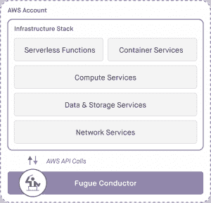

# 富格努力为亚马逊网络服务带来管理和谐

> 原文：<https://thenewstack.io/fugue-strives-bring-harmony-cloud-management/>

总部位于马里兰州弗雷德里克的赋格希望让亚马逊网络服务云部署像交响乐一样和谐地大规模运行。

它在很大程度上借鉴了同名的音乐形式，其中一个主题随着时间的推移而重复和演变。该公司提供了一个“云操作系统”，名为[指挥](https://fugue.co/product/)，用于管理云资源，就像 Linux 或 Windows 在个人机器上所做的那样。(它的[标志是贝多芬第五交响曲](http://www.underconsideration.com/brandnew/archives/new_logo_and_identity_for_fugue_by_sagmeister_walsh.php#.V6i3FY4n_bo)的动画。)

首席执行官兼联合创始人 Josh Stella 表示，尽管问题不同，但公司正试图像管理传统数据中心一样管理云。

> “几乎所有在 AWS 上大规模运营的人都有人编写大量脚本，他们将这些脚本打包在一起以实现某种自动化。”——Josh Stella

“我们知道这一点，但云不是远程数据中心，它实际上是一台大型分布式计算机，”Stella 说。因此，云也需要这样管理。

Stella 之前是 AWS 的首席软件架构师。他说，他和其他 AWS 资深员工的经验让他们对大规模云部署带来的问题有了独特的见解。

在任何时候，被他称为“云成功典范”的网飞都会在 AWS 上运行 50，000 到 70，000 个计算实例。富格一直在与网飞合作，为更广泛的客户群复制这一成功。

“几乎所有在 AWS 上大规模运营的人都有人编写大量脚本，他们将这些脚本打包在一起，以实现某种自动化，”他说。“我们编写了 Fugue，作为对这个由应用程序驱动的爆炸式复杂性和动态且短暂的基础架构问题的系统级解决方案。”

Fugue 提供了一种预先定义基础设施的方法和一个运行时组件，以确保所有云资源都符合该定义。如果资源“偏离”原始定义，它会自动纠正。

“在使用大量服务类型的云上构建东西的一个非常常见的问题是，没有一个地方可以整体描述系统，”Stella 说。“你可能会部署六个 Lambda 功能、一个 API 网关、一个 ECS [EMC 弹性云存储]或[Kubernetes](/category/kubernetes/)群集，你就有了一个 VPC[虚拟私有云]。你如何协调所有这些事情？赋格可以是定义该系统的总体描述和声明。

## **获得简单**

他说，一个直接的用例是使用 Fugue 作为基础设施即代码架构的基础，以及政策即代码。您可以拥有断言公司策略的组合库，这对于受监管的公司(如 HIPAA 覆盖的实体)非常重要。它被隔离在您自己的云帐户中，不会“呼叫总部”任何信息。

虽然 Stella 写了一本关于不可变基础设施(被替换而不是维护的基础设施)的 O'Reilly 电子书，但他说 Fugue 同样适用于没有它的传统工作负载。

它可用于以下情况:

*   作为持续集成工具链的一部分，与 Jenkins、CircleCI 或 Travis 一起实现云基础架构生命周期管理的自动化。
*   预览对基础结构的更改。
*   使用您的代码库工具(如 Git 或 GitHub)来实现可执行的变更控制流程，以提供您的云的单一、可信视图。
*   构建和管理底层基础设施，以支持使用 Docker 和 Mesos 等工具的容器化应用程序。

**Ludwig** ，它的专有语言，被用来编写乐曲，指挥运行的定义程序。(Stella 说开源这项技术是“保留选择的余地”。)

Stella 说，它不需要程序员学习一门新语言——它看起来就像一个 YAML 文件。这是一种使用强类型系统的编译语言。

“路德维希是获得简单性的关键。你需要能够表达你希望在云上发生什么。现在，选择是相当严峻的。你可以通过控制台手动完成，你可以学习一种基于 JSON 模板的特定领域语言，”他说，并补充说 Ludwig 旨在使常见的云任务变得简单。

“在 VPC 建立一个网络需要大约 8 行代码，用于亚马逊虚拟私有云(VPC)、子网、路由规则、互联网网关，所有的一切，”他说。

但是如果你在代码中有任何错误，Ludwig 有一个编译器，在程序员写作文的时候，而不是在应用程序运行之后，给他们有意义的错误。

Conductor 是一个 IaaS API，充当操作系统“内核”,用于自动化云基础架构操作。Stella 说，这并不意味着要取代 Linux 或 Windows 或任何其他工具。

要使用 Fugue 管理策略，您需要将最佳实践嵌入到 VPC 合成中使用的库中。

“我们有一个实施 HIPAA 规则的例子。只是一个函数调用，然后神游会构建。但它也将监督它并执行它。如果有任何东西进入并改变它，而不是通过指挥通过一个批准的命令，它会把它恢复到它应该的样子，”斯特拉说。

都是作为流程来管理的。

“因为你告诉指挥它应该如何，因为它在不断地监控和执行它——它可以修改它，也可以拆除它——而不是必须塑造缠绕在 AWS 上的毛球，你可以只查看你的流程，确保它们是正确的，或者选择运行新的流程，”他说。

## **继续进化**

之前的[名为鲁米诺](http://www.prnewswire.com/news-releases/luminal-raises-20m-for-its-cloud-operating-system-changes-name-to-fugue-300204854.html)，成立于 2013 年。今年 1 月，它宣布进行 2000 万美元的 C 轮投资，并将其名称改为旗舰产品。它总共筹集了 3380 万美元。

“我们认为，至少在未来十年内，云计算将继续创新和发展。所以，Fugue 的设计是为了快速整合任何新出现的云服务，”他说。

他说，很少有人会预测 Lambda 的成功，“在很长一段时间内，容器似乎将成为下一个重要的答案”。Fugue 支持容器，其灵活性允许公司在两周内添加 Lambda 函数。

专门从事可编程基础设施的公司 Container Solutions 的首席执行官 Jamie Dobson 最近为新堆栈写道，用于供应硬件的容器化解决方案和工具将开创一个不需要人工管理的[时代](https://thenewstack.io/how-containers-microservices-and-ai-will-lead-to-the-operatorless-data-center/)。

Fugue 加入了专注于自动化基础设施和执行业务政策的新公司行列。

Calm.io 自称为“DevOps 自动化平台”，致力于解决开发、供应和部署应用程序的挑战，[自动化计算资源](https://thenewstack.io/calm-io-aims-soothe-savage-shop/)以及底层存储和网络，并对其应用业务策略。

[CloudFabrix](https://www.cloudfabrix.com/) ，同时，[专注于治理](https://thenewstack.io/cloudfabrix-applies-governance-legacy-system-modernization/)以确保应用满足关键业务目标。

CloudFabrix 和 Docker 是新堆栈的赞助商。

专题图片: [charles bowling 指挥韦斯特兰乐团](https://www.flickr.com/photos/wwworks/14237987317/in/photolist-nGapzX-gB2Sys-eQ5q4m-bGW2Pv-7W1zkS-eQ5nNq-bu2exj-bGW2y4-f8ZMsd-HMKLpZ-bGW2Dt-rjsWJH-bGW2KT-bu2emj-5VWp8M-7woUQh-4ovnvU-6LQzGb-bu2ei7-HWjDm-cmzAfQ-6BJuez-ae8ErK-cmzz7w-regq9Y-7YKjDu-4h6RaR-s8Yxxd-cmzys7-regAxd-44LXRP-rheWH1-brEvAc-f8ZM9C-apyzqM-4QWf9Z-sb7YwE-aWYD7X-cmzzNU-aWYBk8-46Sfr7-md3MdK-bvtUkj-74suuZ-aWYUFe-aaEeKf-7woUVL-54FDH2-aQE9tR-aQE9tx)由[wodleywonderworks](https://www.flickr.com/photos/wwworks/)创作，授权于**CC BY-SA 2.0**。

<svg xmlns:xlink="http://www.w3.org/1999/xlink" viewBox="0 0 68 31" version="1.1"><title>Group</title> <desc>Created with Sketch.</desc></svg>