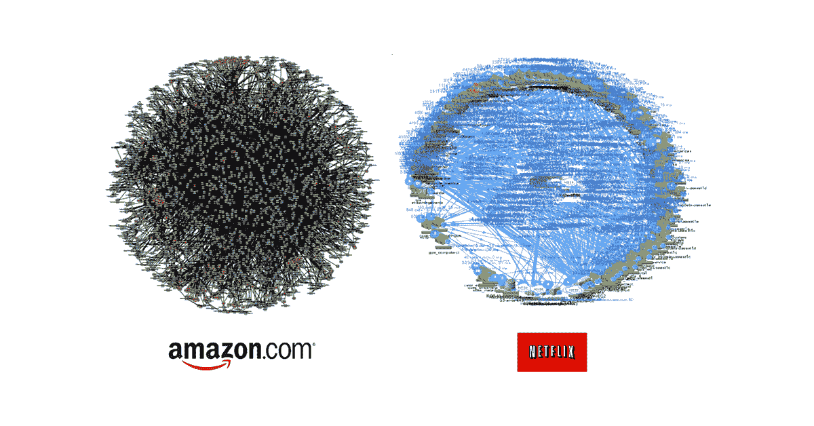

# 全方位服务所有权:释放业务和客户价值的关键

> 原文：<https://thenewstack.io/full-service-ownership-the-key-to-unlocking-business-and-customer-value/>

 [迈克尔·库奇

迈克尔是 PagerDuty 的产品副总裁。他在高科技和软件行业拥有 20 多年的工程、产品管理和营销经验。Michael 创建并推动 PagerDuty 的整体产品和生态系统定位、产品战略、社区宣传和竞争情报。](https://www.linkedin.com/in/cucchi/) 

在过去的几十年里，软件无疑“吞噬了世界”今天，在一个不确定和变化的时代，软件正在重建和支持企业。我们编写、部署和维护软件的方式正在改变——，因此技术运营团队也需要改变。我们的[研究发现](https://www.pagerduty.com/blog/survey-findings-digital-pressure-2020/)80%的公司正经历着对数字服务需求的增长，超过一半(53%)的公司认为这种压力在过去的 3-6 个月里达到了前所未有的水平。这给 IT 和开发团队带来了巨大的压力。

在这种背景下，传统的运营模式不再能跟上现代开发流程、应用程序堆栈和所需的变化速度。随着软件、系统和团队复杂性的增加，传统的集中式管理正在失败。对于新的创业公司来说，从零开始构建应用程序是很容易的，但是我们大多数人已经在如何构建软件方面投资并建立了技能。这是很难改变的。当今的企业正在经历数字化转型，需要一种新的方法来确保当代软件堆栈始终运行并提供最大价值。

这就是全面服务所有权的用武之地。这个想法很简单 — 今天的数字服务是由不断变化的微服务驱动的。这些微服务支持快速开发、部署和灵活性。在这些快速变化的微服务背后是分布式技术团队，他们独立地构建、测试、推出和维护现有的服务。全面服务所有权使这些专家更接近他们的客户和由他们的软件驱动的业务成果。但实现这一目标需要时间、变革和合适的工具。

## 站出来

曾经有一段时间，软件开发的工作方式非常不同。在敏捷和 DevOps 出现之前的日子里，开发人员在静态的四层或五层技术堆栈上编写投入生产的整体代码。部署后，他们将它们移交给多个孤立的团队。这一过程是一致的，但速度慢且效率低。因此，软件很少改变。

然后软件吃掉了世界。当今的企业高度重视推动创新，通过数字服务满足客户在便利性、速度和个性化方面的期望。因此，应用服务发生了重大变化。今天的服务建立在数百个微服务之上，由多个分布式技术团队提供支持。他们在需要的时候更新他们的服务，因此我们看到下游的影响 — 例如，亚马逊一天可以驱动数千个分布式变化。在这种水平上管理和控制复杂性是下一代的挑战。

这种复杂性，加上新的变化速度，正在引发问题 — 估计 80%的事故是由环境[变化](https://www.pagerduty.com/blog/fall-2020-master-digital-operations/)造成的。全方位服务所有权旨在解决这一复杂性。

通过使分散的团队能够拥有其服务的整个生命周期和对他人的依赖，他们可以以新的和意想不到的方式增加价值。首先，您的组织在快速发布特性方面做得更好。关键是实时速度下责任的清晰性，这在这个新的商业时代与敏捷性同样重要。授权给工程团队意味着当出现问题时他们会参与进来——减少移交和平均解决时间(MTTR)。换句话说，没有恐慌，没有不确定性，对客户的影响最小。

全面服务所有权意味着业务中的每个人都确切地了解他们在做什么和为什么做，依赖关系是什么，谁依赖他们的服务，以及交付的最终目标是什么。这让他们更接近他们的软件和服务的影响。反过来，这明确了继续交付价值所需的内容。有了这些知识，团队在尝试新事物的时候解决意想不到的问题就变得容易多了。更少的猜测，更少的干扰，更多的创新。

## 打破筒仓

然而，过渡到全面服务所有权并不容易，这当然要从开发运维心态开始。基于功能的长期孤岛是许多现有 IT 组织的特征。他们将开发代码、质量保证、拥有客户关系、在生产环境中运行软件等过程划分给集中的团队。

改造团队结构和技术以实现全服务所有权的任务看起来似乎势不可挡，但事实并非如此。从小处着手，循序渐进是关键。

## 入门指南

理解“业务服务”的实际含义很重要。业务服务是运营业务或向客户提供产品所需的关键功能。业务服务由数字服务驱动，数字服务由提供功能、组件、共享基础设施或内部工具的微服务组成。

服务所有权是将人与技术和服务联系起来。这包括对什么和谁提供业务服务的理解。给定服务的界限是什么，它涉及哪些流程，它提供什么，谁负责它，它在业务级别上有什么影响？在任何给定的时刻(甚至在动态环境中)，组织都需要用这些信息武装起来 — 甚至是特定服务背后的团队。

如果你刚开始，展示小的收获可能是赢得推动组织变革所需的管理层认同的好方法。选择一个非关键的生产系统或绿地应用开始，并尽量避免技术债务。最初，不要设定太紧的时间表。如果这对您的组织来说是新的，掌握生命周期需要时间。敏捷方法在适应动态开发需求和不可预测的事件的同时，仍然关注长期目标，这是非常有用的。测试驱动开发和小批量编写代码也是一个好主意，这使得在生产前和生产中发现和解决问题变得更加容易。

当您成熟到生产和全面服务所有权的心态时，您的团队不仅应该考虑“构建和部署”，还应该考虑“运行”采用全面显示整个基础架构的技术，利用机器学习来减少警报和错误警报，并使用自动化来节省团队资源和减少“随叫随到”以支持生产服务的影响。

最重要的是，记住全服务所有权需要时间，可能需要文化变革。错误是不可避免的——让您的团队自由地学习新模型和进行实验，而不用担心失败。从长远来看，采用全服务所有权将带来更大的灵活性、更低的成本、更快乐的工程师和更好的客户体验。

*[查看我们的 OpsGuide 获取更多精彩指导](https://ownership.pagerduty.com/)。*

通过 Pixabay 的特色图片。

<svg xmlns:xlink="http://www.w3.org/1999/xlink" viewBox="0 0 68 31" version="1.1"><title>Group</title> <desc>Created with Sketch.</desc></svg>