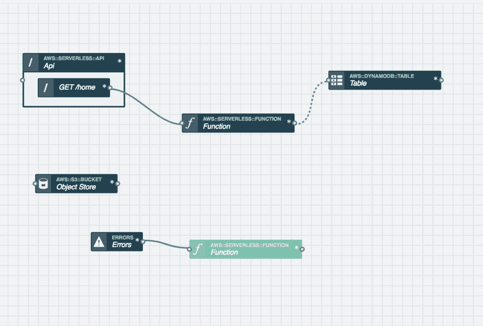

# 全方位服务无服务器:从前端到全堆栈只需几分钟

> 原文：<https://thenewstack.io/full-service-serverless-front-end-to-full-stack-in-minutes/>

Stackery 赞助了这篇文章。

 [托比·费

Toby 是 Stackery 的社区开发人员。她的角色和经历结合了软件工程师、作家和技术讲师的工作，用新兴工具构建有趣的项目，并与世界分享她的发现。在加入 Stackery 之前，Toby 是 NWEA、瓦卡萨和新遗迹公司的工程师。](https://www.stackery.io/) 

无服务器提供了一个高度管理的虚拟主机模型。该平台通常被理解为对希望卸下部分责任的运营团队的改进，它允许您直接从编写令人惊叹的前端体验到服务您的站点，而无需一个 Unix 命令。

然而。

就在五年前，开发角色还存在于地方性的层级结构中。我想坦率地说，这种文化等级制度一直是垃圾，原因有很多，主要是因为它刻意贬低通常由女性扮演的角色。

无论如何，自学成才的开发人员从 HTML 和 CSS 开始他们的教育，后来进入服务器端代码，并以管理 Linux 服务器来运行这些代码而结束。接下来，除了获得高级数据库和代码优化技能，培训中的开发人员还学习了高度管理的环境，如亚马逊网络服务(AWS)和 Azure。对于精通其他一切的人来说，这种托管服务的架构是一个遥远的目标。

然而，前端编码是一个巨大的技术领域，它总是需要敏锐的洞察力来使 HTML 和 CSS 与设计板相匹配。与此同时，现代前端开发人员被期望处理预处理、可访问性和无数的 JavaScript 交互性。**难道理解所有这些的人就不能得到一个真正的、可伸缩的 web 服务工作起来*而没有*这些中间步骤吗？**

对一些人来说，这个问题的答案是 Heroku。一次收购和恶毒的报道之后，Heroku 更像是一个业余爱好者的工具——它对构建 Twitter 机器人很好，但对重塑人们购买拖把的方式却不太好。

## 纯粹的无服务器解决方案

由于它在无服务器市场占主导地位，我将在 AWS 上构建这个例子，尽管完全可以在 Azure 上构建一个完全相同的副本。你需要连接的三个服务是存储你的文件的亚马逊 S3，控制你的服务逻辑的 Lambda 和作为你的站点数据库的 DynamoDB。为了使从数据库中读取的 Lambda 公开可用，您还需要有一个 API 端点。

下面是这个堆栈的图像，以及一些错误集合:



这张地图是由 Stackery 制作的。如果您想避开 Unix 和 AWS 控制台，Stackery 只需点击几下鼠标就可以创建和部署所有这些资源。

*这张地图是用**[Stackery](https://www.stackery.io/)**建造的。如果您想同时避开 Unix 和 AWS 控制台，Stackery 只需点击几次* *就可以创建和部署所有这些资源* *[。](https://docs.stackery.io/docs/tutorials/quickstart/)*

## 基础知识

与容器明显不同的是，无服务器不需要你是全职专家。因此，我相信它将取代容器成为运营团队首选的新工具。

首先，你需要学习如何创建一个基本的 Lambda。这个版本是用 Node 6 创建的，这是所有栈的一个很好的起点:

```
'use strict';
exports.handler  =  (event,  context,  callback)  =&gt;  {
console.log('Welcome from the Lambda-land!');
const response  =  event;
console.log(JSON.stringify(response));
callback(null,  response);
};

```

这是怎么回事？几乎没有什么比每一个λ的两个关键初始步骤更重要的了:

1.  **记录**中的内容— AWS 文档不完整(为了避免冗长的阐述)。要知道什么在调用我们的 lambda，以及它的有效负载是什么，唯一真正的方法是将其注销。
2.  **发送一个有效的响应**——在 Node 中处理正确的 JSON 格式是相当容易的，但是您不需要在调试堆栈的其余部分时处理它！几乎在所有情况下，调用您的事件都是有效的启动响应

lambda 启动并运行后，接下来的扩展步骤如下:

3.  **测试事件到此结束**——既然你已经注销了一个真实事件，那么设置一个测试事件来测试你的 lambdas。为什么不通过 API 网关或者其他触发它们的东西来测试它们呢？再说一次，我们正在努力学习这些工具，所以保持事情尽可能简单是关键。服务返回 402 或 500 错误？在怀疑 lambda 代码之前，发送一个测试事件。
4.  G **在你的堆栈中设置良好的可观察性**——可观察性是指在不打开源代码的情况下，你能多好地理解你的系统及其故障*。像 [Epsagon](https://epsagon.com/) 这样的工具可以帮助你获得比日志 AWS 自动做的更好的可观察性*

*[stack ery](https://www.stackery.io/)还可以为你所有的 Lambdas 所经历的所有错误增加一个单独的消耗点。*

## 结论

前端技术含量极高，非常复杂。启示录？服务器体系结构并非必须如此，无服务器使构建可扩展以满足您的业务成功成为可能。无服务器和 Stackery 等相关平台是打破讨厌的开发人员层级的直接答案，这阻碍了工作的真正目的。

通过 Pixabay 的特征图像。

<svg xmlns:xlink="http://www.w3.org/1999/xlink" viewBox="0 0 68 31" version="1.1"><title>Group</title> <desc>Created with Sketch.</desc></svg>