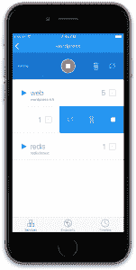

# 全速前进拖船，码头的 iOS 客户端

> 原文：<https://thenewstack.io/full-speed-ahead-tugboat-ios-client-docker/>

市面上有超过 200 万个 iPhone 应用程序，但直到现在，还没有一个是针对希望管理 Docker 实例的开发人员的。进入阿根廷公司 [Manas Technology Solutions](https://manas.tech/) ，其[tuggle](https://tugboat-app.com/)应用程序为用户提供了从 IOS 设备管理其集装箱的能力。

有了拖船，整个堆栈和服务可以管理一个单一的行动。

据 Manas 的首席执行官 [Nicolás di Tada](http://instedd.org/about-us/team/staff/nicolas-di-tada/) 称，开发该应用并不是为了响应客户的需求，而是因为 Manas 自己的工程师想要一种从单一屏幕管理他们自己的 Docker 部署的方法。

“我们相信，如果我们内部需要这样一个应用程序，就会有其他客户也想要它，”他说。

拖船，价格为 9.99 美元，提供了处理多个 Docker 帐户和一个水龙头之间切换的能力。它还允许开发人员在移动中实时监控他们所有的服务日志。Di Tada 表示，由于能够控制多个帐户，该应用程序对那些必须同时处理多个客户的组织特别有吸引力。

他解释说，该应用程序不需要大量的客户干预。“你只需登录你的 Docker 账户，不需要用户输入任何信息；拖船将为您提取应用程序。”他还说，这款应用可以处理的账户数量没有限制。此时，该服务仅适用于 [Docker Cloud](https://cloud.docker.com/) 。

拖船允许用户玩弄多个帐户。

这款应用于 2 月份推出，迄今为止，Manas 已经获得了数百次下载。Di Tada 表示，现在收集大量客户反馈还为时过早，但他表示，该公司已经在计划一些改进措施。

“我们有一些想法，”他说，并解释说该公司正在改进其故障诊断，以便在出现问题时可以更快地通知客户。他说，Manas 还希望增加推出新服务以及管理现有服务的能力。该公司还没有为其他操作系统提供版本的计划。

“我们没有任何 Android 的计划，”Di Tada 说，尽管他补充说不排除这个想法。

拖船可能吸引了数百次下载，但一位分析师并不完全相信它作为一个商业应用程序的价值。

“它可能有自己的位置，但我不太确定在哪里，”It 研究公司 [Quocirca](https://www.google.com/url?sa=t&rct=j&q=&esrc=s&source=web&cd=1&cad=rja&uact=8&ved=0ahUKEwjK1KeK7MnSAhVJl1QKHTzFCkEQFggcMAA&url=http%3A%2F%2Fquocirca.com%2F&usg=AFQjCNHqukVY_QFaxMnhCrgDh5VL3IkQqQ) 的联合创始人兼董事克莱夫·隆巴顿说。他说，di Tada 很可能是正确的，没有其他 iOS 应用程序可以直接管理 Docker 容器，但这不是重点。“系统管理员需要能够从单个窗口查看和管理一切，无论他们是在办公桌前还是在移动设备上。”

隆巴顿认为大多数组织会坚持现有的工具。“大多数现有的全服务系统管理工具都有移动版本，并且越来越多地提供内置容器管理和虚拟机管理，”他说，并指出大多数用户会想要更复杂的东西。

“这个价格很容易在整个公司中体现出来，我会在整个平台上寻找更全面、更有用的东西，”他补充道。

但 di Tada 表示，该应用程序对任何在企业环境中管理 Docker 应用程序的人都很有用。“如果你只是在玩 Docker，那么你不会想在这上面花 10 美元，但如果你管理着很多账户，你就会这么做。“毕竟，”他补充道，“我们已经为此付出了代价。”

<svg xmlns:xlink="http://www.w3.org/1999/xlink" viewBox="0 0 68 31" version="1.1"><title>Group</title> <desc>Created with Sketch.</desc></svg>