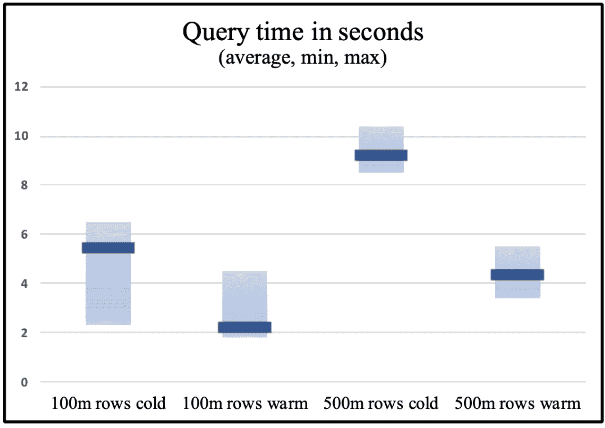

# 漏斗火箭:无服务器查询引擎

> 原文：<https://thenewstack.io/funnel-rocket-a-serverless-query-engine/>

 [埃拉德·罗森海姆

埃拉德·罗森海姆最初是 Commodore 64(是的，那是一个巨大的 64kb RAM)上的 Basic 程序的爱好者，现在在软件栈的所有专业软件开发方面拥有超过 20 年的经验。他对酷 UI/UX 和深层后端(性能、规模、大数据)都感兴趣。作为 Dynamic Yield 的首批员工之一，他组建了团队，管理研究和设计组织，现在专注于新技术计划。](https://www.linkedin.com/in/eladrosenheim) 

通用 OLTP/OLAP 数据库很棒，不重复发明轮子总是一个好原则。然而，这并不意味着所有的查询用例都容易正确实现、运行迅速或成本合理。通常，在设计和管理数据库以使其以某种方式支持所需的规模和复杂性方面需要付出很大的努力，但没有获得我们想要的性能或成本，尤其是当数据和查询量随着时间的推移而增长时。

在 [Dynamic Yield](https://www.dynamicyield.com/) ，一个这样的挑战是在原始数据上运行细致入微的即席查询:在我们为客户收集的数十亿个最终用户事件(也称为“点击流”)中，找到执行过 A、B 和 C 的用户——可能有时间限制或有序序列，并过滤细粒度的细节(例如他们添加到购物车中的衬衫的特定属性)。[我在这里写了更多关于挑战的细节](https://elad-rosenheim.medium.com/funnel-rocket-a-cloud-native-query-engine-30bc142163b1)。

我们现有的解决方案基于 Elasticsearch，但是以插件的形式添加了大量的代码，以支持我们需要的各种条件。这大大降低了解决方案的开箱即用性(几乎没有关于如何实际开发超出“hello world”级别的此类模块的文档或建议)，并且随着时间的推移，运行成本大幅增加。

另一个棘手的问题是需要将 Spark 产生的大量数据导入 Elasticsearch，而不是简单地添加新文档(当然这本身可能是资源密集型的)，我们要为大部分最终用户重新计算和重新导入数据。

我与许多有类似查询需求的其他 SaaS 供应商交谈过，总的方向似乎是从“经典”SQL 数据库迁移到 Presto、BigQuery 等——在建模和为性能预先准备数据方面做了大量工作。

这个查询特性是我们提供的核心服务，考虑到我们过去投入大量精力采用和定制现成工具的经验，我们并没有放弃“构建”选项——当然，我们应该抱着健康的怀疑态度:

*   根据我们的 SLA 需求和成本目标，我们是否可以通过一个运行在无服务器、现场等任何地方的新解决方案来获得更好的成本、速度和功能，以满足我们的特定需求？
*   我们有没有高水平的构件来建造它而不需要太多的重新发明？
*   我们现在需要“按摩”它很多年吗？在未来几年的最终统计中，这一切都是值得的吗？还是这又是一个不受约束的科技乐观主义的例子？另一方面:我觉得与几年前相比，现在我们对需要构建什么有了更好的认识，对现有工具的局限性有了更多的了解。

## 工具:漏斗火箭

出于这种挑战，并且不可否认地，在我目前的“CTO 办公室”类型的角色中，我们已经开始试水。这里是我们建造的:[漏斗火箭](https://github.com/DynamicYieldProjects/funnel-rocket)。

为了构建这个引擎，我们使用了一套工具，每一个都经过了战斗测试，并且做得非常好:Pandas 以及 Apache Arrow 的 Parquet 文件阅读器、S3、Redis 和[亚马逊网络服务](https://aws.amazon.com/?utm_content=inline-mention)、Lambda 和 S3。在漏斗火箭的范围之外，我们用 Apache Spark 准备数据集并将它们写入 S3，但是没有摄取阶段——只是调用漏斗火箭的 API 服务器让它知道数据集的位置并获取其模式。

我们确实创建了一个基于 JSON 的查询规范，它根据我们的需求进行了调整，但是尽一切努力将复杂性降低到所使用的工具——这里详细介绍了设计。

实际上，我对将这个成熟的工具集粘在一起可以实现多少东西感到非常惊讶。还有很多需要优化的地方，但初步结果肯定不错，特别是当许多 Lambda 实例是热的，并且迭代查询相同的数据集时——这符合我们的高级用户深入研究和微调用户群的用例。基于 Lambda 的计算时间，能够准确知道每个查询的成本也是一大优势。当然，和往常一样，还有无数的其他成本:Spark 的数据准备、S3 的存储等等。—但是与强大的始终在线查询集群相比，最重要的部分(即实际查询)没有固定成本，并且与实际使用直接相关。

这是分别包含 1 亿和 5 亿行数据的数据集的初步结果，这些数据集在 S3 以 Parquet 格式存储，并分别划分为 100 或 500 个文件。

*   每个文件由一个 Lambda 实例处理，这意味着并发调用 100/500 个实例。
*   Lambda 功能配置了 2GB RAM，相当于分配了 1 个 vCPU 以上的位。

每个数据集在所有实例都是冷的和热的情况下都进行了测试。

尽管准备成为一名云本地公民，但在本地运行还是很容易的:一个基于 [docker-compose 的堆栈](https://github.com/DynamicYieldProjects/funnel-rocket)提供了无服务器和非无服务器的工人，一个本地 S3 兼容存储(MinIO)，还有一个公共示例数据集可供下载和使用——由查询语言的[教程指导。](https://github.com/DynamicYieldProjects/funnel-rocket/blob/main/docs/example-dataset.md)

虽然漏斗火箭今天已经可以使用，但对我来说，它也是如何构建新的云原生解决方案的测试平台。我一直支持健康的辩论！要了解更多信息，请访问 [GitHub repo](https://github.com/DynamicYieldProjects/funnel-rocket) 。

<svg xmlns:xlink="http://www.w3.org/1999/xlink" viewBox="0 0 68 31" version="1.1"><title>Group</title> <desc>Created with Sketch.</desc></svg>