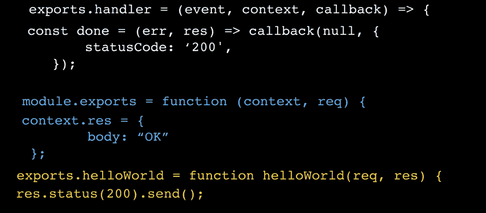

# 娱乐容器:将容器作为函数运行的美妙之处

> 原文：<https://thenewstack.io/funtainers-beauty-running-containers-functions/>

“无服务器实际上并不意味着没有服务器。这只是意味着你不用再和他们打交道了，”俗话说。

在上一次无服务器会议上，我们看到了无服务器使用的增长，这一次，这种增长同样令人印象深刻。

我有幸成为大会的主题发言人，并选择谈论开发者和 [DevOps](/category/devops/) 世界的这一急剧变化，从管理到容器和[微服务开发](/category/microservices/)到[函数和无服务器](/category/serverless/)。

如果我们花一点时间回顾过去 20 年，进化史向我们展示了我们已经走了多远。我们已经从管理物理服务器快速发展到虚拟机，现在正在从运行在容器上发展到运行功能。

 [阿米拉姆·沙迦

Amiram Shachar 是 Spotinst 的创始人兼首席执行官，他帮助团队利用过剩的容量(例如 Spot 实例)来节省高达 85%的云成本。在创建 Spotinst 之前，他是 Ybrant Digital 的 DevOps 总监，并领导了以色列国防军向云的迁移。](https://spotinst.com/) 

当 Docker 爆发时，Linux 容器变得如此易于使用，以至于它们很快成为主流。它们成为帮助开发人员构建、发布和运行的真正有用的工具。我们开始以一种非常舒适的方式开发微服务，并明白开发不必再如此艰难。

2014 年出现了亚马逊网络服务的 Lambda 这种服务允许用户在不管理甚至不考虑服务器的情况下运行代码。Lambda 的隐含承诺是，忘掉容器，开始构建函数。最大的问题是这两个概念是如何联系的。这两种技术突变之间是否存在冲突，或者有没有一种方法可以奇迹般地融合这些技术？

要回答这个问题，让我们首先从采用无服务器技术时存在的障碍、容器的优势以及介于两者之间的一切开始。

## 无服务器入门的障碍

### 1.开发方法的巨大转变

改变从来都不容易。为了利用功能，我们需要从微小的构建块开始，甚至比微服务还要小——本质上是微微服务。这意味着我们将不得不开发更多的服务。

### 2.利用不同的接口

如果我们想使用 [Spotinst 函数](https://spotinst.com/products/spotinst-functions/?utm_source=allclouds&utm_campaign=Guestblog)、 [Lambda](https://aws.amazon.com/lambda/) 或 [Azure 函数](https://azure.microsoft.com/en-us/services/functions/)，我们需要匹配或编码到特定的模板或签名。这里有一个例子来说明我的意思:

我们可以看到亚马逊的界面是白色的，谷歌的是蓝色的，Azure 的是黄色的。这意味着每个云对您的代码的响应都有一点点不同，这使得以任何标准化的方式采用它变得更加困难

### 3.改变部署背后的方式和思维过程

我们已经习惯了容器和虚拟机的世界、蓝/绿部署和健康检查等技术，或者以循序渐进的方式部署新版本。功能要求我们处理稍微不同的现实。再说一次，改变从来都不容易。

### 4.依赖性—依赖第三方

当我们在虚拟机或容器上运行代码时，我们知道运行代码的所有依赖项都将在运行代码的服务器上找到。在新的无服务器世界中，我们需要将代码及其依赖项打包到一个 ZIP 文件中，这样我们的无服务器提供者就可以运行该功能。此外，我们仅限于 50MB(包括任何依赖关系！)，使得在单个函数中运行复杂代码更加困难。

函数确实带来了很多好处，但是它们被一些不容易解决的障碍所阻碍。但是，如果我们能够利用容器的所有优势，并将它们应用到我们的功能中，会怎么样呢？

为了回答这个问题，让我们更深入地研究一下 AWS Lambda 背后的底层技术——这个我们称之为无服务器计算的神奇技术究竟是如何工作的？

其实很简单:

1.  我们上传我们的代码(及其依赖项)。
2.  函数提供者(本例中为 Lambda)获取我们的代码，并将其注入到一个容器中。
3.  容器在服务器上运行函数，Lambda 返回输出。

如果我们跳过第 2 步，创建一个函数的输入实际上是一个容器的情况，这样我们的函数提供者就可以使用我们的容器并运行它，会怎么样？

我们称这个将容器作为函数运行的过程为“娱乐容器”这允许我们利用运行容器带来的所有优势，并将它们与运行函数的所有优势结合起来。高可用性、无操作和无服务器计算等优势，都运行在我们近年来变得如此熟悉的容器之上。

似乎娱乐容器或容器功能是一个以令人难以置信的速度增长的概念，有三个大型项目利用了这一新现象:

1.  [IBM OpenWhisk](https://openwhisk.incubator.apache.org/)
2.  我们自己的 [Spotinst 功能](https://spotinst.com/products/spotinst-functions/)
3.  [OpenFaas。](https://github.com/openfaas/faas)

所有这些平台都带来了难以置信的优势:

1.  没有编程语言的限制，不像其他 FaaS 产品。
2.  不用担心依赖项或 ZIP 文件(所有东西都打包到容器中)。
3.  不再受供应商限制；在任何平台上运行你的娱乐容器，并随时移动它。
4.  不需要担心不同的 FaaS 代码接口。

那么这实际上是如何工作的呢？

1.  写你的代码。
2.  将它“打包”到一个容器中。
3.  构建一个 docker 文件，其中包含我们的容器运行所需的所有安装。
4.  将您的容器上传到 Hub。
5.  创建一个函数，用 DockerHub/ContainerName 替换输入代码。
6.  运行该功能。

一个在容器上运行 C 的 Dockerfile 文件的例子。

一个 Funtainer 的例子，输入不是代码，而是一个容器。

换句话说，无论我们喜欢与否，这整个地震式的转变正在发生。真正的问题是什么时候，而不是如果，函数何时会成为大多数公司运行代码的方式。

但是这种改变不一定要可怕。这并不意味着我们需要改变我们最近学习的运行代码(在容器上)的整个方式，并学习一些新的东西。将容器作为函数运行(Funtainers)可以让我们轻松驾驭这股浪潮，同时享受容器和函数的好处。

<svg xmlns:xlink="http://www.w3.org/1999/xlink" viewBox="0 0 68 31" version="1.1"><title>Group</title> <desc>Created with Sketch.</desc></svg>