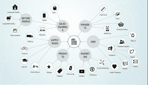
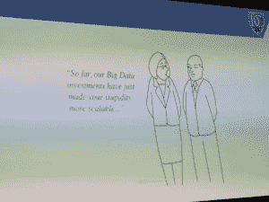

# 未来的企业将需要互联大数据

> 原文：<https://thenewstack.io/future-big-connected/>

“我们正在进入互联时代，” [Neo Technology](https://neo4j.com) 的创始人兼首席执行官 Emil Eifrem 在旧金山 [GraphConnect 大会](http://graphconnect.com/#)的主题演讲中说道。未来“是高度紧密相连的。”

哦，他刚好有一个这方面的应用。

2027 年，目前在标准普尔 500 上的 75%的公司将不再上榜。什么能让那 25%的人留在名单上？数据。

“数据是新的石油，”Eifrem 说，他指的是一种商品，与铁路一起，造就了镀金时代的百万富翁。但不仅仅是数据。

根据 Eifrem 的说法，人类大脑的运行就像一个图形数据库。

Eifrem 说，虽然孤立的数据很有价值，但“将数据联系起来的能力非常有价值。”地球上最强大的数据库:人脑。它的神经元通过突触与其他神经元相连。这看起来很像一张图表。

他说，令人惊奇的是，大脑不仅仅存储数据；这是有道理的。

“现在很难想象,”他告诉 1200 名主题演讲的听众,“但谷歌是 90 年代末上市的第 15 个搜索引擎。”。他解释说，谷歌的不同之处在于对搜索结果进行排名；它将数据核心应用到业务中，并将其连接起来。

基本上，数据库只是存储和检索数据。但 Eifrem 宣称，未来属于那些能够连接数据并使其立即对决策者有用的人，无论他们是实时看到建议的客户，一眼看到供应商表现如何的首席执行官，还是看到以前看不见的欺诈的安全专家。

图形数据库不同于标准的关系数据库，因为它的结构类似于人脑，Eifrem 解释说。它在数据之间建立联系，帮助你理解这些数据。“事实上，您可以将属性附加到关系上，这听起来是一件小事，听起来是一件简单的事情，听起来是一件显而易见的事情，但这正是数据库具有表现力的原因。”

根据 Eifrem 的说法，这一切都与联系有关。

这种数据的情境化是互联企业的未来。“如果你有一个企业，你的所有数据都连接在一起，你的供应链连接到你的 CRM，连接到你的营销技术，连接到你的物流，连接到你的客户，连接到你的支付历史，一切都直接或间接相连，这将是一件非常强大的事情，”Eifrem 说。

这样做的公司将会留在那 25%中。

## 但是我们如何从这里到达那里？

在主题演讲后的新闻发布会上，Eifrem 宣布“一刀切”的数据库的想法已经结束。数据架构师现在试图解决的有趣问题是:什么是合适的？关系数据库管理系统(RDBMS)将它们的数据保存在筒仓中，并且跨筒仓连接数据是复杂和混乱的。

Neo 看到企业用筒仓来保持它们的 RDBMS，并添加图形数据库来存储不同 RDBMS 之间的连接。

万豪酒店(Marriott Hotels)的电子商务和 CMS 高级总监/架构师斯科特·格瑞恩斯描述了当公司政策要求使用特定数据库(如 IBM 或 Oracle)时，这是如何工作的:随着时间的推移，他们最终会拥有 10 层深度的数据。

这家连锁酒店开始使用图形数据库来管理孤立数据之间的关系。“每个节点几乎就像一行，”Grimes 解释说，“所以你可以无缝地跟踪数据的关系。”

数据检索从 30 秒缩短到 25 毫秒。

Grimes 说，关键是让这种关系成为“一等公民”向图形数据库添加新的关系比进入 SQL 数据库并在整个系统中建立外键要容易得多。

Eifrem 说，事实上，新的集群拱是为云思维设计的，在云思维中，你有弹性的东西，当你扩大和缩小规模时，很容易设置和拆除。

## 哦，顺便说一句，硬件现在很性感

巴罗格说，来自硬件方面的坏消息是[摩尔定律](http://www.mooreslaw.org)已经失效，通用 IBM 电力系统公司的[道格·巴罗格](https://www.linkedin.com/in/doug-balog-222b4522)在他的主题演讲中断言。添加新硬件将不再使容量翻倍。相反，Balog 认为加速技术将带来下一代的性能改进，这就是为什么 IBM 正在与 Neo 合作，使用图形数据库来提高 IBM Power 芯片的加速性能。

“我在硬件方面打乱了自己，”他说。他宣称，这不再仅仅是规模的问题，而是如何利用这种加速来快速推动洞察力。在堆栈的最底层存在令人难以置信的技术破坏。

“硬件，”巴罗格宣称，“是一个令人兴奋的地方。”

谁知道呢？

## 微型与整体

在微服务环境中建立一个图形数据库与在一个整体环境中建立有什么区别？Eifrem 说，从技术上讲，简单的答案是没有。

更微妙的答案是将微服务视为加速器或推动者。他澄清说，你不再被迫为后端的每个部分选择完全相同的数据模型。架构更加灵活。例如，您可以将您的产品放在图表数据库中，这样您的客户就可以获得实时推荐，并将财务信息放在表格数据库中。

一个悬而未决的问题是，基于微服务的大规模架构是否真的降低了复杂性。很少有公司做到了这一点(除了网飞)，所以还不清楚。在规模上，有更多的运行时依赖需要管理，而不是在更大的整体结构中发现更多的统计运行时依赖。时间会证明一切。

至少对 Eifrem 来说，有一点是清楚的，那就是在大范围内，需要一个图表来理解这个架构。他告诉我们，下一代创业公司正在使用 Neo4j 来管理外部依赖性。

## 机器学习

IBM 电源系统总经理 Doug Balog 在 GraphConnect 2016 主题演讲中

图形数据库也可以支持机器学习。Balog 认为，当我们开始关注关系而不是数据本身时，机器学习会变得更好

Eifrem 说，从图表中的数据转移到机器学习很容易。“当然，”他说，“我喝我自己的酷艾。”

即便如此，模拟人脑结构的图形数据库对机器学习来说是一个巨大的贡献，这是有意义的。因为对象之间的交互是机器学习的关键。

Balog 指出，自动驾驶汽车的一个绊脚石是需要对物体的上下文理解，这至少部分取决于事物之间的关系。例如，很容易将一棵树作为数据库对象放入，但是还需要识别树的特征，即它是静止的，不会跳到汽车前面。如果你径直朝它走去，它不会跳开你的路。

## 啊，是的，但是你如何转换 C-suite？

典型的 CEO 反应

Eifrem 承认，大多数公司将继续使用他们的关系数据库，直到痛苦太大，他们最终意识到需要另一种解决方案。

许多公司正在扩大规模，进入几年前认为不可能的数据级别。例如，SQL 中连接的最佳限制是三个，这很快就过时了。

Grimes 说，直到数据深入 10 层，万豪才开始寻找新的解决方案。但是更快的处理速度是 ROI 和获得许可的关键因素。现在，开发团队无法想象没有 Neo4j 的工作。

Balog 说，公司不能再使用旧的制造方法来解决问题。需要编程和新软件来提高效率。

他说，优势在于图形数据库的简单性和上市时间的缩短，并指出您可以在几周内获得完整的 Neo4j 实例并投入生产。

## 想参与进来吗？

如果你想成为 Neo 互联未来的一部分，有三个开源贡献的途径。

NEO4J 的源代码是开源的，Neo 已经为 Neo4J 程序建立了一个名为 [APOC](https://github.com/neo4j-contrib/neo4j-apoc-procedures) 的开放资源库。APOC 目前有 200 多种程序。Eifrem 说，虽然这是社区贡献程序的一个很好的方式，但它也为核心产品的未来版本中内置的新功能提供了基础。例如，上周发布的允许您向图表添加模式的功能是从 APOC 开始的。

Neo 的下一个大项目非常雄心勃勃。 [OpenCypher](https://neo4j.com/blog/open-cypher-sql-for-graphs/) 是一个基于社区的项目，其目标是创建免费、开放、厂商中立的图形语言(Eifrem 说，可以把它想象成图形的 SQL)。一年前推出，它是 Apache 许可的，基于 Cypher，这已经有很长时间了。

IBM 是新堆栈的赞助商。

<svg xmlns:xlink="http://www.w3.org/1999/xlink" viewBox="0 0 68 31" version="1.1"><title>Group</title> <desc>Created with Sketch.</desc></svg>