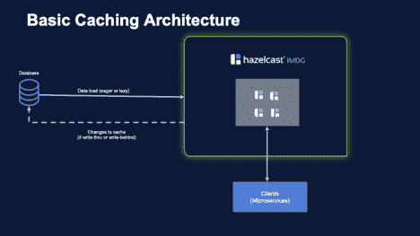
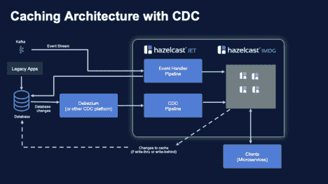
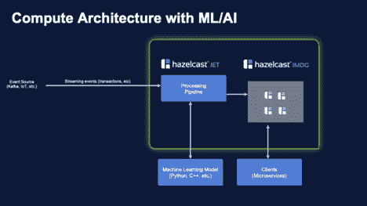

# 采用内存技术的面向未来的高性能微服务应用

> 原文：<https://thenewstack.io/future-proof-high-performance-microservice-applications-with-in-memory-technology/>

[](https://hazelcast.com/)

 [迈克·延恩

迈克·延恩是 Hazelcast 的高级解决方案架构师，由于惊人的巧合，该公司提供的产品包括内存中的操作数据存储(IMDG hazel cast)和内存中的批处理和流处理引擎(Hazelcast Jet ),正如这里所建议的那样，用于未来验证您的应用程序架构。](https://hazelcast.com/) [](https://hazelcast.com/)

单一的应用程序很难发展，而且几乎肯定会因为多年的技术债务而停滞不前。这就是软件架构师转向[微服务](https://thenewstack.io/category/microservices/)的原因:将一个单一的应用程序分解成具有良好定义的 API 的独立服务是后续一切的关键促成因素。作为一名具有面向对象编程背景的开发人员，在我看来，灌输给我们的关于封装的关键概念——基于松耦合和高内聚创建对象边界的设计标准——为我们提供了将复杂的整体应用程序分解为一组精心设计的微服务所需的技能。

但是如何在微服务架构中处理数据呢？

当您将应用程序分解为一组服务时，会想到一个问题，那就是如何处理数据。应用程序有可能将数据存储在关系数据库(RDBMS)中。在向微服务迁移的过程中，让每个服务拥有自己的数据通常被认为是一种良好的做法。原因很明显——将一个应用程序分解成一组服务允许不同的组件以不同的速度发展；一些可能非常稳定，而另一些可能变化非常频繁。但是如果它们都共享一个公共的底层数据库，那么您就不能在不影响每个服务的情况下更改数据库模式。从本质上来说，你仍然受到应用程序还是一个庞然大物时的规则和限制的约束。

有不同的方法来处理这个问题；一个当然是分割数据，在服务之间分配碎片。你得到一个数据库…你得到一个数据库…你得到一个数据库。如果一个服务需要访问一个它不拥有的数据项，那么它会调用拥有该数据的服务。这是最接近微服务最佳实践的方法，但是软件许可成本(对于专有数据库)和拥有许多微安装而增加的数据库管理工作量可能使这不切实际。

更好的方法是应用关注点分离，保留记录系统(RDBMS ),同时添加操作数据存储以满足微服务的需求。这提供了为每个服务提供定制数据视图的能力，而不必改变底层数据库模式。运营数据存储的重要特征是什么？鉴于我们之前探讨的趋势，特别是支持日益在线和移动的用例，以及对速度(低延迟)的需求不断增长，我认为内存技术是要求高性能的服务所必需的。

## 运营数据存储的基本缓存用例

有许多开源的内存平台可以充当运营数据存储的角色。它们都提供了基本的键值存储功能，可用于基本的缓存用途，非常适合操作数据存储。有些甚至超越了这一点，拥有分布式计算等能力。考虑到建议的标准，以确保我们工具包中的技术是多功能和通用的，我将为全功能内存计算平台提供案例，如[哈泽卡斯特 IMDG](https://hazelcast.com/products/imdg/) 。

当我们将开源版本的黑兹卡斯特 IMDG 整合到我们的平台中时，以下是我们添加到技术堆栈中的一些功能:

*   高速、低延迟缓存功能，卸载 RDBMS 或其他记录系统，同时将检索速度提高至少一个数量级。
*   缓存部分或全部数据的能力；根据应用程序的需要，支持诸如通读、直写和后写等缓存模式。
*   通过生存时间(TTL)和回收策略管理缓存大小的能力。
*   不仅可以通过主键检索数据，还可以使用布尔逻辑或类似 SQL 的谓词语法查询缓存。
*   在缓存中存储完整对象的能力；任何对象关系映射都可以在加载缓存时偶尔进行，而不是在每次使用数据时进行，如果 O/R 映射是在从数据库提取数据时进行的，则需要这样做。

正如我们的应用服务可以扩展或缩减以满足工作负载需求一样，我们的运营数据存储也具有弹性可扩展性——可以向数据网格中添加更多节点，软件将自动重新平衡数据分区以利用增加的容量(向上扩展时)或将数据整合到更少的节点上(向下扩展时)。每个数据分区的备份都是自动维护的，因此在发生计划外节点故障时，不会丢失任何数据。

让我们来看看这种基本的缓存架构在实践中是怎样的:



图 1 显示了一个基本的缓存；数据从记录系统加载到操作数据存储中，操作数据存储可以将数据分布在一些缓存节点上。微服务通过单一的统一 API 访问缓存(也就是说，他们不关心缓存数据是如何分布的——他们只是调用 **map.get(key)** 并得到相应的对象作为回报；或者调用一个查询并获得匹配对象的集合。

缓存在历史上一直专注于最小化缓存大小，并将最有可能被使用的对象保存在内存中；随着内存成本下降，延迟要求变得更加严格，100%的数据都保存在缓存中以便所有访问都满足所需的 SLA 的情况并不罕见。在部分缓存的情况下，我们可以延迟加载数据以响应缓存未命中；在缓存满的情况下，我们更有可能在启动时完全加载缓存。如果底层数据库发生变化，在这个简单的体系结构中，我们将在缓存中保存陈旧的数据；设置生存时间将导致我们定期刷新缓存以最小化这种情况。在陈旧数据不可接受的情况下，如下所示的更高级的缓存架构可以将缓存与数据库更紧密地集成在一起。

如果我们的应用程序更改了缓存中的数据，数据网格软件将同步(直写式缓存)或事后(后写式缓存，可以高效地批量更新数据库并提高事务吞吐量)更新记录系统。

## 具有流处理的操作数据存储的高级缓存用例

到目前为止，我们已经描述了作为一组微服务部署的应用程序，以及作为保存数据的地方的运营数据存储，但是数据最初是如何进入系统的呢？我们假设数据已经保存在数据库中，但显然它必须以某种方式到达那里。我们将把注意力转向系统的这一部分，看看我们能否改进它。

现代应用程序架构越来越多地包含某种流数据源(Apache Kafka 可能是最普遍的)。数据可能来自网页、移动设备、边缘设备或其他地方，但它来得很快，需要在到达时进行处理。

流处理引擎——如 Hazelcast Jet(或竞争产品，如 Apache Spark 或 Apache Flink) —可以为您提供处理这种传入数据流的能力。数据可以被过滤、转换、分析和存储。一个有用的组合是让您的流处理引擎充当操作数据存储或记录系统的提取-转换-加载(ETL)引擎。在某些情况下，这种组合可以连接到 Debezium 之类的变更数据捕获平台，通过将数据库变更作为事件进行流式传输，帮助保持您的操作存储与您的记录系统紧密同步。根据传入数据速率和您对延迟的容忍度，您可能也希望该解决方案位于内存中。在某些情况下，如开源的 Hazelcast IMDG 和 Hazelcast Jet 组合，有一个公共平台提供了紧密集成流处理和数据存储功能的能力。



在上图中，我们仍然有一个由 IMDG 提供的内存缓存，一个在这里表示为关系数据库的记录系统，以及访问数据网格以降低数据访问延迟的客户端。我们增加了 Hazelcast Jet，这是一个基于 Hazelcast IMDG 的流处理引擎，为我们提供了许多额外的功能，包括:

*   Jet 的 Kafka 连接器用于将 Jet 连接到来自 Kafka 的传入事件(事务)。这允许我们将数据库更新代码从我们的传统应用程序移动到我们的现代云原生架构中，在那里它可以更容易地扩展(如果需要，使用 Jet 集群所有节点上所有处理器的处理资源)。
*   Jet 可以将更新直接写入 IMDG 缓存。Jet 还可以更新记录系统，或者允许缓存的直写或后写功能负责更新数据库。图中显示了两者，因为不同的服务可能采用不同的方法；但是对于任何给定的事务类型，我们都希望选择其中一种方法。
*   如果没有其他服务或遗留应用程序同时更新数据库，那么我们知道我们的缓存将拥有最新的数据。但是在数据库从其他来源接收更新的情况下，我们可以使用变更数据捕获(CDC)平台，比如开源的 Debezium CDC 平台，来捕获这些更新，并将它们转发给 Jet。Jet 的 Debezium 连接器使连接 Debezium 变得很简单，然后可以对 IMDG 缓存进行更改。

与上面描述的基本缓存架构相比，我们添加了事件流处理，可以对数据网格、数据库或两者执行提取-转换-加载功能；它还可以执行事务处理，我们将在接下来的例子中看到这一点。我们还添加了 CDC 功能，只有当我们的数据库通过事件流之外的其他方式更新时，才需要该功能

我们依靠 Jet 来处理大量处理工作负载，原因是 Jet 能够高效地扩展，以最佳性能处理生产工作负载。Jet 程序或任务是以管道的形式编写的。管道只是一系列链接在一起的步骤；这可能是一系列完全线性的步骤(这符合我们对管道的想象)，但也可能是一个复杂的处理步骤图，其中数据流可以分叉或合并以创建复杂的数据流。

举例来说，下面是一个从 JDBC 数据源加载数据并将其插入 IMDG 地图的简单管道。更复杂的管道可以进行数据过滤、数据转换(对象关系映射)，或者通过将我们正在读取的主表中的项目与其他表或其他数据源中的附加数据连接来丰富数据。

这个例子的完整源代码可以从[这个 GitHub 库](https://github.com/hazelcast/hazelcast-jet/tree/master/examples/jdbc)
获得

```
private static Pipeline buildPipeline(String connectionUrl)  {

  Pipeline  p  =  Pipeline.create();

  p.readFrom(Sources.jdbc(connectionUrl,

"SELECT * FROM USERS",

  resultSet  -&gt;  new User(resultSet.getInt(1),  resultSet.getString(2))))

  .map(user  -&gt;  Util.entry(user.getId(),  user))

  .writeTo(Sinks.map(“user_map”));

return  p;

}

```

与 Debezium CDC 平台的集成只需要上面显示的基本数据库代码；这里有一个例子，它从 MySQL 数据库中获取变更事件，并简单地将它们记录到控制台中。相反，将它们写入 IMDG 映射只需要替换管道的最后一个 writeTo 步骤来定位映射，如前面的示例所示。(这个例子的完整出处是[这里](https://github.com/hazelcast/hazelcast-jet-demos/blob/master/debezium-cdc-without-kafka/src/main/java/com/hazelcast/jet/demo/cdc/DebeziumCDCWithJet.java)。)

```
public Pipeline buildPipeline()  {

  Pipeline  p  =  Pipeline.create();

  p.readFrom(DebeziumSources.cdc(configuration))

  .withoutTimestamps()

  .map(sourceRecord  -&gt;  {

  String keyString  =  Values.convertToString(sourceRecord.keySchema(),  sourceRecord.key());

  String valueString  =  Values.convertToString(sourceRecord.valueSchema(),  sourceRecord.value());

return Tuple2.tuple2(keyString,  valueString);

  })

  .writeTo(Sinks.logger());

return  p;

}

```

## 交易处理用例

流处理引擎是一个如此强大的处理平台，一旦到位，您无疑会发现它扮演着多种角色—如上所示的数据接收和变更数据捕获，以及分析和事务处理。

这些用例是引入流处理的好方法，因为我们已经有了一个缓存用例，并且流处理引擎为我们提供了一些扩展缓存功能的有用方法。但是，当我们使用我们的流处理引擎来执行需要低延迟和高吞吐量性能特征的重要应用处理时，可以实现更有用、通常更具战略意义的业务应用。

例如，Jet 被一些信用卡处理者用来执行欺诈检测。传入的事件流是来自世界各地商家的销售点交易。由于仅从中央数据中心获取数据就涉及到网络延迟，通常信用卡处理器只有非常窄的时间窗口(在某些情况下，只有一位数的毫秒数)来决定是否批准交易。在此期间，处理者将需要执行一系列检查，最好是同时进行——账户的信誉是否良好？交易是否超过持卡人的可用信用额度？根据卡的历史记录、当前位置、商户信息和许多其他因素，该交易是否可能是欺诈性的？如果做出决定所需的所有数据都存储在内存中(IMDG 的一个使用案例)，则所有这些检查和计算只能在所需的时间窗口内执行，并且计算可以在很大程度上分布和并行化(Jet 的一个使用案例)。

许多行业都有类似的使用案例——用各种边缘设备(如物联网传感器)取代信用卡销售点终端，同样的架构可以支持对车队的实时跟踪，或监控主要制造商工厂车间的物料流动。

在流处理技术更令人兴奋的新兴市场之一，事实证明流处理引擎也是实现机器学习的完美工具。数据科学家开发的模型可能不容易使用数据科学家用来构建和训练模型的相同工具集进行大规模操作。这里，问题主要是规模问题；培训模型是一个非常批处理的过程，可以按顺序执行，虽然完成培训的时间很重要，但它不会阻碍业务运营。然而，一旦模型成为生产工作流的一部分，扩展它以处理许多并发任务的能力就变得至关重要。

我们用于缓存架构的相同组件可以在事务处理架构中重用，该架构支持对流式输入数据(来自 Kafka 等事件源)的高容量、低延迟处理，并与使用机器学习模型对事务执行分析相集成。



在上图中，我们有一个来自 Kafka 或 message broker 等来源的事件流，这些事件由 Jet 处理管道处理，如我们在前面的示例中所示。这里的区别是，我们的机器学习模型不是 Jet 内部的；我们需要调用外部服务。由于机器学习模型通常不是用 Java 编写的，Jet 提供了特定的管道阶段，可用于调用外部 Python 任务，或者用支持 gRPC 过程调用机制的各种语言编写的任务。执行外部服务的结果可以传递到管道中的下游阶段，以更新如图所示的 IMDG 数据网格，或者可以通过各种支持的连接器(如 Kafka、JDBC、JMS 等)从 Jet 中传递出去。

下面的代码片段展示了如何调用这个外部服务。我们从 Kafka 读取输入的项目，然后调用一个机器学习模型，在这种情况下，该模型是用 Python 实现的。在这个例子中，我们设置了 2 个 Python 运行时来帮助分担负载；这个值可以根据传入的事务速率和 ML 模型每次执行所需的处理量进行调整。

```
private static Pipeline buildPipeline(String baseDir)  {

  Pipeline  p  =  Pipeline.create();

  p.readFrom(KafkaSources.kafka(props(/* Kafka props omitted for space*/)

  .withoutTimestamps()

  .apply(mapUsingPython(new PythonServiceConfig()

  .setBaseDir(baseDir)

  .setHandlerModule("my_ml_model")))

  .setLocalParallelism(2)  // controls how many Python processes will be used

  .writeTo(Sinks.observable(RESULTS));

return  p;

}

```

上面的代码是几个不同例子的混搭；显示 Python 助手例程执行的完整示例是这里的，而显示从 Kafka 数据源摄取的示例是这里的。

这给我们留下了什么？

有许多技术趋势定义了我们预计在近期到中期的未来运营环境；好消息是，在您的软件栈中使用的相对较少的一组关键技术可以帮助解决所有这些需求。

这些关键技术是微服务(一种设计模式)、容器管理和编排(如 Docker 和 Kubernetes)、操作数据存储(如内存中的数据网格)以及流处理引擎。所有这些功能单独来说都很强大，但结合起来可以提供一个可重用的软件堆栈，几乎可以应用于任何应用领域，为您提供大规模的性能和灵活性，以适应未来的发展趋势。

<svg xmlns:xlink="http://www.w3.org/1999/xlink" viewBox="0 0 68 31" version="1.1"><title>Group</title> <desc>Created with Sketch.</desc></svg>