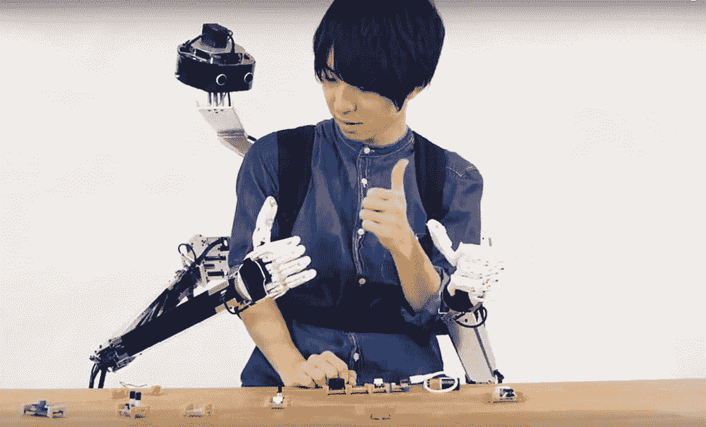
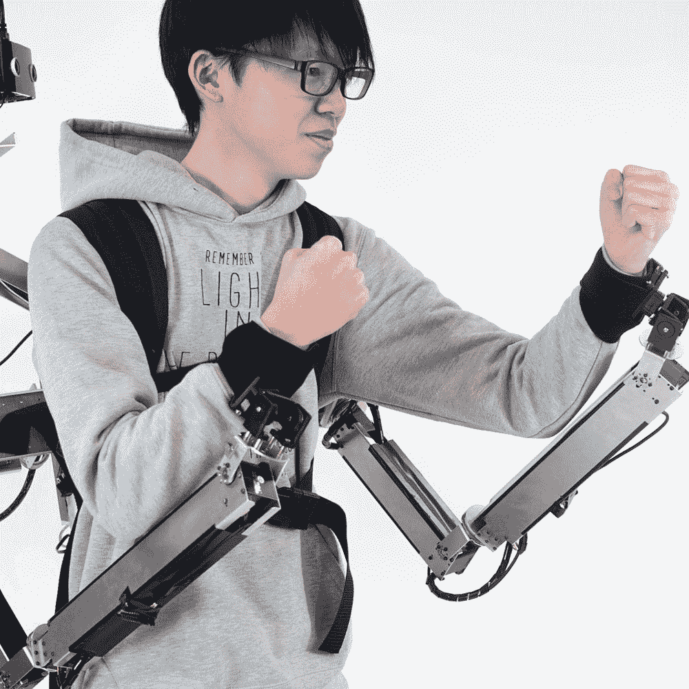

# 用这个背包获得两个额外的虚拟现实控制的机械臂

> 原文：<https://thenewstack.io/gain-two-extra-vr-controlled-robotic-arms-with-this-backpack/>

我们认为拥有双臂和双手的便利是理所当然的，但机器人技术的最新发展表明，即使是身体健全的人也可以通过额外的可编程手臂(甚至是 T2 手指)做很多事情。

庆应义塾大学媒体设计研究生院的助理教授 [Yamen Saraiji](https://myamens.com/) 希望扩大人体的限制，他创造了 [Fusion](https://myamens.com/?section=7) ，这是一套可以由另一个人通过虚拟现实控制的机器人手臂。观察这些额外的附件是如何工作的:

[https://www.youtube.com/embed/Nrc7gH6dydw?feature=oembed](https://www.youtube.com/embed/Nrc7gH6dydw?feature=oembed)

视频

该原型与东京大学合作完成，具有可穿戴的 21 磅重的系统，可以像背包一样携带，包括机械臂和手和手指的机器复制品。除了有足够一个半小时电力的电池外，该包还包括一台小型计算机，可以在用户和远程操作员之间无线传输数据，以及一台摄像头。

通过摄像头，第二个人作为另一个位置的远程操作员，可以通过 Oculus Rift VR 耳机实时“看到”第一个用户看到的任何东西。由于耳机中的传感器，当远程操作者在虚拟现实中移动他们的头部时，摄像机也会相应地移动，可以说，这给了操作者一个行动中的环座。为了远程控制背包的机械臂，操作员使用 Oculus 的触摸控制器，该控制器将运动中继到连接到背包计算机的微控制器。

目的是实现 Saraiji 和他的团队所说的“全身共享”，即远程操作者可以使用虚拟连接“潜入别人的身体”。由于这些手臂可以独立于佩戴它们的人而移动，机器人肢体不仅成为安装它们的“代理身体”的延伸，也成为控制它们的远处的人的延伸。

可选地，机械手可以被移除，并由可以连接到主持人的手腕的带子代替，使得远程操作者可以实际上为他们移动主持人的手臂。

对于我们中的一些人来说，这听起来可能有点令人毛骨悚然，但这样的系统有很多潜在的用途，例如协同使用它来完成任务，或者让一个人以动手的方式指导另一个人学习新技能。这里的主要思想是允许两个实体之间更流畅的交流和更顺畅的互动，[Saraiji 解释道](https://myamens.com/?section=7)“有效的沟通是社交和职业环境中的一个关键因素，这涉及到分享多个人的技能和行动。[..]我们通过这个系统展示了将我们的身体动作从一个人真正体现和转移到另一个人身上的可能性，实现了真正的身体交流。”

该项目是对[远程呈现](https://thenewstack.io/telepresence-robot-uses-virtual-reality-offer-immersive-experience/)技术便利性的一个有趣的扭曲，它允许人们通过机器人的眼睛“看”，而不必亲自到场。但这里有人类增强的因素，正如 Saraiji 所概述的，这个系统有三个层次的“身体驱动的交流”:定向、强制和诱导。最温和的味道是“直接”类型的身体交流，其中人形手正在帮助或教授代理宿主一项新技能。当机器人手臂直接绑在宿主的手臂上时，就会发生“强制”通信，允许远程操作员对代理人的肢体运动施加更多的物理控制。最后，当远程操作员使用更多的力量来控制主机的手臂时，就会发生“诱导”通信——可能会使它们左右晃动。

这不是 Saraiji 第一次进行人体增强实验；事实上，Fusion 代表了他之前项目 MetaLimbs 的一次重大升级，MetaLimbs 的特色是由脚踏板控制的机器人“第三只手臂”。但有了 Fusion，它可以由另一个用户虚拟控制的事实开辟了更多的可能性:人们可以想象有一个远程专家使用手臂来帮助佩戴者处理一些困难的任务，如修理计算机，帮助医疗急救，或促进远程辅助物理治疗。该团队现在希望找到商业化实现核聚变的方法；要了解更多信息，请访问[衙门撒莱吉](https://myamens.com/)。

图片:庆应义塾大学和东京大学。

<svg xmlns:xlink="http://www.w3.org/1999/xlink" viewBox="0 0 68 31" version="1.1"><title>Group</title> <desc>Created with Sketch.</desc></svg>