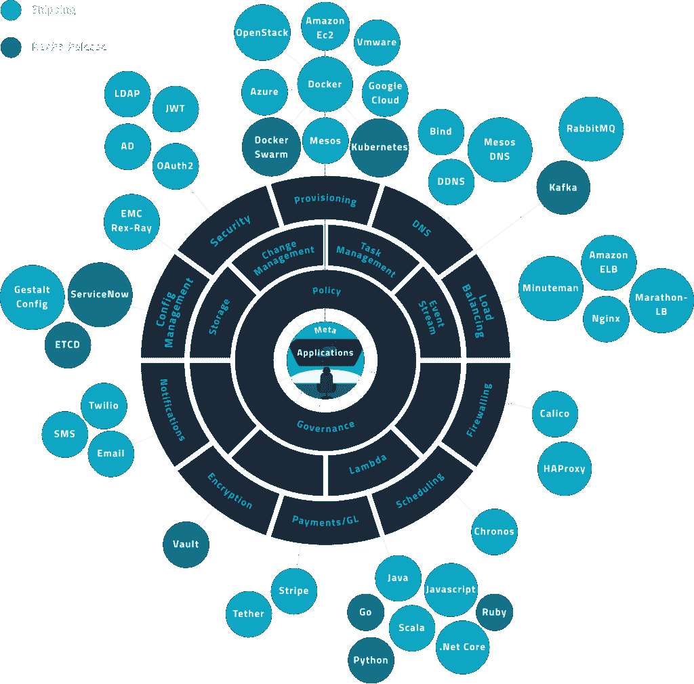

# 银河雾给中间层生态系统带来无服务器

> 原文：<https://thenewstack.io/galactic-fog-brings-serverless-container-ecosystem/>

随着[银河迷雾](http://www.galacticfog.com/product)最近为中间层的 DC/OS(数据中心操作系统)推出一个[无服务器](/category/serverless/)框架，容器 2.0 的愿景继续获得牵引力。

Galactic Fog 的[完形框架](http://www.galacticfog.com/announcement)提供了一种基于任务的能力，让应用程序开发人员可以继续构建功能，而不必管理容器环境。像 AWS Lambda 一样，完形框架中的这个工具也在事件触发时执行“ [lambda 函数](http://docs.aws.amazon.com/AWSCloudFormation/latest/UserGuide/aws-resource-lambda-function.html)”:旋转容器，运行任务，然后自动终止容器。

Galactic Fog 是一家云原生管理平台公司，旨在帮助企业从传统系统迁移到云模型。虽然该公司通过咨询模式创造收入而崛起，在这种模式下，它为 Active Directory 和 LDAP(轻量级目录访问协议)构建了适配器，但这给了该公司转向产品模式所需的专业知识，这种模式利用了该公司的适配器知识。例如，他们的完形框架产品发布的第一个版本包括用于 [Mesos](http://mesos.apache.org/) 、 [Kong](https://getkong.org/) 、 [Project Calico](https://www.projectcalico.org/tag/openstack/) 和 EMC 的 REX-Ray 的适配器。

完整的格式塔框架是一系列微服务，专注于为寻求将其应用程序迁移到云原生平台的企业提供合适的策略环境。大部分版本都是开源的，产品的策略引擎和 AD/LDAP 适配器组件都有商业许可。

在评估了来自 Docker 和 Kubernetes 的编排工具后，首席执行官 Anthony Skipper 表示，优先考虑的是与 [Mesosphere](https://d2iq.com/) 合作:他最喜欢 DC/OS 和 Mesos，并认为 Mesosphere 专注于内部部署的企业数据中心最适合 Gestalt 支持客户的地方。(未来的版本预计将提供与 Docker Swarm 和 Kubernetes 的集成)。

格式塔的思想是提供三个组成部分:

*   一个自顶向下的调度层，提供联合 ID 和策略管理，
*   一个基础设施层，包括一个用于 Mesosphere 的 DC/OS(和其他容器引擎)的可插拔接口，以及一个支持。NET、Javascript、Scala、Ruby 和 Python 编写的可以运行无服务器任务的函数，以及
*   满足常见企业集成要求的一套微服务。

[https://www.youtube.com/embed/KMg8dSKkaJ0?feature=oembed](https://www.youtube.com/embed/KMg8dSKkaJ0?feature=oembed)

视频

该软件现在已经扩展到更全面的开源生态系统组件，最初专注于中间层的 DC/操作系统平台。格式塔框架包括:

*   格式塔企业管理界面。
*   DC 操作系统的格式塔容器管理适配器。
*   格式塔拉姆达发动机。
*   格式塔政策引擎。
*   格式塔安全局。

Gestalt 已经集成了关键的企业微服务需求，包括使用 NGINX 实现负载平衡，使用 Calico 或 [HA 代理](http://www.haproxy.org/)实现防火墙，使用 [Stripe](https://stripe.com/) 实现支付，并拥有自己的配置管理。在接下来的版本中，它希望解决企业的其他常见集成需求:如 [ServiceNow](http://www.servicenow.com/) 和 etcd 配置管理，通过 [Vault](https://thenewstack.io/using-vault-to-manage-your-apps-secrets/) 加密，以及 Kafka 的事件流。

在为新堆栈记录 Mesosphere 的容器 2.0 精神时， [Scott M Fulton III 描述了](https://thenewstack.io/mesospheres-container-2-0-unites-stateless-stateful-workloads/)一种新的“编排风格——工作负载与持久卷通信，而不使用插件”，也就是 Mesosphere 的首席执行官 [Florian Leibert](https://twitter.com/flo) 所说的“容器 2.0”。富尔顿分享了一些例子，包括一家电信公司“在不停机的情况下动态地”升级集群。

格式塔框架是容器 2.0 精神在实践中开始显现的一个例子。

虽然完整的框架通过使用策略管理调度，提供了一种策略驱动的集成方法，并为 DC/操作系统环境启用了一个联邦层，但使 Gestalt 与众不同的是无服务器功能。

德里克·哈里斯上个月宣布完形理论时在中间层博客上写道:

编写基于 lambda 的任务的开发人员根本不需要考虑容器，更不用说虚拟机了，因为 lambda 会在幕后自动启动容器，执行任务，然后终止容器…由于 Apache Mesos 内置的两级调度系统，并由 DC/OS 完善，完形可以自由调度所有 lambda，并且只受分配给它的集群资源数量的限制。

如果 Galactic Fog 想要实现他们的承诺，帮助企业“让他们的应用经得起未来考验”，拥有一个提供无服务器功能的产品是必不可少的正如 Bernard Golden 等行业评论员[提到的](https://read.acloud.guru/serverlessconf-shows-the-future-of-computing-61820c1cea5e#.iivr7ra2b)，无服务器应用设计是云应用设计和部署的下一个阶段:

*我甚至可以说，最终，无服务器环境可能是大多数组织实施微服务的方式。将他们从管理执行环境的需要中解放出来，意味着他们可以专注于应用程序功能，这是所有最终用户价值所在，其他一切都只是低价值的管道。*

这是描述完形框架为容器生态系统提供什么的决定性因素。完形框架通过使无服务器功能成为可能，在帮助容器平台能够抓住实现微服务的更多优势而不增加 DevOps 复杂性方面迈出了一大步。

TNS 分析师 Lawrence Hecht 对本文有贡献。

Mesosphere 是新堆栈的赞助商。

由 Skeeze 通过 Pixbay 制作的专题图像。

<svg xmlns:xlink="http://www.w3.org/1999/xlink" viewBox="0 0 68 31" version="1.1"><title>Group</title> <desc>Created with Sketch.</desc></svg>