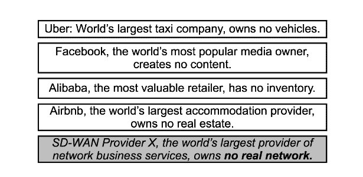
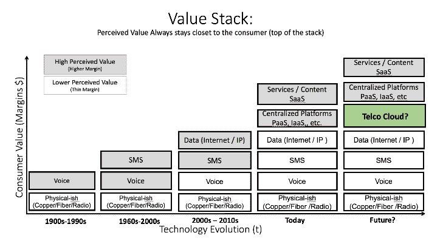
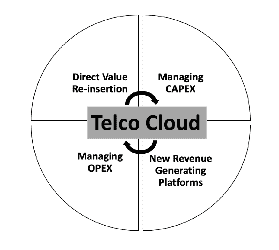
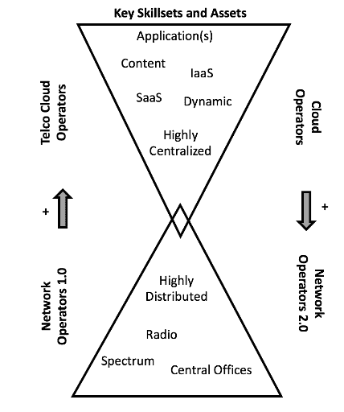

# 节点游戏:网络运营商 vs .云运营商

> 原文：<https://thenewstack.io/game-nodes-network-operators-vs-cloud-operators/>

[](https://twitter.com/marcoprodrigues)

[Marco Rodrigues](https://twitter.com/marcoprodrigues)

[Marco Rodrigues 是瞻博网络公司 Contrail Solutions 部门的杰出工程师。他在构建和运行大型网络方面拥有超过 18 年的经验。最近的重点是与各种一级参与者一起帮助推动和交付电信云目标架构和战略。这个策略的很大一部分包括 OpenStack 和 OpenContrail。](https://twitter.com/marcoprodrigues)

[](https://twitter.com/marcoprodrigues)[](https://twitter.com/marcoprodrigues)

网络商品化的话题掀起了一阵信息旋风。说真的。只需在你最喜欢的搜索引擎中搜索“SDN”、“NFV”或“电信云”您会发现许多开源项目、社区、论坛、架构定义、标准、标准体、新闻文章、新闻稿和博客网站都致力于上述内容。

有了这么多的信息，你会认为外面的人会深刻理解为什么这些话题会制造这么多噪音。我特意问我遇到的每个人这个简单的问题:“用几句话来说，电信云、NFV 或 SDN 对您来说意味着什么？”在许多情况下，人们通常只是引用一串时髦的词语——其中大部分我都被编程遗忘了。其他人则投身于这些趋势的“是什么”和“如何”之中。只有极少数人理解“为什么”,以及他们所在行业当前的商业模式面临着根本性的挑战。有些事情必须改变。

## 商品化和价值

2012 年 4 月 27 日，是我意识到我在过去二十年里帮助建立的这个行业已经发生了根本变化的那一天。这一天很容易记起，当时我正在公寓里的椭圆机上锻炼，眺望纽约的天际线，我敬畏地看着美国国家航空航天局(NASA)的“企业号”(Shuttle Enterprise)航天飞机在波音 747 飞机上进行最后一次飞行。航天飞机怎么会走到这一步？现实是显而易见的:它的主要工作已经完成，为其他人做他们的工作铺平了道路。

电信行业正在经历类似的转变。现实和结论颇为相似。建设互联网的一个关键指标是建立一个网络，让世界上任何地方的任何人、任何事都能近乎实时地消费信息；所有这些都具有共同的接入基底(IP:互联网协议)。

祝贺所有让这一切成为可能的人:我们已经商品化了。

商品化是任何成功行业的自然过程。互联网有多成功？引用瞻博网络公司创始人[帕拉德普·辛杜在](https://www.juniper.net/us/en/company/leadership/pradeep-sindhu/) [2015 年光网络和通信大会](http://www.ofcconference.org/library/images/ofc/Archive/OFC2015-Archive.pdf) (OFC15)全体会议上的“传输网络的未来”，我们已经看到了互联网的指数级增长，无论使用什么指标。例如，从 1991 年到 2015 年，我们看到了以下增长:

1.  用户数量:3 倍于 10^9
2.  设备数量:5 倍 10^9
3.  网站数量:10^8 的 2 倍
4.  申请数量:10^7 因素
5.  总带宽:5 倍 10^7

从上述所有指标来看，公共 IP 传输(互联网)显然是一个巨大的成功。而且看不到增长的尽头。如果说有什么不同的话，那就是它的成功正在加速。想想物联网(对我来说，它意味着联网中一切有价值的东西)和 4K Over The Top ( [OTT](https://digiday.com/media/what-is-over-the-top-ott/) )大规模视频内容，这就在眼前。

你可能会认为，在这种势头下，连接提供商将会享受这种增长。然而，连接提供商面临的根本挑战是持续创新，加上爆炸式增长，需要持续投资。这在一个具有以下固有属性的行业中很棘手:

1.  对客户价值的感知下降(我将在下面解释)
2.  密集资本支出(CAPEX)
3.  不断膨胀的业务支出(OPEX)
4.  收入流下降/持平

利润缩水是一个指数级增长的行业最不应该面对的事情。那么，怎么回事？

## 一切即服务

让我们面对现实吧。消费者和企业欣赏他们直接消费的东西。换句话说，他们消费的是他们最看重的东西。假设是，如果他们消费他们认为有价值的产品或服务，他们会愿意为此付费。商品化与感知价值成反比:

```
commodization  =  1  /  perceived value

```

简单地说，当服务或产品的感知价值增加时，它就不再是商品了。反之亦然:如果一项服务或产品的感知价值下降，它就更接近于一项商品化的业务。

让它沉淀一会儿，祝贺你自己。你已经建立了一个改变世界的无价产业——但是世界还得继续前进。

你上一次听说传统的电气、航运、运输公司、制造商或汽车制造商(除了最近的几家)是创新中心是什么时候？他们之所以成为颠覆的目标，正是因为现有的商业模式几乎没有变化，而人们并不直接重视他们提供的产品或服务。

> 价值的赢家是提升客户体验的人。

你可能已经看到了这种迷因的一种形式，它超越了你的社交和/或职业网络。以下是几个例子(我冒昧地加了灰色的方框):



所有这些公司要么已经建立，要么依赖于其他平台。这些平台主要使用互联网进行连接。传统的商业网络服务也受到新兴 SD-WAN 市场的威胁。

如果从这篇文章中学到了什么，那就是:任何行业的赢家都为最终用户(消费者/企业)提供了直接价值。要想成为赢家，你必须继续寻找提升价值的方法——否则别人就会这么做。

这是我的啊哈！那一刻，我最终接受了电信行业的现状。现在的关键是理解我们是如何走到这一步的，以及在前进的道路上可以做些什么。

## 价值栈

人们重视他们消费的东西。让我们看看电信在上个世纪在价值链中的位置(简要说明一下):



通信运营商是有线电话、移动电话、短信(SMS)和数据(互联网)服务的提供商。从历史上看，这些都是由客户消费的直接服务。

> 过去十年发生了一些根本性的变化:网络运营商已经成为间接的价值提供者。利用通信基础设施的平台和公司正在推动服务和产品的直接消费。

传统网络运营商是终端消费者很少了解的一部分价值管道。例子包括:

*   SaaS 直接提供给消费者和企业。

*   直接提供给消费者、企业和 SaaS 的 IaaS。

*   正在创建的内容(网飞、亚马逊、Hulu 等。)并通过非传统实体和手段进行传送(IP 而非广播/有线)。

要保留任何成长型企业所需的关键投资要素，就必须为消费者提供直接价值，而不是成为另一个小工具。问题是怎么做？

## 转型为电信云运营商

云运营商和关键的 SaaS 平台是大多数行业羡慕的快速创新和高效执行的例子。他们不断地解决客户的问题，并找到颠覆新行业的方法。



与云运营商类似，电信公司提供更大价值的目标是软件定义网络(SDN)和网络功能虚拟化(NFV)的核心，也就是说，它们可以帮助传统网络运营商转变为灵活、高效的电信云运营商和创新中心。这种转变将允许电信公司建立业务和技术技能，允许价值链重新插入，同时管理资本支出/OPEX，同时创造新的收入流。这将是我未来博客的主题。

## 电信云运营商与网络运营商 2.0

如果你在一家电信公司工作，这并不意味着一切都是悲观的。传统云运营商传统上不是网络运营商。他们在做什么？构建全球网络，为客户提升平台价值。分发提供的价值可以直接或间接量化为规模、应用优化(低延迟)、冗余或网络成本效率。通过为他们的平台增加更多价值，他们可以继续在现有的利润上赚钱和/或通过新的服务选项建立新的收入来源。



最近的新闻文章，如:[“云巨头资助的海底电缆”](http://www.thewhir.com/web-hosting-news/here-are-the-submarine-cables-funded-by-cloud-giants)和 James Hamilton 的[“规模创新”AWS re:Invent 2016 Keynote](https://www.youtube.com/watch?v=AyOAjFNPAbA) 应该会引起世界上每一个地铁和交通网络 CxO 的关注。

记住这一点，问问你自己:在过去的半个世纪里，电信公司建立了什么？一个高度分布式的有线和无线网络连接着数十亿人，很快将有数十(数百？)的数十亿台设备。他们已经拥有了网络和终极游戏，也就是与数据消费者(也就是眼球)的最后一英里连接。

不要小看这个价值。其他人以这样或那样的形式看到它并想要它([谷歌光纤](https://arstechnica.com/information-technology/2017/03/google-fiber-reportedly-canceling-installations-in-kansas-city/) / [项目 Fi](https://fi.google.com/about/) 有人吗？)另一个例子是[彼得·莱文的演讲《云计算的终结》](http://a16z.com/2016/12/16/the-end-of-cloud-computing/)中的“边缘价值”很有启发性。对于已经经营了几十年的公司来说，真正的挑战是以一种重新获得价值堆栈中的价值的方式改变商业模式和劳动力。

事实很简单:云提供商希望网络利用它为他们的服务提供的固有价值，而电信运营商需要彻底改造自己，重新融入价值链。

这是一场我饶有兴趣观看的比赛。谁会赢？

*   电信云运营商:成熟的网络运营商成长为价值提供商，同时使用类似云的方法来简化资本支出/OPEX 构建并创建新服务。

或者

*   网络运营商 2.0:一切事物的颠覆者显然将目光投向了传统的网络行业。

## 摘要

这篇文章旨在围绕目前困扰互联网和电信行业的所有 SDN/NFV 疯狂事件提出结构和基本原理。目前的电信运营模式存在一个根本性的问题。但是，迄今为止已经建成的东西仍然有很多内在价值。一种直接向消费者展示这种价值的方式将是电信发展的基础。脱颖而出的赢家将是那些能够在被中断的阴影下同时应对组织、技术和业务挑战的人。

请关注未来的帖子，这些帖子将阐明电信云网络和运营商的内容和方式。这些帖子将详细阐述什么是电信云，它如何解决商品化行业现有企业面临的四个关键挑战，以及我观察到的几个关键用例。

Juniper Networks 提供的特征图像。

<svg xmlns:xlink="http://www.w3.org/1999/xlink" viewBox="0 0 68 31" version="1.1"><title>Group</title> <desc>Created with Sketch.</desc></svg>