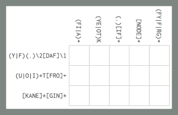
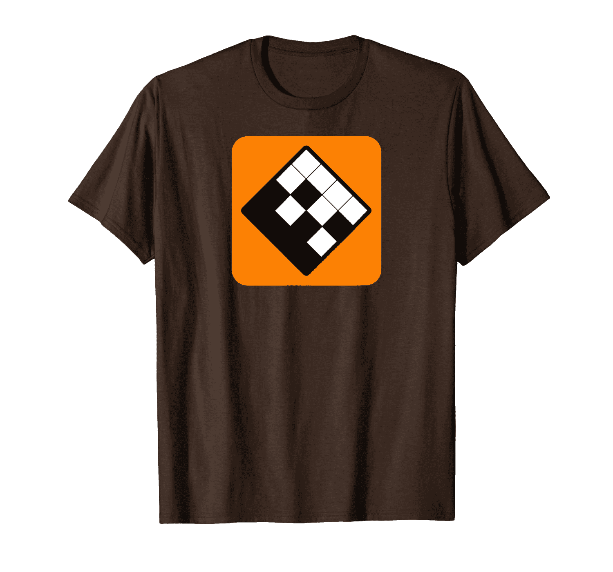
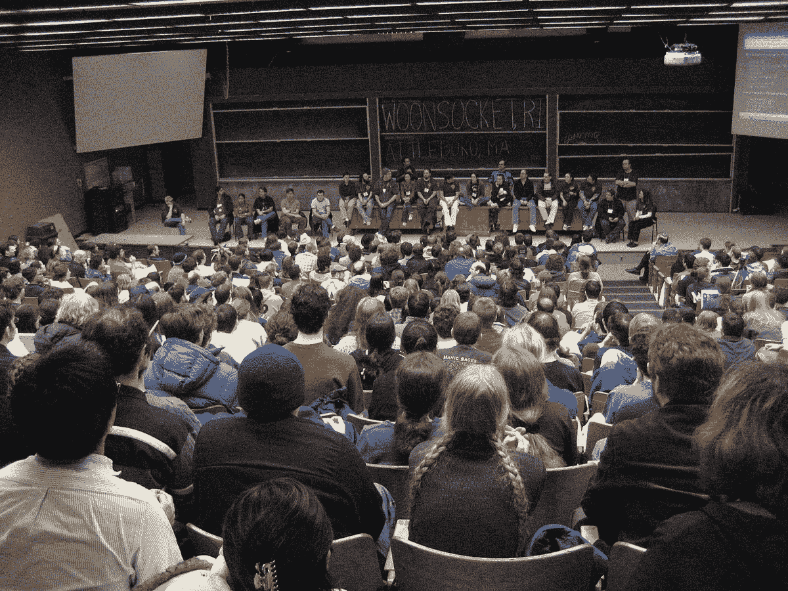

# 极客的游戏:用正则表达式找乐子

> 原文：<https://thenewstack.io/game-of-geeks-having-fun-with-regular-expressions/>

六年来，网站[RegExCrossword.com](https://regexcrossword.com/)一直提供用编程语言正则表达式制作的纵横字谜。"欢迎来到书呆子雷杰克斯乐趣的梦幻世界！"在其主页上显示一条问候语。这就像一个传统纵横字谜的缩小版——除了不是使用单词作为线索，而是使用指定搜索模式的熟悉语法来描述每个方块的内容。

作为一个长期受欢迎的网站，该网站的访问者现在已经提交了超过 1，193，436 次的正确答案。有超过 57，254 名注册玩家，代表着一个顽强而忠诚的追随者。快速搜索显示，它的页面已经被提交给黑客新闻[至少 27 次](https://news.ycombinator.com/from?site=regexcrossword.com)——上周，同一个网址终于收到了超过 405 张赞成票和超过 59 条赞赏性评论[。](https://news.ycombinator.com/item?id=20874475)

多年来，这个想法也激发了其他极客的想象力，催生了一个非常 21 世纪的民间庆祝活动，庆祝我们劳动的工具。这充分证明了在一个有趣的新环境中看到正则表达式是有教育意义的，可以宣泄情绪，有时甚至可以增强自信。但是，它是否也告诉了我们一些关于我们文化的东西，用我们玩耍的方式传递了我们工作方式的新视角？

为了探究正则表达式谜题的诱人阴谋，我找到了软件工程师 Ole Michelsen，RegExCrossword 的联合创始人之一，并请他告诉我这一切是如何开始的。

## **神秘狩猎**

“灵感来自麻省理工学院的神秘狩猎，”迈克尔逊在一封电子邮件中告诉我。自 1981 年以来，狩猎已经成为技术学院一年一度的传统。据该活动的网站称，每年麻省理工学院的学生都要应对令人惊讶的各种智力挑战，包括字谜、数字游戏、寻宝游戏和纵横字谜。

2013 年的狩猎有创纪录的 150 个谜题——迈克尔逊记得其中一个谜题[是六边形 regex 纵横字谜](https://regexcrossword.com/playerpuzzles/8cbea27f-c4c5-4d11-a509-6a622ba01107)。

“解决这个问题真的很有趣，我们认为其他人可能会对解决一些稍微简单的版本感兴趣。”

Ole 与他的妻子 Maria Hagsten Michelsen 合作，她的推特简介[将她描述为“一个充满激情的平面设计师和插画师，他的目标是通过有远见和有思想的设计来改善世界。”他们一起决定制作一个充满疯狂的正则表达式填字游戏的网站。在真正的极客时尚中，他们决定添加一些增强功能。仅举一个例子:谜题可以旋转，以便更容易阅读线索…](https://twitter.com/mhmichelsen)

"我们也想要能解出一个小单词/句子的谜题作为奖励."例如，一个名为“哈姆雷特”的谜题的答案可能以字母 T-O-B-E-O-R-N-O-T-T-O-B-E 开始……)

他们还确保字谜的格式便于打印，这样就可以在普通打印纸上打印出来(并解决问题)。

当大批狂热的极客开始涌入网站时，“我们很快意识到我们需要一个账户和带有奖杯等的排名/评分系统，”Ole 写道。

但是最吸引人的总是那些令人烦恼且精心制作的谜题。“挑战是用转移注意力的东西做谜题，但仍然只有一个有效的答案，”Ole 告诉我。“我们还希望通过挑战逐步增加难度，因此它们都有不同的主题和难度。

## 网站的秘密

现在网站上有 55 个“挑战”谜题——但这仅仅是个开始。玩家甚至可以提交他们自己的谜题，所以现在有 688 个玩家提交的谜题可供选择。“我们从社区中得到了如此多伟大而有创意的谜题，这就是这个网站仍然活跃的真正原因，”Ole 承认道。

它建立了强大的追随者。“有一次，我们上了《黑客新闻》的头版，然后它就开始流行了，”Ole 回忆道，并指出在那以后的几年里，它还出现在其他一些有趣的场合。

“有一次，我们了解到它被用作伯克利计算机科学课程的课程练习材料。我们是在荷兰 Python 会议的节目中出现的。”LinkedIn 甚至在他们的工程招聘过程中使用了这个想法的副本。"

这也激发了其他极客想出他们自己的创造性解决方案——并在同一个疯狂的游戏上提供变体。上周在《黑客新闻》上，一个粉丝甚至分享了一个链接到 GitHub 上的一些代码，这些代码是他们写的，通过“[生成一串与](https://news.ycombinator.com/item?id=20877871)[的正则表达式匹配的字符串](https://github.com/lvh/regex-crossword/blob/master/src/lvh/regex_crossword/logic.clj)，然后将它们作为约束来解决这些难题。”

在 Noah Luck Easterly 的 GitHub 库中等待的是一个巨大的 127 个单元的六边形拼图——并呼吁其他人帮助创建更多。

还有一个“ [Regex Golf](https://alf.nu/RegexGolf) ”的网站，玩家通过在正则表达式中使用更少的字符来匹配一长串单词(而不匹配同样长的列表中的其他单词)，从而降低他们的分数。

对于程序员来说，RegExCrossword 是一种用他们的行业工具进行实践的有趣方式。它甚至为玩家提供了一个方便的正则表达式备忘单。只需点击页面右上角的圆圈中的问号。

即使过了六年，Ole 仍然梦想着改进网站的新方法。

“现在我正在开发一个移动版本，这有点需要重新思考，因为很难将如此复杂的内容转移到一个小屏幕上，”他写道。

但是极客需要修补，这可能是最鼓舞人心的消息。

他为极客们设计了一个谜题，并把它变成了一个更加极客化的挑战。

* * *

# WebReduce

由[汉斯-彼得·高斯特](https://unsplash.com/@sloppyperfectionist?utm_source=unsplash&utm_medium=referral&utm_content=creditCopyText)在 [Unsplash](https://unsplash.com/search/photos/puzzle?utm_source=unsplash&utm_medium=referral&utm_content=creditCopyText) 上拍摄的特征图像。

<svg xmlns:xlink="http://www.w3.org/1999/xlink" viewBox="0 0 68 31" version="1.1"><title>Group</title> <desc>Created with Sketch.</desc></svg>