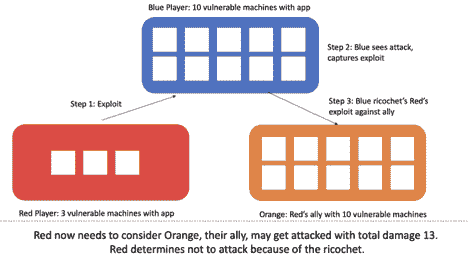

# 博弈论:为什么系统安全像扑克，而不是象棋

> 原文：<https://thenewstack.io/game-theory-why-system-security-is-like-poker-not-chess/>

 [大卫·布鲁姆利博士

大卫·布鲁姆利博士联合创立了 ForAllSecure，对全世界的软件进行自动检查和保护。ForAllSecure 的产品基于他在程序分析方面超过 10 年的研究。大卫作为卡内基梅隆大学的终身教授正在休假，他的职位是计算机科学、电子和计算机工程。大卫的学术工作获得了美国总统早期职业生涯奖，斯隆奖，以及在同行评审场所发表的许多奖项。](https://users.ece.cmu.edu/~dbrumley/) 

1980 年的电影《战争游戏》要求一台计算机学习全球热核战争是否有意义。在电影中，热核战争没有意义，但如果在现实生活中，先发制人的网络攻击是我们获胜的最大希望呢？或者更好的是，当和平是最佳战略时，网络战的场景和动机是什么，就像“战争游戏”一样？或者反过来，最好的办法是投资进攻？

我们不喜欢考虑网络中的进攻和攻击。但是你想想进攻，就不能发展出更好的防守吗？非正式地做可能很棘手，我们需要的是决策和战略制定框架。

博弈论是数学的一个分支，它允许我们通过网络攻击/防御场景进行推理，而无需在哲学圈里打转。博弈论是由通晓多种语言的计算机科学家约翰·冯·诺依曼创造的。约翰尼是一个有趣的家伙，他喜欢创造不寻常的首字母缩写词，比如“MAD ”,意思是确保相互毁灭。他也有问艰难问题的诀窍，一个著名的妙语是“如果你说为什么不明天轰炸(苏联)，我说，为什么不今天？”MAD 允许 Johnny 回答这个问题。最终疯狂是战争游戏中的 WOPR 电脑决定不发动热核战争的原因，并得出结论“唯一的胜利之举就是不玩”

网络显然不是热核战争。我们需要思考它是如何不同的，建立模型，并看看这些模型如何发挥作用。我们需要问一些尖锐的问题，就像强尼一样。

例如，一个漏洞只是网络上的一些比特，如果你的对手碰巧记录了攻击，它就可以被复制。您可以使用该信息来“反映”或“反弹”针对您的对手的漏洞利用，或者您可以决定使用该新知识来创建补丁。当你抓住别人的漏洞并加以利用(或修补)时，你已经用他们的能量来对付他们了。如果你能更好地利用对手的精力和时间为自己谋利，你就有更大的成功机会。

## 博弈论在国家舞台内外都是相关的

美国政府有责任保护国家，这(相当合理地)包括网络进攻和防御。美国的政策是优先考虑防御，并披露美国脆弱性股票程序(VEP)中的任何行动。美国国家安全局(National Security Agency)表示，它通常会披露其研究人员通过 VEP 进程评估后发现的约 91%的漏洞。

有争议的是，我不是一个安全专家，认为国家安全局应该公开每个漏洞。进攻确实有价值，网络进攻一直是现实世界事件的关键部分，如[侵入 DNC 服务器](https://en.wikipedia.org/wiki/Democratic_National_Committee_cyber_attacks)(坏)或[破坏一个危险国家的核材料计划](https://en.wikipedia.org/wiki/Stuxnet)(好)。如果在用炸弹杀人和用网络攻击达到同样目的之间有一个选项，我认为网络可能更有意义。任何公开与否的问题都不应该孤立地提出来。正如你所看到的，这取决于游戏，以及什么样的策略最有可能达到预期的结果。

博弈论不仅仅适用于民族国家；这是一种模拟场景和指导决策的方式。你可以对其他人将如何采取行动以及你将如何应对该行动的概率进行建模。

有一点很清楚，网络攻防不是象棋。这是一种扑克游戏。在国际象棋中，你可以完全看清对手的位置和走法。在扑克游戏中，你缺乏这种可见性，这种情况在网络领域也会发生。在网络上，你无法确定你的对手知道哪些漏洞，他们是否在使用他们披露的漏洞，以及你的零日是否真的是全球零日。

策略意味着你已经考虑了各种选择、风险和回报。你已经建立了一个游戏，不是在嬉戏，有趣的意义上，而是一个允许你通过行动，激励和可能性进行推理的游戏。

网络也应该如此。在我写这篇文章的时候，我想象着著名的安全专家大声疾呼“负责任的披露是道德的选择”和“当我们不负责任地披露时，我们作为一个国家会有更大的风险。”对于这些专家，我请你们停下来，暂时唱反调。破解你的假设，并真正测试它们。我相信它会带来更好的思考。

我们如何想通该做什么？

让我们玩一个游戏。

## 零日游戏

假设您发现了一个新的零日漏洞。您可以披露零日漏洞，或者创建一个漏洞并攻击他人。你的行为会产生后果，你有能力进行一系列的行为:

1.  **只利用**。进攻是有价值的，你会得到一些有用的东西，比如进入、情报或控制。
2.  **只透露**。我们披露，因为它导致了补丁，网络过滤器，或其他补救措施。披露不是辩护；这只是防御的前兆。披露后，补丁或补救措施被创建，并最终推出。补救措施是为攻击者消除漏洞。
3.  **借题发挥然后揭发**。为什么不利用一些系统，希望不被发现，然后披露？如果你为数不多的功绩从未被注意到，你仍可能被视为好人。
4.  **揭露然后利用**。披露机会窗口是漏洞被披露和补救措施保护系统之间的时间。我们知道机会窗口会很大。例如，美国国家安全局声称，它在历史上披露了它发现的 91%的漏洞，但美国安全局也声称利用已经披露的[漏洞](https://www.usenix.org/node/194636)是有效的。使用已知的漏洞是可行的(至少部分可行),因为我们无法立即修补所有东西。
5.  **库存**。你什么也不做，把信息留给自己，以后再做决定。但是零日有一个保质期，当其他人发现同样的漏洞时，它就会过期。你不知道要花多长时间，但只要软件保持相关，你发现的任何零日最终都会被其他人发现。

## 我们采取的行动是在整个世界的背景下进行的

在博弈论中，我们创建一个游戏状态来捕捉上下文。博弈论还要求我们要正式，并为每个行动提供效用——积极的或消极的。在风险评估中问任何人；如果你没有一个行动的成本，你就不能评估风险。博弈论的好处在于，你可以使用不同的效用函数来理解它们如何改变结果。例如，如果被利用的成本是 10 美元对 100 万美元，防御者的策略会如何变化？

让我们从简单的两个玩家开始:红蓝。每个玩家都运行相同的软件，比如说 Windows 10。由于双方运行相同的软件，每一方都受到新的零日漏洞的影响。一个玩家只能在发现零日的时候利用或者透露。如果他们选择利用漏洞，他们每破坏一个系统就会得到一分。每个玩家都想通过获得最多分数或至少平局来获胜。

在这场游戏中，计算机系统的数量至关重要，因为它凸显了特定漏洞可能带来的潜在不对称风险。我们假设红色和蓝色是不同的，蓝色有 10 台电脑，红色有三台。

**(红色的视角)**:如果我发现了一个新的零日，我攻击蓝色的电脑最多可以得到 10 分。我只有三台易受攻击的电脑，所以最多蓝可以拿三分。从 10 > 3 开始，我会一直进攻。

**(蓝色视角)**:如果我发现了一个新的零日，我可以在攻击红色的电脑时获得最多三分。然而，如果红色找到它，他们会得到 10 分。披露和修补是有意义的，假设我能在红色攻击前安装好修补程序。

在这个游戏中，蓝色受到激励不去攻击。从伦理上看，这似乎是一个好结果。不幸的是，红色是发动战争的诱因。稍后，我们将会看到一种激励红色创造和平的方式。

甚至这个简单的例子也强调了一些教训和属性:

1.  衡量您针对已披露的漏洞部署补救措施的速度。知道你正在运行易受攻击的软件是不够的。重要的是你能以多快的速度部署补救措施或补丁。这是你可以衡量和优化的。
2.  弱小的国家——或者那些没什么可失去的国家——更容易受到攻击。这将选中模型在此维度中代表现实的复选框。
3.  负责任的公开有两个世界:一个是供应商修复软件的世界，另一个是他们不修复的世界。如果供应商从未解决问题(咳咳，物联网)，有帮助吗？在短期内，它给了坏人去哪里找的信息。另一方面，传统的观点是，它有助于让公众意识到谁是“负责任”的供应商，谁不是。除此之外，我们可以开始模拟这样的场景。羞辱不响应的供应商有什么(负面)效用？他们需要多坏才会采取行动？一个理性的人会简单地忽略这个漏洞吗？
4.  找到零日的玩家有选择权。如果你不花时间在你自己的软件和供应链中寻找漏洞，你的策略就是被动的。我还要补充一点，如果你不使用技术，至少不像对手那样全面(例如，犯罪分子——如果你是一家企业),你也选择了被动。

## 零日是真正的零披露

术语“零日漏洞”有点用词不当。如果您发现了以前未报告的漏洞，并不意味着其他人不知道它。这意味着没有其他人公开披露过。

假设 Blue 使用以下任一方法找到了一个新的零日:

1.  经过两天的分析，一个广泛使用的模糊器，如 [AFL](http://lcamtuf.coredump.cx/afl/) 。
2.  一个超级秘密，10 天后的下一代技术。

你用来发现漏洞的方法可以改变你的对手也发现漏洞的概率。如果您花了两天时间才发现漏洞，那么攻击者很可能也能在两天内发现漏洞。发现漏洞所需的时间与发现漏洞的难易程度有关。但是，你用来发现漏洞的超级秘密技术是你一个人的。如果它发现了一个漏洞(而 AFL 没有发现)，在别人发现它之前，这个漏洞可能有更长的保质期。

您也可以开始估计您的对手可能有多少新的漏洞。例如，[三年来，谷歌报告了超过 3849 个新的安全关键漏洞](https://www.csoonline.com/article/3444496/autonomy-and-the-death-of-cves.html)，使用他们的 oss-fuzz 基础设施，相当于每天 3.5 个。想想看:据统计，谷歌将在圣诞节和新年之间发现 28 个新的安全问题。谷歌有民族国家进攻能力。是的，武器化需要更多的时间，并不是每天 3.5 个漏洞都可以被武器化，但你得到了要点。

谷歌在他们的开源 fuzzing 中使用开源工具，在攻击者之前找到 bug。如果你真的想主动出击，我建议你效仿他们，采用攻击者也使用的技术。这是一种积极主动的方式。即使你有一种神奇的技术可以发现所有的漏洞，攻击者使用的模糊和其他技术也能有所帮助。如果您发现了一个 bug，并且有数据显示使用这样的工具需要多长时间，您可以使用该信息来评估风险或攻击者需要多长时间。

## 跳弹袭击和玻璃房子

漏洞是比特，可以复制。如果你很擅长跳弹呢？这改变了游戏模型中的策略。有趣的是，它可以为每个人提供一个不攻击的真正激励。

如果当蓝色发动攻击时，红色可以跳弹呢？蓝色可以开始推理可能性:

*   如果我的攻击没有被发现，我得三分，红色得零分。我赢了。
*   如果红色可以跳弹——即检测并反映针对任何特定系统使用的零日——他可以复制它并利用我的 10 台易受攻击的计算机。我不应该攻击。

考虑一些极端值。如果红色可以 100%反弹任何攻击，那么蓝色永远不应该选择攻击。如果红色有 0%的机会跳弹，蓝色应该总是在这场比赛中进攻。极端值有助于澄清情况，但我们不需要假设 100%跳弹。如果 Red 只抽取 10%的流量进行真正深入的分析会怎么样？只有一种可能性，他们看到零日；这足以抑制蓝色吗？

跳弹的有趣之处在于，即使存在弱点，它也能激发和平。有点像疯了，但世界没有被摧毁。如果红色和蓝色有相同数量的系统，并且都有跳弹，任何一方都不应该攻击。就像那句老话:住在玻璃房子里的人不要扔石头。

对我来说，这个框架表明美国的行为是理性的。如果其他人发现漏洞并将其武器化，他们可能会损失最大。理性上(不仅仅是伦理上)，把他们的拇指放在天平的披露侧是有意义的。

除了直接跳弹之外，我们还可以认为泄露向攻击者提供了一些部分信息，这些信息也指导了决策。蓝梅进一步推理道:

*   如果我暴露了这个漏洞，我将需要时间为我的 10 个系统打补丁。我知道我需要在瑞德将大揭露武器化之前尽快完成。
*   如果我什么都不做，我不知道 Red 以后会不会发现并利用这个漏洞。毕竟，红色是聪明的，人们也在寻找零日。我能等多久做决定？

跳弹不一定是报复。例如，假设红色有一个盟友橙色有 10 台易受攻击的计算机。以前，在没有盟友的情况下，激励似乎会促进红色攻击。如果蓝色可以反弹，他可以通过反弹攻击到橙色来阻止红色。红色现在不得不接受如果漏洞被发现他们将失去的三分，加上蓝色对橙色可能造成的 10 分伤害。这个新世界表明红色不应该再先攻击。

想象一个疯狂的世界，俄罗斯只是说，“如果我看到网络攻击，我会对以色列每台易受攻击的计算机进行同样的攻击。”这将激励以色列不仅与俄罗斯保持和平，还会激励以色列向盟友施压，要求他们不要发动攻击。它还将指导国家政策(例如，变得非常擅长跳弹)。

即使你不能跳弹，博弈论建议你不仅应该披露你发现的漏洞，还应该披露那些针对你的漏洞。攻击/防御黑客竞赛告诉我们，最好的办法是先攻击最弱的玩家。如果你对一个弱势玩家利用漏洞，而他们发现了，你知道不要对一个强势玩家利用漏洞。它并没有说一个更强的玩家不会检测到它，但确实提供了一些信息。

如果您披露了对您的网络的任何攻击，特别是如果您披露了新的零日，您可能会打击攻击者。至少，他们不会先攻击你，而是先攻击别人，这是有道理的。

在这一点上，如何在国家层面使用博弈论的细节是理论上的。美国国家安全局授予其“安全科学”奖的是我和研究生蒂芙尼·鲍写的一篇关于博弈论的论文。这篇论文做了一些简化的假设，这些假设可能没有捕捉到许多现实世界的因素。当我们知道这个世界不是理性的时候，它就假定了理性。从保险精算的角度来看，当现实世界更加复杂时，会有一个效用函数。重点是阐明在 MAD、经济学和其他领域行之有效的思维方法。一般来说，博弈论也可以强调我们可以在哪里放置不明显的激励，以及这些激励是否真的改变了我们(认为)正在玩的游戏。

## 优化选择

2014 年，我实验室的 Tiffany Bao 和 Steven Turner 发表了[一篇关于识别 COTS 编译二进制文件](https://www.usenix.org/system/files/conference/usenixsecurity14/sec14-paper-bao.pdf)内部函数的论文。功能识别是漏洞研究中的一个基本挑战。一般认为，您在功能识别方面做得越好，您的漏洞研究就越有成效。常见的推理是，除非您将商业成品(COTS)应用程序分解为功能，否则漏洞发现不会很好地工作。因此，漏洞研究的第一步通常是将 COTS 应用程序逆向工程成函数。

我们的实验表明，我们的工具 ByteWeight 在 64 位二进制文件上有 99%的精度和 98%的召回率，而 IDA pro(一种最先进的商业工具)分别有 74%和 55%的精度和召回率。坚实的进步。

我们接着问，“这样的改进对什么有意义？”很容易挑选出缺少功能的情况，这样就很难找到漏洞。但在决定策略时，轶事并不重要。所以，我们建立了两个世界:一个使用了 ByteWeight，另一个没有。

更具体地说，我们分析了 ShellPhish 使用 ByteWeight 的决定是否对他们在 DARPA 网络大挑战(CGC)中获得第三名有影响。在世界 1 中，ShellPhish 使用了 ByteWeight，我们有他们在 CGC 的真实表演。在《世界 2》中，我们分析了如果没有 ByteWeight ShellPhish 会做得多好。没关系，他们仍然获得了第三名。详情在蒂芙尼宝[博士论文](https://kilthub.cmu.edu/articles/Autonomous_Computer_Security_Game_Techniques_Strategy_and_Investigation/7207325)(6 . 3 . 1 节)。

一项博弈论分析表明，IDA Pro“足够好”。功能识别在 CGC 并不是一个障碍。一个更好的策略是在更好的模糊技术上投入等量的 R&D 元。原因是与仅使用 IDA Pro 相比，达到 100%的有效性不会改变结果。

能学到什么？如果你有一个目标，比如找到零日或防御，问这个问题“如果我们成功了，这将如何改变结果？”假设研究有突破，100%有效。这会改变游戏吗？

例如，假设您可以投资于一个真正深入的静态分析工具，该工具可以突出显示错误代码行，100%识别所有缺陷，但是很难对报告采取行动。与不太深入但更具可操作性的东西相比，这种深入的分析真的对你有益吗？目标通常不是寻找缺陷，而是减少从引入漏洞到部署补丁的时间。想一想参与这样一个项目的所有动机。

## 摘要

策略意味着你已经考虑了各种选择、风险和回报。你已经建立了一个游戏，不是在嬉戏，有趣的意义上，而是一个允许你通过行动，激励和可能性进行推理的游戏。

网络也应该如此。当我写这篇博客时，我想象著名的安全专家宣扬“负责任的披露是道德的选择”或者“当我们不负责任地披露时，我们作为一个国家会有更多的风险。”对于这些专家，我请你们停下来，暂时唱反调。破解你的假设，并真正测试它们。我相信它会带来更好的思考。

<svg xmlns:xlink="http://www.w3.org/1999/xlink" viewBox="0 0 68 31" version="1.1"><title>Group</title> <desc>Created with Sketch.</desc></svg>