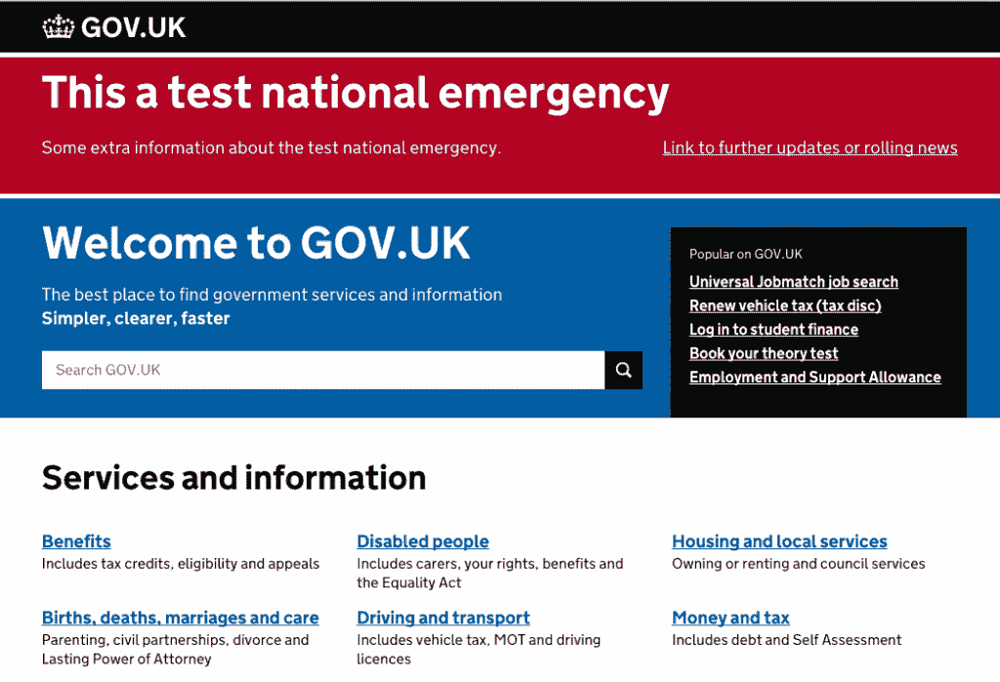

# Gameday 系统测试可以发现生产前检查遗漏的问题

> 原文：<https://thenewstack.io/gameday-system-testing-can-catch-issues-pre-production-checks-miss/>

 [布莱恩·惠勒

布莱恩·惠勒在 Morpheus Data 监管技术团队。在 Morpheus 之前，Brian 创办了一家软件开发咨询公司，为各种行业设计和开发解决方案，包括电网管理、票务系统、在线交易、社交网络和游戏、SOX 合规性和电子商务。Brian 拥有波莫纳学院的化学学士学位。](https://www.morpheusdata.com/) 

当您在生产环境中启动一个新的应用程序，或者想要测试当前的应用程序在生产环境中是否运行良好时，最好先在生产前环境中进行测试。然而，在生产环境中执行一些特定的测试可以证明对于保持系统的安全性以及提高服务的性能是非常宝贵的。这就是一个叫做 gameday 系统测试的过程可以证明非常富有成效的地方。

Gameday 系统测试，虽然名字听起来像是一个简单的游戏，但实际上是一种在生产环境中测试您的应用程序和系统的方法，以确保一切按预期工作，并测试您的团队对所有或部分被测试系统故障的反应。

通常，会安排特定的时间(如几天到一周)来进行漏洞测试并记录系统的性能。当所有测试完成后，可以对结果进行评估，以确定是否需要对系统或故障程序进行任何改进。

## Gameday 系统测试有什么帮助？

> *虽然在生产环境之外进行测试是一种非常恰当的方法，但它是不完整的，因为有些行为只能在生产环境中看到，无论生产环境有多相似。—* [*约翰·奥尔斯帕，Etsy*](http://queue.acm.org/detail.cfm?id=2353017)

虽然试运行环境肯定是该过程的一个重要部分，但生产环境总有可能存在某种差异。值得注意的是，生产是服务的实际用户与应用程序进行交互的地方。因此，无论您能够让试运行环境与生产环境多么接近，都很难复制这种精确的环境。

对于一个典型的游戏日测试场景，你需要做一些事情来确保你从测试中获得最好的信息。创建自动化和手动测试通常是一个好主意，因为每种类型的场景都会产生不同的结果。

此外，让来自多个团队的人员为不同的测试场景带来想法也是很有帮助的，这些场景可以用来测试系统。经理、开发人员、支持人员和其他团队对于什么会破坏系统都有不同的想法。

当然，通知所有受影响的人 gameday 测试正在进行，并且一个或多个系统可能会在此期间出现故障，这是非常重要的。这有助于确保您的团队做好准备，在正常服务中断时采取适当的行动。

最后，确保详细记录每件事，尤其是任何没有按计划进行的事情以及任何错误或响应问题。例如，如果有一个 bug 导致了数据库崩溃，那么就应该记录下来进行修复。如果报告或恢复数据库的响应不是最佳的，这是解决本可以做得更好的问题的好时机(比意外停机后的时机好得多)。

> 比赛日演习最糟糕的情况是在演习过程中会出问题。在这种情况下，整个工程师团队都准备好应对意外情况，系统将因此变得更强大…没有比赛日练习的最糟糕情况是，生产中的某些东西会失败，这是没有预料到或准备好的，并且会在团队没有预料到或密切关注它时发生。 *—* *[约翰·奥尔斯帕](http://queue.acm.org/detail.cfm?id=2353017)*

## 著名的例子

一些著名的利用 gameday 测试的组织包括 Stripe 和 Gov.uk。

### 种类

Stripe 最近运行了一个 gameday 测试，事实证明它有助于发现一个问题，如果这个问题完全出乎意料，它可能会变得更糟。游戏日将使用主节点上的 **kill -9** 测试 Redis 集群的故障转移。

结果，集群中的所有数据都丢失了！幸运的是，由于他们已经做好了响应准备，他们能够使用保存的备份快速恢复数据。正如您所看到的，随机发生这样的事情可能会产生更糟糕的后果，因此在计划好的测试中发现这个问题对他们来说肯定是有帮助的。

### 英国政府

Gov.uk 最近也进行了一次 gameday 测试，他们的测试重点是紧急发布和数据丢失。这些测试有助于发现一些小的文档问题，当更新时，将帮助他们更快地响应他们正在测试的场景。

通过紧急发布，他们的团队能够解决文档问题，找到他们拥有凭证的服务器，并相对快速地发布必要的消息。由于数据丢失，该团队再次找到了解决文档问题的方法，并在几个小时内恢复了数据库。最后，他们发现这很有帮助，因为一旦修补了一些文档，如果发生其中一个事件，他们将能够有更快的响应时间。

Gov.UK gameday 测试了其国家警报系统。

### 寻找合适的工具

迁移到云可以让你的游戏日测试更加容易。然而，我最近在潜在客户和客户中进行的一项调查发现，超过 40%的 IT 专业人员害怕云迁移，因为他们没有合适的技术。

如果你想迁移到云，可以考虑像 [Morpheus](https://www.morpheusdata.com/) 这样的东西，它可以让你的应用和服务器的供应、扩展和维护变得更加简单。云管理工具并非生而平等。找一个能让你马上找到联系人的公司，而不是三个月后。一流的云管理平台将允许您快速配置数据库和服务器，并在很短的时间内启动和运行您的应用程序。一个好的工具还应该能够添加负载平衡或 IPAM，以帮助提高网站或应用程序的速度和报告。

相信我，找到合适的工具可能是成功迁移和您的工作之间的差别，所以请明智地选择。如果你需要一些建议，请打电话给我——我很乐意帮忙。

<svg xmlns:xlink="http://www.w3.org/1999/xlink" viewBox="0 0 68 31" version="1.1"><title>Group</title> <desc>Created with Sketch.</desc></svg>