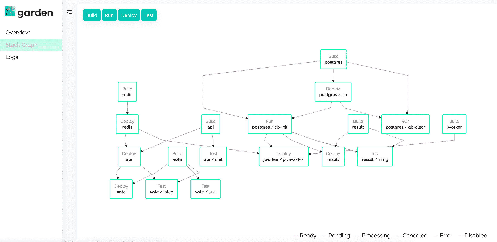

# Garden:用于无缝开发/生产集成的一次性配置 Kubernetes 平台

> 原文：<https://thenewstack.io/garden-the-configure-once-kubernetes-platform-for-seamless-dev-prod-integration/>

 [托尔西古尔德森

托尔西古尔德森是 Garden 的工程副总裁和联合创始人，Garden 是一个开源的 Kubernetes 开发和测试平台。在学习数学和计算机科学后，他作为创始人和全栈工程师参与了一系列软件初创公司的工作。他是神经科学、复杂系统和 80 年代俗气音乐的粉丝。](https://www.linkedin.com/in/thorarinn-sigurdsson-a4352123/?originalSubdomain=is) 

开发人员在持续集成(CI)管道中遇到的许多挑战都源于 CI 与开发过程的其他部分隔离的事实。

在云原生时代，一个典型的开发到 CI 的工作流包括在推送到 [GitHub](https://github.com/) 或 [GitLab](https://about.gitlab.com/?utm_content=inline-mention) 之前在本地编码和运行单元测试，而集成和端到端测试只在 CI 中运行。与 CI 相比，开发环境使用完全独立的(通常是精简的)配置，CI 在更像生产的环境中构建、测试和部署。

让我们仔细想想这种方法如何影响开发人员的体验。

**首先，开发和 CI 环境之间的差异导致 CI 中难以预测的错误。**无论开发过程中进行了多少测试，在 CI 中总有可能遇到错误和测试失败——只要开发和 CI 环境之间存在差异。经典的“但它在我的机器上有效”问题。

**其次，开发人员不知道当他们推进到 CI 时集成测试是否会通过。**开发人员错过了他们本可以通过一个包含集成测试的良好、紧密的提交前反馈循环来捕捉的错误。修复这些错误会迫使开发人员返回到他们认为已经“完成”的工作中这是一种偶尔可以忍受的环境转换，但是会对生产力(和快乐)造成很大的影响。)久而久之。

 [迈克·温特斯

Mike Winters 在过去五年中一直在 Apache Flink、Camunda 和 now Garden.io 等开源项目背后的公司担任产品和社区管理职务。他花了大量时间思考和撰写新兴技术对各种形式和规模的组织的影响。他是俄亥俄州人，目前居住在德国柏林。](https://www.linkedin.com/in/wints/?originalSubdomain=de) 

**第三，CI 故障排除过程缓慢而繁琐。**假设一名开发人员在 CI 中遇到了一个他们在开发过程中没有遇到的错误——我们预计这种情况会经常发生，因为在推进 CI 之前没有进行集成测试。对于每一次尝试的修复，开发人员都必须等待映像的重建和 CI 管道的运行。这里的时间尺度通常至少是起床泡一杯咖啡，如果不是更长的话。这是一个缓慢的反馈循环，会导致大量时间无所事事和/或频繁的上下文切换。

**第四，即使只是编写集成测试也要花费大量的时间和精力。**当调试一个新编写的集成测试时，开发人员需要经历我们上面刚刚描述的同样缓慢、令人不快的 CI 反馈循环——这对于开发人员来说没有多少动力来确保可靠的集成测试覆盖率。

我们可以将所有这些归结为几个根本问题:

1.  开发和 CI 环境之间的不一致
2.  缓慢且不充分的集成和端到端测试

好消息是，我们相信这两个问题都是可以解决的！

我们将通过一个名为[花园](https://garden.io/?utm_source=the-new-stack)的项目规划出一条可能的前进道路，我们认为分享我们的愿景以及实现愿景的具体步骤是最有用的。完全公开，我们是花园的创造者和维护者。它是[开源的](https://github.com/garden-io/garden)，所以任何人都可以跟随并尝试它。在此过程中，请随时[向我们提问](https://community.garden.io/?utm_source=the-new-stack)。

## 配置一次，随处运行

如果我们提供三样东西，我们上面描述的开发人员体验可以得到有意义的改善:

1.  类似生产的“全栈”环境，在开发和 CI 中保持一致
2.  开发人员为编码和测试旋转这些环境的简单方法
3.  在开发期间运行相同的集成测试的能力，最终将在 CI 中运行

但是在我们谈论更多关于 Garden 的开发者体验之前，这里有一个关于 Garden 如何工作的快速入门。

要使用 Garden，您需要在每个服务旁边编写一个简短的配置文件，它位于 Docker 文件和您的源代码旁边。这些配置文件为 Garden 提供了一种一致的方式来描述每个服务是如何构建、测试和部署的，而没有杂乱的脚本或大规模、单一的配置。

这些步骤中的每一步(构建、测试和部署)也可以描述依赖关系。例如，服务 A 的集成测试可能依赖于服务 B(同一项目中的不同服务)。Garden 知道，为了运行服务 A 的集成测试，服务 B 也必须运行并且是最新的。

Garden 扫描所有这些声明(甚至跨多个存储库)，验证它们并将它们编译成 DAG，该 DAG 描述了构建、部署和测试应用程序所涉及的所有步骤。这被称为[栈图](https://docs.garden.io/basics/stack-graph?utm_source=the-new-stack)，它位于 Garden 所做的一切的核心。

“分布式”配置方法使其成为由许多不同组件组成的复杂微服务应用的合适选择。每个团队都可以独立管理他们的 Garden 配置文件，没有人必须处理密集的“集中”配置文件。

Garden 还使开发人员更容易从整体上对应用程序进行推理，堆栈图提供了“活文档”来显示所有不同活动部分之间的关系。这是一种上下文意识，否则很难传达。

其结果是依赖感知管道，你通常只能在你的 CI 系统中使用，但是 Garden 在你的预提交工作流中为你提供了所有相同的功能。

## 用于开发、测试和 CI 的类似生产的环境

然后，堆栈图作为每个预生产环境的基础，无论是开发、测试、CI，甚至是 PMs 和 QA 工程师用于验收测试的应用预览。

只需一条命令，任何应用程序开发人员都可以在 Kubernetes 集群中构建自己的命名空间、类似生产的环境。但是开发环境的有用性取决于开发人员可以用它做什么。因为所有的测试——包括集成测试——都是 Garden 配置的一部分，并且与应用程序代码共存，所以在开发过程中，开发人员可以很容易地在这些环境中运行集成测试。

需要注意的是，这些是将在 CI 中运行的完全相同的集成测试，环境与 CI 的配置完全相同。如果一个测试在开发过程中失败了，开发人员会马上得到反馈，并且可以在上下文中和编写代码时解决问题。

当您推进到 CI 时，您已经在开发过程中成功地运行了集成测试。因为您的预提交环境与您的 CI 环境是相同的，所以您可以相当有信心您的测试将通过 CI。

让花园成为你 CI 渠道的一部分也很简单。在 CI 中，您唯一需要安装的是 Garden CLI 及其依赖项，或者使用现成的容器映像。

用 Garden 运行 CI 管道基本上就是检查一个 repo，配置一个到 K8s 集群的连接，并运行 garden test(一个[命令](https://docs.garden.io/reference/commands?utm_source=the-new-stack%23garden-test)，它运行项目中定义的所有测试，构建模块和依赖项，并在需要时部署服务依赖项)。

使用 Garden 后，当您更改堆栈时，无需更改 CI 配置，因为 Garden 拥有整个堆栈图。

## 非技术涉众呢？

Garden 也很容易在每次 CI 运行时为您的应用程序创建一个工作预览环境，这可以在 QA 和评审过程中使用。无论是谁执行代码审查，(或者手动 QA，或者发布前验收测试)，不仅可以看到自动化测试已经通过，还可以点击应用程序的工作版本，了解它的行为。

这些预览环境在与开发团队以外的人合作时特别有用。它们是产品经理或其他需要在发布前进行验收测试的非工程利益相关者的理想选择。

至此，我们已经涵盖了生产前开发和测试流程的每一步。

## 包扎

感谢您的阅读，我们希望这对您有所帮助。下面是我们今天所学内容的快速回顾:

*   开发人员在 CI 方面遇到的大多数问题是由 a)开发和 CI 环境之间的差异和 b)不充分、缓慢的集成测试造成的。
*   解决这些问题的一个可能方法是对每个生产前环境使用一致的配置，从开发到测试再到 CI。
*   [Garden](https://garden.io/?utm_source=the-new-stack) 是一个开源项目，它可以描述您的整个堆栈——所有服务、测试和依赖项——然后在开发管道的每一步按需构建全堆栈环境。
*   一致的环境减少了开发过程中的摩擦，并使开发人员能够交付更多和更快。

我们总是有兴趣了解组织如何管理他们的开发和测试管道，因此如果您有任何问题(或者您想给我们关于我们方法的反馈)，请随时在我们的[社区论坛](https://community.garden.io/?utm_source=the-new-stack)中给我们留言。

如果你想从[花园](https://github.com/garden-io/garden)开始，我们建议查看[文档](https://docs.garden.io/getting-started/0-introduction?utm_source=the-new-stack)，我们很乐意在此过程中提供帮助。

<svg xmlns:xlink="http://www.w3.org/1999/xlink" viewBox="0 0 68 31" version="1.1"><title>Group</title> <desc>Created with Sketch.</desc></svg>