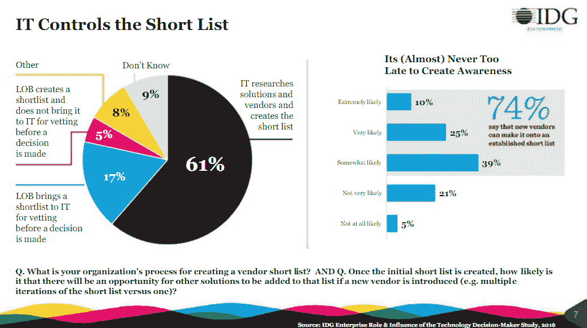

# Gartner 收购企业执行委员会将解决 IT 咨询市场的变化

> 原文：<https://thenewstack.io/gartner-flexes-muscles-addresses-new-spendinginfluence-paradigm/>

IT 分析公司来来去去，但多年来，三大巨头——高德纳(Gartner)、[弗雷斯特研究公司](https://go.forrester.com/)和[IDC](https://www.idc.com/)——一直不变。Gartner 最近[宣布](http://www.businesswire.com/news/home/20170105005728/en/Gartner-Acquire-CEB-2.6-Billion-Cash-Stock)计划以 26 亿美元收购[企业执行委员会(CEB)](https://www.cebglobal.com/account/signin.html) 建立在 Gartner 的核心优势(最终用户读者群)之上，同时应对所有竞争对手面临的行业逆风(转移 IT 支出)。CEB 是一家咨询公司，帮助其 10，000 多名客户分享、分析和应用最佳实践。虽然这笔交易并没有使其免于行业颠覆，但它确实使其相对于最大的竞争对手处于有利位置。*(披露:新栈已开展咨询工作)。*

几年前，Pivotal 技术营销总监迈克尔·科特·‏noted 说，尽管大型分析公司有很多缺陷，但它们仍有一些基本优势。在过去的两年里，IT 研究行业的状况并没有发生根本性的变化。三大巨头的主要优势是他们提供的大量高质量研究的价格相对较低，以及 IT 营销人员可以利用的强大品牌。

第三个优势是最终用户和购买者中的广泛读者群，过去是，现在也只有 Gartner 享有这一优势。它的巨大领先优势类似于 AWS 在公共云市场的领先优势。尽管存在缺陷和潜在的颠覆性，但就像 aws 与谷歌和微软的竞争一样，Gartner 仍然自成一类。多云战略通常意味着 AWS 和另一家云提供商。在分析师领域，购买 Gartner 也是理所当然的，大多数公司都竞相成为研究预算的第二或第三行项目。

作者说明

2003 年，劳伦斯·赫特(Lawrence Hecht)加入了由吉迪恩·高德纳(Gideon Gartner)提供咨询的初创公司 TheInfoPro，该公司意在颠覆 IT 分析师的商业模式。在 2009/10 年，我们与 CEB 建立了战略伙伴关系。最近，劳伦斯与涵盖新兴技术的中型分析公司 451 Research 合作。

尽管有很大的优势，大型 IT 分析公司面临着颠覆。他们面临着付费游戏偏见的永久指控。许多技术人员说，他们对这些话题的了解比分析师向他们介绍的要多。由 [Kea 公司](http://www.keacompany.com/)主持的三集播客描述了有多少小公司解决了这些缺点。总而言之，大型研究公司面临的最大挑战是:

1.  **不愿为研究付费。如果你能在网上免费获得可比信息，为什么还要付费订阅呢？**
2.  **无法跟上日新月异的技术趋势。这不是什么新鲜事。新兴的分析公司不断成功地解决利基话题。然而，很少有公司成长到足以与这些大公司竞争。那些最终被 M & A 吞噬的。**
3.  **偏爱基于同伴的洞察力。**同样，这并不新鲜。大多数大型分析公司都有终端用户委员会和有组织的同行社区。像 G2 Crowd 和 [IT Central Station](https://www.itcentralstation.com/) 这样的同行评审网站已经能够获得供应商客户，同时仍然保持一些对偏见推荐的约束。然而，在最近的 Twitter 对话中，正如长期分析师关系大师卡特·鲁舍所说，“评论网站很难提供最终用户会购买的服务。”
4.  **IT 部门以外的技术支出增加。**尽管影子 IT 支出的程度可能被[夸大了](https://thenewstack.io/parity-check-dont-afraid-shadow-yet/)，但业务部门仍在继续发起支出。因此，IT 在技术决策中作为利益相关者的角色变得更加重要。

部分是因为“数字化转型”触及到组织的所有部分，首席信息官与运营、营销和法律部门同事的互动正在增加。事实上，根据 *2017 SIM IT 趋势研究，首席信息官与首席运营官互动的比例从 2015 年的 58%增加到了 75%。*企业内部参与度增加可能有两个原因:

1.  根据 *[德勤(Deloitte)2016-2017 年全球首席信息官调查](https://dupress.deloitte.com/dup-us-en/topics/leadership/global-cio-survey.html)，*高级信息技术主管认为他们在与成本优化相关的基本工作职能方面做得不错，但担心他们改进业务流程的能力。与公司的其他部门交流对于任何增加收入和客户满意度的尝试都是至关重要的。
2.  在本部门之外的技术支出方面，它是一个值得信赖的顾问。IDG 的 *[企业技术决策者的角色和影响研究 2016](http://www.idgenterprise.com/resource/research/ri-2016-role-influence-sample-slides-title/)* 报告称，51%的组织有 IT 联络员。该角色负责促进 IT 和业务部门之间的知识共享和项目管理。它大量参与创建供应商短名单和评估技术。如果 IT 在这个“值得信赖的顾问”角色中表现不佳，那么影子 IT 和外包云服务的威胁可能会很大。

根据技术决策者的说法，只有 22%的业务部门为技术采购创建入围名单，61%的业务部门依靠 IT 进行入围名单、评估和审查。

收购 CEB 直接解决了非技术部门购买技术的问题。尽管所有主要的分析公司都通过提供针对营销部门的产品来应对这一趋势，但营销仍然只是一个部门或职能。CEB 的工作重点是销售、人力资源、财务和法律。Gartner 预计将向非 IT 部门销售其研究成果。然而，增加订阅量并不是战略优势。相反，它是帮助 it 在数字化转型过程中扮演值得信赖的顾问角色的能力。

Gartner 的职责是协助业务部门进行入围名单和技术评估。IT 专业人员已经使用 Gartner 来验证他们的决策。现在，在与非 it 同行交谈时，使用 Gartner research 将变得更加容易。此外，如果其他部门可以直接访问 Gartner 的内容，IT 部门可以将时间花在解决实际的业务问题上，而不是进行基本的技术信息发现。

由于数字化转型不仅仅是技术，Gartner 将自己定位为为整个企业提供咨询和指导。这将使该公司直接与大型管理咨询公司竞争，这些公司为高管层提供战略建议和变革管理协助。它是否能真正与[麦肯锡&公司](http://www.mckinsey.com/)竞争。波士顿咨询集团是一个非常大的开放性问题。

另一个收购可能不符合预期的领域是基于社区和同行的信息共享领域。这是 CEB 的特产之一。它努力召集高管同事开会和互动。Gartner 通过其会议、全球首席信息官研究委员会和[同行洞察](https://www.gartner.com/reviews/home)也是如此。事件背后有强大的商业模式。

研究委员会提供价值，但面临来自许多其他首席信息官组织的竞争。在更广泛的市场中，对高管时间的竞争甚至更加激烈，许多历史悠久的行业协会拥有优势。关于基于同行的评论，同行洞察有希望，但尚未成为游戏规则的改变者。然而，在第 15 届年度[分析师价值调查](http://analystvaluesurvey.com/)的 [Duncan Chapple 的](https://twitter.com/duncanchapple) [分析](https://www.linkedin.com/pulse/idc-overtakes-hfs-global-analyst-firm-awards-duncan-chapple)中，他推测一家 Gartner 的“相对弱点，同行服务，可以通过最近收购 CEB 来解决。”

Gartner 将 CEB 产品扩展到中端市场的计划也可能与其之前收购的 [Software Advice](http://www.softwareadvice.com/) 和 [Capterra](http://www.capterra.com/) 有关。两者都是同行评审网站，专注于 IT 部门不一定购买的商业软件。由于供应商的收入来源，这两个网站都有固有的偏见。然而，显而易见的希望是，他们将能够从寻求帮助的中型企业那里获得报酬。在这个小领域，Gartner 将面临来自 ISG 和埃佛勒斯研究的竞争，这两家公司专门就如何外包技术和业务流程向公司提供咨询。

## 乐章结尾部

本文开篇提到了一个三巨头。新公司有很大的发展空间，但 Forrester 和 IDC 面临着来自 Gartner 的挑战:

*   当一家中国集团正在就收购其母公司 IDG 进行谈判时，IDC 被一片乌云笼罩着。它在收集卖方数据方面的传统优势，对关心买方见解的客户没有帮助。然而，根据 Chapple 的分析师价值调查，其分析的质量似乎正在获得牵引力。
*   Forrester 一直坚守在 IT 领域，其大部分努力都是通过显著扩大对营销专业人士的推广。根据 Chapple 的调查，Forrester 的“同行社区现在产生的比较优势比其他人发展的要少。”总的来说，它的主要问题是它不是 Gartner。

披露:新的堆栈做咨询工作。

<svg xmlns:xlink="http://www.w3.org/1999/xlink" viewBox="0 0 68 31" version="1.1"><title>Group</title> <desc>Created with Sketch.</desc></svg>