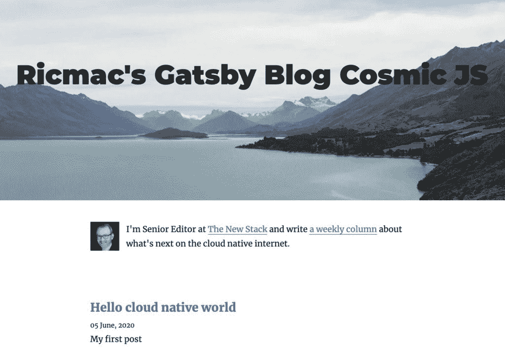

# 盖茨比想成为网站建设的编排层

> 原文：<https://thenewstack.io/gatsby-wants-to-be-orchestration-layer-for-building-websites/>

网站建设者是互联网的主要产品之一。从 1994 年的 Geocities，到 2004 年的 Blogger，到 2014 年的 Squarespace，再到 2020 年的 Gatsby，这些工具继续占据着网络的中心位置。然而，这些东西中的一个和另一个不一样…

就功能和界面而言，你可以在 Geocities 和 Squarespace 之间划一条直线。如果你把一个 1994 年的 Geocities 用户带到 20 年后的未来，那个人将能够在几分钟内开始使用 Squarespace。但他们会被 Gatsby 和类似的云原生工具 Jekyll、Hugo 和 NextJS 弄得晕头转向。

并不是网站本身发生了(很大)变化。它们仍然是用 HTML 和 CSS 等其他 web 标准呈现的。但是在过去的几年里，它们的编译和发布方式已经发生了很大的变化。

 [理查德·麦克马努斯

Richard 是 New Stack 的高级编辑，每周撰写一篇专栏文章，探讨云计算原生互联网的未来。此前，他在 2003 年创立了读写网，并将其打造为全球最具影响力的科技新闻和分析网站之一。](https://twitter.com/ricmac) 

[Gatsby](https://www.gatsbyjs.org/) 是众所周知的“静态站点生成器”，该公司将其定义为“从模板或组件以及给定的内容源创建 HTML 页面的软件应用程序”HTML 页面一旦创建，就通过[内容交付网络](https://www.gatsbyjs.org/docs/glossary/content-delivery-network/) (CDNs)而不是网络服务器交付给用户，这使得交付速度更快、弹性更大。

Gatsby 平台的全部功能更类似于 WordPress，而不是 Squarespace。正如首席执行官兼联合创始人[凯尔·马修斯](https://twitter.com/kylemathews)告诉[福布斯](https://www.forbes.com/sites/davidjeans/2020/05/27/gatsby-website-building-startup-backed-by-index-ventures-raises-28-million/#7a92d6d17f3e)，“我们认为自己是云时代的(内容管理系统)。”

也就是说，在去年 11 月发布的商业平台[盖茨比云](https://www.gatsbyjs.com/)上，你可以在几分钟内创建一个盖茨比个人网站。Gatsby Cloud 与 WordPress.com 相似，所有后端技术都由该公司托管。

我决定试一试。在检查了几个 Gatsby Cloud 选项，连接到我的 GitHub 帐户，并在“headless CMS”服务 Cosmic JS 上创建了一个免费帐户后，我很快就建立了一个“Gatsby provisioned blog”。

与传统的网站建设者或 CMS 相比，它需要一点时间来适应新的行话(例如，你“触发建设”而不是“发布”)。此外，你必须习惯与一个以上的服务。例如，我在 Cosmic JS 中更新了我的内容(它被称为“无头 CMS ”,因为没有表示层；只是内容本身)。

盖茨比云界面。

此外，请注意“provisioned”一词的使用尽管 WordPress.com 或 Squarespace 会说它在托管你的博客，但盖茨比云却说它是由 T2 提供的。这个词概括了 cloud native 的全部含义——它的意思是为你提供必要的服务来(在这种情况下)运营一个博客，包括将它路由到每个读者最近的 CDN。

当然，Kubernetes 也从事供应业务，只是规模更大。Kubernetes 更为人所知的是一个容器编排平台，Gatsby 首席执行官 Kyle Mathews 似乎在[最近的博客文章](https://www.gatsbyjs.org/blog/2020-05-27-announcing-series-b-funding/)中提到了这一点，他宣布了一轮 2800 万美元的融资，当时他称 Gatsby 为构建网站的“编排层”。

为您的网站使用像 Gatsby 这样的静态站点生成器的真正好处是可以连接到多个外部数据源。您可以从各种无头 CMS、SaaS 服务、API、数据库和您自己的文件系统中提取数据。还可以使用 [GraphQL](https://graphql.org) ，这是一种强大的 API 查询语言。在最近发表的一篇关于新堆栈的文章中，Fikayo Adepoju [将 GraphQL](https://thenewstack.io/introduction-to-graphql/) 描述为“类似于 SQL，但用于前端。”

虽然 Gatsby 是为云世界构建的，并且是一种全新的创建网站的方式，但它的一些关键技术在十多年前就已经开始普及了。API 是雅虎 Pipes 和 Flickr 等 Web 2.0 应用的标志。但也许对 Gatsby 和类似的云 CMS 影响最大的是 web 编程语言 JavaScript。

JavaScript 早在 1995 年就由 Netscape 发明了，但直到 2005 年 Ajax 的出现，它才真正起飞。Ajax(“异步 JavaScript 和 XML”)允许开发人员创建在后台加载数据的网站，从而避免了页面重新加载的需要。

> "于是我们继续前进，逆流而上，不停地回到过去."——《了不起的盖茨比》，f·斯科特·菲茨杰拉德。

网站建设者是利用这种新的互动力量的众多应用之一。例如，Weebly 在 2006 年推出，[将它的“支持 AJAX 的界面”作为一个关键特性来宣传。大约在同一时间，基于浏览器的“起始页”,如 Netvibes、iGoogle 和微软的 start，允许用户在他们的页面上放置多个“小部件”。小部件就像是嵌入到网页中的迷你 web 应用程序，它们之所以成为可能，很大程度上是因为 Ajax。](https://www.weebly.com/)

JavaScript 技术并没有随着 Ajax 停止发展。21 世纪初，一个名为 [React](https://reactjs.org/) 的 JavaScript 框架出现在脸书，帮助开发者构建交互式用户界面。React 于 2013 年开源，几年后，GatsbyJS 由[创建](https://www.gatsbyjs.com/about/)，“作为一种用 React 建立网站的简单方式。”

但是至少从宣传的角度来看，现在 Ajax 的对等物不是 React。这是一套标记为 [JAMstack](https://jamstack.org/) 的技术。前三个字母代表 JavaScript、API 和标记；“栈”部分指的是云计算技术。JAMstack 是由一家名为 [Netlify](https://www.netlify.com/) 的公司创造的，这是一个面向网络开发者的云平台。

JAMstack 有点像“Web 2.0”——与其说是技术术语，不如说是营销术语。官网是这样定义的:

*“通过预渲染文件交付快速安全的网站和应用，并直接从 CDN 提供服务，无需管理或运行 web 服务器。”*

不管您对当前围绕 JAMstack 的宣传有什么看法，这个定义很好地描述了 Gatsby 和其他静态站点生成器的工作。虽然没有提到 API 和数据方面。

那么，盖茨比的下一步是什么？首席执行官 Mathews 说，他想让盖茨比“为每个人所用”为了实现这一点，该公司正在“朝着低代码(甚至最终无代码)的盖茨比方法努力”，以引入主流用户。

如果这听起来很熟悉的话，这是从 Geocities 到 Squarespace 的每一个网站建设者多年来一直试图做的事情:让尽可能多的人使用它的产品。

通过 Pixabay 的特征图像。

<svg xmlns:xlink="http://www.w3.org/1999/xlink" viewBox="0 0 68 31" version="1.1"><title>Group</title> <desc>Created with Sketch.</desc></svg>