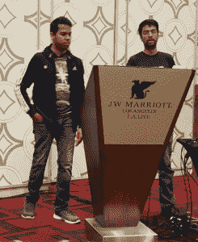

# GE Digital 如何解决工业物联网的有状态/无状态问题

> 原文：<https://thenewstack.io/ge-digital-tackled-stateful-stateless-problem-industrial-iot/>

为了让无状态架构高效工作，正如 IETF 最近在[其物联网 RESTful 架构研究](https://tools.ietf.org/id/draft-keranen-t2trg-rest-iot-05.html)中所宣称的那样，组件之间共享的消息必须彻底、完整且独立。接收函数需要知道的关于它需要做的工作的任何事情，都必须包含在联系它的 API 调用中。

正如工程师(包括 IETF 的工程师)已经认识到的那样，持久数据将永远是服务器端应用程序和客户端应用程序的必要资源。以及物联网(IoT)应用对保持连接传感器和设备的可靠、持久网络的需求，使得稳定和独立的网络状态数据平台变得至关重要。

因此，如果你的工业物联网平台的第一版是建立在 Cloud Foundry 上的，而[以其无状态的架构](https://thenewstack.io/best-practices-for-developing-cloud-native-applications-and-microservice-architectures/)而自豪，你如何将最初的愿景与事物的真实状态调和起来？

## 机器数据机

“无论我们喜欢与否，我们都在从事处理信息的业务，我们正在建立处理数据的业务，”通用电气数字公司 [Predix 工业物联网平台](https://www.ge.com/digital/predix)服务的软件工程总监 [Balajee Nagarajan](https://www.linkedin.com/in/balajeen) 在最近的洛杉矶中尺度会议上发言。

Nagarajan 领导团队开发 Predix 作为 PaaS 平台，用于工业物联网，特别是管理和利用机器和互联设备产生的海量数据。通过在 Predix 平台上部署定制应用，工业客户可以管理、监控和执行自己资产的预防性维护，从而减少计划外停机时间。

“鉴于通用电气在许多商业垂直领域的足迹如此之大，”Nagarajan 继续说道，“我们成为构建这一工业物联网平台的领导者是如此自然、有机的增长，特别是因为我们固有的领域经验。”

2015 年 8 月，通用电气宣布有意进入云服务市场。其最初的愿景涉及一种名为 Predix Cloud 的产品，这是一个数据收集和处理平台，用于其自身的工业运营以及工业客户，特别是医疗保健、石油和发电领域。与典型的公共云服务不同，Predix Cloud 可以实时接收、解释、分析和报告机器数据。

去年 11 月，通用电气将该产品扩展到“Predix 系统”，这是一个面向工业的分布式服务网络，包括更直接面向其关键垂直客户的应用程序。但即使 Predix 已经彻底渗透到物联网服务领域，其母公司也没有在 Predix 的促销活动中使用“物联网”这个词。

现在，随着工程师们规划出一条前进的道路，母公司经理们的任何疑虑都烟消云散了。

数据平台负责人 Venkatesh Sivasubramanian 和 GE Predix 软件工程总监 Balajee Nagarajan

“我们正试图成为一个云不可知的物联网平台，”Nagarajan 宣布。他将 Predix 的当前架构描述为依赖于 HashiCorp Terraform 来配置和供应亚马逊 AWS 和微软 Azure 上的基础设施，其他公共云提供商的计划即将推出。从那里， [Bosh](https://bosh.io/) 被用来提供 Cloud Foundry，它是唯一面向开发者的组件。客户通过 Cloud Foundry 使用其熟悉的模型部署应用程序。

“Cloud Foundry 有这个强大的市场，”他说，“在这里你可以建立资产构建模型和分析构建模型。然后 Cloud Foundry 也提供了一个非常安全的接口来 Predix 自己。”

Predix 平台现在的工作方式是，一些服务部署在“边缘”——要么在客户场所，要么在安装客户传感器的位置。这些服务充当本地聚合点，在传感器数据被中央云接收之前，尽可能地对其进行预处理。在安装了通用电气自己的光传感器的地方，Predix 可能会使用通用电气的数据连接工具来执行更接近传感器本身的分析功能。

然而，在其他地方，客户将他们自己定制开发的工具部署到 Predix 的 Cloud Foundry 基础平台，用于对输入数据进行他们自己的预测分析。“Cloud Foundry 以一种对他们来说实际上合理的方式抽象了开发人员的体验，”Predix 数据平台负责人 Venkatesh Sivasubramanian 解释道。“他们不必管理单独的机器、基础架构等等。对于无状态的应用程序来说，这确实很棒。它为您提供了一个很好的市场，您可以与之交互来创建您需要的服务实例，并将它们绑定到它们的应用程序。”

## 薛定谔的存储接口

随着大量数据被摄取成为一个问题，Predix 团队开始研究扩展其数据存储能力的新选项。首先，他们调查了 Cloud Foundry 正在建设的[容器存储接口(CSI)计划](https://thenewstack.io/containerization-leaders-explore-possible-data-storage-interface-initiative/)。但是正如 [Sivasubramanian 在](https://www.youtube.com/watch?v=RKg4ucE40ic)[即将到来的播客](https://thenewstack.io/podcasts/makers)中告诉 New Stack 的 Alex Williams 的那样，CSI 还没有表现出发展成熟的迹象——稳定下来进入规定的形式。

“我们确实需要一个单一的基础设施，让我们能够运行无状态和有状态，”他说。

这就是[持久数据层提供者 Portworx](https://thenewstack.io/portworx-provides-container-level-approach-stateful-applications/) 介入的地方。Predix 使用 Mesos 作为其调度器，团队可能选择的任何数据层都需要适应有状态和无状态应用程序，就像 Mesos 一样。Predix 一直在使用 Bosh 实例化其面向 Cloud Foundry 的服务，同时使用 Terraform 来提供基础设施和 Chef 来准备流程。但是由于 Cloud Foundry 本身并不支持持久数据集群，所以它们必须在 Cloud Foundry 之外进行实例化，然后使用其 Service Broker API 进行连接。

Portworx 启用了一种新的供应模式，该模式利用了 Mesos 的两级调度程序[，于 2016 年 8 月正式推出](https://thenewstack.io/mesospheres-container-2-0-unites-stateless-stateful-workloads/)。通过这种方式，Predix 可以引入一个动态卷供应流程来独立于 CF 维护这个庞大的数据存储。Predix 可以使用[开放服务代理](https://github.com/openservicebrokerapi/servicebroker) (OSB)从 Portworx 请求这些服务。

“Portworx 的核心[ *是一个分布式数据块、软件定义的存储解决方案，”Portworx CTO [Goutham Rou](https://www.linkedin.com/in/gouthamrao/) 解释道，他也与 Alex Williams 进行了交谈。Rou 评论说，在过去的 15 年中，向网络添加 10 到 20TB 的存储已经从几个月甚至几年内设计一个 SAN 或 NAS 发展到购买一个已经安装了 20TB 的服务器。*

“与此同时，Cassandra、MongoDB 或 HDFS 等现代应用天生就喜欢向外扩展，并自己处理向外扩展和聚合，”Rou 继续说道。“如果你看一下 Cassandra，你会想给它一种直连存储的错觉，或者超收敛的概念。我们的软件架构从根本上使人们能够超融合地运行他们的应用程序，尽管它更有利于 Cassandra 这样的应用程序，因为你可以获得低延迟的访问。您的应用程序正在更接近其存储所在的位置运行。”

CTO 说，更重要的是，Portworx 能够直接与 Mesos 或任何调度程序一起工作，以确保数据驱动的应用程序保持合理的编排。“Predix”堆栈包含 Cassandra 事实上，Predix 团队为 [Mesosphere DC/OS](https://mesosphere.com/product/) 创建了一个 OSB 包，用于提供 Cassandra 的服务代理兼容版本。

“今天，许多公司都在 DC/操作系统上运行数据丰富的应用程序，”Mesosphere 首席技术官[托拜厄斯·克纳普](https://www.linkedin.com/in/tobiasknaup/)*在一次 MesosCon 主题演讲中说道。Knaup 表示，其中许多应用程序，尤其是物联网领域的应用程序，都运行在它所谓的“SMACK 堆栈”上:Spark、Mesos、Akka、Cassandra 和 Kafka。“我们得出了一些数字:超过 50%的 DC/操作系统集群正在运行其中的一些框架。因此，它确实是一个运行数据驱动型应用的平台。”*

Portworx 的堆栈还包括 Redis、ElasticSearch、一个开源异常检测包，以及作为独立于 OSB 的消息代理的 [RabbitMQ](https://www.rabbitmq.com/) 。

“我们作为平台运营商和平台架构师[*面临的最大挑战是，”Nagarajan 告诉新的 Stack，“当我们为最终用户提供平台时，我们希望确保该平台高度可用。正如 Mesos 为您提供统一的计算结构一样，Portworx 提供了统一的存储结构。然后，我们可以让最终用户不必担心如何使用高可用性应用。”*

如果这不完全是有状态和无状态的“婚姻”，就目前而言，这是一种可行的同居。用不了多久，第一个打开电灯泡的公司可能会认识到这个想法的全部范围正在启动。

这个故事是由中间层赞助的。[云铸造基金会](https://www.cloudfoundry.org/)是新堆栈的赞助商。

特征图片:上图，从左至右:新栈的亚历克斯·威廉姆斯；Venkatesh Sivasubramanian，GE Previx 数据平台负责人；GE Predix 软件工程总监 Balajee NagarajanPortworx 首席技术官兼联合创始人 Goutham Rou

<svg xmlns:xlink="http://www.w3.org/1999/xlink" viewBox="0 0 68 31" version="1.1"><title>Group</title> <desc>Created with Sketch.</desc></svg>