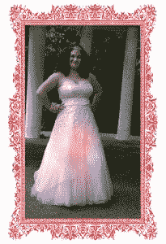

# 极客魅力:或者，穿着发光礼服的女孩

> 原文：<https://thenewstack.io/geek-glamor-girl-glowing-gown/>

克莱尔·史密斯(Claire Smith)的舞会礼服拥有一个女孩梦寐以求的第一件华丽礼服的一切:闪亮的粉红色面料层，闪亮的无肩带缎面紧身上衣，由可穿戴电子平台控制的柔和发光的 LED 灯…

嗯，好吧，所以史密斯可能是她毕业舞会上唯一一个时尚宣言包括水果和电池组的女孩。可能是唯一一个在舞会上穿着发光礼服的女孩，至少现在是这样。但是克莱尔·史密斯很乐意在人群中脱颖而出，如果这能激励其他少女觉得她们可以像拿缝纫针一样轻松自然地拿起烙铁。

“我和任何女孩一样——我喜欢漂亮、闪亮的东西，”史密斯在接受《新书库》采访时说。“我也喜欢科技。我做这件衣服是因为这是一个挑战，也是一件非常酷的事情。也是为了向其他女孩表明，时尚和科技并不相互排斥。”

史密斯发光舞会礼服的灵感来自设计师 Zac Posen，他为女演员[克莱尔·丹尼斯](https://www.vanityfair.com/style/2016/05/met-gala-2016-red-carpet)设计了一件光纤礼服，在大都会艺术博物馆庆祝其“马努斯 x 玛奇纳:科技时代的时尚”展览时穿着。

2015 年，史密斯在参加[编程女孩](https://girlswhocode.com/)暑期沉浸项目时接触到了计算机编程。她在 7 周内学会了 7 种计算机编程语言的基础知识，完成这个项目后，她开始参加黑客马拉松。这位来自马里兰州帕克维尔的在家上学的学生，实际上[在 2015 年赢得了巴尔的摩黑客马拉松](https://devpost.com/software/history-flip)，并在 2017 年再次获胜，尽管项目采用了 3d 打印和应用程序构建。她现在就读于当地的一所社区大学，今年将开始学习物理、数学和中级计算机科学。

克莱尔·史密斯的阿达果强化舞会礼服在今年夏天早些时候成为了热门话题

“在女孩编程之后，我学到的另一件事是，目前没有多少女孩编程，”史密斯说。“我开始思考如何改变这种状况。我能做些什么来改变这种状况。”

进入礼服。整个项目花了史密斯大约两周的时间。“我花了更多的时间研究和弄清楚我将如何着手，而不是实际动手制作——那部分只花了几天时间，”她说。史密斯使用了 [Adafruit 的 Flora](https://www.adafruit.com/flora) ，这是一个兼容 [Arduino](https://www.arduino.cc/) 的可穿戴电子平台，连接到六个[新像素](https://www.adafruit.com/category/168)(与 Flora 一起工作的微型 LED 灯)。

她把它们缝在现成的衣服上，用导电线把所有东西连接起来。该设计甚至将电池组不引人注目地缝在裙子里，这样她就可以断断续续地给设备供电。史密斯评论说，节能的 Adafruit 的两节 AA 电池让她的礼服在舞会之夜一直发光，而且这些电池仍然很强。

克莱尔·史密斯对这件衣服的效果很满意，更满意的是它最终引起的关注。她的发光礼服的故事像病毒一样传播开来，激发了一系列社交媒体分享和多个杂志故事——包括一个在 [Teen Vogue](http://www.teenvogue.com/story/aspiring-engineer-copies-claire-danes-met-gala-dress-for-prom#intcid=dt-recirc-cral2_1) 上的故事。"这条裙子融合了女孩们喜欢的时尚和我喜欢的科技. "史密斯说。“因此，任何阅读这个故事的女孩都明白，喜欢科技和喜欢时尚可以是一回事。”

她的最终目标是:“教育年轻女孩，无论你对什么感兴趣，你都可以用科技让它变得更好、更酷。就像如果你喜欢动物，你可以用科技制造帮助动物的东西，就像秃鹰美人在她的鸟嘴被射掉后得到了一个 3d 打印的鸟嘴。”

史密斯的裙子被接受作为下个月在纽约举行的[世界创客博览会](http://makerfaire.com/new-york/)的展品，她一直在通过 GoFundMe 筹集资金参加活动。“我是三胞胎，这意味着我的父母从今年秋天开始为我和我的两个兄弟支付大学费用，”她说。“他们说，‘好啊，你成功参加了创客大会！“但是你得自己支付去那里的费用，”"

不过，最终，礼服之后还会有生命，史密斯已经为此做好了准备。她成立了一个小组，在自己的家庭教育社区向中学年龄的女孩传授技术、3d 打印和环境方面的知识。而且，利用来自国家妇女和信息技术中心的 3000 美元拨款以及与 Be You 的合作，史密斯在今年秋季晚些时候组织了一场名为“让它成为现实”的活动，教女孩们蜜蜂生态学，以及如何 3d 打印特殊的水盘供蜜蜂饮用。

“大黄蜂的数量正在减少，部分原因是没有足够的水源或者水源的种类不对。因此，我们将打印特殊的大黄蜂浇水平台，让它们在不溺水的情况下补充水分，”她解释道。“女孩们可以用科技将她们喜欢的东西，动物和自然，以及她们可能会害怕的东西联系起来。”

克莱尔·史密斯认为，让女孩对学习计算机编程感兴趣，甚至感到兴奋，最好是在动手的环境中进行。“我设计这件衣服的想法是，哇，这看起来很容易做到。我知道如何缝纫，现在我们只是在可缝纫电子产品上更进一步，然后再进一步，学习如何为 Arduino 和 Adafruit 编程，”她解释道。“以这种方式接近它真的很棒，因为女孩们做手工，不管怎样，手工很有趣。然后突然之间，科技产品就没什么大不了的了，只是一种新的制作方式。”

史密斯说，进入科技创客空间的大门一直都在。她只是用缎子、亮片和导电线来利用它，只有 18 岁的女孩才能真正做到。“我只是想告诉他们如何把门开大一点，”史密斯说。“展示技术可以成为你想要的任何东西，应用在你生活的任何地方。”

<svg xmlns:xlink="http://www.w3.org/1999/xlink" viewBox="0 0 68 31" version="1.1"><title>Group</title> <desc>Created with Sketch.</desc></svg>