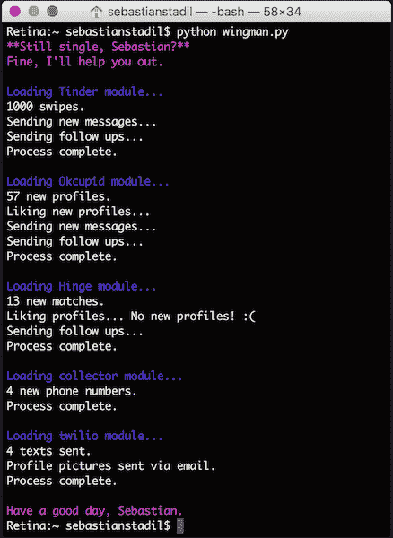

# 算法时代的爱情

> 原文：<https://thenewstack.io/geek-hacked-dating/>

用计算机工程能找到真爱吗？一个勇敢的极客再次接受了挑战，并向互联网报告了他的结果——又一个勇敢的爱情傻瓜。上个月，[塞巴斯蒂安·斯塔迪尔](https://twitter.com/sebastianstadil)向世界展示了他为一个非常私人的数据项目编写的应用程序:他编写了代码，在约会网站上徘徊，寻找自己的完美伴侣。

“我决心找到一个，即使这意味着刷遍整个海湾地区，”斯塔迪尔在一篇关于媒体的迷人文章中写道。当然，他尽可能以极客的方式着手做这件事，创造了他所描述的“一个严谨而科学的过程”

First Stadil 尽职尽责地为寻找真爱的后勤工作创造了“抽象层”——或者至少，为第一次接触创造了“抽象层”。从他作文里的截图来看，他是用 Python 写的，他的超人程序名字叫 wingman.py，“还是单身吗，塞巴斯蒂安？”阅读其活泼的发布信息。“好吧，我来帮你。”wingman.py 完全配备了 Tinder、OKCupid、Hinge 等主要在线约会网站的特定领域模块，显然，它最终将所有输出输入 Twilio，这是一款根据其他程序的输入发送真实文本消息的应用程序。

一旦它识别出一个电话号码，就会有更多来自 Twilio 的自动短信——不管有没有回复。从 Stadil 的截图来看，他的超级优化技术包括在前三条消息后表现冷静——但在 72 小时后跟进第四条消息——然后在第五条消息之前等待五天:“是的，你是对的。喝茶有点无聊。我们应该去买冰淇淋！Bi-Rite 奶精店怎么样？”

因此，first wingman.py 确定了 Tinder 上所有新的约会资料——或新的“刷屏”。甚至在那之后，“我把一切都自动化了，”斯塔迪尔写道。“开启器、后续消息、刷卡、书签、短信和电话号码记录。”

好吧，到目前为止还不错——但是这种天真的极客自信会不会导致我们的英雄采用一种笨拙、笨拙、太没有人情味的方法呢？

不，显然不是。斯塔迪尔的实验中最奇怪的结果之一是，如果他用一个“预先准备好的”回答来代替他亲自手写的回答，这并不重要。在收到 10，000 份回复后，Sebastian 发现他的回复率并没有明显的不同。对他的照片和个人资料进行了更多的 A/B 测试，并且“转化率增加了:更多的匹配，更多的线索，更多要安排的日期。”

有时候他真的很圆滑。"你是某种 OKC 超级英雄吗？"一名妇女问道。"不管我收到多少条信息，你的总是显示在页面的顶部."事实上，Stadil 为他们的“高级”服务水平付费，这种服务水平总是将他的信息推到收件人收件箱的顶部——但他用一个更好的答案来回应。

“那是因为 OkCupid 真的觉得我们应该见面。；)"

《华盛顿邮报》后来计算出，Stadil 的 Python 脚本[接近了整个旧金山湾区](https://www.washingtonpost.com/news/the-intersect/wp/2016/08/01/this-guy-has-swiped-right-on-200000-women-without-much-success/)6%的女性。

那么接下来发生了什么？"我的第一个问题解决了:把线索放进管道."

"我现在有了一个新问题:体积."

所以下一步他称之为“大规模约会”是的，他真的下定决心*见见*他们所有人。他真的很认真地寻找完美的伴侣，有了如此丰富的数据，他敢冒险通过不合标准的执行来搞砸他的项目吗？这要求每次约会都要精简到只喝咖啡——请在附近——并且“为了加快过程和提高时间效率”，他称之为“平行约会”——也就是每天三次约会——他对每次约会的观察都要仔细记录在电子表格上。这比你想象的更重要。“我曾经问过一个女孩，她整个第一次约会都在给我讲一个关于她是孤儿的悲伤故事。在我们第二次约会时，我问她她的父母怎么样了。那是一个尴尬的时刻。如果你正在读这封信，我道歉。”

所以现在你在想——等等，这个人是谁？就像杜斯·艾奎斯为一个关于世界上最有趣的极客的广告创造了他。“当他不在 Scalr 上工作时，Stadil 喜欢做寿司和玩橄榄球，”他在[可爱的 LinkedIn 个人资料](https://www.linkedin.com/in/sstadil)上写道。Stadil 是微软和谷歌关于云的顾问委员会成员，他还创建了硅谷云计算小组，这是整个硅谷最大的用户群之一。他是 Scalr 的创始人，Scalr 是美国宇航局和三星使用的云计算管理平台，他还在卡内基梅隆大学做关于创业的客座演讲。

所以简而言之，他就是那种会把网上约会比作企业销售的人。(“当你的客户选择一款更具竞争力的产品时，你永远不会被告知，也不会得到任何反馈。”)但在他的文章中隐藏着一个美丽的段落，所有的逻辑都失控了，他描述了一个特别的约会——他们如何划过一个湖，他如何偷走了第一个珍贵的吻。在第二次约会中，他把她扛在肩上上山，他们笑了又笑，这导致了第三次约会，然后是第四次。但是在第五次约会时，他的真爱告诉他，事实上，她还没准备好谈恋爱。

斯塔迪尔的结论？"这个策略有缺陷。"这可能是斯塔迪尔关于在线黑客的文章中最重要的一点。“作为一名创始人，我坚信一切都在我的能力范围之内，有些事情本来可以做得不同，迫使决策对我有利。”

《华盛顿邮报》对这个项目做了一些额外的计算。“150 次初次约会中，52 次成了秒；17 成了第三。”如果你算一下，总共有 219 次约会。幸运的是，他们被分散在 17 个星期。

[在《每日邮报》报道](http://www.dailymail.co.uk/news/article-3721571/Is-unluckiest-Tinder-user-world-San-Francisco-man-swiped-right-200-000-women-building-dedicated-bot-s-single.html)(补充道“这是世界上最不幸的火绒使用者吗？”).当然，这在 Twitter 上引起了一些关于斯塔迪尔最终向右滑动了多少次的嘲笑。“手指累吗？”思科前智能自动化首席技术官罗德里戈·弗洛雷斯在一条推特上开玩笑说。“我想 20.3 万人已经准备好给你竖起手指了，哈哈”即使是《Cosmopolitan》也不得不注意到这一点——尽管他们得出了完全不同的结论。“这家伙的 Tinder Bot [证明约会很可怕](http://www.cosmopolitan.com/sex-love/news/a62238/tinder-bot-find-love/)”。

然而，这个实验并没有完全失败。但是他确实学到了很多关于女人的东西。事实上，在他的几个约会对象透露他们在大学或青少年时期被强奸后，斯塔迪尔开始向世界上最大的性暴力网络 RAINN 捐款。

但最终，Stadil 仍然坚持他的幻想，他写的代码可以给他带来完美的匹配。“我仍然相信科技可以黑掉爱情，尽管这种信念可能是不理性的。技术是杠杆，但我认为我利用它的方式是错误的:执行很好，但战略不行。”

但是互联网以神秘的方式运行。几周之内，Stadil 的文章被 981 个其他用户“喜欢”,并引来了 76 条评论。在他的文章中，他分享了使这一切发生的魔法信息的完整文本。在你读到他文章的最后一行之前，你可能会觉得他在开源整个过程。"附注:我不会开放源代码，因为它可能会被用来伤害他人，但如果你友好地请求，我可能会分享它。"

后来，斯塔迪尔甚至告诉一位记者，“我的朋友建议我把它作为一种产品出售。但我不想武装竞争对手。”不过，这可能为时已晚。在对他的文章的评论中，一位女士发帖说她已经*收到了*Stadil 完美优化的七条短信序列中的第一条——准确地说，一字不差……

但至少他的实验广受欢迎，让我们仍然抱着一线希望。“谁知道呢，”他在文章结尾写道。"也许我会通过这篇文章找到我的特别的人？"

虽然 Stadil 的文章引起了轰动，但他并不是第一个入侵约会网站的人。

三年前，[艾米·韦伯](https://twitter.com/amywebb)在[做了一个 TED 演讲“我是如何黑掉网上约会的”](http://www.ted.com/talks/amy_webb_how_i_hacked_online_dating?language=en)她的方法甚至更加鲁莽——她为*男人*创建了虚假的个人资料——只是为了收集“那些会被我真的真的想嫁的男人吸引的女人”的数据

通过研究网站上最受欢迎的女性，她计算出了个人资料的最佳长度、她们个人资料照片的共同特征，甚至生成了一个词云，识别出网站上最受欢迎的女性中所有最常用的词。“事实证明，我做得非常好。我是网上最受欢迎的人。”当她发布她的“超级个人资料…现在为这个生态系统优化…很多很多男人想和我约会。”

她的方法最有趣的部分是，她已经为她想约会的男人*建立了 72 个独立的标准。“有人不仅想要两个孩子，而且对养育孩子的态度也会和我一样，所以有人会完全同意强迫我们的孩子在三岁时开始上钢琴课，如果我们可以争论的话，还可能会上计算机科学课……但我也希望有人去遥远的异国他乡，比如约旦的佩特拉。我还想找一个永远比我重 20 磅的人，不管我多重……”她有一套复杂的计分算法，最低门槛是 700 分。*

他的演示视频已经被观看了近 500 万次，甚至被翻译成 31 种不同的语言。和 Stadil 一样，她也有过糟糕的约会——有一次她真的在一家高级餐厅抛弃了她，让她去买单。但与斯塔迪尔不同的是，她的故事有一个幸福的结局——也许可以解释为什么她最终不仅得到了真爱，还签了一本书。

她发现有一个家伙得分 850 分，超过了她的算法阈值，在他们第一次约会后，她重新计算了他的分数——1050 分。2013 年，她发布了“[数据，一个爱情故事:我是如何破解网恋密码，以满足我的匹配](https://www.amazon.com/Data-Love-Story-Cracked-Online/dp/0142180459)”

也许这只是一个巧合——一些喜欢数据的极客无法抗拒玩弄在线算法的怪异边缘。毕竟，当你可以黑掉 Tinder 的时候，为什么要黑掉五角大楼呢？但这里还有一个数据点需要考虑。

今年 12 月，艾米·韦伯将出版第二本书，书名为《信号在说话:为什么今天的边缘是明天的主流》

通过 Pixabay 的特征图像。

<svg xmlns:xlink="http://www.w3.org/1999/xlink" viewBox="0 0 68 31" version="1.1"><title>Group</title> <desc>Created with Sketch.</desc></svg>