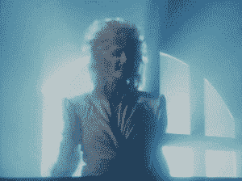

# 周一日食的极客指南

> 原文：<https://thenewstack.io/geeks-guide-solar-eclipse/>

到现在为止，你可能已经听说了周一下午在你附近的天空中发生的天体大事件(就像我们都知道的那种。就在你的头上)。

8 月 21 日星期一，从俄勒冈州纽波特到南卡罗来纳州麦克莱伦维尔的 70 英里宽的北美地区将陷入正午的黑暗，尽管时间很短，因为月亮遮住了太阳的脸。美国的其他地方仍然可以看到日全食的部分版本——例如，旧金山可以看到 75%的月影，曼哈顿接近 70%。这是《时代》杂志的一个漂亮的互动动画，展示了从任何给定的美国邮政编码/位置看日食会是什么样子。

这是自 1979 年发生在西北地区的一次微不足道的事件以来，美国大陆上首次可以看到日全食。这场即将到来的日食是一场真正的大灾难，从东海岸到西海岸横扫整个国家——这是自 1918 年以来的第一次。人们对前景有点失去理智。就连美国国家航空航天局也变得有点夸张，称之为“美国大日食”。

人们有理由感到兴奋。日全食是一件非常惊险的经历。同样罕见的是:从统计数据来看，平均每 360 年，地球上的任何一个地方都会被月球的白天阴影穿过一次。大多数美国人生活在被称为全食之路的 70 英里地带之外，只能看到被遮挡的太阳的一部分。那些在路径内的人，尤其是那些沿着路径中心线的人，将会体验到太阳几乎完全消失的怪异景象，就像天空中被冲出的黑洞一样。这是一次真正难忘的经历。

如果你周一还在工作，或者只是不想出去，或者可能只是一个天文爱好者，他为此做了精心的计划，但却站在大雨中的最大日食点(伊利诺伊州卡本代尔，那里的酒店房间一年前就卖光了)…好吧，振作起来。有各种各样的虚拟方式来观看表演。

最佳选择可能是 good ol' NASA，它将在许多平台上直播这一事件，包括其官方的[脸书](https://www.facebook.com/NASA/)、[潜望镜](https://www.pscp.tv/NASA)、 [Twitch](https://twitch.tv/nasa) 和 [UStream](http://www.ustream.tv/nasahdtv) 页面，以及 [NASA TV](https://www.nasa.gov/multimedia/nasatv/) 和[NASA 官方 YouTube 频道。](https://www.youtube.com/nasa)你甚至可以为 [iPhone](https://itunes.apple.com/app/nasa-app/id334325516?mt=8) 和 [Android](https://play.google.com/store/apps/details?id=gov.nasa) 下载[美国国家航空航天局(NASA)的官方日全食](https://eclipse2017.nasa.gov/apps)应用程序，并偷偷在你的手机上观看日全食。

如果你真的要出去，这里有一个必须的警告:不要直视太阳，该死的。是的，这真的很酷，是的，一旦月亮大部分覆盖了燃烧的天空的脸，事物看起来会暗很多。然而，即使光线变暗，直视太阳仍然会严重损害你的眼睛，你以后需要用它来聚焦在电脑屏幕上。只是。不要。即使戴着太阳镜也不行。

如果你还没有得到一些日食观测眼镜，祝你好运得到一些。没有什么比一副廉价的纸框日蚀太阳镜更能说明书呆子气的了，但是到现在为止，这种东西已经在各地销售一空。

此外，显然不道德的卖家一直在市场上充斥着无效的假货来赚快钱。所以你要确保你放在你的窥视者和太阳之间的任何东西都被美国天文学会推荐的品牌和供应商的便利列表认证是安全的。好的眼镜会标有一个“太阳安全”认证标志。

日蚀眼镜虽然方便，但并不是必备的。你可以制作一个针孔观察器，这是一个简单、安全、廉价的替代直视太阳的方法。

[14 号焊接眼镜](http://www.ebay.com/itm/Cutting-Grinding-Welding-Goggles-With-Flip-Up-Glasses-/330604205868)，专门为安全注视高强度紫外线辐射而制造的，也能达到这个目的——另外，你会看起来很酷。或者看看 Pinterest 上的 DIY 太阳能浏览器——麦片盒子的那个很不错——就像我们说的，内部网络对这个垃圾快疯了。**只是不要用你的肉眼看太阳好吗？**

## 去那里

没有什么比站在整体的道路上更好的了。即使是 95%以上的日偏食，也只是超现实的壮丽的全食的一个苍白的影子(双关语),值得在周一尝试让自己进入那条路径。

在全食前的半分钟左右，光线戏剧性地变暗，看起来像一个非常深的蓝色黄昏，恒星和行星开始出现在黑暗的天空中。气温明显下降。当前进的月亮在全食开始时熄灭了最后一缕阳光(这是直视太阳唯一安全的时间)，日冕的珍珠白光芒跃入眼帘。在大约 2.5 分钟的时间里，人类、动物，甚至昆虫，都感到敬畏。白天的鸟儿停止歌唱，而夜晚的蟋蟀开始唧唧喳喳。你脖子后面的头发竖起来了。即使是人群后面那个不戴防护眼镜长时间盯着太阳看的低能儿(是的，会很拥挤)也会短暂地停止尖叫**我的眼睛哦天哪我的眼睛。**

因此，想尽办法获得完整的 eclipse 体验是一件非常棒的事情。现在让自己走上这条路还不算太晚。

书呆子注意:大约有 1200 万人直接生活在今年展览的路径上，占美国人口的 3.68%。如果你碰巧生活在全食的道路上，请认为自己非常幸运。平均每 360 年，我们星球上的任何一个地方都会被月球的阴影完全覆盖。

有些地方可能会持续几千年而没有经历过全食，尽管有些地方要幸运得多。黑暗之神一定很喜欢伊利诺伊州的卡本代尔，因为今年日食的中心点将会在 2024 年，也就是下一次我们在美国大陆看到日全食的时候。尽管有消息说其中一个不会那么好。我们不知道为什么，去问 NASA。

如果你真的去了那里，以下是你对这场表演的期待:

日食的时间会根据你所在的位置而有所不同。例如，在俄勒冈州的塞勒姆，日偏食将于当地时间上午 9:05 开始，全食持续不到两分钟。时间最长的日食将发生在伊利诺伊州南部——幸运的卡本代尔！—全食持续 2 分 40 秒，从当地时间下午 1:20 到 1:23。然后日食将从南卡罗来纳州拥挤的海滩离开大陆，TNS 的工作人员将在那里密切关注(当然是通过护目镜)。

这里有一些有趣的天文爱好者关于日食现象的事实，这样你就可以给你的太阳观测者们留下深刻印象了:

*   **奔跑的影子**:如果你的西面有一片相当平坦的土地，比如草原、海洋或者伊利诺伊州南部的贫瘠荒地，你可能会看到月亮的影子以每小时 2000 英里的速度穿过这片土地向你飞奔而来。这是许多人不知道要寻找的东西，而且这非常酷。
*   **天珠**:钻戒和贝利珠。当月亮从太阳前面经过时，剩余的最后一点阳光产生了一条薄薄的光带，其中一个亮点就像白金带上的钻石接龙一样闪耀。它发生得很快，很容易被忽略。同样，当月球遮住了太阳的表面时，光线会穿过月球表面的山谷和其他低点——毕竟，月球不是完全平/圆的。这些亮点有时聚集在一起，看起来像一串发光的珠子。贝利的珠子。
*   **日珥**:根据当时太阳的活跃程度，或者它午餐吃了什么，巨大的气体火焰可能会跃出太阳，远到在太空背景下也能看到。
*   日冕:日冕是太阳大气层的最外层，非常分散，只有在日全食时才能观察到——即使是对美国宇航局来说。讽刺的是，日冕比太阳表面还要热。是那个苍白透明的发光戒指。
*   **360 度日出**:当太阳大部分，然后全部，再大部分被月亮覆盖时，整个地平线会发出粉红色和黄色的光芒。就像，从字面上看，整个地球与天空的交汇处将会是 360 度的日出/日落。
*   年老的流行歌星:这次特殊的月食有一个不寻常的相关现象，如果在全食期间出现演唱他们很久以前与月食有关的热门歌曲的歌手，这是你多年都没有想到过的。说真的。邦妮·泰勒将在皇家加勒比的日全食游轮上表演“[心之日全食](https://www.youtube.com/watch?v=lcOxhH8N3Bo)”，游轮沿着日全食的路径漂浮到一个最佳位置。作为伊利诺伊州 Moonstock 音乐节的一部分，Ozzy Osborne 预计将以“[对着月亮吠叫](https://www.youtube.com/watch?v=bnNWUUZ7cEA)”来迎接全食的到来还有其他人。已经警告过你了。

所以！走上前去凝视，当然要戴上护目镜，让我们一起来一场精彩的日食吧！这里希望天空保持晴朗，美国宇航局的服务器保持运行。

[https://www.youtube.com/embed/9wjZrswriz0?feature=oembed](https://www.youtube.com/embed/9wjZrswriz0?feature=oembed)

视频

专题图片:瑞克·芬伯格 2013 年的日食拼贴画，由美国天文学会提供。