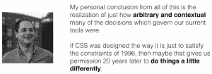
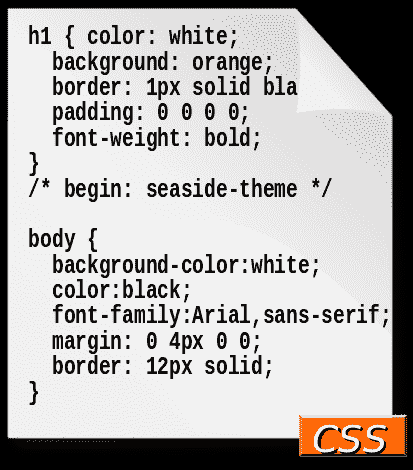
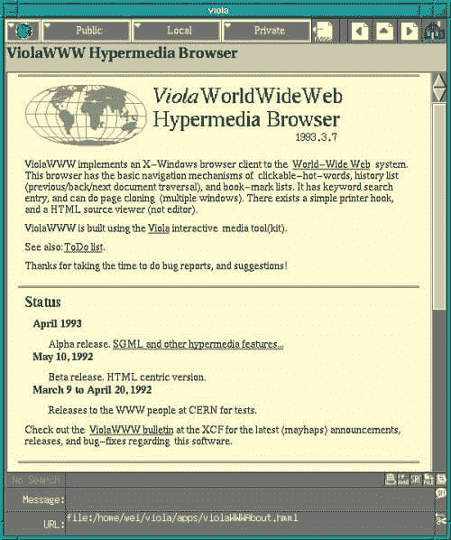

# CSS 的成功对技术标准意味着什么

> 原文：<https://thenewstack.io/geeks-ponder-lessons-world-css/>

本月早些时候，开发者扎克·布鲁姆写了一篇发人深省的文章，向 T2 回顾了 20 世纪 90 年代，当时新的网页内容风格语言在小型的极客邮件列表上被分享和讨论。他的过去之旅给我们上了一堂重要的课，那就是世界选择科技赢家和输家的方式有时近乎武断。

由于历史的偶然，一些强大且有前途的格式化语言最终被级联样式表所取代，级联样式表如今代表了一种无处不在且根深蒂固的标准。布鲁姆最后看了一眼“几乎是 CSS 的语言”——引发了一场关于我们继承的世界的持续讨论。正如一位奥马哈的开发者所说，布鲁姆的文章是“对可能发生的事情的证明”。



20 年前，[hkon Lie](http://people.opera.com/howcome/)发表了第一个版本的 [CSS 规范](https://www.w3.org/Style/CSS/)——但布鲁姆将目光投向了它之前的那个时代。

“CSS 直到 1997 年才开始使用，直到 2000 年 3 月才被任何一个浏览器完全支持，”Bloom 在他的文章中写道。“任何开发人员都会告诉你，直到几年前，也就是 CSS 发布 15 年多之后，浏览器支持才接近标准。"

因此，即使回到 1991 年 HTML 首次发布的时候，“CSS 在五年内不会被引入，十年内也不会被完全实现。这是一个紧张工作和创新的时期，导致了许多竞争的造型方法，这些方法很容易成为标准，”布鲁姆写道。

甚至在万维网出现之前，就已经开始讨论如何将风格信息传递给浏览器了。利用“ [www-talk](https://lists.w3.org/Archives/Public/www-talk/) ”邮件列表中的存档讨论，布鲁姆可以引用网景公司未来的联合创始人[马克·安德森](https://twitter.com/pmarca)在 1994 年说的一句有趣的话。有人问 Andreessen“你为什么不实现摆在桌面上的许多样式表提案中的一个呢？如果操作正确，这将很大程度上解决问题。”安德森的[回应](http://1997.webhistory.org/www.lists/www-talk.1994q1/0683.html)？



“因此，我可以告诉人们，‘好吧，你可以学习这种语言来写你的文档，然后你可以学习这种语言来让你的文档看起来像你想要的那样。哦，他们会喜欢的。"

后来在 Reddit 上，布鲁姆对马克·安德森的个性进行了评价，甚至用经典视频记录了他们。这篇文章引发了巨大的网上讨论，文章以回忆所有那些被提议的东西开始——RRP、FOSI、DSSSL、PSL96 和 Viola 浏览器的 PWP 样式表语言。

这是对另一个世界的迷人观察。例如，Robert Raisch 的 RRP 使用只有两个字符的属性名(如“fa”表示字体，“si”表示大小),以最大限度地减少必须通过 28.8 bps 调制解调器传输的数据量。这也反映了一个世界，样式表只会向浏览器“建议”样式。Blooms 说,“提示”方法——例如，没有度量单位——“被认为是必要的，因为相同的样式表需要同时适用于普通的行模式浏览器(如 Lynx)和越来越流行的图形浏览器。”

在过去的几周里，布鲁姆的文章引发了对过去的一些深思熟虑的反思，在一个温暖人心的转折中，有人自称是 RPP 的创造者[罗布·赖希](https://www.linkedin.com/in/robraisch)在布鲁姆的博客上给[留了一条评论](https://eager.io/blog/the-languages-which-almost-were-css/#comment-2755440831)。“亲爱的上帝……那些日子以来，桥上已经过了很多水了，嗯？对此表示感谢。”

[](http://www.viola.org/)

Viola 是第一款内置图形、脚本、表格，最重要的是样式表的网络浏览器。

“很荣幸，感谢阅读！”扎克回应，并让他打开更多的记忆。“编码的简洁很大程度上是考虑到当时网络上比特的匮乏，”赖希补充道，“[带宽是一个巨大的问题](https://eager.io/blog/the-languages-which-almost-were-css/#comment-2755621124)。”

*“我记得有几次公开评论说，由于我们所有人都有微薄的管道，互联网将永远无法支持高带宽应用程序(如视频和音频)……有人将在上游链接上流式传输视频的想法足以让我们所有人尖叫“滥用公地”。”*

Bloom 的文章描述了 Pei-魏源 ViolaWWW 浏览器如何附带其样式语言，在“几乎 LISP-y”的语法中使用括号来声明“嵌套”样式——用于其他元素中的元素。不幸的是，它的目标是 [X 窗口系统](https://www.x.org/wiki/)(主要在 Unix 系统上使用)，最终会被抛弃。但是就在这款浏览器的创造者佩-魏源提出他的建议后几天，邮件列表就采纳了上世纪 80 年代风格语言的想法。布鲁姆开玩笑说:“互联网有一条不可违背的规则:如果你能在这个过程中证明某人是错的，总会有更多的事情被完成。”。

另一种新的风格语言是 FOSI，它起源于国防部创建的 SGML 语言。它最大的优势似乎是它的样式被放在括号中，就像 HTML 一样，这使得它的语法更为 90 年代的开发人员所熟悉。

“这只是证明了一个想法，即使你有一个糟糕的标准，人们也会建议使用它，而不是试图重新发明或创造一个新的更好的方法，”Matt Steele 在他的文章的视频摘要中评论道。“从第一天起，这就已经融入了我们行业的 DNA。”

更令人印象深刻的是这些风格语言提案中的雄心壮志，比如 1996 年 DSSL 的公告——文档风格和规范语言。“长期计划是基于函数式编程语言方案创建一种语言，这种语言能够实现你所能想象的最强大的文档转换，”Bloom 写道。除此之外，“DSSSL 可以将继承的值视为变量，并对它们进行数学运算。”

不幸的是，回到 20 世纪 90 年代，HTML 页面必须从上到下加载，这是由于下载速度慢而必须做出的另一个妥协。“像 DSSSL 这样的语言完全被淘汰了，因为它们可以对文档本身执行操作，而当呈现开始时，这些操作将不会完全可用。”

在一些讽刺性的评论中，Bloom 补充说，DSSSL 有“致命的缺陷”,这将困扰所有 Scheme 类语言:太多的括号。此外，当它最终发布时，可以说是一个过于完整的规范，使浏览器开发者望而生畏。DSSSL 规范包括超过 210 个独立的可样式化属性。"

> “事情可能会完全不同…如果不是因为一些邮件列表上的几个刻薄的人。”——扎克·布鲁姆。

虽然该团队继续创造更流行的 XSL 样式表语言，但最终“它有点太复杂了”，Steele 在他的演示中表示，“无论是对浏览器实现者来说，还是对标准的 web 开发人员来说。那些试图手工制作 HTML 的人不想考虑用图灵完全语言进行样式化的方法。他们想要更具宣示性的东西。”

Bloom 的文章分享了一种更有趣的样式表语言。PSL96 最吸引人的特性——被称为特定于表示的语言——是“你不仅可以根据为元素指定的大小来表示元素的位置，还可以根据浏览器呈现的实际(实际宽度)大小来表示元素的位置。”它甚至包括 if-then 语法(而不是像我们今天做的那样，强迫开发人员为每个可能的场景定义一个不同的类)。)

“不幸的是，这种语言被可扩展性太强所困扰，这意味着它的实现很可能会因浏览器而异。此外，它是在学术界的一系列论文中发表的，而不是在 www-talk 邮件列表上，大多数功能性工作都是在那里完成的。它从未被集成到主流浏览器中，”布鲁姆指出。

Steele 指出，虽然 PSL96 是一种复杂的语言，但它的愿景仍然是难以捉摸的“分离标记和内容的圣杯”

## CSS:相当疯狂

最后，Bloom 的历史到达了 CSS 到来的时刻，开玩笑说“像大多数好主意一样，最初的提议相当疯狂。”

例如，“在某种程度上乐观的科幻未来愿景中，人们相信你的浏览器会知道给定内容与你有多相关，从而允许它以更大的尺寸显示给你:

```
<tt>  RELEVANCE  &gt;  80  ?  h1.font.size *=  1.5  </tt>

```

Bloom 描述了页面作者、网站管理员和浏览器之间的一场奇怪的拉锯战。当 Steele 描述 Netscape 最终如何“被哄骗在 Netscape 4 中实现 CSS”时，他甚至引起了现场观众的反应。

最初，Netscape 4.0 将 CSS 转换成 JavaScript，具体来说就是“JavaScript 样式表”(JSSS)，然后在页面上呈现(通过 JavaScript)。“如果你在浏览器中禁用 JavaScript，它也会禁用 CSS，”Steele 指出，“这真是太棒了。”

就连微软也在抱怨，Internet Explorer 的创造者[托马斯·里尔登](https://thomasreardon.blogspot.com/)在给网景的一封电子邮件中写道，“如果你要成为专利，正如最近的行动所显示的，那么请停止伪装，不要声称开放和支持标准，当你拒绝接受标准，只是努力破坏它们。”

Bloom 记得当时开发人员社区“已经团结在 CSS 周围，而 Netscape 当时被大多数标准社区视为恶霸。当网景公司确实将 JSSS 提交给标准委员会时，却被置若罔闻。三年后，网景 6 放弃了对 JSSS 的支持，它(基本上)安静地死去了。”

## 马后炮偏差

我们当前的现状实际上是某种不可避免的结果，这种观点被称为后见之明偏差。布鲁姆认为，CSS 的兴起表明，今天的许多标准“只是历史的怪癖”，布鲁姆写道。“随着时间的推移，我们的标准和规范不一定会越来越好。很多时候，我们只是在改变。

布鲁姆写道:“好主意并不总是胜出的……有时，只有最响亮的方法或最简单的方法最终胜出。”。“仅仅因为一种方法受欢迎或势头强劲，并不一定意味着它就是您应该实施的方法。”

* * *

## WebReduce

专题图片:1860-1878 年，爱尔兰贝莱德大街，[来自](https://www.flickr.com/photos/nlireland/8966073211/)爱尔兰国家图书馆。

<svg xmlns:xlink="http://www.w3.org/1999/xlink" viewBox="0 0 68 31" version="1.1"><title>Group</title> <desc>Created with Sketch.</desc></svg>