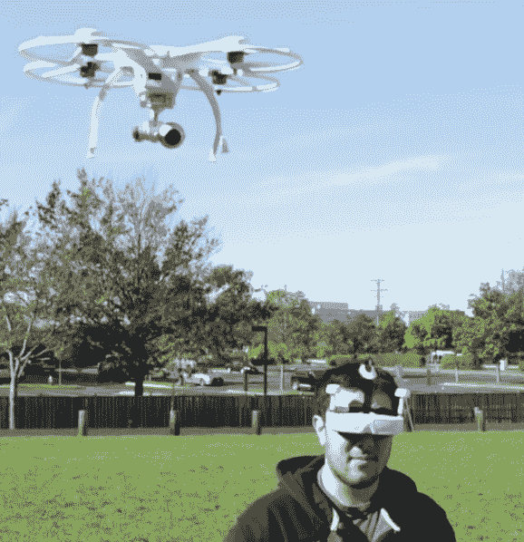
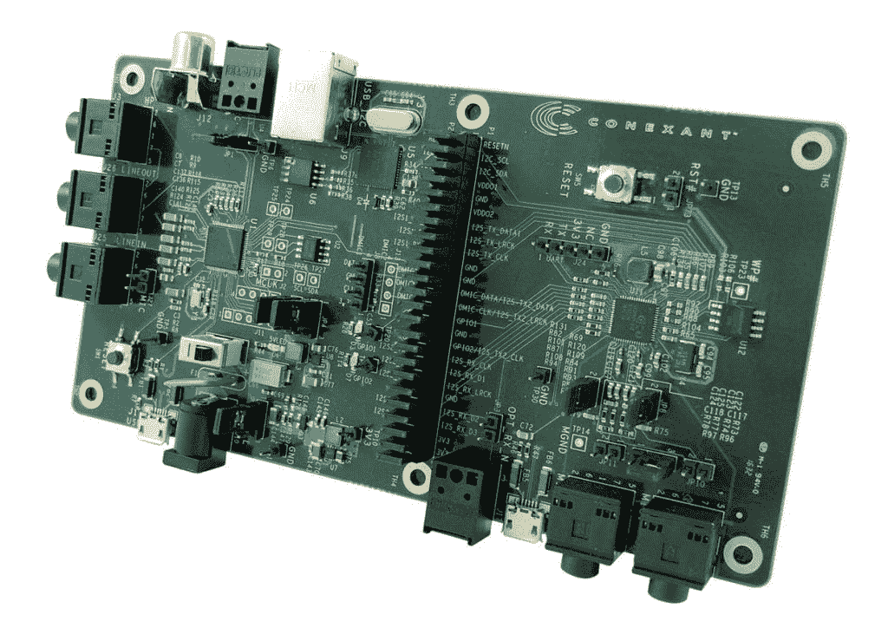
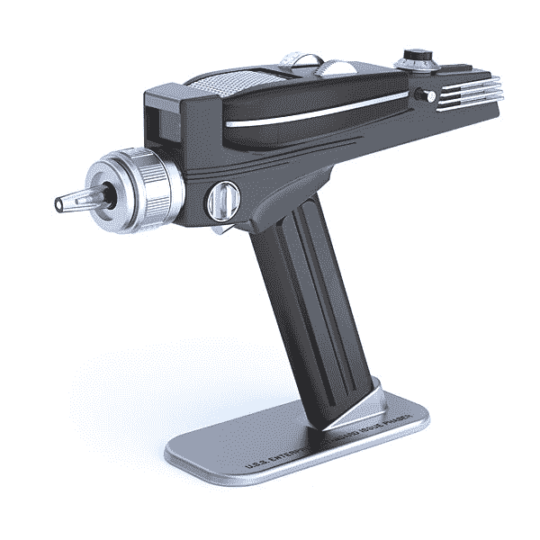
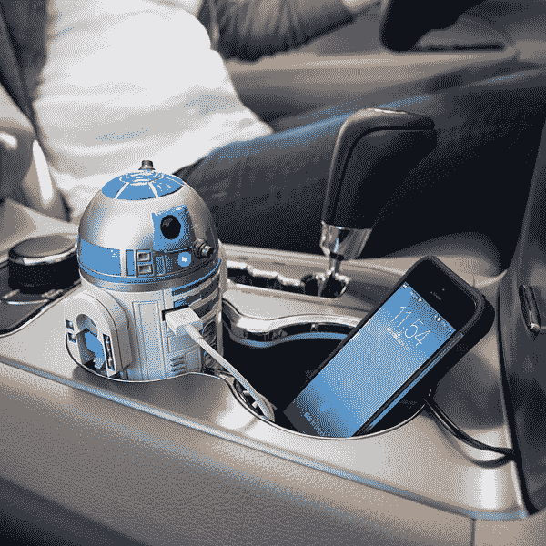
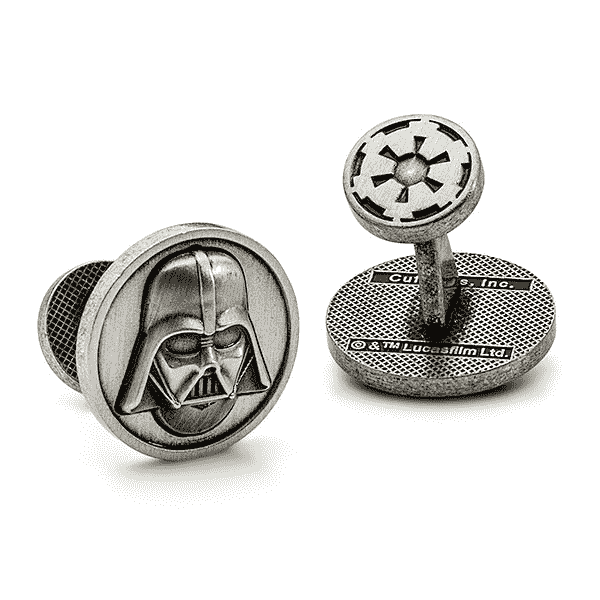

# 我们暗暗希望得到的古怪礼物

> 原文：<https://thenewstack.io/geeky-gifts-secretly-wish-wed-gotten/>

嗯，当我们打开盒子寻找另一件毛衣时，我们必须提醒自己，心意才是最重要的。我们承认，对于极客来说很难买。喝完所有的蛋奶酒后，真相终于大白了:这是我们真正想要的节日礼物…

## 配备虚拟现实的无人机

似乎今年每个人都想要无人机或虚拟现实耳机。但是为什么不同时拥有*？*今年，ThinkGeek.com 开始销售特殊的“[ghost drone 2.0–VR 版](http://www.thinkgeek.com/product/jngk/)”，它通过蓝牙连接将其悬挂的空中摄像头直接连接到你的耳机上。请务必查看 ThinkGeek.com 上的“看看无人机看到了什么”视频。)

[https://www.youtube.com/embed/uQ3cd-x1jNo?feature=oembed](https://www.youtube.com/embed/uQ3cd-x1jNo?feature=oembed)

视频

虽然大多数无人机很难控制，但 Ghost Drone 2.0 可以通过倾斜和移动手机来控制。一个应用程序将你手机的移动转化为导航命令。甚至还有一个“自动跟随模式”，所以当你愉快地穿越下面的地球时，你的无人机可以在你身后飞行(其他无人机称这个功能为“紧急模式”，如果…嗯..出于某种原因，你必须迅速逃离。

但最重要的是，如果它的电池开始耗尽，GhostDrone 2.0 会自动找到回到你身边的路，而不是无助地撞到树上！

## 亚马逊为树莓派开发的 Alexa

对于拥有一切的极客来说，这是一个非常极客的礼物。有很多关于智能家居和语音识别的讨论——但是如果你是一个崭露头角的年轻梦想家，想要建立自己的智能设备呢？

原来已经有一个硬件黑客开发工具包，可以让你将亚马逊的 Alexa 语音系统连接到树莓 Pi 板上。12 月，Conexant 发布了[AudioSmart 2-Mic](https://blog.hackster.io/build-alexa-enabled-devices-with-the-audiosmart-2-mic-dev-kit-for-raspberry-pi-55d445d0093f#.lsqcixq4b)——剩下的[就靠你的想象力了](https://youtu.be/glUCu7oZZsA)。

售价 299 美元，他们会卖给你一套工具，可以“远程语音识别和语音控制”——甚至可以过滤回声和其他背景噪音，以强化口头命令。如果你是一个喜欢修补的人，那么所有这些技术最终都会有一个听起来相当不错的血统。“与亚马逊一起，我们正在提供开发人员需要的原型工具…基于目前部署在数百万台消费设备中的成熟技术，”该公司表示。

## Meccanoid 2.0

有很多关于玩具机器人的讨论——但是技术已经进步到可以买到真正的机器人了。虽然有很多可供选择，但 [Meccano](http://www.meccano.com/) 的“Meccanoid 2.0”有着经典的直立人风格。这非常复杂。有 497 个零件和 6 个马达，你必须自己组装。但是当你完成后，你就已经建造了你自己的可爱的两英尺高的机械仆人。算是吧。

它是声控的——命令 Meccanoid“向前走”，你的机械奴才就服从了！它会说话！它滚过地板！它还模仿了我们人类社会的仪式，至少在这一点上，Meccanoid 知道超过 3000 个预编程的短语，并会试图通过背诵机器人琐事来娱乐你。但最重要的是，它是可编程的——你可以用几种有趣的方式给 Meccanoid 编程来完成你的命令。

 [我们 2015 年的极客礼物指南](https://thenewstack.io/exploding-kittens-geeky-gifts-secretly-wish-got/) 

在 Meccanoid 的手臂周围晃动，它会*记住*确切的模式，并根据命令重复一遍。或者你可以告诉 Meccanoid 开始移动它的手臂，就像你移动你的手臂一样。甚至还有一种看起来很怪异的“巫毒娃娃”模式，尽管他们称之为“布娃娃化身”，在那里你触摸智能手机或平板电脑屏幕上的机器人图标，它就会在现实生活中做出反应…

当你厌倦了你的*人形机器人*时，你可以把整个东西重建成一只机器狗……或者一只机器恐龙！

## 我自己的星球大战相位枪

我还想，在这个圣诞节，挥舞我自己的相位枪会很有趣。就像《星际迷航》里那样。

请记住，这些看起来逼真的复制品有一个比击昏你的外星敌人更重要的任务:他们在你的电视上切换频道。

同样在《星际迷航》的家居装修前沿，圣诞老人还会带给你几个《星际迷航》主题的草坪侏儒，以及一套形似企业号的盐和胡椒瓶[:](http://www.thinkgeek.com/product/jkop/)

## 我自己的 R2-D2 机器人

似乎最近每个人都想卖给你 R2-D2。迪士尼实际上出售一个 10.5 英寸的会说话的 R2-D2 复制品——还有很多其他更实用的版本，你也可以在家里使用。有一把 R2-D2 形状的卷尺以及一个热水瓶和一个爆米花机。厨房里还有[R2 D2 量杯](https://www.amazon.com/R2-D2-Measuring-Exclusive-Officially-Licensed/dp/B00JS3GG6M/)。看看这个炫酷发光的 3d 夜灯。

甚至还有一个车载充电器，可以让你将智能手机[插入 R2-D2 的 USB 端口](http://www.thinkgeek.com/product/11f0/):

在你的生活中，还有一对特别为韩独奏的戒指。一个说“我爱你”——另一个说“我知道。”如果你认识一个喜欢喝鸡尾酒的《星球大战》迷，也许他们会喜欢自己的一套“geeki tiki”酒杯。他们可以和波巴·费特、丘巴卡、达斯·维德、R2-D2、冲锋队或尤达一起喝成人饮料。

但是我一定让圣诞老人生气了，因为，相反，他给我的只有[达斯·维德的袖扣](http://www.thinkgeek.com/product/iuht/)。

* * *

# WebReduce

<svg xmlns:xlink="http://www.w3.org/1999/xlink" viewBox="0 0 68 31" version="1.1"><title>Group</title> <desc>Created with Sketch.</desc></svg>