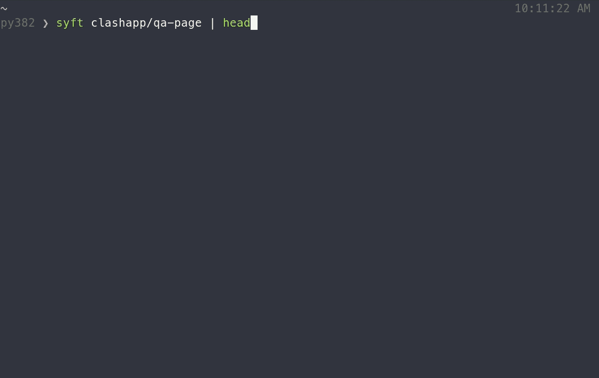
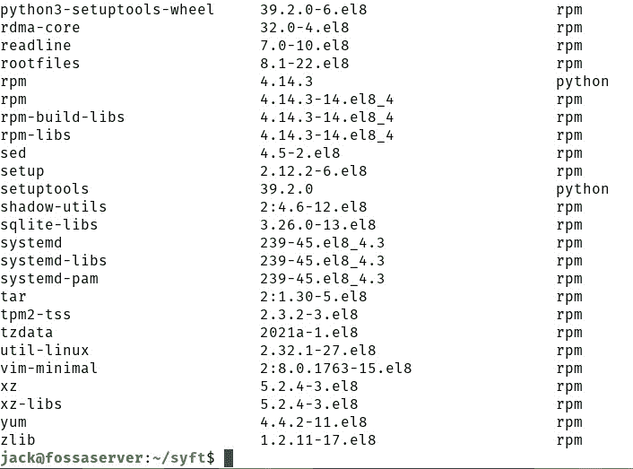

# 使用 Syft 为容器映像生成软件物料清单

> 原文：<https://thenewstack.io/generate-a-software-bill-of-materials-for-a-container-image-with-syft/>

我们的供应链受到攻击。这对商业有着沉重而持久的影响，可能会严重影响全国(乃至全球)的商业。正因为如此，美国白宫发起了一项网络安全倡议，以帮助指导开发商和企业。你可以完整阅读[网络安全行政命令](https://www.whitehouse.gov/briefing-room/presidential-actions/2021/05/12/executive-order-on-improving-the-nations-cybersecurity/)，所以你熟悉它的每一个细节。然而，要点是，对于公司来说，保证供应链的安全已经变得绝对必要。

要做到这一点并不简单，因为涉及到如此多的活动部件。在云原生世界中尤其如此，在那里容器和 Kubernetes 是不安全的移动目标。

但这一切都始于一个地方…容器图像。如果您没有使用值得信赖的图像，您的整个堆栈可能会受到威胁。但事实是，这些图像是由每个人创造的，从个人到大型企业。当然，您可以使用各种工具来扫描这些图像的漏洞，但很明显，现在需要一个特定的拼图。那块是软件材料清单(SBOM)。

## 什么是 SBOM？

简而言之， [SBOM 是制作容器映像的每个包和依赖项的完整列表](https://thenewstack.io/securing-the-software-supply-chain-with-a-software-bill-of-materials/)。好吧，那可能很有挑战性。为什么？因为创建一个 Linux 容器映像需要多少个包和依赖项？就拿流行乐来说吧！_OS(也就是我的日常驱动)。如果我发出命令:

`dpkg --list |wc --lines`

我被告知已经安装了 3008 个软件包。那太多了。更复杂的是，您不能轻易地在容器映像上运行该命令。当然，您可以基于映像部署容器，访问容器，然后发出命令。但是只有当 dpkg 和 wc 命令包含在基础映像中时，您才可能看到输出。

你不想为你创造的每一张图片都这样做。考虑到开发人员有多忙，这是一个很大的问题。那你是做什么的？幸运的是，有一些工具可以让创建软件材料清单变得非常容易。

一个这样的工具叫做 [syft](https://github.com/anchore/syft) ，来自 Anchore。有了 syft，你可以让它快速下拉图片并提取完整的 SBOM。一旦有了 SBOM，您就可以将它呈现给需要该列表的人，这样他们就可以验证映像中包含的所有内容是否符合公司要求和/或安全策略。

更好的是，syft 不仅仅列出包含包的名称，它还添加了版本号。这意味着安装的每个软件包都可以进行安全性验证。

这很重要。

而且因为 syft 支持大多数包格式(包括 APK、DEB、RPM、Ruby Bundles、Python Wheel/Egg/requirements . txt、JavaScript NPM/Yarn、Java JAR/EAR/WAR、Jenkins plugins JPI/HPI、Go 模块)，它应该可以在大多数容器映像上工作。

那么如何使用 syft 呢？让我展示给你看。我将在 Ubuntu Server 20.04 上演示，但该工具可以在任何支持 Docker 的平台上使用。

## 安装 Syft

首先要做的是安装 git。为此，登录到您的服务器并发出命令:

`sudo apt-get install git -y`

安装 git 后，您将使用以下命令克隆 syft 存储库:

`git clone https://github.com/anchore/syft.git`

您现在应该会看到一个名为 syft 新目录。使用以下命令切换到该目录:

`cd syft`

使用以下命令创建可执行二进制文件:

`./install.sh`

接下来，您需要将 syft 二进制文件移动到您的$PATH 目录中。使用以下命令执行此操作:

`sudo cp bin/syft /usr/local/bin`

通过发出以下命令确保安装完成:

`syft -h`

您应该会看到列出的帮助信息。

## 如何使用 syft 生成 SBOM

现在好戏开始了。假设您想要基于官方的 AlmaLinux 映像构建一个云原生应用程序。这样做，你将使用 syft 不仅生成 SBOM，而且下拉图像(虽然你可以生成一个已经被拉的图像的 SBOM)。让我们使用以下命令对 AlmaLinux 运行 syft:

`syft almalinux`

一旦 syft 拉下图像，它将加载它并提取内容。提取内容后，syft 将列出在映像中找到的每个包和依赖项(**图 1** )。

图 1: Syft 报告了 AlmaLinux 映像的 SBOM。

这一切都很好，但是当你需要将列表发送给团队中的某个人时，你该怎么做呢？简单。由于这是 Linux，您可以将该命令的输出发送到一个文件，如下所示:

`syft almalinux > almalinux_sbom`

该命令的输出将被发送到文件 almalinux_sbom，您现在可以打印出来或通过电子邮件发送给其他人。想数一下集装箱里的包裹数量吗？发出命令:

`less almalinux_sbom | wc --lines`

您应该会看到大约安装了 162 个包。

朋友们，这就是为容器映像生成软件材料清单的全部内容。这可能不是开发人员工具箱中最令人印象深刻的技巧，但在不久的将来，您可能会发现需要这样做。一旦您有了 SBOM，您就可以检查每一个包的漏洞，以确保您的构建有一个坚实而安全的基础。

<svg xmlns:xlink="http://www.w3.org/1999/xlink" viewBox="0 0 68 31" version="1.1"><title>Group</title> <desc>Created with Sketch.</desc></svg>