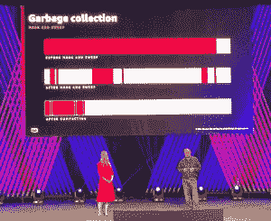

# 世代 Shenandoah 为 Java 提供了一种更快的垃圾收集方式

> 原文：<https://thenewstack.io/generational-shenandoah-offers-java-a-better-way-to-collect-garbage/>

Java 在内存管理方面一直存在性能问题，但是现在由亚马逊网络服务[和 T2 红帽](https://aws.amazon.com/?utm_content=inline-mention)开源的替代垃圾收集器可能有助于应对这一挑战。

在本月早些时候的 re:Invent 年度用户大会上，AWS [推出了开源](https://aws.amazon.com/blogs/developer/announcing-preview-release-for-the-generational-mode-to-the-shenandoah-gc/) [Shenandoah](https://github.com/openjdk/shenandoah) 垃圾收集器的变种，作为其 OpenJDK、 [Corretto](https://aws.amazon.com/corretto/) 发行版的第 17 版预览。Shenandoah 最初是由 Red Hat 开发的，但两家公司最近推出的算法的“世代模式”提高了吞吐量，并大大减少了暂停时间。

“我们相信这是 Java 虚拟机垃圾收集的下一步,[开发者工具亚马逊网络服务总经理 Ken Exner](https://www.linkedin.com/in/ken-exner-b914542/) 说，他在与 DevOps 营销 AWS 负责人 [Emily Freeman](https://www.linkedin.com/in/editingemily/) 的联合演示中介绍了这项技术。

“这是 JVM 的第一个并发分代垃圾收集器，”他说。

Exner 解释说，新的垃圾收集器提高了效率，因为它只关注内存中最有可能存在垃圾的地方，从而减少了暂停应用程序进行清理工作的时间。

这项技术不仅对 Java，而且对运行在 Java 虚拟机上的其他语言，如 Kotlin、Clojure 和 Scala，都有很大的前景。

## 内存管理

Java 一直都有自动内存管理。定期地，库存 JVM 垃圾收集器在内存中查找那些被丢弃的变量和对象图中程序不再引用的其他位，并删除它们，释放内存。它在当时是革命性的:这种自动化提供了优于 C 和 C++等旧语言的优势，在旧语言中，开发人员必须手动取消分配不再使用的内存，否则会导致安全漏洞。

> 一个垃圾收集者对另一个垃圾收集者说了什么？…长时间的停顿”——艾米丽·弗里曼

然而，Java 的自动内存管理的缺点是相当大的:为了对哪些可以丢弃，哪些不可以丢弃进行排序，垃圾收集器必须完全暂停所有程序线程来清理内存。这使得该语言不适合一些时间敏感的关键任务，并降低了大型 Java 应用程序的速度。

主持人解释说，为了减少停机暂停，Shenandoah 引入了一种称为分代垃圾收集的新技术。它基于世代假说，这基本上是一种假设，即在大多数情况下，较年轻的对象比较老的对象更经常被丢弃。

“世代 Shenandoah 识别包含新对象的区域，这些新对象来自已经在至少一个垃圾收集套件中幸存的对象，”Exner 解释说。对象被分成两代—年轻的和老的—然后更频繁地扫描年轻的对象。

“因为收集器可以专注于包含最多垃圾的区域，所以它降低了暂停时间，缩短了收集周期，并减少了实现低暂停时间所需的内存量，”Exner 说。在 AWS 博客中详细介绍的测试[中，基于新一代的 Shenandoah 能够在大多数情况下将暂停时间减少到几乎检测不到的 10ms 以下，整体应用程序吞吐量不到 5%。](https://aws.amazon.com/blogs/developer/announcing-preview-release-for-the-generational-mode-to-the-shenandoah-gc/)

根据[最近的一项研究](https://thenewstack.io/what-tens-of-millions-of-vms-reveal-about-the-state-of-java/)来自[新遗迹](http://newrelic.com/?utm_content=inline-mention)，有许多低延迟垃圾收集算法正在开发中。除了谢南多阿，还有 ZGC、 [CMS](https://docs.oracle.com/javase/8/docs/technotes/guides/vm/gctuning/cms.html) 和 [G1](https://docs.oracle.com/javase/9/gctuning/garbage-first-garbage-collector-tuning.htm) 等竞争者。

<svg xmlns:xlink="http://www.w3.org/1999/xlink" viewBox="0 0 68 31" version="1.1"><title>Group</title> <desc>Created with Sketch.</desc></svg>