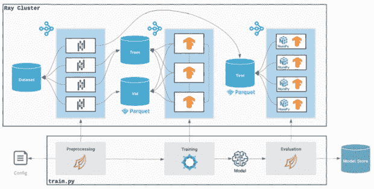

# 生成人工智能:公司如何使用和扩展人工智能模型

> 原文：<https://thenewstack.io/generative-ai-how-companies-are-using-and-scaling-ai-models/>

Robert Nishihara 是 Anyscale 的联合创始人兼首席执行官，该公司开发了开源平台 Ray——chat GPT 和优步等其他高度规模化的产品正在使用的[分布式机器学习框架](https://thenewstack.io/how-ray-a-distributed-ai-framework-helps-power-chatgpt/)。我采访了西原，了解普通公司如何利用人工智能技术，以及 Ray 如何融入企业空间。

在这个[生成人工智能](https://thenewstack.io/top-5-internet-technologies-of-2022/)的新时代，像 Ray 这样的框架将变得越来越重要——事实上，就创建大规模现代应用而言，就像过去十年 Kubernetes 一样重要。

[西原](https://www.linkedin.com/in/robert-nishihara-b6465444/)是艾恩·斯托伊察在柏克莱瑞瑟拉实验室的研究生之一。正是在那里，他、斯托伊察和菲利普·莫里茨(另一名研究生)于 2016 年创造了雷。几年后，Anyscale 成立，旨在将这项技术商业化。

值得注意的是，正如西原在最近的 LinkedIn 帖子[中所说，Ray 最初被设想为“一个通用系统，它将使分布式计算变得容易”。因此，它是为“所有可扩展计算”而设计的，而不仅仅是机器学习工作负载。也就是说，它现在的主要用例是扩展机器学习。](https://www.linkedin.com/feed/update/urn:li:activity:7023872678700752896/)

## 企业中的生成性人工智能

我向西原询问了 Ray 帮助一家企业使用生成式人工智能的例子。他指出了一家名为 [Cohere AI](https://cohere.ai/) 的公司，该公司通过大型语言模型为开发者和企业提供 NLP(自然语言处理)的访问权限。他说，Cohere AI 使用 Ray 来训练其大型语言模型。

他补充说，Anyscale 也在与许多希望利用生殖人工智能趋势的早期创业公司进行洽谈。

“我觉得每周，或者一周多次，我们都会与那些试图做微调稳定扩散模型的新创公司交谈，为他们服务，并围绕这些模型开发产品。所以我们确实和很多这样的公司合作。”

他看到的生成性人工智能用例大多基于语言和图像数据，但也有一些音频和视频用例。

至于哪些数据正在企业中用于人工智能工作负载，西原证实，这些数据大多是那些公司拥有的数据。但是，他们通常会将它与一些公共数据结合起来。

“他们确实使用现成的、预先训练好的模型，”他说。“有时候事情是用自己的数据端到端做的，但这取决于他们有多少数据。通常使用根据公共数据训练的预训练模型，然后用自己的数据进行微调。”

## 优步如何使用雷

说到超大规模运营的公司，优步是 Ray 的最大用户之一。

“优步在 Ray 上运行他们所有的机器学习，”西原告诉我。“还有机器学习——这是深度学习，经典的机器学习，XGBoost。[……]他们到处都在使用机器学习，比如……如果你乘坐优步，它会告诉你什么时候到达——你的预计到达时间。而那个 ETA 是深度学习模型做出的预测。”

西原解释说，优步有自己的“内部分布式系统，他们为扩展深度学习培训而建立。”那个产品就是 [Horovod](https://www.uber.com/en-GB/blog/horovod/) ，2017 年开源发布的 TensorFlow 分布式深度学习框架。优步后来将 Ray 添加到其工作流中，以便更好地扩展数据摄取和预处理部分。

“当他们扩展越来越多的 GPU 时，他们[优步]遇到的限制是，瓶颈从 GPU 的扩展转移到他们接收和预处理新数据的速度，以便将其输入到训练中，”西原解释道。

优步仍然使用 Horovod 进行 ML 训练，但它现在运行在 Ray 之上——Ray 通过一个名为 [Ray Datasets](https://docs.ray.io/en/latest/data/dataset.html) 的 Ray 库处理数据摄取和预处理。Ray 使用 CPU 来实现这一点，而 Horovod 使用 GPU。西原说，Ray 的另一个优势是它可以同时使用 CPU 和 GPU 来实现 ML 缩放。

优步和雷建筑；via Anyscale ( [点击此处](https://cdn.thenewstack.io/media/2023/01/cbb6cb34-ray_uber_large.jpg)查看完整尺寸)

## 基础模型的作用

最近，西原在 Twitter 上指出，“训练和服务基础模型是我们在 Ray 和 Anyscale 上看到的增长最快的用例之一”。一个[基础模型](https://en.wikipedia.org/wiki/Foundation_models)是一个基于广泛数据和大规模训练的人工智能模型，目标是将其用于许多不同类型的任务。这是一个相对较新的现象，OpenAI 和稳定扩散在过去几年里帮助推广了这项技术。

我请西原阐述在这个新的生成人工智能时代，Ray 如何帮助组织训练和服务基础模型。他用一个基于图像的基础模型的例子来帮助解释。

“你可以重新利用它来识别物体，或者预测图像的深度，或者分割出不同的物体——有许多不同的使用案例。这个想法是，你会有一个大型的基本模型，它理解图像，并经过大量计算和大量数据的训练，然后其他人可以[……]对它进行微调，使其适应不同的目的。”

因此，基础模型的训练既包括训练初始数据，也包括为特定目的对其进行微调。至于服务，他说它也有“两种不同的味道”——他称之为线上和线下。

“你希望以一种实时的方式部署模型，其中有一个正在运行的服务可以被查询，你可以在几毫秒内得到响应，或者其他什么。另一个版本是离线的，你有了模型，你想把它应用到大量的数据上。”

他说，通常情况下，Anyscale 的客户——以及 Ray 的其他开源用户——会执行所有这些不同的步骤。例如，一家初创公司可能会使用一个图像模型，针对其特定的业务目的对其进行微调，然后将该模型“作为服务”部署给其用户。

## 有点像 Kubernetes，但是对于 Python 开发者来说

Ray 的所有功能都旨在方便开发者使用，Nishihara 指出这不同于 Kubernetes 为开发者提供的用户体验(众所周知的困难)。部分原因是因为 Kubernetes 是为 DevOps 人员设计的，而 Ray 是专门为 Python 开发人员设计的。

“我们试图提供的体验[……]是关于作为一名开发人员，你知道如何在你的笔记本电脑上用 Python 编程——这就够了，”他说。“然后，您可以构建这些可扩展的应用程序。[……]你可以像 OpenAI 那样做，但你不必学习跨多台机器的调度、容错和自动伸缩。”

他补充说，很多人选择在 Kubernetes 上运行 ML 应用程序，但 ML 的缩放是由 Ray 处理的。因此，最好将 Ray 视为开发人员整体扩展解决方案中另一个急需的部分。

<svg xmlns:xlink="http://www.w3.org/1999/xlink" viewBox="0 0 68 31" version="1.1"><title>Group</title> <desc>Created with Sketch.</desc></svg>