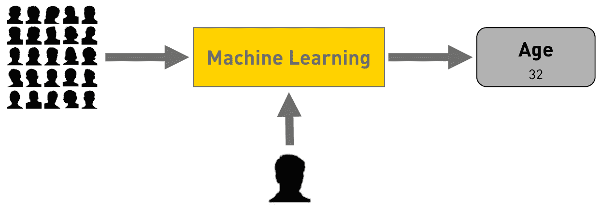
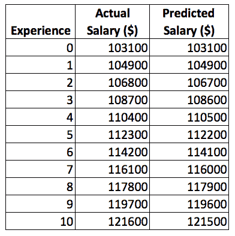

# 机器学习的简明介绍

> 原文：<https://thenewstack.io/gentle-introduction-machine-learning/>

编者按:这篇文章是一个系列的最新文章，名为“机器学习不是魔法”，涵盖了如何开始机器学习，使用熟悉的工具，如 Excel，Python，Jupyter 笔记本以及 Azure 和 Amazon Web Services 的云服务。请每周五回来查看未来的文章。

我被在一次微软会议上看到的一个演示迷住了。主持人将人们的偷拍照片上传到一个名为 how-old.net 的网站上，它非常准确地检测出了照片中所有人的年龄。微软声称该网站是由机器学习驱动的，这显然引起了我的好奇心。从那以后，我遇到了许多基于机器学习的惊人用例及场景。

从预测天气到让自动驾驶汽车能够自动驾驶，ML 无处不在。作为一名技术人员，我总是想知道这些强大应用程序的幕后是什么。大多数可用于 ML 的指南介绍了各种概念，但并没有真正为开发人员揭开它的神秘面纱。我的目标是将这些点连接起来，去揭开 ML 的概念是如何在这些复杂的用例中应用的。

在我们深入细节之前，理解 ML 实现的预期目标是很重要的。在很高的层面上，任何机器学习程序的目标要么是**预测**一个结果，要么是**对**一个项目进行分类。例如，作为开发人员，我们被期望纳入 ML，根据历史数据预测特定公司的股价；预测一名员工在五年内会获得多少加薪；将一组简历分为架构师、开发人员和管理员。查找信用卡交易是真实的还是欺诈的。

基于现有数据预测值。

基于现有数据对对象进行分类。

微软的 how-old.net 网站使用 ML 分类技术将人置于特定的年龄段。

根据现有数据确定一个人的年龄。

你可能会争辩说，完全有可能实现目标，而不必经历学习和实施 ML 的过程。

对于涉及预测和分类的任务，可以编写使用多个嵌套 if 条件来达到特定结果的程序。这种方法有两个问题。首先，它太脆弱了，这意味着当程序遇到不符合预定义条件的意外输入时，它会失败。第二个问题是它不可维护。由于程序中包含了所有硬连接的逻辑，修改逻辑以适应变化是极其复杂的。

我们需要理解的一个关键问题是，我们已经有了现成的数据，而且很多时候我们可以访问相当多的数据来进行推断。机器学习解决问题依靠的是同一个事实——现有数据的可用性。它依靠历史数据来构建一种面向未来的动态规则引擎。与具有多个 if 和 then 条件的脆弱代码不同，这提供了一种可以处理大范围输入的健壮方法。

冒着过于简化的风险，让我告诉你，机器学习可以被认为是一个智能和动态的规则引擎，它不使用编程中常见的常规决策技术。

我们现在离理解机器学习的核心概念和术语更近了一步。我们该看看现实世界的问题了。

下表显示了来自 Stack Overflow calculator 的薪金数据子集，供在纽约办公室工作的开发人员使用。

来自堆栈溢出的工资数据的子集。

基于上述数据集，如果我让你预测一个有 6 年工作经验的候选人的工资，你会怎么做？

这是否让你想起了我们在脸书经常看到的病毒迷因？

脸书数学迷因。

以上两个问题有相似之处。人们期望我们发现一个参数如何影响另一个参数。但是，我跑题了。

让我们回到问题陈述。我们从哪里开始？为了简单起见，我们可以假设所有的参数如位置、技能水平、位置都是不变的。这一切都是从找到一个开发人员的经验年限和他的工资之间的相关性开始的。

让我们通过找出两个只有一年经验差异的开发人员的工资差异来计算一下。我们将从 103，100 中减去 104，900，以找出没有经验的开发人员和只有一年经验的开发人员之间的工资差异。差额共计 1800 英镑。对每一行重复这一过程会给我们一种感觉，即员工每增加一年的经验都会有所增加。

工作经验每增加一年，薪水就会增加。

事实证明，每增加一年的经验，Stack Overflow 承诺增加 1700 至 1900 美元的工资。那是一笔不错的交易。

现在可以有把握地假设，薪金的增量可以是 1700 和 1900 的平均值，即 1800(1700+1900/2)。按照这种逻辑，一个有七年经验的开发人员可以挣 114，100 美元，再有一年经验，他可以得到 115，900 美元。

现在让我们将它与来自计算器的真实数据进行比较。

一个有六年经验的开发者的堆栈溢出工资。

一个有七年经验的开发者的堆栈溢出工资。

虽然不是 100%准确，但我们已经很接近了。这确实给了我们继续进行假设的信心。

此时，我们有两个重要的假设:

1.  **起薪= 103，100 美元**
2.  **每年增加= 1800 美元**

请记下这些事实。我们将在本教程的后续章节中再次讨论它们。

让我们暂停一下，回顾一下 ML 中预测的概念。尽管我们正在用一组已知的数据进行实验，但前提是相同的——基于某些假设，我们试图做出预测。

基于假设预测工资。

我们现在可以应用这些假设来推断数据集，以预测长达 10 年甚至 20 年的工资。我们的做法是，每增加一年经验，就增加 1800 美元。让我们也将我们的预测与现有数据进行比较。

下表并列显示了实际工资和预测工资。

10 年的实际工资与预测工资。

尽管我们接近实际数据，但每次预测都相差 100 美元。从下表中可以清楚地看出差异。

实际工资和预测工资之间的差异。

总而言之，我们试图推断经验和薪水之间的关系。基于一个假设，我们已经预测了工资，尽管有些不准确。

在我们学习 ML 的旅程中，我们已经到达了一个重要的里程碑。在不使用行话的情况下，我们设法了解了机器学习的核心前提——从已知数据集预测未知参数的值。

在本教程的下一部分，我们将探索与机器学习相关的关键概念。我给你解释一下有监督的机器学习和无监督的机器学习的区别。我们还将了解什么是算法，以及如何通过结合现有的数据和算法来创建机器学习模型。我们将把 ML 的官方术语映射到我们到目前为止所学的概念。敬请期待！

<svg xmlns:xlink="http://www.w3.org/1999/xlink" viewBox="0 0 68 31" version="1.1"><title>Group</title> <desc>Created with Sketch.</desc></svg>