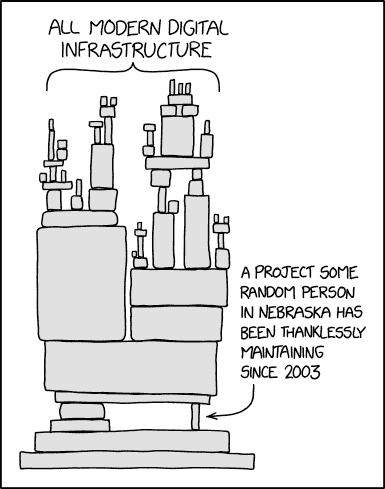

# 掌控你的软件供应链

> 原文：<https://thenewstack.io/get-a-handle-on-your-software-supply-chain/>

[Jack about boul](https://www.linkedin.com/in/jackaboutboul/)

[Jack about boul 是 Linux、开源和自由软件社区的长期成员。他带来了 20 多年的技术、社区和开发人员拓展专业知识。他之前的角色包括 Red Hat for Fedora 及其相关项目的社区架构师、开源电子商务平台 Magento 的开发人员项目经理、云通信巨头 Twilio 的开发人员福音团队的早期成员以及 Energizer 的 Connect IoT 平台的 CTO。他目前是流行的 CentOS 替代 AlmaLinux 的社区经理。Jack 热衷于教育、技术、开源、物联网，并致力于让开发人员通过出色的开发体验来构建最好、最安全的软件。](https://www.linkedin.com/in/jackaboutboul/)

在您的组织中部署的软件可能是支持运营和提高生产力的基础设施中最关键的部分。如果卡车坏了，可以做后勤安排。但是，如果一个关键的软件变得易受攻击，甚至更糟，被主动入侵，不仅组织 [可能面临毁灭性的法律后果](https://www.ftc.gov/news-events/blogs/techftc/2022/01/ftc-warns-companies-remediate-log4j-security-vulnerability) ，而且运营也可能完全停止。欢迎来到 2022 年，在这里这不再是虚构，而是今年已经被多次观察到的现实。

先说两种软件消费模式，专有和开源。传统上，在专有软件消费领域，您了解您的供应商，并对他们寄予很大的信任(价格也是如此)，以确保您的软件始终是功能性的、可靠的，并积极维护和修补安全漏洞。责任总是在他们身上。

事实上，这只是一半。在您的基础设施上运行什么最终是您的责任，与他人无关。网络安全管理软件产品的 [黑掉了的](https://www.csoonline.com/article/3601508/solarwinds-supply-chain-attack-explained-why-organizations-were-not-prepared.html)逼得那一分回家。如果您的整个组织没有全面的信息安全计划，并且没有持续监控文件、文件夹、基础架构和应用程序(基本上是用眼睛和耳朵来检测即使是看似最温和的活动)，那么您只能像信任自己一样信任您的供应商，而不应该信任自己。

快进到 2022 年，世界运行在开源软件上——这是事实。Gartner 表示，全球 95%的 IT 企业使用开源软件处理其任务关键型 IT 工作负载，而且这一数字在世界各地都在增长，不仅仅是在 IT 企业中。Linux 和开源软件也驱动了大部分云。这也有很好的理由，主要是开源软件创新的速度，因为其开发的协作性质。

开源软件最大的优势之一被认为是莱纳斯定律——只要有足够的眼球，所有的错误都是肤浅的。总有人在找，对吧？不对。即使有人在寻找，仍然有可能引入极其严重的漏洞，如 [Heartbleed](https://en.wikipedia.org/wiki/Heartbleed) 和现在的[Log4j/log4 shell](https://en.wikipedia.org/wiki/Log4Shell)，这些漏洞会潜入而不被发现。然而，这些是错误引入的，它们的根本原因在于开放源代码开发模型的全球特性，在这种模型中，某个关键的代码片段(或者在发现漏洞后结束的代码片段)可能是由一个学生贡献的，或者可能是由某个主要专业关注点在其他地方的人维护的。参见 [xkcd #2347](https://xkcd.com/2347/) 。

组织现在必须解决一个更微妙、潜在更危险的威胁载体，即软件供应链攻击。虽然网络安全管理软件产品的黑客攻击是从外部进行的，但也有可能是由它自己的开发者从内部故意做出这样的妥协。最近，广受欢迎的 npm 软件包 colors.js 和 faker.js 的开发者决定参加一场激进主义狂欢，故意改变他的软件以表达他的观点，这两个软件包每周被下载 2500 万次(是的，每周)。

他的辩解？ [“我将不再用我的免费工作来支持财富 500 强(以及其他小公司)。”](http://web.archive.org/web/20210704022108/https://github.com/Marak/faker.js/issues/1046)

更可笑的是，企业会主动联系与他们没有任何关系的开源维护者，要求他们给出答案。这里有一个最近由 Daniel Stenberg 报道的例子，他是流行的 cURL 和 libcurl 开源包的维护者。

## **这一切该怎么办……**

我建议组织转变思维，以适应新的环境。不要把软件看作是你消费的产品，而要把它看作是你参与的一个过程。这里有一个链条，不管你喜不喜欢，你都是那个链条上的一环。你需要发挥你的作用来保持这个链条的连续性。

这是通过认识和接受你在链条中的位置来实现的。你的组织纯粹是软件的消费者还是软件的生产者？你是依赖专有软件还是开源软件？很可能是两者兼而有之。确保你正在与你的专有软件供应商交流，你正在付给他们一大笔钱。他们欠你的。使用他们已建立的指南来确保他们的软件设置安全，然后采取进一步的措施来强化您的基础设施。毕竟，它是你的。

在开源方面，不要只是一个消费者。现在，您参与加强更广泛的开源生态系统比以往任何时候都更加重要。确定哪些开源项目和组件对您的组织很重要，然后与社区合作。有几种方法可以参与进来，最简单的方法是将你发现的任何 bug 发送到上游。开发人员非常欣赏这一点，比你想象的要多。这保持了反馈回路的开放，并帮助他们改进，这对许多人来说是一个充满激情的项目。

许多开源项目也接受赞助商或某种捐赠。这通常不多，但它有助于开发人员感受到赏识，并可能允许一点额外的自由。说到欣赏，联系开发者，让他们知道你在使用他们的软件，并简单地承认他们的工作。许多开源开发者花费了无数的时间将他们的心灵和思想倾注到他们的项目中，却没有得到尊重、名声和关注。通常一句简单的“谢谢”就能帮上大忙。

将这种新思维与基础设施监控、漏洞扫描器、监控、日志记录和审计跟踪的传统方法相结合。建立新的政策，模仿总统最近的 [行政命令](https://www.whitehouse.gov/briefing-room/presidential-actions/2021/05/12/executive-order-on-improving-the-nations-cybersecurity/) 确保你正在生成或被提供一份软件材料清单(SBOM)。开始实施最近关于 [迈向零信任网络安全](https://www.whitehouse.gov/wp-content/uploads/2022/01/M-22-09.pdf) 备忘录中的网络安全原则。

这种新的思维模式，加上传统的网络安全方法，并跟上最新的指导方针，将确保您的组织有一个全面的战略来支持您在未来很长一段时间内对软件供应链的数字防御。

<svg xmlns:xlink="http://www.w3.org/1999/xlink" viewBox="0 0 68 31" version="1.1"><title>Group</title> <desc>Created with Sketch.</desc></svg>