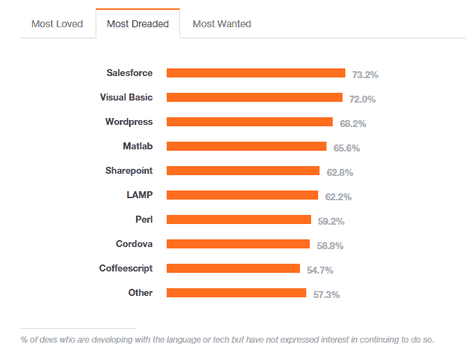

# 使用静态网站生成器回归基础

> 原文：<https://thenewstack.io/get-back-basics-static-website-generators/>

这个周末找项目承接？为什么不测试一些静态网站生成器呢？

静态网站生成的想法可能看起来很吸引人，至少从像 WordPress 这样的博客软件可以想象的伤害世界来看是这样的。

神经兮兮的系统管理员非常清楚，博客可能是定时炸弹。出问题的时候，是摇摇欲坠的博客平台吗？或者，栖息在上面的摇摇欲坠的框架？或者，罪魁祸首可能是任何一个可能在站点上出现的几乎没有记录的插件？也许暗黑破坏神隐藏在 PHP 脆弱的基础之下，[从未](http://eev.ee/blog/2012/04/09/php-a-fractal-of-bad-design/)认为[是从](http://webonastick.com/php.html)开始的[语言中最一致的](http://whydoesitsuck.com/why-does-php-suck/)？不幸的是，操作员得到的是死亡的白屏，用户看不到任何内容，管理员看不到任何错误代码。

最近 TNS 对栈溢出用户的分析发现，WordPress 是最可怕的软件包之一。

不要沾沾自喜，Drupal 用户，你喜欢的代码堆[也有问题](https://securityintelligence.com/news/joomlas-latest-release-fixes-sql-injection-flaw-that-put-2-8-million-sites-at-risk/)。

在某种程度上，即使是最有耐心的管理员也一定会想，博客软件抽象掉的所有复杂性是否比博客软件本身引入的新复杂性要多得多。无论如何，你迟早都要处理这种潜在的复杂性:虽然博客软件让一些事情变得容易，比如自动创建分类页面，但它让其他事情变得几乎不可能，这些疯狂的事情是创新型设计师永远都想做的

静态网站生成器是网页设计的[回归自然运动](https://www.youtube.com/watch?v=YsTK2LHZKPQ)。从你最喜欢的文本编辑器中给生成器[输入一些简单的降价拷贝](http://hackercodex.com/guide/pelican-static-site-generator-install/)，它就能生成简洁健康的代码，基于标准强化的老式 HTML 和 CSS 的代码。不需要数据库；最终产品是人类可读的文件，它将在最后一个 MySQL 表被[软件 cruft](https://books.google.com/books?id=g80P_4v4QbIC&pg=PA135&lpg=PA135&dq=cruft+hacker%27s+dictionary&source=bl&ots=6ocsuxjmVb&sig=4vSDWNBIjiqiPhwV11avOpWWFTk&hl=en&sa=X&ved=0CC4Q6AEwA2oVChMItO_km4L7yAIVy6UeCh38mABV#v=onepage&q=cruft%20hacker's%20dictionary&f=false) 的缓慢累积破坏后长期存在。

静态网站生成器的消息就像草根之火一样蔓延开来。你可能见过“静态站点生成器”这个词在 Twitter 上流传，但是你知道最流行的五个开源吗？根据 [StaticGen](https://www.staticgen.com/) 数据统计，它们分别是:" [Jekyll](http://jekyllrb.com/) 、 [GitBook](https://www.gitbook.com/) 、 [Octopress](http://octopress.org/) 、【Hexo】、 [Pelican](http://blog.getpelican.com/) 、 [Brunch](http://brunch.io/) 。它们都有简单且几乎一致的手工名称，毫无疑问是为了表示它们公认的优雅简洁。

然而，并非所有人都参与其中。在评估他们的价值主张时，科技作家丹尼·克赖顿[得出结论](https://www.dannycrichton.com/2015/10/23/a-new-website-and-the-dangers-of-stupid-optimization/)他们所谓的利益被误导了。“优化”是在错误的地方，可以这么说，因为它是针对网站读者，而不是作家。

他认为，博客软件的重点应该是让作者尽可能容易地发布一篇文章，这是 WordPress 擅长的事情，而像基于 Python 的 Pelican 这样的网站生成器，尽管其意图高尚，但仍然不太受欢迎，他总结道。

“尽管我写了一些额外的剧本让《鹈鹕》更受欢迎，但事实是，实际写作是一件非常痛苦的事情。我必须完美地修复文件名，以便 pelican 可以读取它，我必须通过我编写的脚本运行 Pelican 命令行，然后我必须将所有文件同步到我的服务器，以便可以实际查看。每当我写完一篇文章，我都要再花 10 分钟来启动它，”他写道。

专题图片:纽约市[街头艺术](http://joabj.com/Photos/2013/1304-SA-Bushwick-Phetus88.html)由 Phetus 拍摄，Joab Jackson 拍摄。

<svg xmlns:xlink="http://www.w3.org/1999/xlink" viewBox="0 0 68 31" version="1.1"><title>Group</title> <desc>Created with Sketch.</desc></svg>