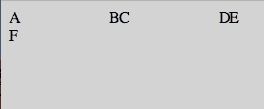
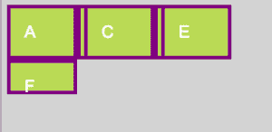
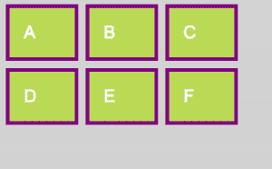
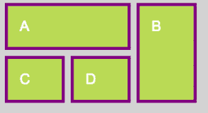
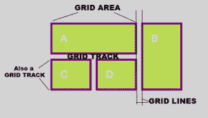

# 用 CSS 网格布局模块最后上网格

> 原文：<https://thenewstack.io/get-grid-last-css-grid-template-markup/>

web 的通用样式语言[层叠样式表](https://developer.mozilla.org/en-US/docs/Web/CSS) (CSS)在布局方面总是被从根本上打破，这有多奇怪？

自从样式从标记中脱离出来的早期，web 开发人员就一直在努力把东西放在我们希望它们去的地方，甚至更好的是，让它们留在那里。对此从来没有一个可靠的工具或有效的系统。在早期，我们强迫表格标记完成布局任务——尽管它从来就不是为了这个目的。最终，浮动属性出现了；这是另一个不适合布局的工具，绝望的开发者可以和 clear 一起使用，创建一些布局的外观。然后是官方的 CSS 定位，一个实际上是为布局设计的实体，但不幸的是从来没有构建得足够好来有效地完成它。

CSS 作为一种语言逐渐变得足够强大，可以在页面上实现各种效果，甚至是复杂而生动的动画——但布局却受到冷落，开发人员只是简单地拼凑一些有用的东西。最近 [Flexbox](https://www.w3.org/TR/css-flexbox-1/) 让我们的生活变得更加简单，作为一名网站开发人员，我对 Flexbox 非常满意。我已经能够让它做我需要它做的事情，或多或少，在大多数时候，这比我能说的所有以前的竞争者都多。然而，总有改进的空间，所以我——和 web 开发界的其他人——一直在不耐烦地等待 [CSS 网格布局模块最终上线](https://www.w3.org/TR/css-grid-1/)。

这是一个漫长的过程。该规范由微软于 2011 年 4 月首次提出，名为“CSS 网格布局”。早期版本包含在 Internet Explorer(版本 10 和 11)中，该规范于 2012 年被万维网联盟(W3C)采纳为工作草案[。在接下来的五年里，来自 Mozilla 和 Google 的志愿者编辑与微软一起完善和发展该规范。最后，在 2017 年 3 月，CSS 网格布局模块全面上线，现在出现在你附近的浏览器中。现在，所有主流桌面浏览器的最新版本都支持网格，iOS Safari 和 Chrome 也支持 Android 移动浏览器。](https://www.w3.org/TR/2012/WD-css3-grid-layout-20121106/)

就我个人而言，我迫不及待地想用我那黏糊糊的小手指来玩这个新玩具。从现在开始我们称之为“网格”

当玩新项目时，我经常使用[glitch.com](https://glitch.com/)以方便使用和即时满足实时网络显示，但不幸的是，glitch 似乎没有 *sprechen sie CSS Grid* ，即使在 [Chrome 的金丝雀](https://www.google.com/chrome/browser/canary.html)浏览器中打开了“实验性网络平台功能”，所以我转向 Atom 和 good ol' localhost:8000，在本地使用它。Grid 在 Chrome v.57 中为我工作，不需要任何标志，尽管在[caniuse.com 的 Grid](http://caniuse.com/#feat=css-grid) 当前状态摘要中有警告。令人鼓舞的是， [Atom](https://atom.io/) 文本编辑器提供了网格属性作为编辑器中的自动补全功能，所以很高兴知道我并不是完全处于未知领域。

## 有点像乐高积木

是的，乐高。有了 Grid，我们将各种形状和大小的盒子堆叠并连接在一起,(希望)构建一个平滑、均匀的整体。首先，我们在 HTML 中制作一些基本的盒子:

```
  &lt;div class="wrapper"&gt;
     &lt;div class="A"&gt;A&lt;/div&gt;
     &lt;div class="B"&gt;B&lt;/div&gt;
     &lt;div class="C"&gt;C&lt;/div&gt;
     &lt;div class="D"&gt;D&lt;/div&gt;
     &lt;div class="E"&gt;E&lt;/div&gt;
     &lt;div class="F"&gt;F&lt;/div&gt;
  &lt;/div&gt;

  

```

然后 CSS 网格乐趣从显示开始:网格；(只是 flexbox 布局从 display 开始的方式:flex).一旦在父容器上建立了这一点，就该享受行和列的乐趣了。CSS 网格布局模块提供了两个访问它们的属性:grid-template-rows 和 Grid-template-columns(Atom 在弹出窗口中也提供了这两个属性)

```
  .wrapper  {
     display:  grid;
   grid-template-columns:  100px  10px  100px  10px  100px;
     grid-template-rows:  auto  10px  auto;
  }

```

这建立了三个 100px 的列，由两个 10px 的间距隔开。网格-模板-行行建立了三行；中间的也是一个 10px 的檐槽。另外两个是“auto”，这是一个漂亮的东西，意味着它们可以扩展以容纳里面填充的任何内容。这是它的样子:



等等，什么？Ohhhhh:问题是网格子节点已经顺从地试图在提供的列中按照标记的顺序放置它们自己，这意味着一些子节点已经挤进了 10px 的 gutter 列。即使还有空的和可用的内容列。

## 快乐的小盒子

对这种自动放置现象的修复恰好也是网格的最佳实践:网格中每个项目的指定定位，它依赖于基于行的布局放置。我们的第一个快乐的小盒子 A 的属性如下所示:

```
  .A  {
     grid-column-start:  1;
     grid-column-end:  2;
     grid-row-start:  1;
     grid-row-end:  2;
   }

```

这需要大量的输入，所以幸运的是，Grid 提供了一些速记:

```
   .A  {
     grid-column:  1  /  2;
     grid-row:  1  /  2;
   }

```

其中网格-列和网格-行值表示列/行开始和列/行结束。

由于我们可能还想对我们的快乐小盒子做一些其他的事情，CSS 网格布局模块有一个更短的快捷方式:网格区域属性。

```
  .A  {
      grid-area:  1  /  1  /  2  /  2;
  }

```

这将行和列的开始和结束值合并成一行，但是——至少对我来说——可读性的损失抵消了这种便利。这是早期的游戏，真的，但现在，我会走中间道路，网格列和网格行。

所以，我们的 CSS——现在有了自定义的框位置！—看起来像:

```
   .A  {
     grid-column:  1  /  2;
     grid-row:  1  /  2;
   }
   .B  {
     grid-column:  3  /  4;  /*(because we want it to skip the second, gutter column)*/
     grid-row:  1  /  2;  /*(because it's the still the same row as A)*/
   }
   .C  {
     grid-column:  5  /  6;  /*(again, skipping the fourth column, which is another gutter)*/
     grid-row:  1  /  2;
   }
   .D  {
     grid-column:  1  /  2;  /*(back to the first column again because...)*/
     grid-row:  3  /  4;  /*(...we are starting a new row!)*/
   }
   .E  {
     grid-column:  3  /  4;
     grid-row:  3  /  4;
   }
   .F  {
     grid-column:  5  /  6;
     grid-row:  3  /  4;
   }

```

(哦，对了，我偷偷加入了一些格式，因为，嗯，盒子。)无论如何，当盒子由于网格的默认位置而堵塞时，我们从元素消失在排水沟中开始:



到一个漂亮、整洁的——等等——网格！


但是现在已经不是 2001 年了，我们可能不希望在我们的 web 应用程序中出现一个方形的小内容框，对吗？网格理解。网格挖掘我们的设计需求，并以无限的弹性做出回应。网格框(区域)可以是适合行和列的初始网格声明的任何维度。我们只需要指定内容的开始和结束。

这是同一个网格声明，现在有四个不同尺寸的盒子。开始看起来像一个实际的布局，甚至:



注意，在 Grid 中，这些 Grid 子元素的标记顺序并不重要。这很酷:我们可以在 HTML 中从语法上做正确的事情，然后独立于源代码顺序放置这些元素，然而，我们希望在 CSS 中。:

```
  .A  {
 grid-column:  1  /  4;
 grid-row:  1  /  2;
  }
  .B  {
 grid-column:  5  /  6;
 grid-row:  1  /  4;
  }
  .C  {
 grid-column:  1  /  2;
 grid-row:  3  /  4;
  }
  .D  {
 grid-column:  3  /  4;
 grid-row:  3  /  4;
  }

```

(有趣的是，你可以让盒子在网格中重叠。下面，A 现在跨越了整个 5 列，B 在 grid-column 中重叠:5/6；他们共有的地方。由于这是 CSS，这可能会导致一些可怕的和意想不到的结果，但我仍然把这些信息藏在我的后口袋里，以便以后使用。因为你永远不知道它什么时候会在设计上派上用场。*告诫选择者。*)

## 行话时间！

CSS 网格布局模块的下一步需要一些新的词汇。

水平和垂直**网格线**组成网格。访问它们的默认方式是通过编号，但是也可以给它们指定一个名称。

一个**网格单元**是任意四条相交网格线之间的空间，是 CSS 网格系统中的最小单元。有点像电子表格中的单个表格单元格。

一个**网格区域**由多个网格单元组成。它必须仍然被四条网格线所限制。(所以我们这里说的是正方形和长方形，而不是“L”形)。

**网格轨迹**是垂直或水平网格线对之间的空间。在我们的例子中，我们有宽的网格轨道代表内容放置的空间，窄的网格轨道起着装订线的作用。



目前，网格区域之间的檐槽空间必须手动规划和放置。我可以预见，在命名网格线时记住排水沟将是一件痛苦的事情。即将出现的网格属性称为网格-列-间隙和网格-行-间隙，有助于这一过程，但它们还没有得到浏览器的广泛支持。在此之前，网格水槽是严格的 DIY。但我认为你能处理好。

## 现在:启动电源

在这一点上，如果你想做的只是设计表格的变化，网格看起来可能有点酷。“咩”是可以理解的回应。但是等等——还有更多！

CSS 网格布局模块提供了一个内置的方法来快速创建和自动定位常见的网站组件，如侧栏和页脚。这是一个名为 grid-template-areas 的属性，它将命名的网格区域放在我们认为它们通常会去的地方。让我们从最简单的 HTML 标记开始:一个页眉、一个页脚、一些内容和一个侧栏:

```
&lt;div class="wrapper"&gt;
       &lt;div class="header"&gt;Our Header&lt;/div&gt;
       &lt;div class="content"&gt;Coolio&lt;br&gt;&lt;br&gt;  Content  &lt;br&gt;  &lt;br&gt;Here&lt;/div&gt;
       &lt;div class="sidebar"&gt;(Some Side Stuff)&lt;/div&gt;
       &lt;div class="footer"&gt;The Footer&lt;/div&gt;
&lt;/div&gt;

```

为了将它设计成类似于页面的样式，我们以和前面一样的方式开始，建立网格。首先，在包装器上声明 display: grid，然后定义 grid-template 列和 grid-template-rows。这一次我删除了七列——四个内容，三个装订线——并用(更易响应的)12.5em/1em 单位表示尺寸，而不是像素。全自动驾驶，看看会发生什么。

神奇的事情发生了:网格-模板-区域。为了定义我们想要什么去哪里，CSS 大师 Rachel Andrew 做了一个非常贴切的比喻来制作 ASCII 艺术:你必须在你想要它填充的每个位置键入一次元素名称。因为我们有七列，标题在最上面，我们从“标题标题标题标题标题标题标题标题标题标题标题”开始。

对于内容和侧边栏，内容得到了更多的发挥，因为侧边栏，嗯，放在一边:“内容内容内容内容内容内容。侧边栏。”也就是网格术语“让内容有五列宽，让第六列空着，给侧边栏分配一列。”句点字符告诉 Grid 将该网格单元格留空。

```
.wrapper  {
   display:  grid;
  grid-template-columns:  12.5em  1em  12.5em  1em  12.5em  1em  12.5em;
  grid-template-rows:  auto;
  grid-template-areas:  "header header header header header header header"
  "content content content content content . sidebar"
  "footer footer footer footer footer footer footer";
      }

```


注意这里没有水平的檐槽，因为我们没有在网格模板行中声明任何水平的檐槽。有一个垂直的檐槽，感谢“.”在 grid-template-areas values 语句的第二行中。

另一件很酷的事情是:你可以在网格子元素中使用 Flexbox！我希望侧边栏网格区域内的“一些附加内容”文本垂直和水平居中，而不是默认的块。所以通过声明 display: flex on。我们可以使用 align-items 和 justify-content Flexbox 属性来居中侧边栏的文本内容。

## 结果是

因此，这是基本的启动和运行信息，你需要跳进去，开始摆弄 CSS 网格布局模块的布局。有很多关于这是 CSS 布局工具的圣杯的宣传，但是到目前为止我仍然不相信。虽然在获得网格大师的地位之前，我还有很多东西要学——而且可能会出现一些我意想不到的奇迹——但从根本上来说，这是一个网格系统。

尽管我不得不说，希望网格的出现意味着，至少，我们可能永远不再需要漂浮任何东西，任何地方，永远不再。

<svg xmlns:xlink="http://www.w3.org/1999/xlink" viewBox="0 0 68 31" version="1.1"><title>Group</title> <desc>Created with Sketch.</desc></svg>