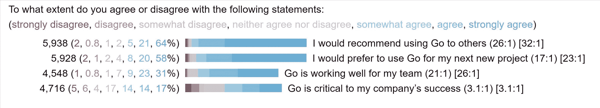
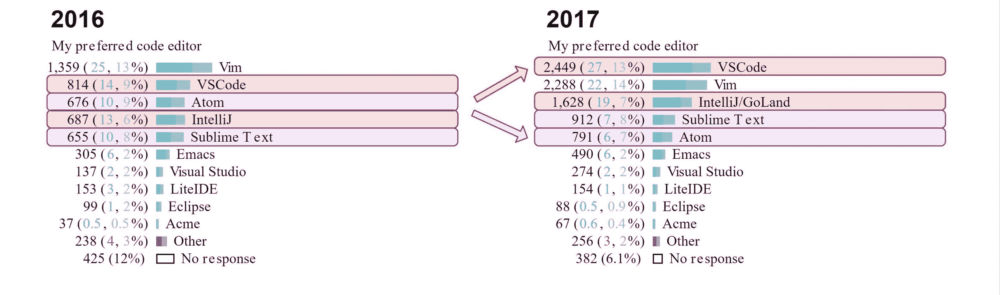

# 本周数字:Golang 开始工作

> 原文：<https://thenewstack.io/get-ready-get-set-go-survey-recap/>

最近 2017 年[对超过 6000 名 Go 语言(](https://blog.golang.org/survey2017-results) [golang](/tag/golang/) )开发者的 Go 项目调查发现，满意的开发者越来越多地将它用于他们的工作。然而，当他们微调他们的用例时，开发人员更有可能说缺乏关键功能正在阻碍 Go 的采用。

 

总的来说，64%的人强烈推荐 Go，58%的人强烈倾向于在他们的下一个项目中使用 Go。虽然 Go 粉丝男孩和女孩在样本中可能被过度代表，但这一发现得到了 [Stack Overflow 的 2017 年开发者调查](https://insights.stackoverflow.com/survey/2017#technology)的证实。与该报告中的大多数其他语言相比，Go 用户更有可能表示有兴趣继续使用它。

使用 Go 进行工作的开发人员比例上升至 67 %,而 2016 年版本的调查为 62%。与此同时，在 Go 中编写 API/RPC 服务的人比去年上升了 5 个百分点，达到 65%。

随着越来越多的人使用 Go for work 项目，几个挑战的引用增加了，缺少泛型增加了一倍，上升到列表的第二位。提到的最大挑战是缺乏依赖性管理。更有启发性的是 Go 没有参与更多项目的原因。在当前的研究中，认为围棋不适合这个项目的人从 2016 年的 24%下降到了 16%。与此同时，那些认为缺乏关键功能阻碍了额外使用的人从 11%跃升至 19%。

除了关于挑战的答案之外，调查没有具体说明缺少的功能是什么。然而，缺乏开发人员首选编辑器的支持并不是原因，因为三分之二的人“满意”或“非常满意” [VSCode](https://code.visualstudio.com/) 在“地鼠”中的使用大幅上升，这反映了[更广泛的行业趋势](https://thenewstack.io/microsoft-visual-studio-2017-devops-five-star-app/)。

特征图片:瑞典奥兰勒卡卡[新老股票](https://nos.twnsnd.co/image/171453291209)。

<svg xmlns:xlink="http://www.w3.org/1999/xlink" viewBox="0 0 68 31" version="1.1"><title>Group</title> <desc>Created with Sketch.</desc></svg>