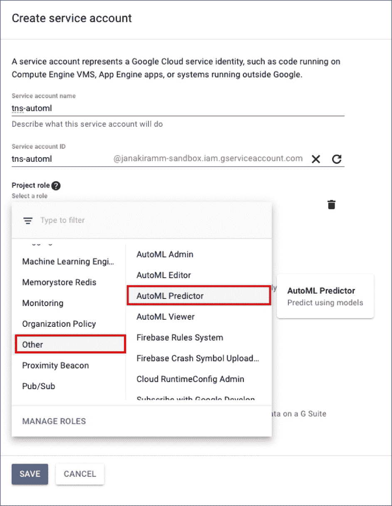
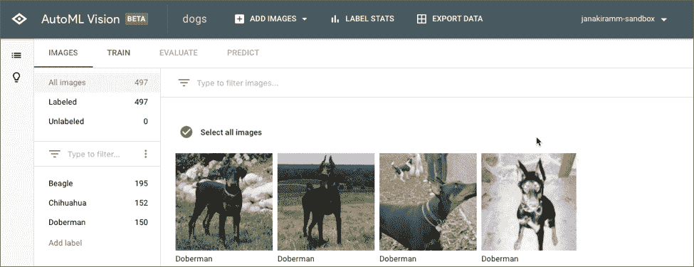
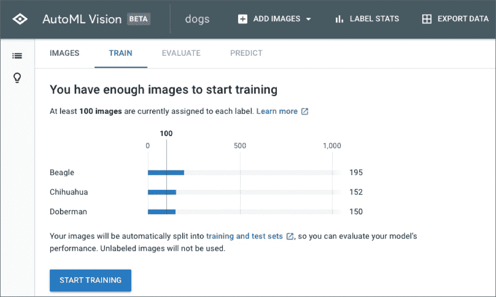
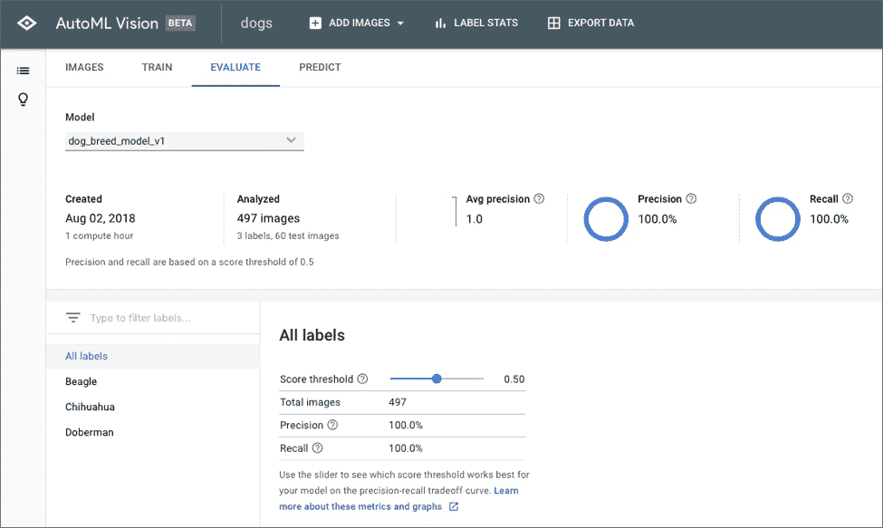
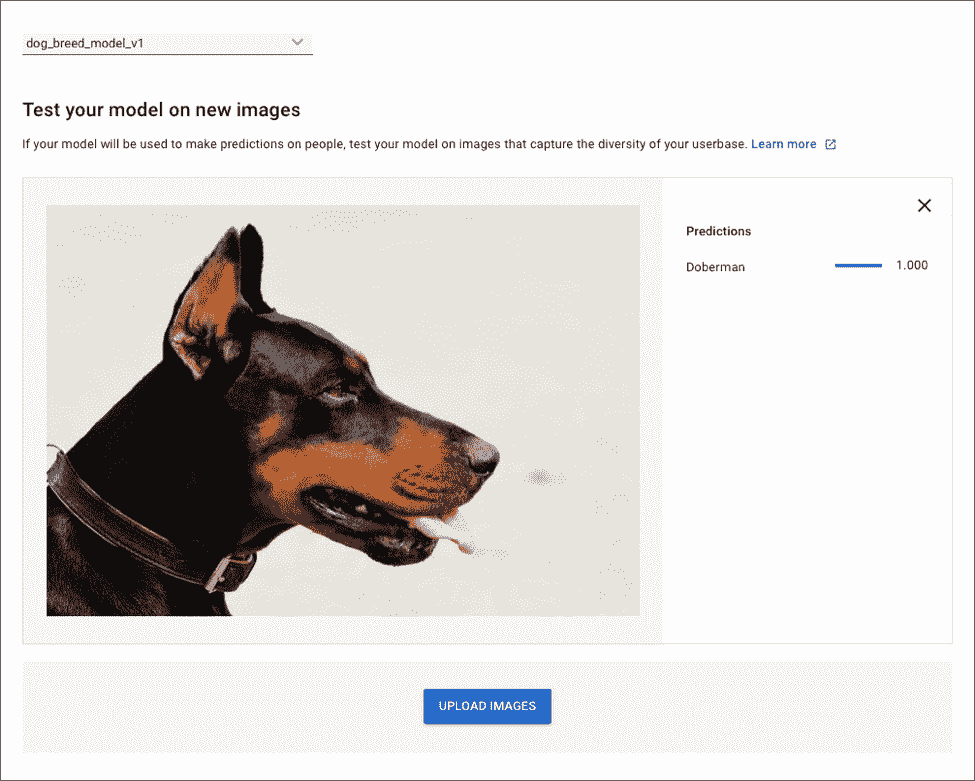
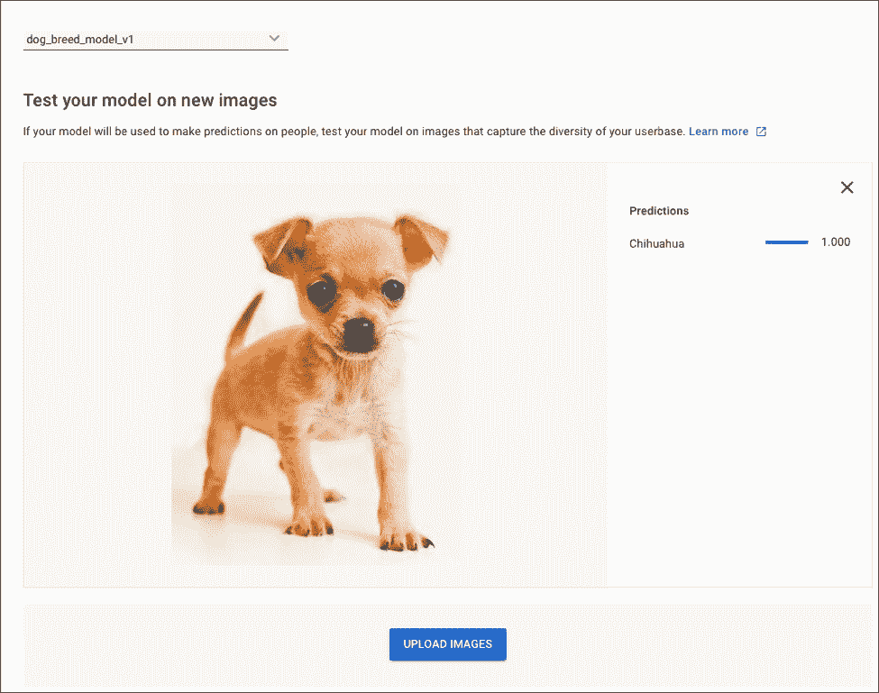
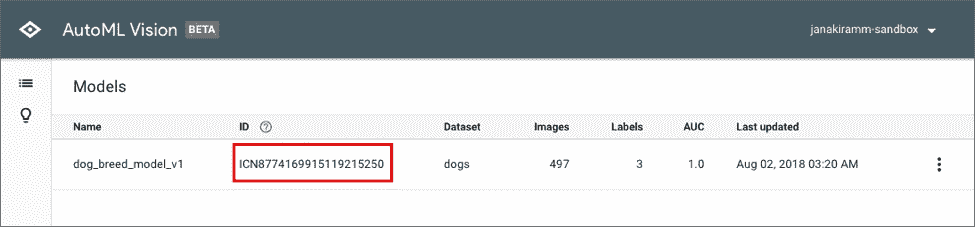
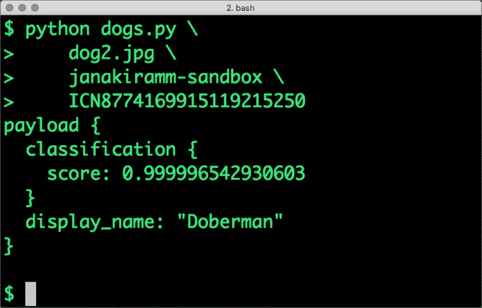

# 开始使用 Google Cloud AutoML Vision 进行图像分类

> 原文：<https://thenewstack.io/get-started-with-google-cloud-automl-vision-for-image-classification/>

最近，在 Cloud NEXT 2018 大会上，谷歌向公众提供了 AutoML，处于测试阶段。这项服务大大减少了训练和调整机器学习模型的步骤。[Google Cloud 上的 AutoML](https://cloud.google.com/automl/)可用于翻译、自然语言和视觉。

在本教程中，我们将使用 AutoML 视觉解决图像分类问题。我们将训练模型根据狗的品种对狗的图像进行分类。

遵循本指南，您不需要成为 Python 或 TensorFlow 开发人员。最后，我们将编写几行代码，在 Google 云平台上托管的经过全面训练的模型上执行推理。在继续下一步之前，请确保满足以下先决条件。

## 先决条件

*   Google 云平台的主动订阅
*   谷歌云 SDK
*   计算机编程语言

## 设置环境

在开发机器上，首先设置以下环境变量。将 *<项目标识>* 替换为您的活动谷歌云项目。不要更改第二个变量，因为 AutoML Vision 在测试版中只能在美国中部地区运行。

```
<em>export PROJECT_ID="&lt;project-id&gt;"</em><em>export REGION_NAME="us-central1"</em>

```

我们需要启用[AutoML API](https://console.cloud.google.com/flows/enableapi?apiid=storage-component.googleapis.com,automl.googleapis.com,storage-api.googleapis.com)从代码中调用，为您的项目启用 Google 云存储、Cloud AutoML API、Google 云存储 JSON API。

为了调用该模型，我们需要将我们的应用程序与一组凭证相关联。访问[服务帐户](https://console.cloud.google.com/iam-admin/serviceaccounts)来创建一个 JSON 格式的服务和相应的密钥文件。



对于项目角色，选择**自动预测器**。下载的 JSON 文件将有足够的权限调用 API 进行推理。创建另一个指向下载的 JSON 键的环境变量。

```
<em>export GOOGLE_APPLICATION_CREDENTIALS=key-file</em>

```

我们还需要创建一个 Google 云存储(GCS)桶来存储图像数据集。运行以下命令来配置存储桶。确保时段名称为$PROJECT_ID-vcm。这是测试版的强制性要求。

```
<em>gsutil mb  -p  $PROJECT_ID  -c  regional  -l  $REGION_NAME gs://$PROJECT_ID-vcm/</em>

```

最后，让我们为 Cloud AutoML 安装 Python 模块。运行以下命令将其安装到您的工作站上。

```
<em>pip install google-cloud-automl</em>

```

## 数据准备

我们将使用流行的斯坦福狗数据集来训练我们的模型。下载并解压缩 Images tar 文件，大小约为 757MB。

对于本教程，我们将只使用属于三个品种的狗图像-小猎犬，吉娃娃和杜宾。让我们将它们分别放在不同的目录中。您可能还想重命名这些文件。你最终的目录结构应该如下所示:

```
<em>.</em>

<em>└──  data</em>
<em>     ├──  Beagle</em>
<em>     ├──  Chihuahua</em>
<em>     └──  Doberman</em>

```

AutoML Vision 每个标签至少需要 100 张图像。狗的数据集为每个品种提供了大约 150 张图片，这对于本教程来说已经足够了。

## 训练模型

一切就绪后，让我们开始培训流程。这一步相当于在运行代码之前编译代码。

打开 AutoML 视觉控制台，点击**新建数据集。**

给模型命名，然后点击**稍后导入图像**选项。这将使我们能够在创建标签后上传图像。

下一步，点击**新标签**添加**小猎犬。**选择新创建的标签，点击顶部的添加图像按钮，选择**从您的计算机上传**选项。从 beagle 文件夹中选择所有图像，将其上传到 bucket。根据您的带宽，上传可能需要几分钟时间。

对其余的标签重复上述步骤——吉娃娃和杜宾。上传的图片被贴上标签并存储在谷歌云存储(GCS)桶中。在这一步结束时，您的数据集应该看起来像下面的屏幕截图:



现在，该训练模型了。只需点击**训练**选项卡，然后点击**开始训练**。您可能希望更改模型名称，使其更有意义和版本化。



训练工作可能需要几分钟，之后我们将能够测试模型的准确性。完成后，点击**评估**选项卡查看详情。



由于我们使用的图像数量有限，因此准确率和召回率几乎都是 100%。您可以拖动**分数阈值**滑块来调整精确度-召回率的权衡。

要执行预测，单击**预测**选项卡，然后从互联网上抓取一张狗的图像(这应该是数据集之外的图像)上传。我们的模型应该能够根据狗的品种对它进行分类。





恭喜你！您已经成功训练了模型。上面的截图证实了这个模型是有效的。

## 使用模型进行推理

有了完全训练好的模型，我们可以开始在代码中使用它进行推理。Cloud AutoML 公开了一个 REST 端点，可以很容易地从 cURL 访问它。由于有多个客户端库使这项工作变得简单，因此让我们编写几行 Python 代码进行推理。

```
<em>import sys</em><em> </em>

<em>from google.cloud import automl_v1beta1</em>
<em>from google.cloud.automl_v1beta1.proto import service_pb2</em>

<em>def get_prediction(content,  project_id,  model_id):</em>
<em>   prediction_client  =  automl_v1beta1.PredictionServiceClient()</em>
<em>   name  =  'projects/{}/locations/us-central1/models/{}'.format(project_id,  model_id)</em>
<em>   payload  =  {'image':  {'image_bytes':  content  }}</em>
<em>   params  =  {}</em>
<em>   request  =  prediction_client.predict(name,  payload,  params)</em>
<em>   return request   # waits till request is returned</em>

<em>if __name__  ==  '__main__':</em>
<em>   file_path  =  sys.argv[1]</em>
<em>   project_id  =  sys.argv[2]</em>
<em>   model_id  =  sys.argv[3]</em>
<em> 
</em><em>  with open(file_path,  'rb')  as ff:</em>
<em>     content  =  ff.read()</em>
<em>   print  (get_prediction(content,  project_id,   model_id))</em>

```

将以上代码另存为 *dogs.py* 。

在执行代码之前，获取我们刚刚训练的模型的 ID。您可以从“模型”选项卡中访问它。



通过传递模型 id 和样本图像来运行代码。确保 GOOGLE_APPLICATION_CREDENTIALS 环境变量指向 JSON 密钥文件的绝对路径。

```
<em>export GOOGLE_APPLICATION_CREDENTIALS=key-file</em>

<em>python dogs.py  \</em>
<em>             dog2.jpg  \</em>
<em>             janakiramm-sandbox  \</em>
<em>             ICN8774169915119215250</em>

```

根据狗的品种，输出将显示分类的输出。



谷歌不是 AutoML 的唯一提供商。微软有定制的认知 API，可以根据定制的数据集生成模型。在本教程的下一部分，我们将探索微软的 [CustomVision.ai](http://customvision.ai) 来构建一个 AutoML 模型。

<svg xmlns:xlink="http://www.w3.org/1999/xlink" viewBox="0 0 68 31" version="1.1"><title>Group</title> <desc>Created with Sketch.</desc></svg>