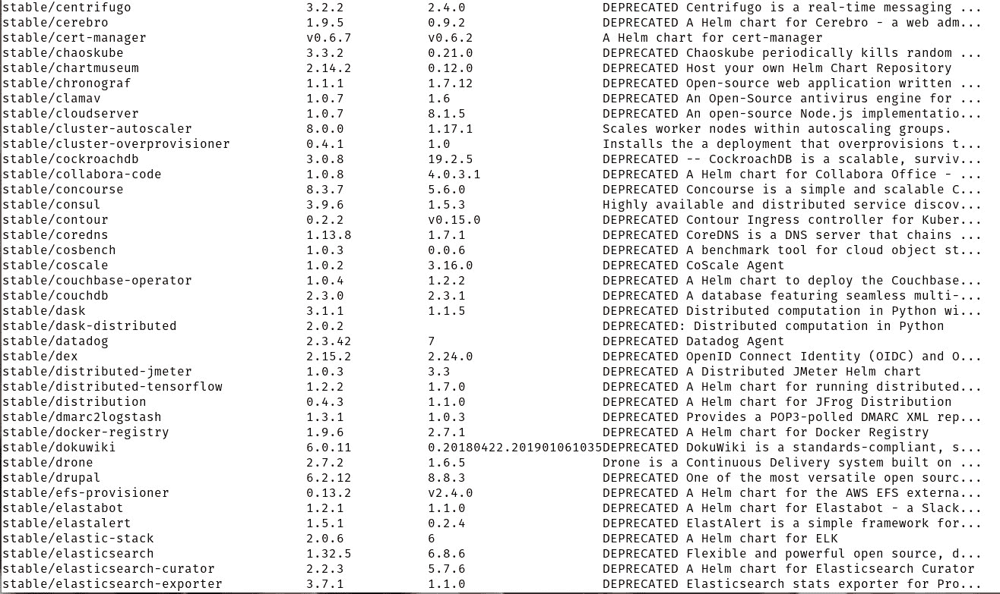
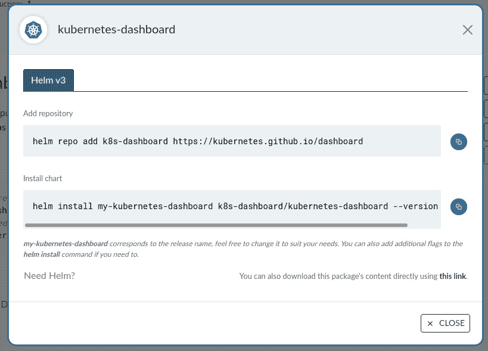

# Helm Kubernetes 软件包管理器入门

> 原文：<https://thenewstack.io/get-started-with-the-helm-kubernetes-package-manager/>

如果您刚刚开始使用 [Kubernetes](https://thenewstack.io/category/kubernetes/) 的旅程，您可能已经发现为应用程序创建全栈清单是多么具有挑战性。一旦您花时间熟悉了应用程序和服务是如何部署的，事情就会变得容易得多，但即使这样，写出一份完整的清单也是一件苦差事。

这就是头盔发挥作用的地方。Helm 是 Kubernetes 的一个包管理器和应用程序管理工具，它使得部署应用程序和服务变得相当容易。

把[掌舵](https://helm.sh/docs/intro/install/)想象成库伯内特人的 *apt* 或 *dnf* 。有了这个应用程序，您可以更容易地将预构建的应用程序部署到您的 Kubernetes 集群中(甚至自定义它们)。

Helm 背后的魔力是 Helm Charts，它是一个打包的预配置资源集合，用于部署应用程序和服务。通过使用 Helm，您可以显著提高 Kubernetes 的工作效率，同时还可以更容易地一次又一次地重新创建成功的部署。

让我们浏览一下安装 Helm 的过程，然后使用它来查找和下载 Helm 图表，您可以使用这些图表将应用程序部署到您的 Kubernetes 集群。

## 舵轮图

在我们开始之前，让我们先来谈谈舵图的结构。典型的舵图由以下文件组成:

*   **。helm ignore**–包含打包图表时将被忽略的所有文件。
*   **chart . YAML**–包含关于被打包的图表的所有信息(如类型、版本和 appVersion)。
*   **values . YAML**–包含所有要注入模板的定义。
*   **图表**–包含您的图表所依赖的其他图表的目录。
*   **模板**–存放要部署的清单的目录。

创建或下载图表后，目录结构可能如下所示:

├──排行榜
├── Chart.yaml
├──模板
│├──deployment . YAML
│├──_ helpers . TPL
│├──HPA . YAML
│├──ingress . YAML
│├──notes . txt
│├──service account . YAML
│├──service . YAML
┖──tests
│考试

## 安装舵

在你安装 Helm 之前，你必须首先确保你已经安装了 Kubernetes。为此，请通读我的教程[如何使用 Kubeadm 和 containerd](https://thenewstack.io/how-to-deploy-kubernetes-with-kubeadm-and-containerd/) 部署 Kubernetes。一旦你有 Kubernetes 启动并运行，你就可以安装头盔。

幸运的是，Helm 的安装相当简单。登录到您的 Kubernetes 机器(您将从中进行开发)并发出命令:

`curl https://raw.githubusercontent.com/helm/helm/master/scripts/get-helm-3 |bash`

应该会提示您输入管理员密码。身份验证成功后，安装将开始并完成。然后，您可以使用以下命令验证安装:

`helm version --short`

您应该会看到类似这样的内容:

`v3.8.1+g5cb9af4`

头盔现已安装完毕，准备就绪。

## 下载稳定的存储库

下一个任务是下载稳定的存储库(存储了大量预先配置的舵图)。为此，发出以下命令:

`helm repo add stable https://charts.helm.sh/stable`

使用以下命令进行测试，以确保存储库已成功下载:

`helm repo list`

您应该会看到类似于
的内容

```
NAME       URL
stable      https://charts.helm.sh/stable

```

## 如何在存储库中搜索图表

如果您想从稳定存储库中找到可用的图表，请发出以下命令:

`helm search repo stable`

这是第一个问题出现的地方(这也是 Kubernetes 如此复杂的另一个原因)。当您运行这个搜索命令时，您会看到大多数图表都被否决了(**图 1** )。



图 1:在稳定回购中发现的弃用舵图。

原因是[云本地计算基金会](https://cncf.io/?utm_content=inline-mention)不再愿意支付托管单个整体式存储库的不断上涨的成本。因此，图表现在通过几个不同的组织跨不同的存储库托管。

幸运的是，在 [ArtifactHub](https://artifacthub.io/) 中有一个解决方案。在这个网站上，你可以搜索任何你能想到的舵图。

例如，假设我想下载 Kubernetes 仪表板的舵图。我可以转到 ArtifactHub，搜索该应用程序，然后查看图表的所有必要信息。甚至还有一个安装链接，它会打开一个弹出窗口，为您提供安装 repo 和图表所需的命令(**图 2** )。



图 Kubernetes 仪表板的安装说明。

要安装 Helm chart，首先要使用以下命令添加存储库:

`helm repo add k8s-dashboard https://kubernetes.github.io/dashboard`

立即用以下内容更新存储库:

`helm repo update`

使用以下内容搜索新添加的存储库:

`helm search repo k8s-dashboard`

您应该看到存储库中包含的所有应用程序(在本例中，只有一个)。

添加存储库后，使用以下内容安装图表:

`helm install my-kubernetes-dashboard k8s-dashboard/kubernetes-dashboard --version 5.3.1`

*my-kubernetes-dashboard* 是您为图表指定的唯一名称(这使得可以多次下载图表。下载图表可能需要一些时间(取决于文件的大小和数量)。

在 *~/。cache/helm/repository/directory 您应该会看到文件 kubernetes-dashboard-5 . 3 . 1 . tgz .*使用以下命令解压该文件:

`tar xvzf ~/.cache/helm/repository/kubernetes-dashboard-5.3.1.tgz`

现在，您应该会在当前工作目录中看到一个新目录 kubernetes-dashboard。该目录的结构如下所示:

├──chart . lock
├──charts
│└──metrics-server
│├──chart . YAML
│├──ci
│ci-values . YAML
│├──readme . MD
│├──templates
││├──apiservice . YAML
││├──cluster role-aggregated-reader . YAML
│├──clusterrole binding-auth ││├──role binding . YAML
││├──service account . YAML
││└──service . YAML
│└──values . YAML
├──chart . YAML
├──readme . MD
├──模板
│├──clusterrole binding-metrics . YAML
│├─clusterrole binding-readonly . YAML
│├─clusterrole-metrics . YAML
│ ├──role . YAML
│├──secret . YAML
│├──service account . YAML
│├──service monitor . YAML
│├──service . YAML
│└──_ TPL values . TPL
└──values . YAML

您可以梳理这些文件，并根据部署需要进行任何必要的更改。

安装图表后，您将在底部看到部署说明。例如，Kubernetes 仪表板部署是用以下命令处理的。

通过运行以下命令获取 Kubernetes 仪表板 URL:

`export POD_NAME=$(kubectl get pods -n default -l "app.kubernetes.io/name=kubernetes-dashboard,app.kubernetes.io/instance=my-kubernetes-dashboard" -o jsonpath="{.items[0].metadata.name}")`

如果 pod 成功运行，您应该会看到如下输出:

`echo https://127.0.0.1:8443/`

最后，使用以下命令将本地端口转发到 pod 中的一个端口:

`kubectl -n default port-forward $POD_NAME 8443:8443`

一旦一切就绪并开始运行，您应该能够访问 Kubernetes 仪表板(或您用 Helm 部署的任何应用程序/服务)。

朋友们，这就是你开始使用头盔的方法。熟悉这个 Kubernetes 包管理系统，这样您就可以节省 Kubernetes 部署的时间和精力。

即使您实际上没有使用 Helm charts 部署您的应用程序，这也是了解创建 Kubernetes 清单的细节的好方法。下载各种图表，并确保研究 **Chart.yaml** 文件，以了解关于如何创建这些清单的更多信息。

<svg xmlns:xlink="http://www.w3.org/1999/xlink" viewBox="0 0 68 31" version="1.1"><title>Group</title> <desc>Created with Sketch.</desc></svg>