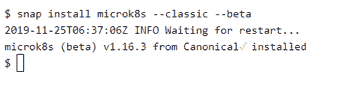
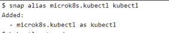
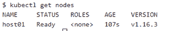
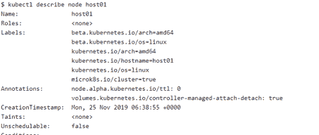
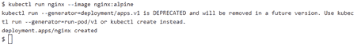
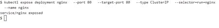
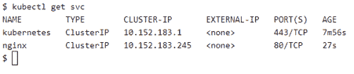
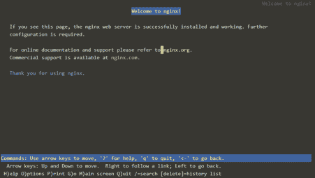
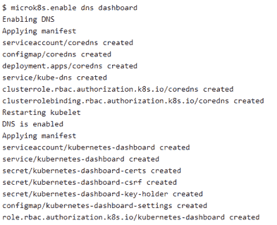
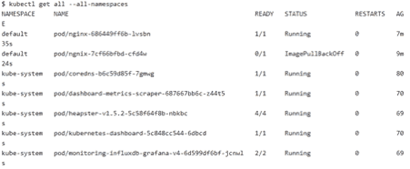

# 只需 3 个步骤即可获得最小、最快、完全符合标准的 Kubernetes

> 原文：<https://thenewstack.io/get-the-smallest-fastest-fully-conformant-kubernetes-in-just-3-steps/>

[](https://www.upnxtblog.com)

[Karthikeyan shanmu gam](https://www.upnxtblog.com)

[Karthikeyan shanmu gam(Karthik)是一名经验丰富的解决方案架构师，拥有超过 17 年的银行、金融服务和航空领域应用程序设计开发经验&。目前参与技术咨询&提供应用程序转换领域的解决方案，包括传统应用程序的现代化、管理转换练习以及为转换提供解决方案架构。](https://www.upnxtblog.com)

[](https://www.upnxtblog.com)[](https://www.upnxtblog.com)

正如我们所知，Kubernetes 协调一个高度可用的计算机集群，这些计算机作为一个单元连接在一起工作。Kubernetes 包含许多抽象概念，允许将容器化的应用程序部署到集群中，而无需将它们附加到单独的机器上。

简言之，Kubernetes 就是:

*   **可移植:**公共、私有、混合、多云
*   **可扩展:**模块化、可插拔、可挂钩、可组合
*   **自我修复:**自动放置、自动重启、自动复制、自动扩展

在本文中，我们将了解可以在 edge、物联网和设备上运行的轻量级 Kubernetes 引擎 [MicroK8s](https://microk8s.io/) 。MicroK8s 非常适合离线开发、原型制作和测试。您还可以在 VM 上使用它作为 CI/CD 的小型、廉价、可靠的 k8s。

在下一节中，我们将研究如何在 MicroK8s 集群上安装和部署示例应用程序。

## 第一步。安装 MicroK8s

在下面的步骤中，我们将安装 MicroK8s 集群，它将安装一组有限的组件，如 api-server、controller-manager、scheduler、kubelet、cni、kube-proxy。像 kube-dns 和 dashboard 这样的附加服务也可以使用 microk8s.enable 命令运行。

先决条件:

*   你应该有 Ubuntu 18.04 LTS 或 16.04 LTS 环境
*   建议使用 20G 磁盘空间和 4G 内存

MicroK8s 通过 [Snaps](https://snapcraft.io/) 部署。快照是易于创建和安装的容器化软件包(如 docker ),它们捆绑了它们的依赖项，无需修改即可在所有主流 Linux 系统上工作。快照会自动更新，可以安全运行。另外，请注意，MicroK8s snap 会经常更新，以匹配 Kubernetes 的每个版本。

MicroK8s snap 可以使用下面的命令安装:

```
snap install microk8s  --classic  --beta

```



图 1:安装 Microk8s

为了避免与已经安装的 kubectl 冲突，也为了避免覆盖任何现有的 Kubernetes 配置文件，MicroK8s 添加了一个 microk8s.kubectl 命令。如果您只使用 MicroK8s，请考虑使用以下命令添加别名:



图 2:向 Microk8s.kubectl 添加别名

## 第二步。验证安装

此时您已经安装了 MicroK8s，使用下面的命令
检查新部署的节点是否处于就绪状态



图 3:验证 Microk8s 安装

如果收到错误，说明 microk8s 还在后台启动节点。等待几分钟，然后重试。

还可以使用 kubectl describe 命令来获取节点的详细信息。



图 4:使用 Kubectl 描述节点

## 第三步。部署示例应用程序

至此，您拥有了一个功能齐全的 Kubernetes 集群。以下命令将部署 nginx web 应用程序。

```
kubectl run nginx  --image nginx:alpine

```



图 5:部署 nginx 应用程序

一旦部署了 nginx，就可以用下面的命令公开应用程序。

```
kubectl expose deployment nginx  \
--port  80  \
--target-port  80  \
--type ClusterIP  \
--selector=run=nginx  \
--name nginx

```



图 6:公开 nginx 应用程序

您应该看到分配了一个新的服务和集群 IP 地址。



图 7:分配了新的服务和集群 IP 地址。

现在服务已经对外公开，我们可以启动 lynx，一个基于终端的 web 浏览器，使用下面的命令访问 Nginx 应用程序。

```
export CLUSTER_IP=$(kubectl get svc/nginx  -o  go-template=&amp;apos;{{(index  .spec.clusterIP)}}&amp;apos;)
echo CLUSTER_IP=$CLUSTER_IP
lynx  $CLUSTER_IP:80

```



图 8:部署在 Microk8s 集群上的 Nginx 应用

恭喜你。现在，您已经使用 Microk8s 将 Nginx 应用程序部署到一个全功能的 Kubernetes 集群。

## 第四步。部署附加组件(可选)

使用 microk8s.enable 命令可以启用 kube-dns 和 dashboard 等附加服务。

```
microk8s.enable dns dashboard

```



图 9:安装附加组件

使用以下命令检查附加服务的所有组件是否都已启动:

```
kubectl get all  --all-namespaces

```



图 10:检查附加服务的状态

MicroK8s 为您提供了故障排除[工具](https://microk8s.io/docs/troubleshooting)来检查出了什么问题。请务必查看[常见问题](https://microk8s.io/docs/troubleshooting#common-issues)部分，以帮助解决常见问题。

有用的资源:

通过 Pixabay 的特色图片。

<svg xmlns:xlink="http://www.w3.org/1999/xlink" viewBox="0 0 68 31" version="1.1"><title>Group</title> <desc>Created with Sketch.</desc></svg>