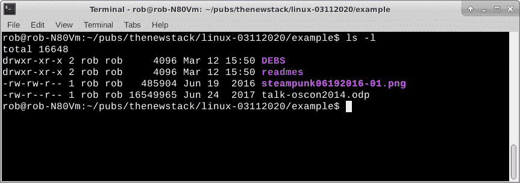
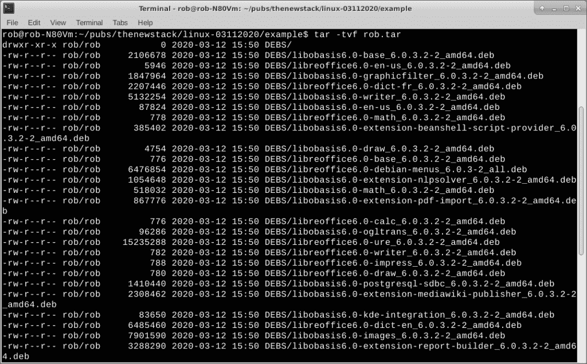

# 了解 tar，Linux 最初的打包格式

> 原文：<https://thenewstack.io/get-to-know-tar-linuxs-original-packaging-format/>

过去，常规文件备份记录在磁带上。将所有需要备份的文件收集到一个文件中，然后一次性将它转储到磁带驱动器中，这样做很有意义。磁带驱动器不喜欢启动和停止，因此一次完成所有操作减少了驱动器磨损和将数据存储到磁带上所需的时间。尽管磁带早已过时，但备份仍然很重要，将归档整合到一个大文件中仍然有效。

Linux/Unix 世界中的主要磁带归档程序是 [tar](https://en.wikipedia.org/wiki/Tar_(computing)) ，它最初代表磁带归档程序。它仍然被广泛用作打包机制，可以将多个文件聚集在一个文件下。创建归档文件后，您可以将文件复制到备份驱动器、USB 拇指驱动器或发送到网络存储设备。

许多 Linux 发行版和应用程序将它们的文件集放在一个文件中，以便于下载。tar 命令有[个百万选项](https://linux.die.net/man/1/tar)。今天我们将学习一些基础知识。

## 创建 tar 文件

假设我正坐在我的 Linux 笔记本上，我想将一组文件传输到网络上的另一台 Linux 机器上。这些文件包括。构建 LibreOffice 应用程序所需的 deb 文件、一个图形文件和一个旧的 conference tech talk 幻灯片堆栈。我可以使用 rcp 来传输它们，但是以这种方式移动单个文件肯定是很乏味的。

首先，所有文件都放在一个名为“examples”的目录中。在我的情况下。deb 文件实际上位于子目录中，就像。自述文件。

在命令行中，向下移动到示例目录。

`robnotebook% cd examples`

我们想要的文件的目录。

请注意各个文件以及 DEBS 和 readmes 目录。tar 可以处理多级目录。

接下来，使用带有 create (-c 选项)的 tar 命令来构建一个. tar 文件。使用“*”获取所有文件和目录，并把它们放在一个结果 tar 文件中，在本例中是 rob.tar。file (-f 选项)告诉 tar 您希望将归档文件命名为什么。tar 将默默地完成它的工作，并在完成后将您返回到命令行。对于大型档案，可能需要一段时间才能恢复，请耐心等待。如果需要的话，你可以用 CTRL-c 退出 tar。

`robnotebook% tar -cf rob.tar *`

您还可以使用列表指定要归档的内容。

`robnotebook% tar -cf rob.tar DEBS readmes steampunk06192016-01.png talk-oscon2014.odp`

除了将文件和目录集合打包成一个文件之外，我们还可以压缩输出。有几种压缩方案可用，比如 gzip (-z 选项)和 bzip2 (-j 选项)。有些压缩量少时速度快，有些压缩量多时速度慢。

`robnotebook% tar -czf rob.tar.gz *`

这个例子用 gzip 压缩算法生成了一个 tar.gz 文件。在这种情况下，使用 gzip 只减少了 3 MB 的输出文件大小，从 221 MB 减少到 221 MB。压缩率因目录数量、文件类型和其他因素而异。

有时，我们可能希望从 tar 存档中排除一个或多个文件。使用“–exclude =”选项。

`robnotebook% tar -cf robex.tar --exclude=*.tar *`

在这种情况下，robex.tar 会排除任何以前创建的 tar 文件。

如果在创建 tar 文件时使用 verbose (-v)选项，您可以通过观察文件名写入 tar 文件的过程来查看命令的进度。其他存档程序给你一个进度表。tar 其实没有那个功能。

## 解压缩文件

我们已经了解了如何创建 tar 文件。创造只是等式的一半。我们还需要知道如何将 tar 文件转换回目录和文件。

最简单的形式是，用下面的 Linux 命令行将文件从 tar 文件提取到原始的文件/目录结构中。

`robnotebook% tar -xvf [tarfile.tar]`

“x”选项代表提取，而“v”选项给出详细的输出。“f”表示文件名。正常的输出只是一个在屏幕上滚动的文件列表。

同样，您可以通过 gzip (-g 选项)和 b2zip (-j 选项)运行 tar 文件进行解压缩。最近，一个简单的 tar -xvf [filename]似乎可以工作了，至少在 Xubuntu 的一个相当新的版本上。您可能仍然需要在 tar 的不同版本(旧版本)上使用-g、-j 和其他解压缩选项。

在提取之前，您可能想看看 tar 文件中有什么。使用-t 选项获取归档文件中所有内容的文件列表。添加-v 选项来获取文件大小、创建日期等等。

带有' t '选项的 tar 输出

## 注意文件大小

任何时候处理归档文件时，都应该注意磁盘的使用情况。它们会变得巨大。例如，如果您计划备份由各种文件和目录组成的 1GB 的数据，您将需要足够的磁盘空间来保存新创建的 tar 文件。底线是，不要填满 100 GB 磁盘，然后期望能够在同一个磁盘上创建一个包罗万象的 tar 文件。如果您有另外三个空的 100 GB 以上的分区或外部驱动器，这可能不是问题。这是我通常将我的驱动器分成多个分区的一个原因。

在我上面的例子中，目录和文件使用的空间量如下。

DEB–207 MB
readmes–24kb
steampunk06192016-01.png–476 Kb
talk-oscon 2014 . ODP–16mb

将它们加起来大约有 223 MB 的磁盘空间。使用没有任何压缩的 tar 创建一个大约相同大小的归档文件。使用压缩，它可能会更小。

无论如何，将您的存档文件清理到外部存储源总是一个好主意，甚至可以清理到多个位置，以防灾难发生。

使用 [df](https://www.geeksforgeeks.org/df-command-in-linux-with-examples/) 和 [du](https://www.geeksforgeeks.org/du-command-linux-examples/) 命令来跟踪您的磁盘空间，并估计您的驱动器上是否有足够的空间来存储大型 tar 文件。您可能希望定期清除“下载”目录中任何旧的不需要的 tar 文件，或者在您将 tar 文件复制到另一台机器上之后。拥有一个 1-2GB 的 tar 文件的未检查列表会很快耗尽一个磁盘。

## 包裹

tar 是一个很棒的程序，可以将一堆文件打包成一个单元，然后复制到另一个位置或机器上。它通常用于传输磁盘映像和应用程序构建。

我们只接触了焦油的表面。稍微在网上逛逛，你就会发现各种各样的技巧和窍门，因为 tar 已经存在很久了。我们将在以后的教程中探索其他一些选项。

在[doc@drtorq.com](mailto:doc@drtorq.com)或 407-718-3274 联系 [Rob "drtorq" Reilly](/author/rob-reilly/) 咨询、演讲约定和委托项目。

图片由 Pixabay 的 siala 提供。

<svg xmlns:xlink="http://www.w3.org/1999/xlink" viewBox="0 0 68 31" version="1.1"><title>Group</title> <desc>Created with Sketch.</desc></svg>