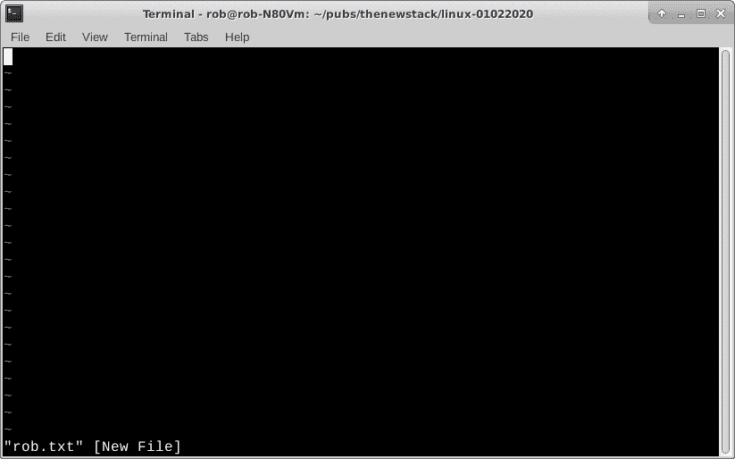
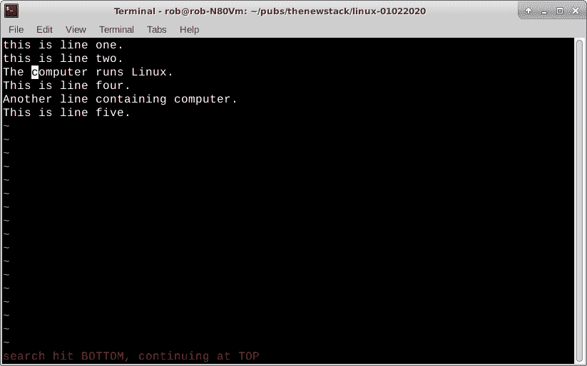

# 了解 vi，一个时代的文本编辑器

> 原文：<https://thenewstack.io/get-to-know-vi-a-text-editor-for-the-ages/>

几乎所有现存的 Unix 或 Linux 系统上都有 **vi** 文本编辑器，通常是默认的。我第一次使用它是在 1981 年，普渡大学的新生。我的第二堂编程课是在一台大型的大学主机上运行 Unix。那是 GUI(图形用户界面)出现之前的日子，一切都是通过命令行完成的，同时还沉浸在令人欣慰的(怪诞？)老派 CRT(阴极射线管)终端的绿色文本辉光。普渡大学正在逐步淘汰穿孔卡片，我曾经和他们一起上过一堂课。我能说的就是给你的牌编号。

正是在那些黑暗的地下室电脑室的深夜，我进入了 Unix 上的古老神秘的第六代的地下世界。令人高兴的是，39 年后的今天，它仍然是我编辑文本的首选武器。其他流行的、现成的 Linux 文本编辑器也存在，比如 [nano](https://www.nano-editor.org/) 或 [emacs](https://www.gnu.org/software/emacs/) ，它们做得很好。不过，依我拙见，并不像第六版那么容易。

在严格基于 GUI 或鼠标的编辑器中长大的用户可能会发现基于命令终端的 **vi** 令人生畏。不要烦恼。我们正处于喧嚣的 21 世纪 20 年代的开端，没有比这更好的尝试新事物的时机了。给 **vi** 一个公平的尝试，我想你会看到一个快速、无戏剧性的文本编辑器的价值，它可以在你所有的 Linux 服务器、笔记本和基于微控制器的机器上工作，甚至包括远程(网络或串行)连接。(注意，大多数发行版使用更新的 **vi** ，称为 [VIM](https://www.vim.org/) )。

过一会儿，vi 也可能成为你的老朋友。

## 伙伴按下 ESC 键

把 **vi** 想象成一个强大的、基于字符或键盘的极简文本编辑器。顺便说一句， **vi** 可以处理数兆字节的文本文件，所以手工编辑基于文本的大型数据集是可能的，没有太多麻烦。逗号分隔值(。csv)、HTML 和 json 文件浮现在脑海里。

在 Linux 终端中，用文件名调用 **vi** 。如果文件已经存在，你可以直接进入文本，并从那里开始编辑。如果文件不存在，它将创建一个新的空文件。下面是一个新的 rob.txt 文件的命令行。

`rob% vi rob.txt`

空白 rob.txt 文件

添加文本很简单，记住 **vi** 的方法是基于字符/键的。键入代表“插入”的“I”字符，并将所需文本添加到文件中。完成后，按一次 ESC 键，告诉 **vi** 您想退出“插入”功能。

escape 键是一个重要的 **vi** 机制，用于结束一个命令序列。默认情况下， **vi** 接受键盘字符/按键组合来执行各种功能，例如插入文本(使用“I”命令)、在文件中移动、替换或删除文本以及切换到命令模式(使用“:”命令)。

> **vi** 的方法是基于字符/键的。键入代表“插入”的“I”字符，并将所需文本添加到文件中。完成后，按一次 ESC 键，告诉 **vi** 您想退出“插入”功能。

这几乎涵盖了在文件的任何地方插入文本。将光标移动到要键入的位置。使用“I”键插入文本，完成后使用 ESC 键。继续下一个你想添加或改变的东西。

如果我们已经有了一些文本，并且想向下移动几行并插入一个字符或一些文本，该怎么办？用同样的方法打开一个现有的 rob.txt 文件。

`rob% vi rob.txt`

现有的 rob.txt 文件

**vi** 使用四个基本导航键在文件中移动。

**h**–将光标向后移动一格
**l**–将光标向前移动一格
**j**–移到下一行
**k**–移到上一行

假设您想在这个 rob.txt 文件的第三行将字母“s”添加到单词“computer”中。使用“j”键向下移动到第三行。现在使用“l”键移动到单词“computer”的末尾。接下来，键入“I”(insert)键插入一个字符，输入字母“s ”,然后按 ESC 键。键入 ESC 键后，我们不再插入文本，可以使用导航键 h、l、j 和 k 自由移动。

请注意，使用 h、l、j 和 k 键移动可以最大限度地减少手指的移动，让您可以用一只手浏览文件。从 70 年代起，我就能触摸打字了，把你的手放在一个地方可以加快速度。

我习惯性地在做完所有的事情后按 ESC 键。事实上，在 WordPress 和 LibreOffice 上编辑文章文件时，我偶尔会发现自己在按 ESC 键。

## 标准方法，不同字符

删除文本字符与插入文本字符的方式相同。移动到您想要删除的字符，然后键入“x”。噗，这个角色会从你的屏幕上消失。您可以重复使用一串 x 来删除一串字符。不要忘记键入 ESC 键来结束删除功能。

要替换字符，请使用“r”键。移到您想要替换的字符，键入“r”，然后键入您的替换字符。按 ESC 键结束替换字符功能。

假设您想在文本文件中搜索一个字符串？

使用“/”键。这个工作方式略有不同。通过按 ESC 键确保你处于编辑模式。输入“/”键后，你将被传送到终端编辑窗口的底部。键入您的搜索字符串。你可以在 rob.txt 文件中使用“computer”。点击 Enter 键，vi 将在文件中找到“计算机”的下一个实例。键入另一个“/”，然后按 Enter 键，它会记住它正在寻找“计算机”，并去寻找下一个实例。 **vi** 当到达文件末尾时，在底部显示提示。再次键入“/”继续从顶部开始搜索。

在我们结束今天的教程之前，最好保存我们的工作。

键入“:”再次传送到终端窗口底部的 **vi** 命令行。在这里，你可以使用一大堆额外的关键字符和组合来真正深入了解 **vi** 的威力。

在我们的例子中，我们只想将我们的工作保存在文件中。键入 ESC，然后键入“:”，然后键入“w”键。如果您正在编辑现有文件，磁盘上的文件将被您当前的编辑所替换。如果它是一个从未保存过的全新空白文件，您也可以给它一个文件名。我可能会创建一个新文件，键入“:”，后跟“w”，然后是一个空格，然后是“rob.txt”。当编辑一个文件，尤其是一个大文件时，我经常使用“w”。

同样，完全退出 **vi** 就像输入“:”键，然后输入“q”键一样简单。如果您还没有保存您的工作，您可能会得到一个“文件未保存”的提示。我通常用“wq”组合来结束我的编辑会话。如果你不想保存任何东西并退出，使用“q！”组合。当然，如果您开始了一个空白文件，并且由于某种原因改变了主意，使用“q”而不做任何编辑来结束您的 **vi** 会话。

## 下一步是什么？

这就是了。在 Linux 机器上使用 vi 的速成班。我宁愿打开一个终端，键入 **vi** 和一个文件名，然后直接进入编辑，而不是去桌面菜单，找到一个基于 GUI/鼠标的编辑器，然后那样做。

当然，我经常用 LibreOffice 写故事，偶尔用 bluefish 编辑 HTML 文件。我的在线帖子现在也完全在 WordPress 上发表了。我们都必须有点开明和灵活。

为了在我所有基于 Linux 的机器上快速编辑文本，vi 是我的首选应用。对我有用的旧程序可能就是对你有用的新程序。投身其中，成为 Unix/Linux 传统的一部分。

寻找未来的 Linux 教程，深入研究如何使用 **vi** 文本编辑器。

*在[doc@drtorq.com](mailto:doc@drtorq.com)或 407-718-3274 联系 [Rob "drtorq" Reilly](/author/rob-reilly/) 咨询、演讲约定和委托项目。*

<svg xmlns:xlink="http://www.w3.org/1999/xlink" viewBox="0 0 68 31" version="1.1"><title>Group</title> <desc>Created with Sketch.</desc></svg>