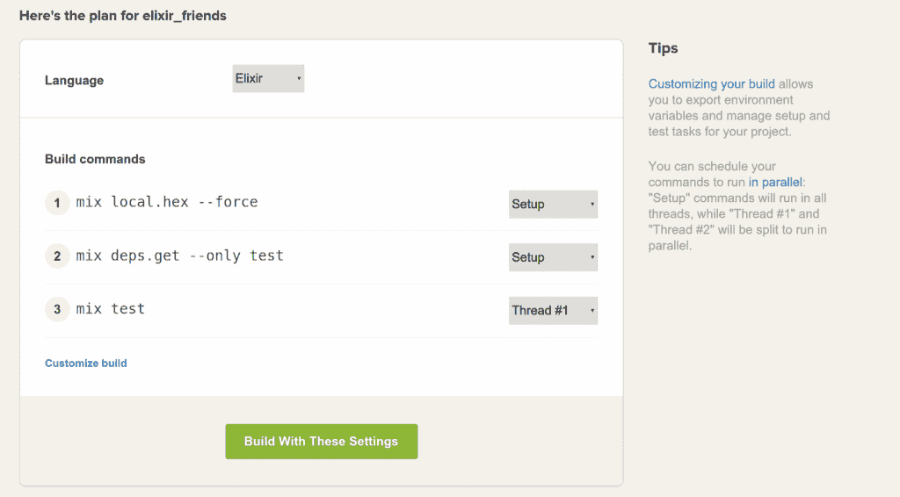
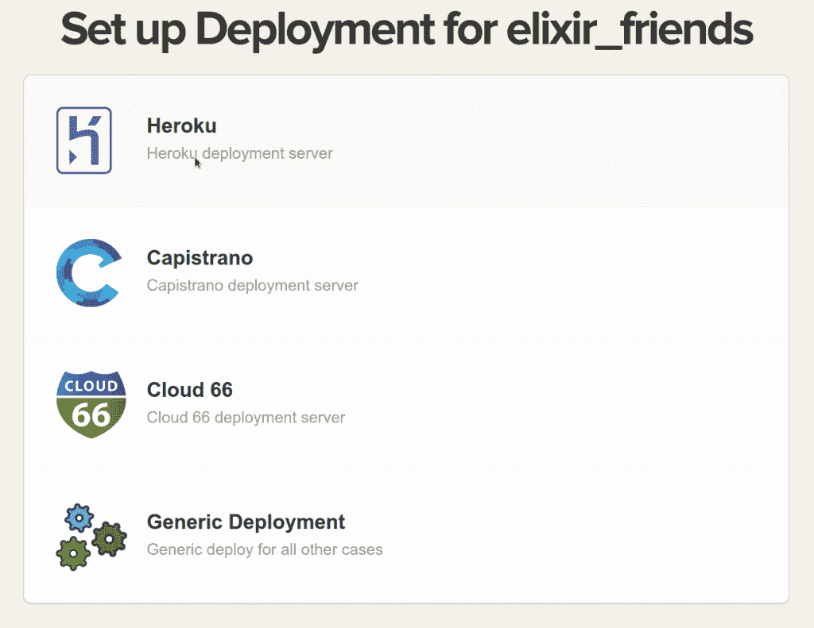
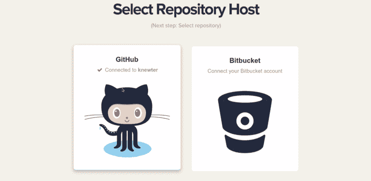

# 信号量测试 Docker 上的持续集成

> 原文：<https://thenewstack.io/getting-continuous-integration-semaphore/>

持续集成(CI)和持续开发(CD)为开发人员提供了在短时间内将应用程序投入生产的能力。随着团队分散在全球各地，CI/CD 成为一种必需，因为代码变更提交可以在一天中的任何时间添加到存储库中——通常是一天多次。

Semaphore 提供了一个 CI 平台，通过不仅提供 CI 服务，还提供 CD，使开发人员能够部署到生产环境中。当结合在一起时，这两个特性使团队能够快速测试、部署和投入生产。

## 码头工人之前

Semaphore 是基于 Docker 的前身 [LXC 容器](https://linuxcontainers.org/)的托管 CI 和 CD 服务。Semaphore 选择 LXC 是因为它能够提供高性能，而不是虚拟化。虚拟化中使用的 CPU 性能通常不是问题，因为 KVM 可以直接访问它。然而，当运行集成和可接受的测试时，在数据库运行时会出现瓶颈。Semaphore 发现，与虚拟机相比，使用 LXC 容器时，LXC 和虚拟化之间的性能差异在效率上提高了 4 倍。

[达科·法比扬](https://thenewstack.simplecast.com/episodes/darko-fabijan-semaphoreci-at-dockerconeu)

随着 Docker 进入技术生态圈，Semaphore 团队发现有必要支持 Docker，以便用户可以在 Semaphore 上构建和运行 Docker，同时使用 [KVM](http://www.linux-kvm.org/page/Main_Page) 作为其虚拟化层。

图为:信号量构建计划评审

Semaphore 最初是一家 Rails 咨询公司，后来随着其 LXC 产品进入了容器生态圈。“当我们安装 Jenkins，然后需要扩展时，这是与 GitHub 或 Heroku 不同的体验。Semaphore 的联合创始人兼首席技术官 Darko Fabijan 表示:“我们希望打造一种像这些平台一样容易为 CI 所用的服务。在 CI 和 CD 中设置和部署生产必须是一个简单的过程，因为在整个开发周期或 sprint 中将多个应用或微服务投入生产时，时间是至关重要的。

## 飞快地

无论是运行单元测试还是集成测试，公司都在继续扩大他们每天运行的测试的规模。通过用户反馈，Semaphore 发现它的客户想要快速的反馈循环来查看他们的代码是否通过了测试，以便部署到生产中。在 CI 和 CD 中，等待测试编译几分钟已经成为一个标准，而不是一个例外。

Semaphore 在 CI/CD 方面有一些竞争。TravisCI 和 [Buildbot](http://buildbot.net/) 都提供 CI 框架，这些框架提供广泛的 CI 和 CD 工具，如发布管理、测试和集成。TravisCI 是最大的开源 CI 测试产品之一，目前在其平台上有超过 246，506 个项目。这些解决方案中的每一个都为用户提供了管理和测试其部署的能力，无论他们的项目处于开发的哪个阶段。

图为:在信号量中选择部署类型

这可以在 GitHub 和 GitLab 上看到，因为贡献给存储库的用户经常会在他们选择的 CI 平台上看到标记为通过或失败的测试。Semaphore 在构建过程中提供实时日志，详细记录任何冲突和测试运行的结果。为了获得更短的反馈循环，Semaphore 将这个工作负载分散在服务器上。

“测试大约 45 分钟，在 32 台机器上进行。这使我们能够在 3-4 分钟内获得结果，这对我们的开发人员来说是一个巨大的优势，”Fabijan 说。对于 CD 管道，一天部署几十次是很常见的。在集中的控制面板中单击部署成为这一过程的关键部分，节省了可能运行多个软件来推动部署的时间。

图为:Semaphore 用户可以从 GitHub 或 Atlassian 的 Bitbucket 中选择来托管他们的存储库。

Semaphore 目前使用 Docker 来运行其服务，但尚未完全过渡到微服务架构。目前处于测试阶段，用户可以注册并请求 Docker 特性，因为在他们的开发工作流程中需要它们。用户可以部署 [Docker compose](https://docs.docker.com/compose/) 并在信号量基础设施中生成许多容器，将它们推送到 Docker hub，然后将所做的更改部署到产品中。

如今，大规模管理和部署容器有许多解决方案。Docker compose 等工作流工具的可用性和简单性允许开发人员从线框或项目大纲快速将项目投入生产。在过去，保持开发和生产环境相同是一个巨大的挑战；随着容器技术的进步，Docker 和 Semaphore 等工具致力于改进这一点。

Docker 是新堆栈的赞助商。

新的 Stack 主编 Alex Williams 为这个故事做出了贡献。

通过 Pixabay 的特征图像。

<svg xmlns:xlink="http://www.w3.org/1999/xlink" viewBox="0 0 68 31" version="1.1"><title>Group</title> <desc>Created with Sketch.</desc></svg>