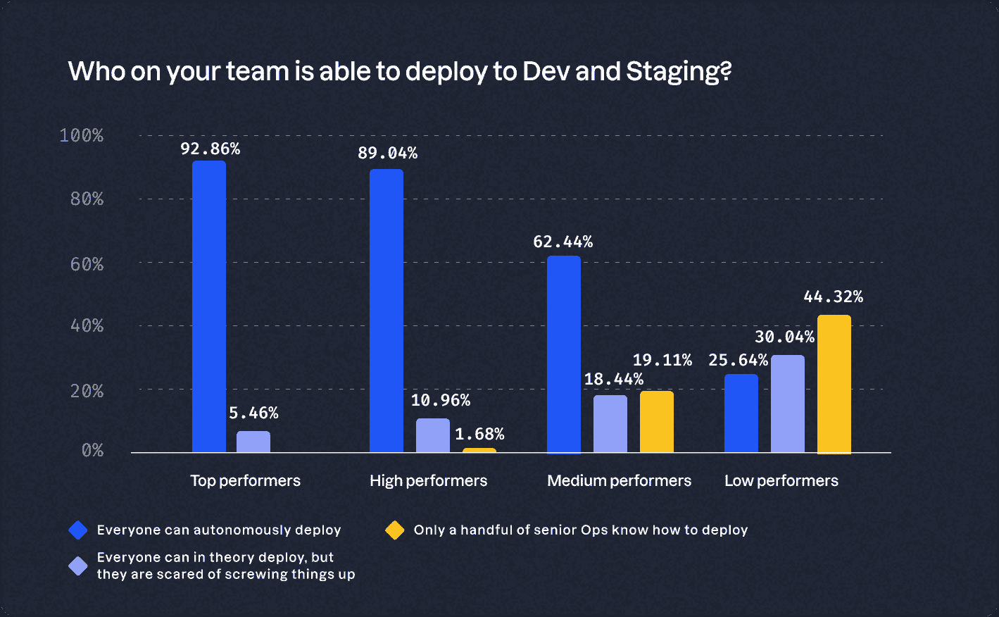

# 获得开发人员自助服务权利

> 原文：<https://thenewstack.io/getting-developer-self-service-right/>

改善开发者体验(DevEx)是 DevOps 世界的一个热门话题。支持开发人员自助服务经常被认为是提高 DevEx 和开发人员工作效率的一种方式。如果处理得当，它有助于缓解开发人员和运营人员之间的紧张关系，因为它能够:

*   运营部门优先考虑策略而非票证。
*   增强的安全性和合规性。
*   从提交到部署的时间更短。
*   不依赖运营的自主部署。

换句话说，开发人员自助服务是实现真正“您构建，您运行”开发运维的关键。不幸的是，对于真正的开发人员自助服务实际上是什么样子以及组织如何才能最好地实现它，仍然有很多误解。

在 Humanitec 的" [2023 DevOps 基准研究](https://humanitec.com/whitepapers/devops-benchmarking-study-2023?utm_source=twitter&utm_medium=organic_social&utm_campaign=devops_report23)"中，我们开始了解顶尖的工程组织如何支持开发人员[自助服务](https://thenewstack.io/what-we-learned-from-enabling-developer-self-service/)。我们与来自不同行业的 1000 多个不同规模的团队讨论了他们的 DevOps 设置。然后，我们根据团队对既定最佳实践的坚持程度以及他们在 [DORA 指标](https://thenewstack.io/elite-vs-low/)(部署频率、变更交付时间、变更失败率和平均恢复时间)上的表现，给团队打分。

我们发现，表现优异的团队支持高度的开发人员自助服务。他们不依赖运营来部署新功能、调配基础架构或分配资源。通常，这是通过构建内部开发人员平台(IDP)来实现的。IDP 使开发人员更容易构建和交付软件，而不会抽象出底层核心服务的有用和差异化功能。我们发现，优先考虑支持自助服务和减少[认知负荷](https://thenewstack.io/devs-and-ops-can-this-marriage-be-saved/)的组织在提高 DevEx 方面最为成功。

## 优秀的组织支持高度的开发人员自助服务

理论上，高度的开发人员自助服务消除了对关键人员的依赖，最大限度地减少了等待时间，并消除了经常因票证操作和瓶颈而产生的挫折感。

但这与数据相符吗？我们的研究表明是的。无论是创建新环境、部署新功能还是配置基础架构，表现出色的人员始终支持高度的开发人员自助服务。

### **支持更大的开发者自主权**

让我们以创建新的特性或预览环境为例。在 83.6%的顶级设置中，开发人员可以动态创建预览环境。相比之下，不到一半(42.7%)的中等绩效团队拥有相同程度的自主权。近 40%的人需要工程经理的批准，19.5%的人依靠运营部为他们提供批准。表现不佳的团队表现更差，只有 24.8%的团队能够独立创造新环境。

这种趋势也反映在开发和试运行的部署中。接近 90%的优秀团队能够自信地独立部署特性。另一方面，40%的中等表现者害怕把事情搞砸，或者依赖运营部为他们部署功能(19.1%)。只有 25.6%的低绩效团队有能力和信心部署特性。近四分之三的低绩效员工不敢这样做，或者不得不等待 Ops。

### **自主部署到开发和试运行**

关键人物对运营的依赖并不等同于环境创造。对于基础架构供应、分配资源和查找信息来说，这是一个巨大的问题。

### **基础设施供应方法**

我们发现，表现出色的团队使用两种主要的基础架构配置解决方案。首选途径(56.2%)是使用基础设施即代码(IaC)解决方案，如 Terraform。替代方案(32.9%的人倾向于)是将基础设施供应纳入部署流程。

一些组织允许开发人员通过云控制台自行调配基础架构。虽然这是实现某种程度的开发人员自助服务的一种方式，但它也有明显的缺点。云控制台、门户和“点击操作”方法不太标准化、合规、风险高且容易出错。

无法在多个环境中重用相同的配置会减慢团队在点击操作设置中的工作速度。缺少配置版本控制阻碍了审计和回滚。此外，依赖关键人物的风险极高。通常，“上帝模式”管理员是唯一能够理解和复制设置的团队成员。

### **资源分配和应用程序引导功能**

当涉及到资源分配时，低绩效的团队仍然压倒性地依赖于 Ops。每项服务都需要大量的资源——数据库、DNS、存储或类似的东西——才能运行。通常，团队希望将相同的资源连接到所有环境中的不同服务，反之亦然。例如，您可能不希望在测试环境中使用生产中使用的真实客户数据库来运行您的电子商务应用程序。

谁为应用程序分配资源以及如何分配，在不同的受访者中差异很大。接近 85%的优秀员工让开发人员在黄金路径内自助获取资源。黄金路径的存在表明这些组织也有一个 IDP，或类似的东西，旨在使开发人员能够自助服务资源，而不用担心或冒把事情搞砸的风险。这最小化了认知负荷，并有助于一个伟大的发展。

### **寻找信息**

管理应用程序和分配的资源之间的所有依赖关系通常是一项挑战，尤其是在具有复杂设置的大型组织中。当工程师需要更多信息来导航或使用他们的设置时，了解他们去哪里会很有帮助。

表现最好的团队报告使用了版本控制系统(VCS) (76.7%)或服务门户(17.81%)。类似地，高绩效团队依赖于 VCS (65.52%)和服务门户(21.5%)。只有表现不佳的团队依赖他们的运营或基础设施团队(35.4%)，或者因为硬编码连接而不得不在应用程序内部挖掘(22.7%)。

我们询问的开发人员自助服务的最后一个指标是团队启动一个新应用程序(和所有依赖项)并部署它需要多长时间。你可能已经从之前的结果中猜到了，表现最好的团队往往更快:53.4%的团队可以在不到两个小时的时间内完成，39.8%的团队可以在一天内完成。相比之下，36.9%的低绩效团队需要长达一周的时间，31.1%的团队甚至需要更长时间。

## 真正的开发人员自助服务不只是向左移动

真正的开发人员自助服务需要的不仅仅是将开发运维任务转移给开发人员。如果执行得不好，左移会增加开发人员的认知负荷，降低整体生产力。

为了改善开发人员体验，支持开发人员自助服务和减少认知负荷必须齐头并进。黄金路径是实现自助服务的关键，而不会有个别开发人员不知所措或把事情搞砸的风险。成功的 IDP 通过铺平黄金道路，帮助工程组织在开发人员自由和支持之间取得正确的平衡。

麦肯锡表示，“平台通过提供一套精心策划的工具和服务来改善用户体验，旨在为用户提供一流的技术能力和高度优化的流程，而最终用户不必为自己创建操作平台。”

黄金路径使顶级团队能够自助服务数据库、DNS 和存储等资源，而不会有破坏整个设置的风险。他们维护开发人员对底层技术的访问，保留他们快速移动的自由，并在必要时独立于运营。默认情况下，黄金路径还提供了正确的抽象来最小化复杂性和认知负荷。

简而言之，IDP 和他们的黄金路径实现了正确的开发人员自助服务，允许组织实施关注点分离，而不会将开发人员和运营人员推回各自的孤岛。这使得 IDPs 成为支持开发人员自助服务、改善开发人员体验和推动组织进入更高发展阶段的关键。

*想进一步了解如何改进贵组织的 DevOps 设置吗？* [*下载 Humanitec 的《2023 DevOps 标杆研究*](https://humanitec.com/whitepapers/devops-benchmarking-study-2023?utm_source=twitter&utm_medium=organic_social&utm_campaign=devops_report23) *》了解更多专家见解。*

<svg xmlns:xlink="http://www.w3.org/1999/xlink" viewBox="0 0 68 31" version="1.1"><title>Group</title> <desc>Created with Sketch.</desc></svg>