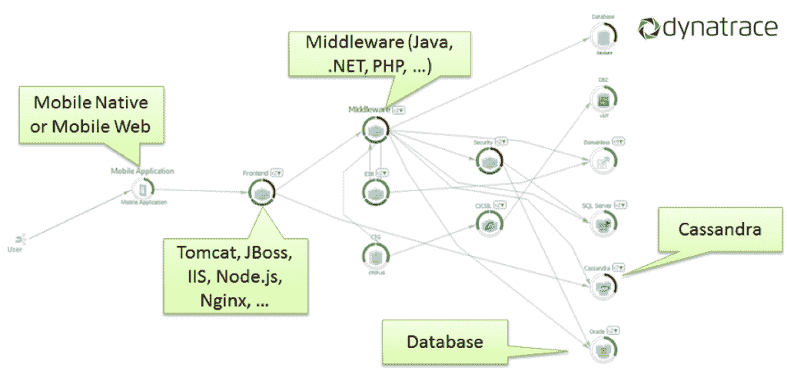
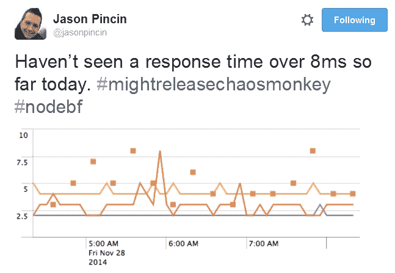
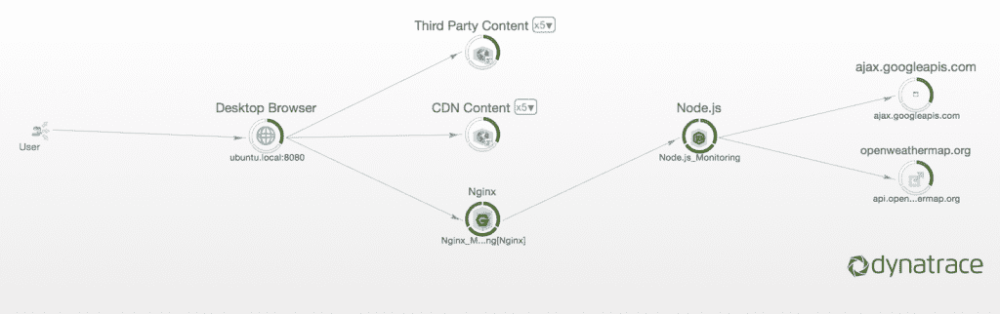

# 使用 Dynatrace 处理 Node.js 部署

> 原文：<https://thenewstack.io/getting-handle-node-js-deployments-dynatrace/>

假设场景:你公司的市场部刚刚设计了一个全新的网站。他们用 JavaScript Angular 框架构建了它，因此附带了从各种数据源中提取数据的疯狂的个性化逻辑。该公司的高管对该网站很满意，所以现在该由系统管理员来让它快速工作，并确保它以最小的延迟运行。

这可能是一个挑战。

使用开源的 Node.js，一个建立在谷歌 V8 JavaScript 引擎上的服务器端 JavaScript 运行时，可能会有所缓解。使用 Node 可以减少将框架连接到后端数据库的工作量。这比支持传统的 Java EE 堆栈来完成任务要简单得多。

JavaScript 的危险在于，如果代码的某一部分出现中断——你可以打赌它会——它很容易就会变成一整页空白。然后电话就开始了。当页面崩溃时，或者即使它真的变得很慢，管理员怎么知道——在这个庞大的网络技术堆栈中——根本问题隐藏在哪里？

下周，在奥兰多举行的 Dynatrace 的[performance](http://www.dynatrace.com/en/perform.html)用户会议上，Dynatrace 技术策略师 Daniel Khan 将讨论如何使用该公司的应用监控工具来检测 Node.js 部署，以便在出现问题时，管理员能够准确地知道该去哪里查找。

Dynatrace 软件的目标是为管理员和开发人员提供一个端到端的视图，了解多层应用程序的运行情况。该信息在微服务类型的架构中尤其有用，因为它有许多活动部件。如果 web 应用程序运行缓慢，Dynatrace 软件可以帮助确定瓶颈可能在哪里。

“我们能够监控整个堆栈，从浏览器到 Node.js，再到后端，”Khan 说。自从今年早些时候发布 dyna trace 6.2以来，该公司一直提供 Node.js 支持。

## 为什么是节点

Ryan Dahl [创建了用 C 语言编写的](https://www.youtube.com/watch?v=ztspvPYybIY) Node.js，以解决 web 应用程序中的 I/O 阻塞问题，并于 2009 年发布了该软件。当网页从数据库或磁盘请求某些东西时，会发生 I/O 阻塞，导致所有后续操作暂停，至少是暂时暂停，直到响应到达。这在像 Ruby on Rails 这样的 web 框架中尤为严重。

Dahl 第一次发布 Node 时，已经有了绕过阻塞 I/O 的方法。但是在 web 应用程序中构建并发性往往需要在多个线程之间进行上下文切换(这会消耗时间)，并且需要每个线程获得自己的内存补丁(这会消耗内存)。其他方法涉及程序特定的库，这些库晦涩难懂，难以学习。

Node.js 使用一个事件循环线程来处理多个杂务。Node 可以为每个函数分配一个回调，而不是等待响应，因此事件循环可以继续到下一个任务，并在函数响应到达时返回到函数响应。

使用事件循环是明智的，Dahl 选择 JavaScript 作为开发人员的接口也是如此。作为一种浏览器语言，JavaScript 非常适合构建事件循环。

更重要的是，到 2009 年，很多程序员都知道了 JavaScript。通过构建作为服务器端技术运行的 Node，它立即为 JavaScript 应用程序开发人员提供了一种他们熟悉的语言。

沃尔玛的杰森·平辛在 2014 年黑色星期五庆祝 Node.js 提供的 5 亿页面浏览量。

Node.js 迅速流行起来，而且不仅仅是在初创企业中。这项技术在许多企业商店和网络规模的公司中找到了家。在 PayPal、沃尔玛、纽约时报、Groupon 和网飞等公司的防火墙后面，你会发现 Node 在运行。

“Node 提供了一个非常简单的 API，以异步的方式从不同的数据源提取数据，”汗说。

因此，开发人员不必担心许多特定后端技术的实现细节，从而加快开发时间并减少错误。也不像在 Java EE 中那样需要处理大量的框架开销。

## 测量两次，切割一次

都是好事。但是，当出现问题时，如何使用 Node 以及 Node 涉及的技术呢？

这就是【Dynatrace 出现的地方。组织在服务器上运行 Dynatrace 软件，该软件从安装在被检测组件旁边或内部的各种代理收集指标。

检测节点只需要在节点部署本身上安装几个模块，以及在运行节点的服务器上安装一个代理。代理捕获对节点的所有调用，节点发出的所有调用，以及节点本身处理这些调用所花费的时间。

将这些数据与来自监视浏览器、数据库、应用服务器和工作流中其他组件的其他代理的类似信息相结合，可以让管理员全面了解事务流程。

基于 Node.js 的事务流

该软件提供了一个拓扑视图，显示了单个事务流中所有组件的连接方式。这个图表还详细说明了两个组件完成一个事务平均需要多长时间，以及每个组件每分钟处理多少个事务。记录失败的事务数量，以及每个组件完成其在整个流程中的部分所用的时间百分比。

所有这些信息也被汇总起来，以提供一组关于应用程序整体性能的指标。

专题图片:Scott Draves 的[羊涡](https://www.flickr.com/photos/torley/2343919702/in/photolist-4z8cEE-sunKtN-v47SyC-xkjcv3-e6BcWz-5s3TKR-9jGJe-wws6kL-38Uo-nV9V5g-5KpbHF-aNMGtD-7W8BSd-hyBbLn-5FicTv-8BUK7n-9Na5jA-nenVX4-9ENPmf-p4C4Dh-qBFjxf-r1eTrN-7Nkat7-qZpHgD-rC5Rzr-rGMg3f-qN1BCn-9Wmyy6-bokZpe-unbenJ-hyzM7d-pFHiRH-2AUjQV-nAMRfL-8XMGY1-hyzUdg-dmJpYC-hyB98N-6gUxGU-azZKQ5-8iSzqB-hyBJm6-qE9DMX-7E1FNy-e1mZUr-sM4Rj2-qJC3An-idJuuN-qJfr4H-unHaHw)和 Somatika 的 3D 设计电动羊。根据 [CC BY-SA 2.0](https://creativecommons.org/licenses/by-sa/2.0/) 授权。

<svg xmlns:xlink="http://www.w3.org/1999/xlink" viewBox="0 0 68 31" version="1.1"><title>Group</title> <desc>Created with Sketch.</desc></svg>