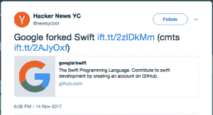
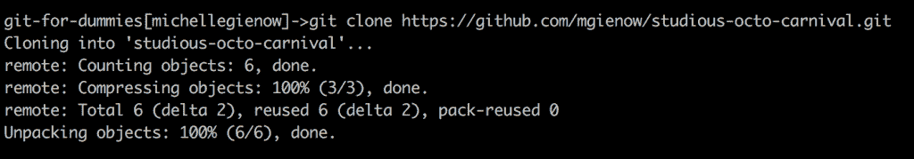

# 合法使用 git(和 GitHub):克隆和分叉

> 原文：<https://thenewstack.io/getting-legit-with-git-and-github-cloning-and-forking/>

欢迎回来，饭桶！在你学习合法使用 git 的过程中，我们已经走到了一起:建立你的第一个本地 Git 库和[建立一个 GitHub 账户](https://thenewstack.io/git-with-the-program-getting-started-with-github/)来保存你所有的项目代码。[准备、提交和推动改变](https://thenewstack.io/git-with-the-program-getting-started-with-github/)，同时练习制作有用的和[有效的提交消息的艺术。](https://thenewstack.io/getting-legit-with-git-and-github-the-art-of-the-commit-message/)

今天的课程是关于派生和克隆存储库，它建立在使用 Git 的分支特性的[之上。如果您需要快速复习，请快速浏览一下，因为创建分支并将它们合并回 master 的能力是(1)一项基本技能，并且(2)在有效地进行项目版本控制的下一步工作中，无论是单独工作还是与团队合作，都是绝对必要的。](https://thenewstack.io/dont-mess-with-the-master-working-with-branches-in-git-and-github/)

## 从你的复制品中辨别你的叉子

分叉和克隆在许多方面是极其相似的行为。两者都有效地复制了存储库的整个源代码。是什么让它们与众不同，以及是什么影响了你做出是放弃回购还是克隆回购的选择，是这一举动背后的意图。

派生一个项目就是制作一个项目存储库的副本，对其进行重命名，并将该副本作为一个全新项目的基础。分叉的项目很少被提交或合并回原始(主)存储库。您很少(如果有的话)将一个项目再次贡献给父项目。这相当于罗伯特·弗罗斯特的那首诗[:](https://www.poetryfoundation.org/poems/44272/the-road-not-taken)代码库中出现了两个分支，我……我选择了人迹较少的那一个……这让一切都变得不同了(帮助我快速启动了自己的新项目)。

一个项目被分叉有各种各样的原因。分叉的基础是原始项目得到完整的复制，作为一个新的独立实体开始生命，它可能会朝着自己的方向前进——并围绕它开发一个新的独立的开源贡献者社区。有时，这种情况会发生，因为一个项目已经搁置了很长时间，并且有兴趣重新启动它:叉那只小狗，开始工作。或者，一个由企业组织培育/资助的开源项目在公司被收购后发现自己的前途未卜:担心的是新的母公司可能会关闭、更改或以其他方式篡改新收购的开源代码。

分叉项目的最坏情况发生在社区分裂发生时，两个(或更多)派别决定从原始项目中分裂出来，并朝着不同的方向发展，就像 [node.js 分叉成 io.js](http://anandmanisankar.com/posts/nodejs-iojs-why-the-fork/) 的情况一样。(幸运的是，几年后，有争议的问题得到了解决，io.js 合并回了 node . js——这就是分布式版本控制的美妙之处。

需要记住的是，分叉主要是一种社会行为，是出于文化原因而非技术原因。

另一方面，克隆一个项目更像是一个技术动作。其目的是创建一个项目的工作副本，以便进行更改，然后将这些更改直接提交到项目中。克隆是开源贡献的支柱。为了对一个使用 Git 作为版本控制系统的项目做出贡献——无论是在 GitHub 上还是在其他选项上，比如[bit bucket](https://bitbucket.org/)——你首先要做一个克隆。这将创建项目代码库的精确副本，您可以在其中进行任何想要的更改或添加。

为了将您的更改提交回原始项目，您必须创建一个[拉请求](https://help.github.com/articles/about-pull-requests/)(这将是我们下一个教程的主题)。除非原始回购的维护者碰巧授予您直接访问权——本质上，让您成为项目所有者或管理员——在这种情况下，您可以进行直接的、无人监管的更改……这可能会造成混乱。这就是为什么整个克隆/拉取请求工作流存在的原因(◕‿◕).

## 决定，决定

关于 Git 克隆和 fork 的事情经常会有混淆，这是完全合法的。早在 2008 年，当 GitHub 推出时，Octocat 幕后的力量指定单词“fork”代表 Git 克隆命令中执行的动作。因此，派生 GitHub 库就是简单地创建该项目的一个克隆:一个你可以在其上施展你自己的特殊魔法的副本。

完全可以分叉原始意义上的任何项目，也就是创建一个全新的独立副本项目，并围绕它建立一个离散的社区，而不是发送 pull 请求合并回原始项目。如果你愿意的话，你甚至可以派生出[Git 代码库本身](https://github.com/git/git)。

然而，几乎每个人都是为了创建个人工作副本而分叉任何 GitHub repo。没错:他们在应该克隆的时候分叉了。即使是应该更清楚的人也会感到困惑。就在六个月前，当[谷歌分叉出 Swift 编程语言](https://news.ycombinator.com/item?id=15700902)时，出现了短暂的恐慌，这暗示着谷歌出于自己的可能是邪恶的目的而取消了 Swift 的保留。



所以没错，确实发生了分叉。但这并不是一个完全分叉的情况，因为实际上，谷歌的意图是纯粹的:克隆项目，以便为它做出贡献，就像任何正直的开源公民一样。

### 分叉

所以现在你已经理解了分叉和克隆的不同之处，很明显你几乎总是要克隆。

不过，为了以防万一，下面是如何在 GitHub 上派生一个存储库。尽管意义可能很大，但分叉过程本身实际上非常简单。

1.  登录您的 GitHub 帐户
2.  导航到您有兴趣参与的项目的存储库。(让我们使用我们的示例项目)。
3.  进入 repo 后，在 UI 的右上角寻找“Fork”按钮。点击此按钮开始自动分叉过程。
4.  一句俏皮的“分叉进行中！”动画打开:
5.  不一会儿，完成的 fork 就会出现在*您自己的存储库中*——所以请导航回您的 GitHub 主页并在那里找到它。
6.  至此，分叉全部完成。从这里开始，您可以将它克隆到您的本地工作环境中，所以请继续阅读克隆教程以了解这些细节。

## 克隆主页

当初级程序员/开发人员职业生涯中的重要一天到来，并且您准备做出您的第一个开源项目贡献时，您的第一步是为您想要贡献的项目克隆 GitHub 库。这将在您自己的 GitHub 帐户中创建该存储库的副本，使您能够开始处理代码。

克隆作为一种保护措施，是 Git 和 GitHub 工作流的一部分。公共存储库的权限允许任何人查看代码——但不能直接提交到存储库中，也不能从主存储库创建分支。这允许项目所有者和维护者控制所有的变更，并防止未授权的变更出现在他们的代码库中。(同样，更改通过拉请求合并回主数据库；这一点我们将在下一次讨论)。

克隆一个项目，然后，创建一个拷贝——一个你有权限进行分支、提交等的拷贝。这是项目的工作副本，它不再是项目本身。您可以在这里对自己的内容进行更改，安全地知道这些更改不会波及到主存储库。

1.  登录您的 GitHub 帐户。
2.  导航到您有兴趣参与的项目存储库。(让我们使用 https://github . com/mgie now/好学-octo-carnival 上的示例项目)。
3.  将代码克隆到您的本地工作环境中(我的伙计们，这是您在计算机上选择的文本编辑器)。GitHub UI 使这变得非常简单:点击漂亮的绿色“克隆或下载”按钮将打开一个包含这个特定项目的 URL 的框。URL 右侧的一个按钮(看起来像剪贴板)允许您将其复制到剪贴板中。点击以复制链接。
4.  打开终端，导航到您想要在电脑上保存存储库的位置。桌面，一个特殊的“项目”文件夹，什么都行。
5.  现在在您的项目中克隆，这是通过键入“git clone”命令，然后粘贴链接来完成的。$git 克隆 https://github.com/mgienow/studious-octo-carnival.git
6.  该命令完成后，您将拥有一个包含克隆存储库的新文件夹。[](https://storage.googleapis.com/cdn.thenewstack.io/media/2018/05/32e0c664-screen-shot-2018-05-30-at-5.19.42-pm.png)
7.  导航到那个文件夹:这是许多初学者错过的一步，所以确保在克隆后立即“cd yourFolderNameHere”。
8.  最后一步是设置一个指向主存储库的遥控器。Remotes 只是表示到其他版本的存储库的路径——如果这些版本在云中，有时这些是 URL。由于我们是从 GitHub 存储库中克隆的，Git 自动为我们设置了一个默认的 remote，称为 origin。有了这个指向 origin 的指针，我们就可以从托管该项目的 GitHub 存储库中推送和提取代码。我们可以使用“git remote”命令列出我们机器上当前配置的遥控器: [](https://storage.googleapis.com/cdn.thenewstack.io/media/2018/05/6e698929-screen-shot-2018-05-30-at-5.28.41-pm.png)

## 古老的推拉

从您自己的克隆项目的工作版本中推和拉是非常有用的，事实上您将如何最经常地处理代码。

然而，每次你开始编写代码时，你都希望从最新的版本开始。自从您第一次将 repo 从 GitHub 克隆到您的本地之后，事情可能已经被更新和改变了。重要的是要记住，在两个可能的层面上可能发生了变化:

*   如果您从另一台计算机远程处理这个项目，通过将它们推送到 GH 来存储其间的更改，您将从您自己的源(GitHub 帐户中的存储库，它是原始项目的副本)中提取。
*   如果你和其他共同贡献者一起工作，他们可能会在此期间做出改变，情况也是如此。

在这种情况下，我们做了一个简单的 **$git pull** ，它到达当前的上游遥控器，将它与您在本地获得的内容进行匹配，或者更新您的本地内容以匹配 GitHub 上的新版本，或者通过返回一个“已经是最新的”消息让您知道您可以开始了。

[](https://storage.googleapis.com/cdn.thenewstack.io/media/2018/05/c20a5c75-screen-shot-2018-05-30-at-5.34.50-pm.png)

但是，如果您需要引用主项目——您第一次克隆的那个项目，进入您自己的 GitHub 帐户，然后进入您自己的本地环境——我们需要设置第二个远程项目，它指向那个原始存储库，也就是我们第一次克隆的那个存储库。回想一下，我们在那里没有提交权限——我们不能将变更推送到原始存储库。但是我们可以下载——获取——最新版本。

要创建一个新的遥控器，我们使用 **$git remote add** 命令，传入新遥控器的名称和我们想要添加的遥控器的 URL 作为参数。我们可以在浏览器中返回 GitHub。从我们的主存储库中，我们可以使用便利链接将我们带回主存储库，也就是我们最初克隆它的地方。

一旦回到好学 _octo_carnival 主项目，我们可以使用与之前相同的步骤，通过绿色 GitHub“克隆或下载”按钮访问克隆 URL，并将其复制到我们的剪贴板。

回到终端，添加指向第一个源存储库的遥控器，我们输入:

```
$git remote add upstream  <a  href="https://github.com/mgienow/studious_octo_carnival">https://github.com/mgienow/studious_octo_carnival</a>.

```

“Upstream”和“origin”一样，是 Git 中的命名约定。实际上，我们可以将遥控器命名为“Fred”或其他任何我们想要的名称，但是 upstream 既简单又能确保其他任何查看我们代码的人理解这里到底发生了什么。再次运行“git remote”命令，我们可以验证我们现在有两个远程，origin 和 upstream。

## 代码发生

现在是您处理项目的时候了，当然要尽早保存您的更改，通常是在一系列提交中，当然，要有精心编写的提交消息，解释为什么要做每个更改。

一旦你完成了编写/调试/修改任何需要的代码，并提交了你的最后一次提交，就该把所有东西推回 GitHub 了。

如果您正在推进到您自己的项目存储库，您已经得到了这个——到目前为止，我们已经做了很多次了！

然而，如果您希望将这些代码提交回原始(主)存储库，并将您的更改合并到开源项目中……这将需要做更多的工作。

准备好提出你的第一个拉取请求。下次继续关注 git 和 GitHub！

<svg xmlns:xlink="http://www.w3.org/1999/xlink" viewBox="0 0 68 31" version="1.1"><title>Group</title> <desc>Created with Sketch.</desc></svg>