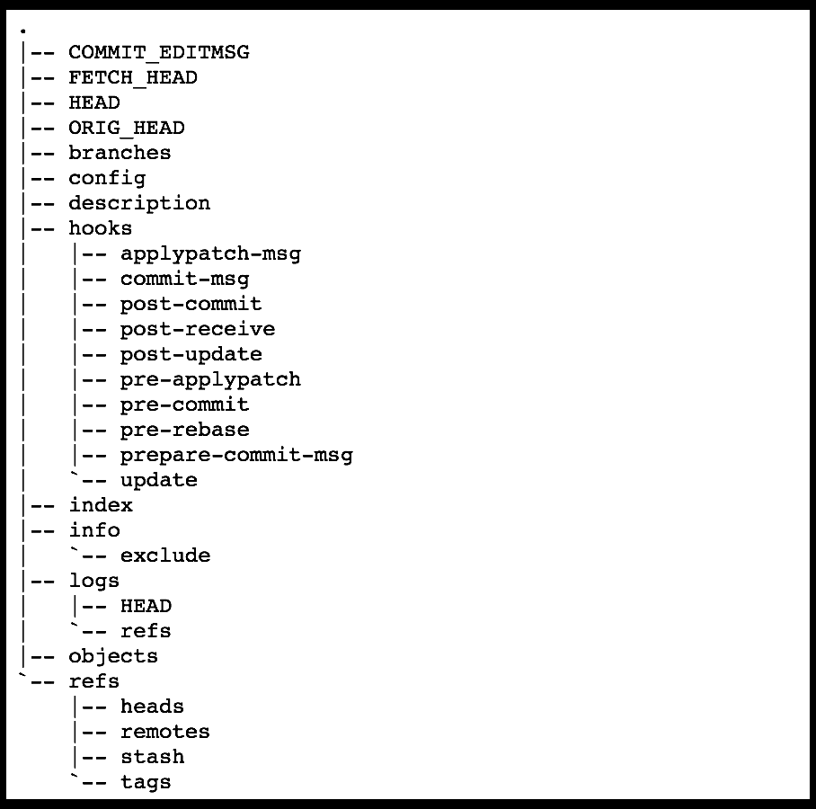
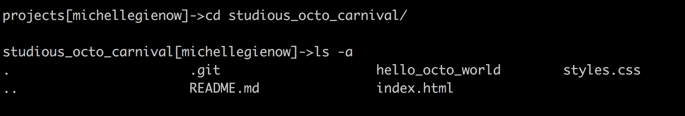
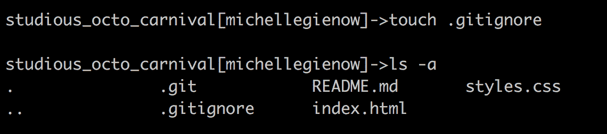
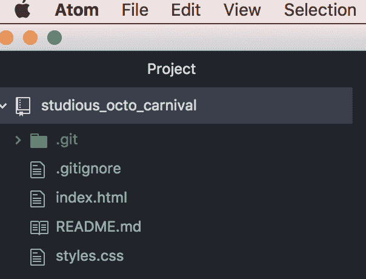
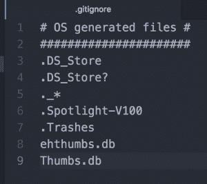

# 合法使用 git 和 GitHub:如何(和什么)忽略 Gitignore

> 原文：<https://thenewstack.io/getting-legit-with-git-and-github-how-and-what-to-gitignore/>

如果您还记得本系列的第一篇教程，[Git for absolute every body](https://thenewstack.io/tutorial-git-for-absolutely-everyone/)，$git init 是用于创建和初始设置新 repo 的一次性命令。执行$git init 会生成一个全新的[主分支](https://thenewstack.io/dont-mess-with-the-master-working-with-branches-in-git-and-github/)，在此基础上您可以开始构建您的全新项目。它还创建了一个新的。当前工作目录中的 git 子目录，即项目的根目录。这个子文件夹包含 Git 生成的所有东西，用于跟踪和存储每个文件的修订历史。

注意“，”前面的点。git”文件夹。这使得它在 finder 和 terminal 中的功能是不可见的，除非我们使用一个命令来专门公开它(提示:$ls -a)。如果你没注意到。git 子目录，更不用说在那里挖掘了，不要担心。我们想揭露真相的唯一原因。git 是作为一种检查来确保工作目录确实是一个 Git 库。这是一个方便的能力，但除此之外，你最好离开。饭桶。

Git 故意把它隐藏起来:里面有很多重要的东西，其中大部分超出了普通人和普通开发人员的理解范围。我只想说。git，这个文件夹，包含了让 Git，这个版本控制软件，做我们想让它做的事情的几乎所有东西，乱搞它的内容会严重破坏你的项目。做好自己的工作，相信自己。git 自己做。

[](https://storage.googleapis.com/cdn.thenewstack.io/media/2018/06/683313f2-gitunderhood.png)

git 的内容。明白我的意思吗？只是。不要。

### 别理它！

我并不是说忽略. git 的内容。

在您的 repo 中还有另一个隐藏文件，也是在我们运行$git init 时自动生成的，名为. gitignore. Your。gitignore 文件名故意不跟踪文件，以便告诉 git“嘿，不要包括这些！”在其版本工作中。基本上，它是您希望 Git 忽略的文件列表。

这种工作方式可以追溯到 Git 的分布式图论树模型。Git 将工作目录中的每个文件视为以下三种情况之一:

1.  跟踪—已经暂存和/或提交的文件；
2.  未跟踪—尚未暂存或提交的文件
3.  ignored—Git 被明确告知忽略的文件。

被忽略的文件通常是特定于操作系统的文件，也就是说，您的电脑需要渲染您的项目，但与您的实际项目无关。这就是为什么我们不想把它们包含在我们的回购协议中:它们是不必要的空间浪费。GitHub 可能是免费的(就目前而言)，但它不是无限的--。gitignore 是每个用户的一种礼貌姿态，只发送实际上属于一个项目的东西。有时候。gitignore 包含项目实际上需要的文件，但对存储库来说不是必需的，因为它们总是从运行项目的任何计算机和平台上生成/派生的。

咻！这是很多高层次的抽象。这里有一个具体的例子来说明这一点:假设你在苹果电脑上，你有[。DS_Store](https://en.wikipedia.org/wiki/.DS_Store) 文件在你所有的目录下。(你有，它们无处不在，但也无害，这是苹果的事情)。的。DS_Store name 是桌面服务存储的缩写，它是一个自动生成的文件，出现在您创建的每个文件夹(目录)中。它存储其父文件夹的自定义属性，如图标的位置或背景图像的选择。

显然，您不需要 Git 跟踪您的 Hello Kitty 桌面映像的这些信息，并在每次提交时提交和推送到 GitHub。它和你的项目没有任何关系，只是放在那里，从来没有使用过，占用了内存。只是一点点内存，但是如果每一个 GH 提交都包含不必要的文件，超过 5700 万个存储库…嗯，它开始增加。所以我们告诉 Git 忽略不必要的东西。

### 如何。gitignore

我们将奉献整个教程。gitignore 是因为，尽管基本思想足够简单，但实现它意味着利用概念的融合。这是我见过的最让我的学生们意识到走一遍是合适的事情。

第一步。前往“终端”中的项目文件夹。(还记得好学 _ octo _ 嘉年华吗？我们将以此为例)。然后键入“$ls -a”打印出项目中所有可见和隐藏的文件。看那是我们的。git:

【T2

然而，还没有一个. gitignore .我们必须做一个；Git 不会自动为我们做这件事。

第二步。键入" $ touch。gitignore”来创建。gitignore 目录。不要忘记“.”！

[](https://storage.googleapis.com/cdn.thenewstack.io/media/2018/06/c8d98a47-screen-shot-2018-06-15-at-8.31.11-am.png)

第三步。在您选择的文本编辑器中打开项目。因为我们用的是 Atom。我们输入“$atom”启动 Atom 并在其中打开当前目录。

(额外提示:要从终端激活对 Atom 的访问，首先要打开 Atom。点按左上角的 Atom 菜单，然后点按“安装 Shell 命令”。回到你的终端；从现在开始，你可以输入“Atom”来启动 Atom，或者“Atom”启动当前工作目录，或使用“$Atom，/directoryName”打开不同的目录)。

[](https://storage.googleapis.com/cdn.thenewstack.io/media/2018/06/fde29ad6-screen-shot-2018-06-15-at-8.40.27-am.png)

请注意我们的新。gitignore 文件是绿色的，这意味着它是未被跟踪的——也就是说，我们还没有暂存/添加或提交它。

第五步。打开。gitignore file 中的文件，就像对待其他文件一样，比如 index.html。出于一些奇怪的原因，这一步对我的学生来说似乎是最神秘的，但是:一个隐藏的初始点文件与其他任何文件一样。只需双击目录名，Atom 就会为. gitignore 打开一个窗口。

第六步。现在神奇的事情发生了:我们实际上添加了我们希望 Git 忽略的东西。



这是纯文本，所以我们在行首使用#来表示这是一个注释。然后我们列出我们希望 Git 忽略的东西。这里，我包括了 Mac OS 在每个创建的目录中生成的所有 cruft。所以再说。我们有机器生成的文件，如 Thumbs.db(呈现缩略图)和。垃圾箱(这是被删除的文件在被永久删除之前存储的空间。GH 不需要我们的垃圾！).

就是这样！只需在你的. gitignore 中输入你想让 git 忽略的任何文件的名字，保存它。完成了。

### 全球。gitignore

由于在每个项目中会忽略这么多讨厌的小动物，所以创建一个全局变量会更方便。gitignore file，它是计算机上每个 git 存储库中要忽略的文件的列表。

步骤 7(可选)。去终端和 CD 到你的顶层目录(通常，有你的用户名的那个；它包含您的所有文件，如果您不确定，在 MAC 上，Finder 中它旁边有一个小房子图标。

现在输入

```
$git config  --global core.excludesfule  ~/.gitignore global

```

导航到新的全局。gitignore 目录，并添加您希望 git 始终忽略的所有不好的内容。操作系统生成的系统文件是一个很好的起点。

[GitHub 有一个有用的列表](https://gist.github.com/octocat/9257657)，列出了它永远不会使用的东西，它真诚地希望你会使用。不管是对他们还是对你自己，都不要理会。

### 注意:递归确实适用

不幸的是。gitignore 不是递归的，这意味着如果你已经提交了一个项目，然后返回去创建一个. gitignore，你首先要做一些基础工作。如果你想忽略一个你过去犯过的错误，比如说 good ol。DS_Store，您需要首先从存储库中删除该文件，然后为它添加一个. gitignore 规则。

有一个方便的选项叫做“–cached”(两个破折号加单词“cached”)，当与 Git remove 命令$git rm 一起使用时，会导致文件从存储库中删除，但作为一个被忽略的文件保留在工作目录中。

任何带有“.”的文件。日志”扩展是公平的游戏。git 忽略包容。Git 自己生成日志，谢谢，不需要你的。如果你已经提交了一个项目，并想返回删除日志文件，这看起来是这样的:

```
$  git rm  --cached *.log
$  git commit  -m  "Start ignoring *.log files"

```

我们必须在这里执行一个 commit with message，因为这些无用的文件目前正在被 Git 跟踪——所以删除它们成为了版本历史的一部分。

正在设置。当你是一个新的程序员，被所有你想让 Git 注意的事情淹没，更不用说你不想注意的事情时，gitignore 可能会觉得是一个不必要的额外步骤。但是我向你保证，在你进行的每一次回购中花时间这样做是成为一个好的 GitHub 公民的重要一步——并且作为一名程序员被认真对待。

由[Tru " kat sande](https://unsplash.com/photos/Km5JGMW4VPM?utm_source=unsplash&utm_medium=referral&utm_content=creditCopyText)在 [Unsplash](https://unsplash.com/?utm_source=unsplash&utm_medium=referral&utm_content=creditCopyText) 上拍摄的特征图像。

<svg xmlns:xlink="http://www.w3.org/1999/xlink" viewBox="0 0 68 31" version="1.1"><title>Group</title> <desc>Created with Sketch.</desc></svg>