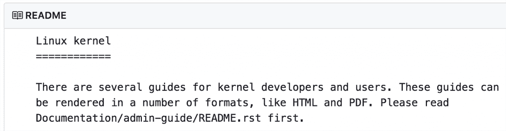
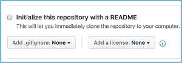
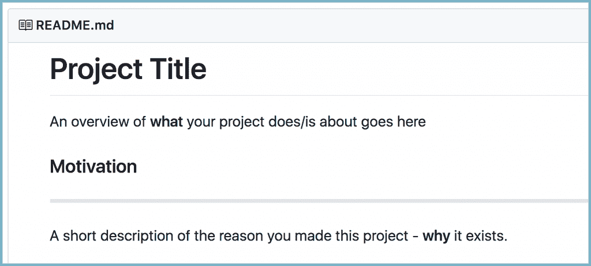
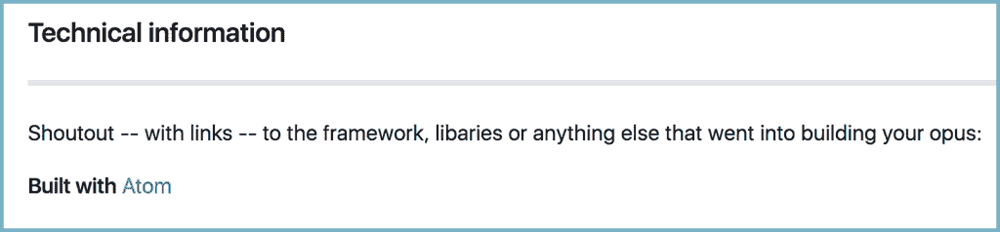
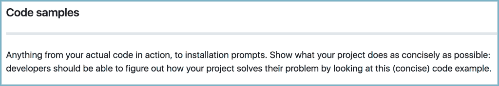
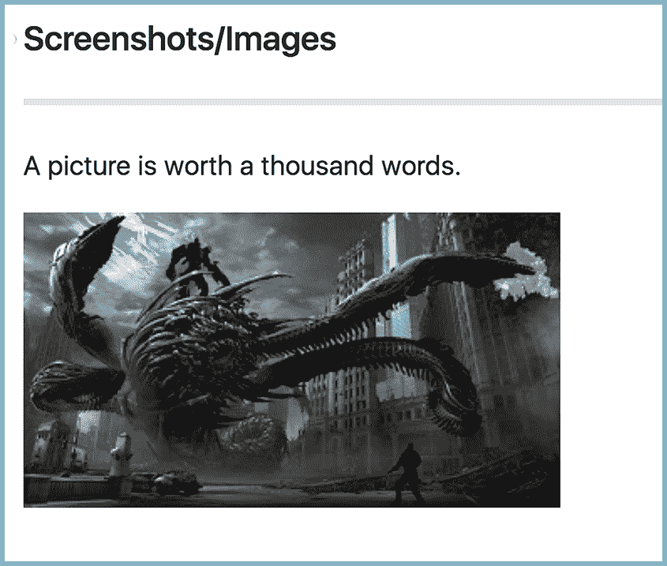

# 使用 git 和 GitHub 变得合法:使用 Git Markdown 清晰明了的 README

> 原文：<https://thenewstack.io/getting-legit-with-git-and-github-readme-loud-and-clear-using-git-markdown/>

万岁，饭桶朝圣者们！当我们结束关于学习 Git 和 GitHub 的系列教程时，从您的第一个 git init 到您最近的 T2 pull 请求，我们现在停下来考虑这个不起眼的、经常被忽略的 README.md 文件。

在 GitHub 领域，README.md 到底是什么？当你访问 GitHub 上的任何库时，你首先看到的是文件树——对于像[Linux 内核](https://github.com/torvalds/linux)这样的大规模开源项目来说，文件树可能有几十行长。项目文件列表的正下方是自述文件。



自述文件就像你作品的公众形象。这是大多数来到您的 repo 的人与您的项目交互的第一种方式，这一点非常重要，因此 GitHub 在存储库设置工作流中包含了 README 创建提示:



然而，太多的开发人员要么完全跳过自述文件，要么放入一些通用的样板文本。我们都这样做过，我们每个人都打算以后再回来把它做好。这种情况几乎不会发生。这可以理解；软件开发是一条快速流动的河流，想要逆流而上重新审视任何不是问题/bug/着火的代码是非常困难的。但这并不意味着它是好的。其实在自述上克扣真的不好。

有多糟？嗯， [Tom Preston-Werner](https://www.linkedin.com/in/mojombo/) ，GitHub 的创始人之一，写了一篇关于 README 驱动开发的引人注目的文章:“README 应该是你的代码库中最重要的文档；先写出来才是正确的做法…

首先。比如，在你写任何代码、测试、行为、故事或其他东西之前。我知道，我知道，我们是程序员，该死的，不是科技作家！但这就是你错的地方。写自述文件对于编写好的软件是绝对必要的。直到你写了你的软件，你才知道你要写什么。

所以。不要成为那个显然非常非常努力地创建一个开源项目的家伙，把它放在 GitHub 上，没有任何自述…然后坐在那里想为什么没有人分叉他们的项目。或者看着它。因为，嗯，你没告诉我们那是什么？

### 撰写精彩的自述文件

那么，好的自述文件的要素是什么呢？

GitHub 上 2700 万个公共存储库中的每一个都代表一个项目，从完整的 JavaScript 框架到[微小的单一功能软件包](https://github.com/jezen/is-thirteen)某个地方的某个人认为可能有用。因此，没有一种固定的方式来写自述文件，适用于所有的回购。另一方面，每一个都以同样的方式开始:你的项目做什么。

(说真的。如果你开始写自述文件有困难，这里有一个句子提示:“我的项目是……”。现在告诉我们我做的这个东西，好吗？)

以下是典型自述文件将包含的内容列表:

1.  你的项目做什么
2.  如何安装
3.  用法示例

之后，您可以考虑加入其他一些有用的部分:

1.  如何设置开发环境
2.  常见问题
3.  变更日志
4.  许可证和作者信息

### 使用 Markdown 使您的自述文件看起来更专业

以上是你需要包含的信息。这里有一个指南(1)你可能如何格式化它，以及(2)如何用 [GitHub 风格的减价](https://github.github.com/gfm/)来格式化。这是一种 GitHub 特有的 markdown 语言，是一种基于轻量级文本的语法，用于格式化文本。简单地说，它是一堆散列符号和其他符号，你可以用它们来放大或加粗文本，或者改变文本的外观。把它想象成网页的样式文件，只是没有讨厌的 HTML 和 CSS。

Markdown 在 GitHub 上可以处理任何包含。md 或者。降价扩展。比如 README.md，你也可以用它来创建丰富多彩的拉请求注释，甚至在提交消息中。你甚至可以在[中加入表情符号](https://gist.github.com/rxaviers/7360908)！

如果你以前从未用过 markdown，不要害怕。非常简单。你只需创建一个 README.md 文件，在你喜欢的文本编辑器中打开它，然后开始输入。记住:文本，你对你的项目所说的，是重要的部分。不要太在意造型。(也就是说，看起来时尚的自述文件只会是一种资产，所以一定要从中获得乐趣)。

### 第一步:项目标题和描述。



我们如何施展这个降价魔法:

> ```
> # Project Title
> An overview of **what**  your project does/is about goes here
>  
> ### Motivation :rocket:
> ------------------
> A  short description of the reason you made this project  -  **why**  it exists.
> 
> ```

Markdown 非常简单:你只需输入你想要的文本，然后通过附加特定的符号告诉它做什么。如果您想要一个空行，您可以在两行文本之间插入一个空行，或者更多，如果您想要更大的空白空间。

1.  hashtag 控制文本大小:

> ```
> # This is the largest title font size (think &lt;h1&gt; tag in HTML)
> ## This is a bit smaller, for sub-headings (like &lt;h2&gt; tag)
> ###### This is as small as it gets before regular text.
> 
> ```

因为你的项目标题应该很大，所以你把它写成“# My Project Title”(开始的 markdown 符号，这里是一个标签，和标题的第一个字母之间的间隔很重要)。

2.  。键入一行长破折号(–––––-)，将在屏幕上绘制一条实线分隔线。
3.  想强调文字？使用星号符号。“* *我大胆！**“会生成我大胆！，而“*我斜！”产生我是斜的！
4.  表情符号很简单:看看[的表情符号小抄](https://gist.github.com/rxaviers/7360908)。(专业提示:如果你使用 Slack，你已经很熟悉了——它是同一个 markdown 库)。选择你的表情符号，然后在两个分号之间输入名称:“:rocket:”产生了许多人喜欢在初始提交消息中包含的火箭符号。

### 添加链接、代码示例和截图。

其他自述文件内容使项目存储库登录页面的外观更加生动，同时提供了有价值的用户信息:

*   链接到其他资源，如 API。
*   代码示例
*   截图/图片

因此，我们的下一个部分，技术信息——其中包括关于您用来构建项目的工具的信息——看起来像这样。请注意指向 Atom 的超文本链接:



降价:

> ```
> ### Technical information
> ------------------
> Shoutout  --  with links  --  to the framework,  libraries or anything else 
> that went into building your opus:
> **Built with**  [Atom](https://github.com/atom)
> 
> ```

同样，我们使用标签和星号来创建标题大小的粗体文本效果，用一行破折号来创建一条线。

插入外部链接的减分是“[此处为链接文本](此处为 https://url)”因此，您要用作链接锚的文本放在两个括号[ ]内，紧跟其后(中间没有空格)是包含 url 的( )括号。



再说一次，Slack 用户已经知道如何做到这一点:在`single backticks`中封装内联代码片段，在``triple backticks` `中封装代码块。Markdown 将负责格式化:``

 ``> ```
> ```javascript
> function fancyAlert(arg)  {
>    if(arg)  {
>      $.facebox({div:'#foo'})
>    }
> }
> ```
> 
> ```

理想情况下，你应该有一个同样精彩的开源软件/库/npm 模块的截图来吸引人们对你的项目的兴趣。一只贪婪的巨型机器蜈蚣蠕虫也能工作。



标记几乎等同于插入超链接，所以要小心。主要区别是一个图片/截图前面有一个！爆炸符号:

> ```
> ### Screenshots/Images
> ------------------
> A  picture is worth  a  thousand words.
> 
> 
> ```

注意[ ]括号和( )括号的语法在其他方面是相同的。您可以使用指向外部托管图像的链接，或者指向项目存储库中托管的资产的内部路径。

### 就是这样。真的。

嗯，不是真的。还有一些其他的降价玩具可以玩，但是这些是在你的 GitHub 库上创建一个简单但有效、有吸引力的自述文件的基本要素。

看到了吗？减价可以很有趣！注意不要以牺牲好的内容为代价而过分沉迷于代码。请记住:文字真的是最重要的部分。

通过 Pixabay 的特征图像。

<svg xmlns:xlink="http://www.w3.org/1999/xlink" viewBox="0 0 68 31" version="1.1"><title>Group</title> <desc>Created with Sketch.</desc></svg>``