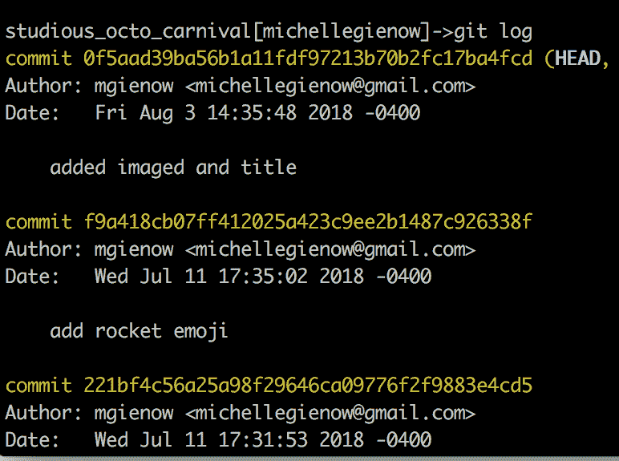
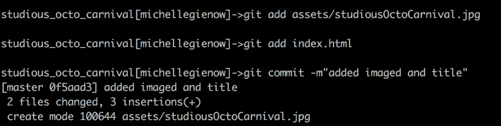
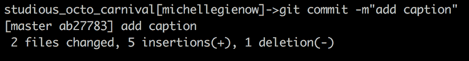
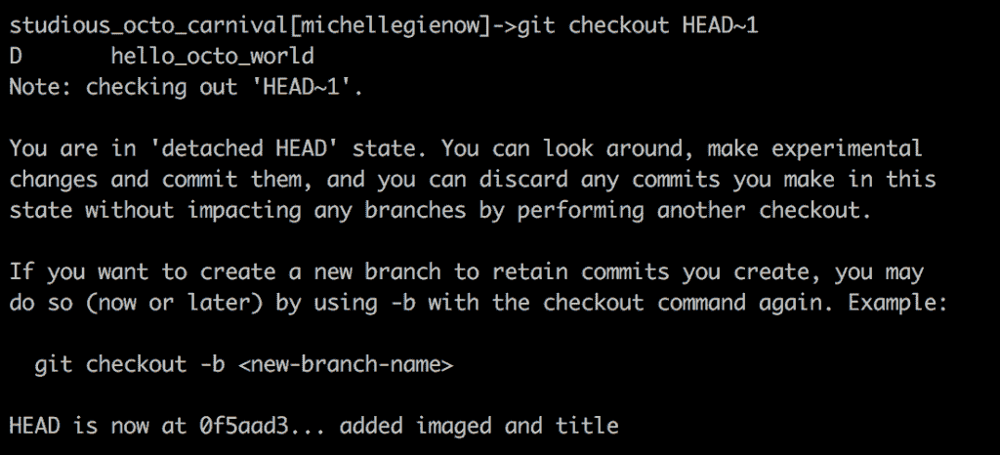
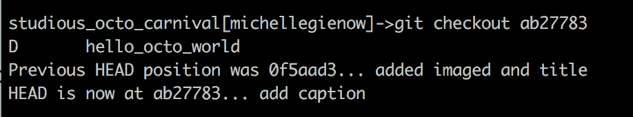
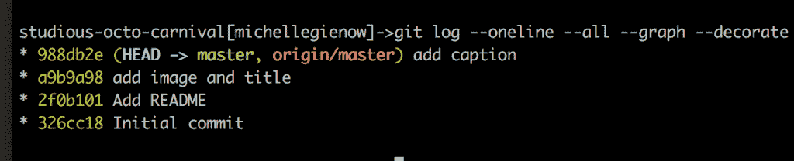
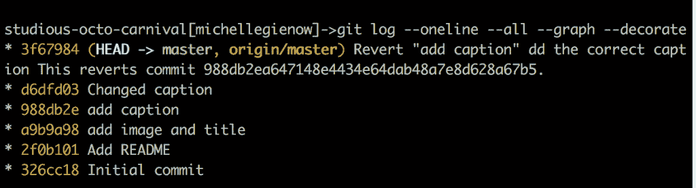

# 合法使用 git 和 GitHub:使用 Revert 和 Reset 回滚更改

> 原文：<https://thenewstack.io/getting-legit-with-git-and-github-rolling-back-changes-with-revert-and-reset/>

Git 俱乐部的第一条规则是，我们不会假装过去没有发生。版本控制就是这个意思，人们:随着项目的进展，管理项目的多个演进版本。也就是说，有时候我们想让时间倒流——也就是说，回滚更改？是的，特别是如果我们在做持续的部署/集成，在主程序中的代码和运行在生产环境中的工件以及我们本地 IDE 中的任何东西之间总是应该是对等的。

不过，让我们从更基本的东西开始。Git 的美妙之处在于，当我们的代码出现问题时，通过简单地恢复到上一个有效的版本就可以很容易地解决问题。通过使用$git revert 或$git reset，我们可以回到几分钟(或几个月或几年)前的世界。

## 嗯，我们实际上如何看待这些以前的提交呢？

问得好！这涉及到遍历 git 的分支树结构，所以如果以下任何一项看起来很神秘，我建议你参考我们之前关于使用分支的教程。

tl:dr 版本:我们使用$git 日志查看以前的提交，使用$git checkout 在它们之间遍历。

循序渐进的版本:

一旦你对一个项目进行了多次提交，或者如果你已经分叉/克隆了一个存储库(打包了它以前的提交历史)，或者如果你的代码中出现了非常非常严重的问题，你需要找出问题出在哪里……不管是什么原因*，*最终总有一天你会想要查看版本历史。

### 步骤 1: $git 日志

键入" $git log。"有各种变化——您可以向$git log 添加各种参数来修改输出——但是，默认情况下，普通的$git log 打印该存储库上所有提交的列表。它首先从最近的开始，然后按时间倒序返回到开始整个事件的初始提交。如果您在一个有很多合作者的大型项目的主分支上运行$git log，显然这个输出会持续几天。幸运的是，默认情况下，git 通过一个分页器传输所有输出，因此您一次只能看到一页日志输出。然后，您可以请求下一页，以此类推，但是希望大多数时候您正在寻找的断点是最近的，并且在当前的几个提交之内。

这种默认格式还列出了每个提交及其唯一的标识符编号(一个由 SHA-1 生成的 40 个字符的校验和)、作者/提交者的姓名和电子邮件、编写日期以及提交消息。

### 第二步:清点人数

注意第一行和单词 HEAD。回想一下我们的分支教程，Git 是如何使用一种指针来标记文件的当前状态的，也就是你正在工作的当前版本？我们称之为头部。不过，我们实际上可以移动 HEAD 引用来指向我们想要的任何东西，这是回滚版本的关键。第一步是，确定你所在的版本，这样你就可以开始搜索你想要恢复的版本。

在 Git 中，有两种方式引用特定的提交，一种是绝对的，另一种是相对的。

*   绝对的方法是使用它的唯一标识符，即由数字和字母组成的 40 个字符串，准确地指向提交。这是精确的，也是一个巨大的痛苦。幸运的是，Git 只允许我们引用前 7 个字符(总共 40 个字符的标识符代码)
*   相对的方法是使用 HEAD 作为固定的参考点，并告诉 Git 我们想要返回多少个版本。因此，为了引用当前版本之前的提交，我们使用 HEAD~1。前两个是头~2。你明白了。

### 第三步:检查一下

现在，让我们来讨论如何检查我们之前的提交。我们需要做的就是使用$git checkout <reference name="" here="">。因此，让我们尝试使用 git checkout HEAD~1 将一个提交移到当前提交之前。</reference>

我们的过程:使用我们强大的[studio octo carnival](https://github.com/mgienow/studious_octo_carnival)示例项目(或者您在前面的练习中创建的等价示例项目)，让我们添加一些东西来创建一个更长的提交链。我放入了一张看起来很酷的章鱼游行花车的照片和 index.html 页面的标题。然后按照通常的 git 工作流程准备并提交这些变更。

这给了我们一个版本作为起点。现在，让我们给照片添加一个标题，并提交更改，给我们一个后续版本。

所以我们的“添加标题”提交是我们当前的版本。它的绝对标识符应该是“ab 27783”——正如您在提交信息中看到的。相对标识符是 HEAD，因为默认的 HEAD 指向当前版本，除非我们告诉它去别的地方看。

我们就这么做吧:指向当前提交之前的提交。就像输入$git checkout HEAD 那么简单~1:

现在，我们的文件回滚到当前提交前一次提交的状态。我们可以通过输入$git log 来检查，打印出最近提交的点名——不管它们是多久以前提交的。请注意 HEAD 指针如何指示今天的“添加图像和标题”提交(Git 标识符 0f5aad3)，而不是最近的“添加标题”提交(ab27783)。

为了回到最近的提交(由远程的头指向的“添加的映像”提交)，我们可以使用$git checkout <name-of-branch>。有一点要记住，当我们再次使用相对引用时，它将是相对于当前的 HEAD 指针，而不是我们之前手动指向的那个(HEAD 减一个版本)。这是因为检查分支会将 HEAD 重置为 current。</name-of-branch>

所以我们又安全地回到了最近提交的版本。请记住，这个练习只是为了“检查”版本，并练习在它们之间移动。Git 告诉我们，

“你处于‘超然头’状态。您可以四处查看，进行实验性的更改，然后提交它们，并且可以通过执行另一次签出来放弃您在这种状态下所做的任何提交，而不会影响其他分支。”

这对于试驾变化来说很方便。如果事情不顺利，您只需使用$git checkout 和分支名称签回到当前版本(或您喜欢的任何其他版本)。最佳实践可能是使用唯一标识符，因为(a)如果您来回移动几个版本，很容易丢失,( b)如果其他人也在代码库中工作，这可能会移动相对头部，您甚至不会意识到这一点，除非您记得先检查 git 日志。所以，绝对结帐通常是一种方式。

(PS:如果您喜欢这些更改并希望保留它们，您只需创建一个新的分支来保留提交:$git checkout -b <new-branch-name>)。</new-branch-name>

## 回滚和后退:重置和恢复

哎呦！刚刚意识到我们改变了我们的标题是不正确的，我们需要回到以前的，正确的标题！

我们都发现自己处于这种情况，有些东西被部署了，引起了问题，并且必须被回滚。然而，大多数时候(希望如此)我们很快就能发现它，只有少数几个问题发生后才提交。这是使用$git revert 或$git reset 最容易完成回滚的时候。

使用任何一种方法的结果本质上都是一样的:回滚到代码的前一个版本。然而，它们以不同的方式工作，并且存在一种比另一种更好的情况。

### 还原或重置？这就是问题所在:

*   有趣的是，git revert 不是简单地让现在不需要的更改消失，而是创建了产生现在不需要的提交的 diff 的镜像，并应用它。这“撤销”了代码更改，然后提交结果，表面上看起来这就是我们想要的:所有糟糕的代码都消失了。然而，提交仍然会作为代码库历史的一部分存在，首先显示放入，然后显示取出。这可能有助于把反物质代码应用于原始物质:两者一起相互抵消。

*   另一方面，$git reset 只是完全清除先前的提交，并将其从当前分支中删除。消失得无影无踪。这样做的好处是可以存储更少的代码，并且当你以后再出错时，可以筛选更少的版本。然而，严重的缺点是，如果被删除的代码已经被提交，那么我们现在就在搞乱存储库历史。这意味着，如果另一个项目合作者也在那里工作，突然之间你的版本，他们的版本，甚至可能是主版本之间出现了不一致。融合冲突地狱的快车。

所以！如果您已经提交/推送了，请使用$git revert。

如果您还没有提交，并且正在独自处理您自己的分支，那么您可以继续执行$git reset。这只会清除所有尚未提交的更改，并将您放回到最近提交的门槛上。试着再试一次。(此外，它还可以很好地卸载您已经$git 添加的任何内容，而无需提交)。

## 如何恢复/重置

### 第一步:注销

我们以前来过这里，但这次只是为了好玩，让我们试试$ git log–one line–all–graph–decoration。这将把所有以前的提交打印出来，每一行显示一个漂亮的分支和合并历史的小 ASCII 图像，输出代码用颜色编码很有用。(如果您想自定义配置自己的$git 日志命令，请查看本指南。

这个输出告诉我们两件事。(实际上有很多事情，但现在我们最关心这两件事)。首先，我们当前的分支(头)和本地主存储库是同一个，d6dfd03。另外，最近推送的版本(红色的“origin/master”)与 HEAD 相同，这是 GitHub 正在跟踪的。这意味着我们拥有最新的远程存储库。

### 第二步:恢复

好了，现在我们有了提交列表。现在，假设我想回滚到“添加标题”提交，988db2e。

因为我们已经提交了标题添加，所以我们不能使用$git reset。还记得 reset 对于清除未提交的更改有多有用吗？Reset 还会取消您在准备提交时添加的任何内容，但是它对已经提交的内容没有任何作用。这现在已经正式成为 git 历史的一部分，即使你还没有推送到 GitHub，回滚它的唯一方法是$git revert。

回想一下，使用 Git，revert 有一个非常具体的含义:用反向补丁创建一个 commit 来取消它。这样你就不会改写任何历史。但是最初的“哎呀”提交和补丁总是版本历史的一部分。

让我们再次注销它，看看它是否有效:

然而，另一个提交——我们想要删除的那个——仍然在日志中——wtf？好吧，Git 永远不会忘记:我们确实犯了那个错误。因此 d6dfd03“更改的标题”已经存储在链中，因此其存在的证据将持续存在。Git 非常有用地撤销了我们想要撤销的所有内容，我们已经回到了我们想要重新开始工作的“好”版本。头，主和遥控器都在一条线上。

因此，这些工件没有什么可担心的:只是继续前进，并开始工作在新的变化。时间将从这一点向前推进。你已经成功地回滚到你之前的选择，世界又是新的了。

<svg xmlns:xlink="http://www.w3.org/1999/xlink" viewBox="0 0 68 31" version="1.1"><title>Group</title> <desc>Created with Sketch.</desc></svg>