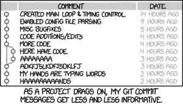
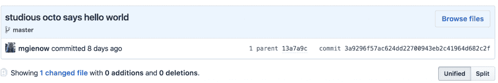

# 合法使用 git(和 GitHub):提交消息的艺术

> 原文：<https://thenewstack.io/getting-legit-with-git-and-github-the-art-of-the-commit-message/>

欢迎回来，饭桶朝圣者！到目前为止，在我们关于 git 和 GitHub 的系列文章中，我们已经学习了[基本的 Git 命令和 Git 工作流](https://thenewstack.io/tutorial-git-for-absolutely-everyone/)。然后，[如何与 GitHub.com 合作，将项目代码](https://thenewstack.io/tutorial-git-for-absolutely-everyone/)上传到我们 GH 账户的一个存储库中。第三部分是如何通过[与 Git 和 GitHub 中的分支](https://thenewstack.io/dont-mess-with-the-master-working-with-branches-in-git-and-github/)合作来管理和更新项目。我希望你已经完成了你的家庭作业。什么事？很好。让我们继续前进！

一个非常重要的 Git 概念是[Git 提交](https://help.github.com/articles/github-glossary/)。回想一下，当您保存对项目存储库(或一组文件)的更改时，Git 中会发生提交，就像在那个确切的时刻制作项目的快照一样。这就像每次有更改时 Google docs 如何归档一样，除了 git 为每次提交创建一个唯一的名称(也称为“SHA”或“hash”ID)来记录做了什么更改，以及何时由谁做的。

提交几乎总是包含一条提交消息，在这里你可以写下所做更改的简要描述。提交消息基本上是提交工作流中最重要的部分，因为它不仅记录了更改的内容，还记录了更改的原因。不幸的是，许多开发人员没有暂停片刻来精心制作一个好的提交消息，以伴随和解释从上一次快照到当前快照之间进入他们项目的所有艰苦工作。但是这样做——努力向未来的你清楚简洁地解释你在这个特定的承诺中到底做了什么——是非常非常重要的。



来自 xkcd。经许可使用。

Git 和 GitHub 提供了各种不同的工具来打开一个项目，查看两次提交之间到底发生了什么变化——例如“ [git diff](https://git-scm.com/docs/git-diff) ”。然而，一个精心制作的提交消息的美妙之处在于，它使您不必去寻找、弄清楚并使用那些工具，因为您已经在提交消息中对此写了一个简短、巧妙的总结。

将提交日志视为项目的新闻源会有所帮助。这类似于略读 Reddit 上的标题来快速总结世界上正在发生的事情:这些标语不需要讲述故事的每个细节。足以让你知道这个故事是关于什么的。下面是一个非常基本的例子，以最后一次提交的形式，来自我们之前的分支教程中的 Octo“hello world”示例项目:

【T2


当与一组项目合作者一起工作时，提交消息对于让每个人都知道其他人在做什么(以及为什么)显然是必不可少的。但是:如果你只是一个人工作，整个提交消息的事情可能看起来有点离题。很明显，你在那里，对吗？因此，似乎只需要拨入一个通用的提交消息。

```
Worst commit message,  ever:  git commit  --m  “changes”

```

但是:你今天早餐吃了什么？昨天怎么样？一年前的昨天怎么样？看到了吗，时间越往后越难记住细节？现在写一个好的、信息丰富的提交消息有助于将来当你拼命地想弄清楚错误是从哪一点引入代码库的时候，不要打你的脸。

## 提交消息的艺术

那么，如何编写一个好的提交消息呢？

首先，它需要简短。提交消息通常在 Git 提交日志的上下文中查看，这里没有多少显示文本的空间。

```
commit  3a9296f57ac624dd22700943eb2c41964d682c2f

Author:  Michelle Gienow 
Date:    Fri May  26  15:49:03  2018  -0500

Studious octo says hello world

```

第一行是最重要的，因为它将出现在实际的提交中。所以在这里投入最多的心思和精力。

也就是说，提交消息可以——也应该——尽可能长或尽可能详细。它们甚至可以跨越多行。Git 对提交消息的内容没有任何硬性限制，事实上，如果给定的提交确实需要额外的上下文，您可以向消息中添加额外的文本。段落，甚至。

```
Studious octo says hello world

Simple Hello World page as placeholder code/project file for exercise in creating git repositories,  then branching and merging.

```

## (提交消息)样式的元素

Git 提交消息令人抓狂的一点是，尽管它们对于良好的协作工作流和项目文档非常重要，但实际上并没有硬性规定。从来没有人从上面把刻有“献上你的承诺”的石板送下来。

所以，当然，在集体接受的提交消息风格指南的地方(当你最需要它们的时候，它们在哪里？)相反，我们有很多很多关于指导方针和良好实践的文章，如果你只看了几篇，会很快把你搞得晕头转向，因为很多文章直接相互矛盾。

所以承诺俱乐部的第一条规则是，做对你的项目有意义和有用的事情。

提交俱乐部的第二条规则是，有一些基本的指导方针，许多开发人员实际上都遵循:

**使用祈使句**。这是大多数 GitHub 贡献者实际遵循的提交消息风格的一个元素。命令式意味着编写“重构表单处理程序测试”，而不是“重构”或“重构”“-ed”或“-ing”没有问题，它们只是稍微长一点。这就是为什么这是最常见的提交消息共性:我们都同意输入越少越好。如果另一种风格更适合你或你的团队，那就去尝试吧——试着坚持下去。

**要简短。详细点。**新提交的主要动力——总结新“快照”中的变化——是提交消息的核心。这种变化的原因应该在你的第一行简洁地解释。将此视为提交的“主题”行，并尽量保持单行(大约 70 个字符)。然后最重要的细节——几乎是改变的原因——可以作为一个单独的段落。

别搞笑了。提交消息是一个总结变化的故事:这是我做的事情和我为什么这么做。尽管在提交消息中发泄沮丧情绪很有诱惑力，无论是针对 bug、Git，还是您的团队/您自己的愚蠢错误，但不要这样做。当你准备写一条沮丧的提交信息，大意是“$ git commit-m 我他妈的讨厌一切”——我们并不是说这不是真的，有时候一个人确实他妈的讨厌一切——这只是没有帮助的信息。信息中的任何内容都应该对参与你的项目的人有价值。发泄也很重要。只是不在“$git commit”中。

**保持一致。如果所有合作者都同意并遵循集体提交风格规则，你的回购将会变得更干净、更清晰、更易于使用。你不需要精心制作的风格指南；毕竟，提交信息更多的是俳句而不是史诗。通过快速对话建立一些约定，或者快速列出一些该做的事情(不要做的事情也是有用的)来帮助事情更顺利地进行。**

如果您的提交消息风格不一致，或者您只是随意编造，会发生什么？非常糟糕的事情？

[https://www.youtube.com/embed/JmzuRXLzqKk?feature=oembed](https://www.youtube.com/embed/JmzuRXLzqKk?feature=oembed)

视频

JK！我们都是人。失误时有发生，你可以在下一次提交消息时做得更好。然而，建立并遵循一些这样的风格规则，会使编写提交更容易、更快，因为您不必考虑如何在每次提交时说出“我做了什么和为什么要做”的信息。你做得越多，它就变得越容易，最终会变成自动的。尽你所能写最好的提交消息，这样你的存储库会更好，更有用。

未来——你永远也不想用拳头打你的脸。

<svg xmlns:xlink="http://www.w3.org/1999/xlink" viewBox="0 0 68 31" version="1.1"><title>Group</title> <desc>Created with Sketch.</desc></svg>