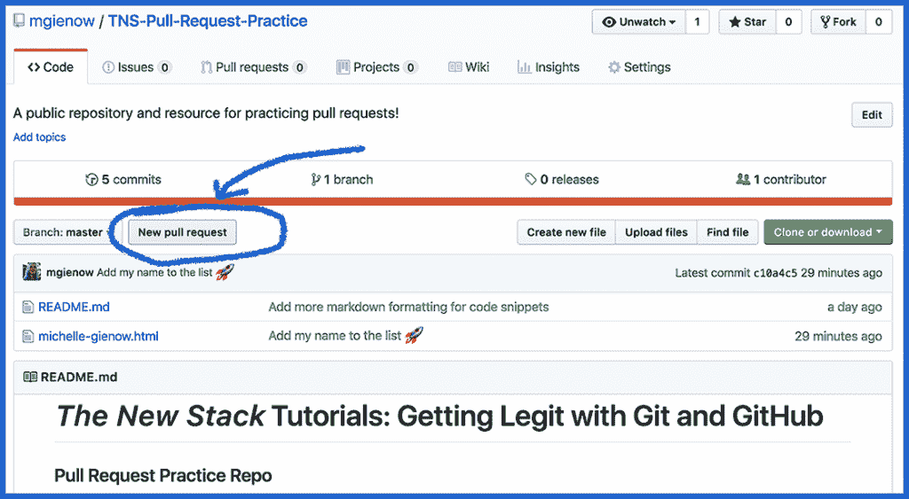
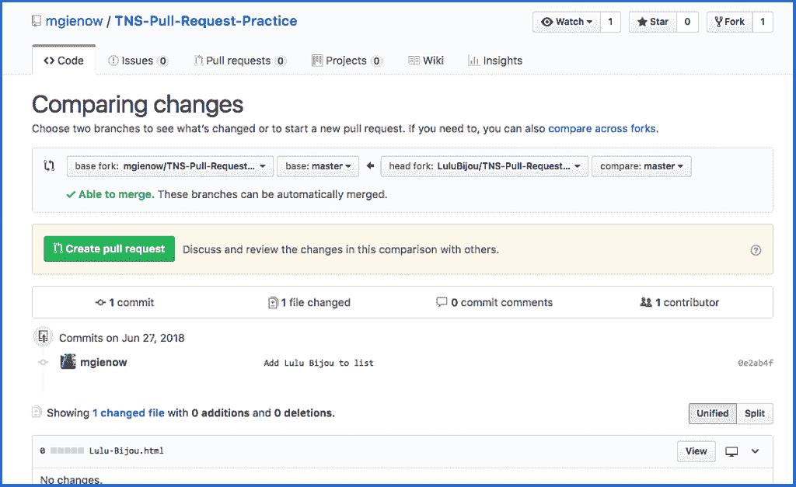
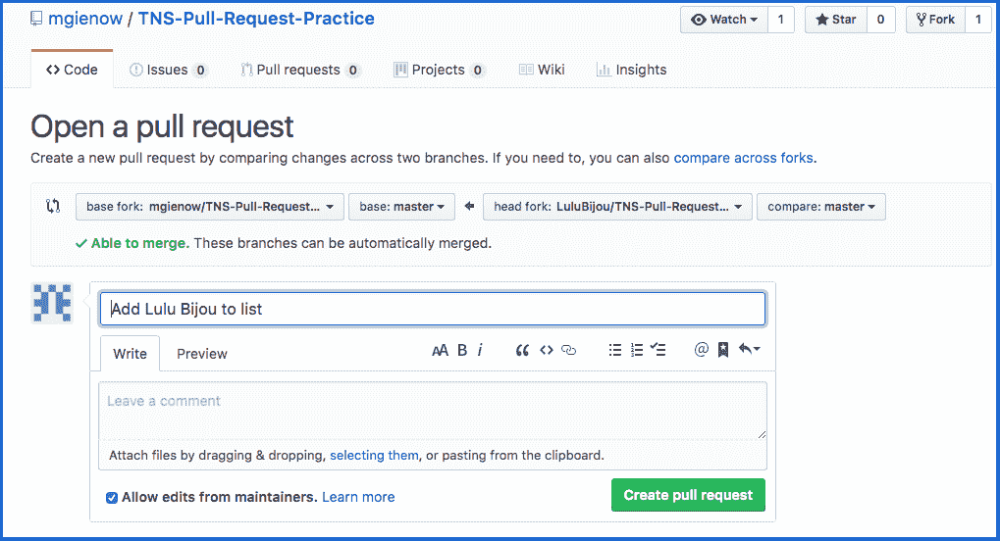
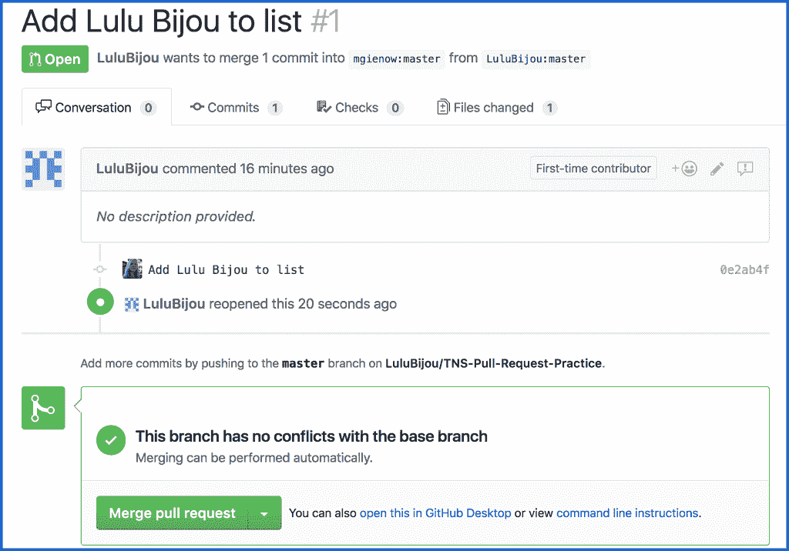
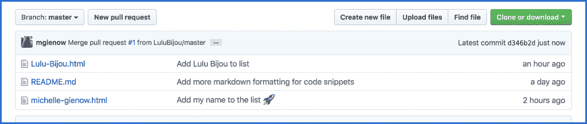

# 合法使用 git 和 GitHub:您的第一个拉取请求

> 原文：<https://thenewstack.io/getting-legit-with-git-and-github-your-first-pull-request/>

欢迎回来，饭桶！我们已经一起走了这么远，当你学会用 git 变得合法的时候。从[建立你的第一个本地 Git 库](https://thenewstack.io/tutorial-git-for-absolutely-everyone/)和[建立一个 GitHub 账户](https://thenewstack.io/git-with-the-program-getting-started-with-github/)来保存你所有的项目代码到提交、推送、[分叉和克隆](https://thenewstack.io/getting-legit-with-git-and-github-cloning-and-forking/)——你学到了很多，蚱蜢。干得好。

今天，你将向 full Git 和 GitHub 迈出下一步，作为一名开发者的合法性:你的第一个拉请求。

## 什么是拉取请求？

从根本上说，拉式请求是对团队项目做出贡献的机制。当您派生/克隆一个项目，对代码库进行更改或者添加一个特性，或者做其他工作，然后准备将您的改进合并回主存储库的主分支时，就会发生拉请求。当一切真正准备就绪时，您可以通过 GitHub 帐户向原始项目提交一个 pull 请求。(这至少是基本的工作流程——正如您将看到的，还有更多的内容)。这让项目负责人知道你做了一件事，所以他们应该检查它，如果它是好的，然后将它合并到 master 中作为项目的永久部分。

但是 PRs 不仅仅是一个促进项目变化的机制。“拉”请求流程也可以作为一个论坛。一开始，为什么这种改变是必要的，你做了什么，结果是什么。然后，项目维护人员或其他贡献者可以对您的更改进行评论，提醒您存在的问题，甚至通过推送后续提交来增加您的工作——所有这些都包含在 pull 请求中！

拉请求是开源代码的核心，也是 GitHub 集团项目的支点。如果你是一名初级程序员，你可能还没有使用过第三方项目的特性。有十亿个超酷的、有用的、开源的库、工具和快捷方式，这些都是人们建立和分享的。随着您编写越来越多的自己的代码，构建更多的东西，获得更多的经验，您会自然地发现它们。成为一名开源贡献者是成为一名更高级程序员的自然延伸:当你开始在自己的代码中加入这些令人敬畏的开源资源时，你会开始注意到错误，或者可能会想到可以添加的有用的新功能。

这就是 pull 请求的来源:它是您如何为开源世界做出贡献，并使您自己的代码成为其中的一部分。

### 首先，我们用叉子

好吧，那么未来开发你发现了一个错误或有一个伟大的功能想法。是时候提出你的第一个拉动请求了。

嗯，差不多是时候了。在你真正点击 GitHub 上的绿色“打开拉取请求”按钮之前，需要做一些事情。首先要做的事情:在你为一个不属于你自己的项目写代码之前，开源礼仪要求你首先询问。据你所知，他们可能已经在开发你刚刚(也)想到的伟大的新功能，或者可能有一个重要的原因导致它还不存在。你只有问了才知道。在突如其来地加入一个拉请求的项目之前，还有一些其他的社会考虑，所以在你在家尝试之前，也许可以去读一下[一个礼貌的拉请求指南](https://thenewstack.io/code-n00b-polite-guide-pull-requests/)。

**第一步:将原始项目放入你自己的 GitHub 账户，然后克隆到你的电脑上。**

您将原始项目派生出来，将代码库的整个当前工作副本放在您自己的手中，然后将其克隆到您的本地工作环境中，开始发挥编码的魔力。

我已经创建了一个名为[拉动请求练习](https://github.com/mgienow/TNS-Pull-Request-Practice)的公共 GitHub 回购，在我们取下训练轮之前，给你一个安全的地方来尝试你的拉动请求乘坐。所以请去那里把它复制到你的笔记本上。说明就在存储库的 README 文本中。

如果你不确定如何做到这一点，或者可能只是生疏，请回顾本系列前面的分支和克隆教程。

第二步:为你的新代码创建一个本地分支。

一旦项目在您的本地工作环境中启动，首先要做的就是为您的全新代码创建一个全新的分支。这是因为，当您将 repo 克隆到您的计算机上时，您从主在线项目存储库中设置了一个主分支的副本。记住我们的规矩:不要惹师父。创建一个新的分支来试验和改变事物总是一个好主意，无论是在你自己的小项目中工作还是为团队努力做贡献。PRs 也不例外。当你这样做的时候，一定要给这个新的分支取一个简短但有意义的名字，以反映你正在做的工作。

关于如何在 Git 中分支的回顾，请查看我们的[在 Git](https://thenewstack.io/dont-mess-with-the-master-working-with-branches-in-git-and-github/) 中使用分支教程。(它附带了有用的代码片段，但作为一个提示:$git checkout -b newBranchName)。出于本教程的目的，请以您的名字命名这个分支:名字-姓氏。

**第三步:创建！**

在这里，你可以深入到你刚刚下载的代码中，进行你想象中的修改/添加，或者踩死那些 bug。

由于这是第一个拉式请求教程，我们将把你的名字添加到拉式请求练习者的名单中。

所以！在终端中，请将目录(cd)更改为项目的根目录，即您克隆到计算机的名为 TNS-Pull-Request-Practice 的目录。创建一个新文件，使用 FirstName-LastName.html 惯例以你自己的名字命名(例如 michelle-gienow.html)。

现在，在您选择的文本编辑器中打开项目，放入一些快速占位符文本。一句经典的“你好，世界！”会成功的。(是的，这是一个 HTML 文件，但是如果你不熟悉 HTML5，就不要费力地编写标记代码——你可以在文本编辑器中键入单词“Hello”和“World”)。保存您的更改。这是您将要(1)推送到 GitHub 的文件，然后(2)请求我将它添加到 TNS-Pull-Request-Practice repo 中。

第四步:将你的分支合并到主文件中，然后删除它。

在以您命名的分支上添加了项目之后，是时候将更改合并回 master:在终端中，$git checkout master 从临时分支切换到 master。然后$git 合并 FirstName-LastName。

一旦你成功地合并回主服务器，删除你的分支。你再也用不到了，把 cruft 推给 GitHub 也没什么意义。$git branch -d FirstName-LastName

应该是一个简单的合并，但是如果你遇到麻烦，请参考 Git 文章中的[使用分支。](https://thenewstack.io/dont-mess-with-the-master-working-with-branches-in-git-and-github/)

**第五步:登台。提交。用力。**

很确定你已经完成了 GitHub 工作流的核心部分，但是现在是时候让$git add、$git commit 和$git push -u origin 控制你新创建的 FirstName-LastName.html 文件了。如果你需要复习，请参考[Git 和 GitHub 入门](https://thenewstack.io/tutorial-git-for-absolutely-everyone/)，这是我们教程系列的第一篇。

**第六步:你的第一个拉动式请求**

现在到了关键时刻:你的第一个拉动请求！

回到 GitHub 上最初的 [TNS Pull 请求练习库](https://github.com/mgienow/TNS-Pull-Request-Practice)——不是你自己的页面，而是你第一次进行练习的页面。

单击“新的拉取请求”选项卡

这将带您进入一个新屏幕，如下所示:

为了这个练习的目的，我的另一个自我露露 Bijou 分叉，克隆，分支，接触，创建，添加，提交，并推动 Lulu-Bijou.html 到我们的回购。

点击“创建拉取请求”也就是说，只要绿色复选标记和“能够合并”处于活动状态并出现在页面上。如果有合并问题，GitHub 会提供一些关于如何修复它们的建议，但是在一切都可以合并之前，你不能发出拉请求。考虑到这是一个非常简单添加文件名的练习，合并问题的可能性非常小。

这将弹出一个如下所示的屏幕:

是的，这是一个两步的过程:你必须再次点击“创建拉取请求”,只是为了让 GitHub 知道你确实想这么做。点击它。

Aaaannddd…就这样。您的第一个拉动请求。只是，可能有点什么都没发生的感觉？

但确实如此。在幕后，GitHub 通知您所贡献的库的所有者/维护者您已经提交了一个 pull 请求。他们去看一看你的努力工作，并且可以选择简单地将它合并到主分支中，这样你的代码现在就和主代码合二为一了，或者他们可以给你回复评论和问题。

当您向我发送将您的名字添加到 TNS 拉动式请求练习报告中的拉动式请求时，我这边看起来是这样的:

由于与基本分支没有冲突，我继续点击“合并拉取请求”你通过 GitHub 得到一条消息，说我已经接受了你的拉请求。你成功的证据将最终在 Lulu-Bijou.html 现在居住的原始回购协议上可见:

好的。轮到你了。走吧。

<svg xmlns:xlink="http://www.w3.org/1999/xlink" viewBox="0 0 68 31" version="1.1"><title>Group</title> <desc>Created with Sketch.</desc></svg>