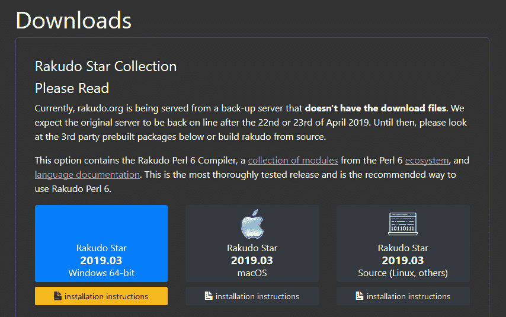
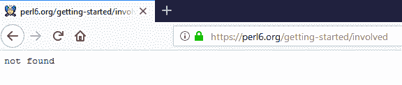

# 终于开始使用 Perl 6 了

> 原文：<https://thenewstack.io/getting-started-at-long-last-on-perl-6/>

本教程是学习 Perl 6 编程语言基础系列的第一篇。大约一个月检查一次新的分期付款。

从我第一次学习 Perl 到现在已经 23 年了。其中至少有 15 年的时间花在了思考新的 Perl 6 语言最终发布时会做些什么。那个[神奇的、期待已久的日子在 2015 年](http://www.10zenmonkeys.com/2015/10/06/the-night-larry-wall-unveiled-perl-6/)到来了——但是，我从来没有真正安装 Perl 6 并试用它…

直到现在！

这是一次新的冒险，是的，它导致了一些有趣和强大的新功能的发现。但是，只要随意浏览一下 Perl 6 的安装过程，就能瞥见背后的专用社区。

在真正的 Perl 风格中，我还发现，即使您只是在安装这种语言，也有不止一种方法。

## 安装并运行

有一系列有帮助的页面会引导您找到 Perl 6 安装程序。Perl6.org 的[“入门”页面体贴地提供了一个到](https://perl6.org/getting-started/)[“下载”页面](https://perl6.org/downloads/)的链接，它描述为“一个 Perl 6 发行版，包含了许多有用的模块。”该页面还提供了在类 Unix 系统上下载 tarball 的说明，但是我点击了它在 Rakudo.org/files 下载 Windows 和 macOS 二进制文件的链接。(本页将 Rakudo 描述为“Perl 6 的一个有用且可用的产品发行版。”)

所以这是我的第一个观察:偶尔会有一些小故障。当我在 5 月 7 日第一次访问该页面时，它给了我一个多余的警告，即“目前”该网站正由一个没有下载文件的备份服务器提供服务，并建议我尝试一个预建的第三方包。

但是在这个警告的正下方是他们自己的 Windows 64 位二进制文件的图标——下载得很好！



总的来说，社区支持似乎是一流的。如果您试图下载 Unix tarball，页面上的最后一个链接会显示“需要帮助吗？与我们交谈”，它链接到一个 Kiwi“webchat”页面，该页面将直接引导您到 freenode IRC 上的#perl6 聊天频道。

尽管当我点击入门页面上的最后一个链接时，我不得不笑了——“参与进来！“这显然是为了招募志愿者来编写文档或测试，并帮助发现和报告错误。但是当我在 7 月 1 日点击它时，它只显示“未找到”。



但是安装证明是一个非常简单的两步过程，可以概括为“下载然后运行”(这里有[一页安装说明](https://rakudo.org/files/star/windows)，第一步只是从链接下载安装文件，第二步是“*运行*安装程序，然后按照屏幕上的说明操作。”)即使在那里，文档也是简单而全面的。如果您试图安装第三方 Chocolatey 软件包，该页面还提供了单独的具体说明，以及在 32 位 Windows 系统或 Linux 的 Windows 子系统上安装的建议。

但对我来说这很容易。我刚刚点击了页面的链接“最新的 Rakudo Star 64 位 Windows。msi 安装程序文件”，它下载了一个 25.8MB 的文件。

如果你在关注我的进度，这里有我的标准免费建议:和大多数安装过程一样，你最大的障碍是你自己的系统。

在我的浏览器发出关于我如何点击一个可执行文件的强制性警告后，我又收到了 Windows Defender 发出的第二个单独的警告。(点击它的“更多信息”按钮会在窗口中添加一个“无论如何都要运行”按钮，点击它最终会让我进入 Rakudo Star 2019.03 设置向导。)


所有必要的 Perl 6 文件都安装在 C:\rakudo 的子目录中(正如安装页面所解释的那样)，可执行文件位于 C:\rakudo\bin\目前，没有办法更改位置，但是安装向导包括一个复选框，用于自动设置 path 环境变量，以便 Perl 6 可以从任何目录运行。

因此，这自然触发了另一个警告，这是来自 Window 10 的“用户帐户控制”(一个操作系统级的安全功能)，要求我确认我想允许这个程序对我的系统进行更改。

我点击是，并被告知安装已完成。


## **美丽新世界**

现在怎么办？

它在哪里？我的桌面上没有 perl6 图标。

当然，下一个要检查的地方显然是在命令窗口中(在 2019 年，在你键入 Windows_key + R 时出现的运行窗口中键入“cmd ”,就会神奇地召唤出命令窗口)。有趣的是，“perl”不是一个可识别的命令——毕竟这是一个 *Windows* 命令窗口——但是“perl6”现在是了。

这种打字方式引发了一种奇特的现象，被称为“读取-评估-打印循环”(或 REPL)。是的，我实际上是在一个 Perl 6 环境中。多年来，我一直在一个单独的 perl 模块中编写我的 perl 5 代码，然后保存并退出该文件，然后在“Perl”命令(调用 Perl 解释器)后键入其名称作为参数，现在我处于一个完全不同的工作流程中。

幸运的是，在 Perl6Intro.com 有一个专门为初学者[编写文档的网站——包括一整节关于“](https://perl6intro.com/)[运行 Perl 6 代码](#_running_perl_6_code)”的内容

“REPL 主要用于尝试一段特定的代码，通常是一行代码，”它解释道。当然，仍然可以从独立文件中以“旧”的方式运行您的 Perl 6 代码。Perl 6 简介页面建议给它们一个. p6 扩展名——并指出您将只能看到“print”或“say”语句的文本，而不能看到评估每一行的结果。

我决定先用老办法试试。就在那时，我得知 Windows 10 不再有命令行文本编辑器，我记得以前只要输入“Edit”就可以启动。一个网页推荐从命令行启动记事本[——如果你在“记事本”后面输入你想要的文件名，它实际上会提示你确认你想要创建那个文件……然后在适当的(当前)目录中创建它。](https://www.computerhope.com/issues/ch001303.htm)


那么，在一门新的语言中，你做的第一件事是什么？当然是说“你好，世界”。我一直很喜欢 Perl 5 的“say”命令(它打印出你的字符串*和一个换行符*，这样你打印出的变量就不会集中在同一行)。唯一的缺点是在 Perl 5 中，我总是不得不记住添加一行代码，使*能够实现*那个特性:

这是令人愉快的第一个惊喜。在 Perl 6 中——或者至少在这个发行版中——显然已经包含了 *say* 命令，所以我可以用 *say* 替换我的 *print* 语句，而不会出现错误。

我在记事本文本文件中输入以下内容，并将其保存为 *perltest.p6* 。

```
say  "hello world";
say  "3 + .14";
say pi;

```

我们出发了…

`> perl6 perltest.p6
hello world
3 + .14
3.141592653589793`

Pi 实际上是作为预定义的值包含在 Perl 6 中的…

第一个实验仅仅触及了表面——但是至少它确认了 Perl 6 已经成功安装并运行，并且能够打印出“hello world”。

在这一点上，我对那些我已经听了四年的 Perl 6 新特性充满了渴望，随之而来的是一场疯狂的 geek-o-riffic 实验，这让我想知道晚上怎么会突然变得这么晚。这是另一个教程的内容——但希望这已经展示了安装 Perl 6 是多么容易，以及对于那些对该语言感兴趣或刚刚入门的人来说有多少可用的资源。

理解一门新语言的第一步总是亲自体验它，我要告诉你:体验 Perl 6 非常有趣！

特征图片:[我们星系的磁中心](https://apod.nasa.gov/apod/ap190619.html)、NASA、索非亚、哈勃([每日天文照片](https://apod.nasa.gov/apod/ap190619.html))。

<svg xmlns:xlink="http://www.w3.org/1999/xlink" viewBox="0 0 68 31" version="1.1"><title>Group</title> <desc>Created with Sketch.</desc></svg>