# 在 Kubernetes 上开始使用 Spinnaker

> 原文：<https://thenewstack.io/getting-started-spinnaker-kubernetes/>

在本系列的上一期中，我们介绍了作为多云部署工具的 [Spinnaker](https://www.spinnaker.io/) 。我们将探索如何在 [Kubernetes](/category/kubernetes/) 开源容器编排引擎上设置 Spinnaker，并通过它部署您的第一个应用程序。

在本教程中，我将带您了解如何在 Minikube 上设置和配置 Spinnaker。一旦它启动并运行，我们将在 Kubernetes 中部署和扩展一个容器化的应用程序。

Spinnaker 通常安装在运行 Ubuntu 14.04 LTS 的虚拟机中。多亏了 Helm 社区，现在只需一个命令就能以图表的形式安装。

## 安装和配置 Minikube

Spinnaker 被设计为一个云原生的微服务应用程序。它附带了一组资源密集型容器。典型的 Minikube 安装不能为 Spinnaker 提供足够的本地运行功率。我们将定制 Minikube 配置，使其功能强大到足以托管 Spinnaker。

或者，您可以在 Kubernetes 集群上安装 Spinnaker，其中的节点至少有 4GB RAM。 [Google Kubernetes 引擎](https://cloud.google.com/kubernetes-engine/)或用于托管 Kubernetes 的 Azure 容器服务是这种配置的理想选择。因为 Minikube 是免费和简单的，我们用它来配置 Spinnaker。不建议将此配置用于生产。

运行以下命令在 macOS 上安装 Minikube。

```
$  curl  -Lo minikube https://storage.googleapis.com/minikube/releases/v0.24.1/minikube-darwin-amd64

$  chmod  +x  ./minikube 

$  sudo mv  ./minikube  /usr/local/bin/

```

我们还需要最新版本的 Kubectl 来管理 Kubernetes 集群。以下步骤将安装它。

```
$  curl  -LO https://storage.googleapis.com/kubernetes-release/release/`curl -s https://storage.googleapis.com/kubernetes-release/release/stable.txt` /bin/darwin/amd64/kubectl

$  chmod  +x  ./kubectl

$  sudo mv  ./kubectl  /usr/local/bin/kubectl

```

具备了先决条件，让我们开始 Minikube。

首先，我们需要确保 Minikube VM 至少配置了 4GB RAM 和 4 个 CPU 内核。我们使用下面的命令来完成这个任务。

```
$  minikube config set memory  4096

These changes will take effect upon  a  minikube delete and then  a  minikube start

$  minikube config set cpus  4

These changes will take effect upon  a  minikube delete and then  a  minikube start

```

如果您不想持久化配置，您也可以使用以下参数启动 Minikube:

```
$  minikube start  --memory  4096  --cpus  4

Starting local Kubernetes v1.8.0  cluster...
Starting VM...
Downloading Minikube ISO
 140.01  MB  /  140.01  MB  [============================================]  100.00%  0s
Getting VM IP address...
Moving files into cluster...
Downloading localkube binary
 148.25  MB  /  148.25  MB  [============================================]  100.00%  0s
 0  B  /  65  B  [----------------------------------------------------------]    0.00%
 65  B  /  65  B  [======================================================]  100.00%  0s

```

```
Setting up certs...
Connecting to cluster...
Setting up kubeconfig...
Starting cluster components...
Kubectl is now configured to use the cluster.
Loading cached images from config file.

```

等待单节点 Kubernetes 集群启动，并验证安装。如果这是您第一次启动 Minikube，它将在启动集群之前下载 ISO 文件。

```
$  kubectl version

Client Version:  version.Info{Major:"1",  Minor:"9",  GitVersion:"v1.9.0",  GitCommit:"925c127ec6b946659ad0fd596fa959be43f0cc05",  GitTreeState:"clean",  BuildDate:"2017-12-15T21:07:38Z",  GoVersion:"go1.9.2",  Compiler:"gc",  Platform:"darwin/amd64"}
Server Version:  version.Info{Major:"1",  Minor:"8",  GitVersion:"v1.8.0",  GitCommit:"0b9efaeb34a2fc51ff8e4d34ad9bc6375459c4a4",  GitTreeState:"clean",  BuildDate:"2017-11-29T22:43:34Z",  GoVersion:"go1.9.1",  Compiler:"gc",  Platform:"linux/amd64"}

$  kubectl  get  cs

NAME                  STATUS     MESSAGE               ERROR

scheduler             Healthy    ok

controller-manager    Healthy    ok

etcd-0                Healthy    {"health":  "true"}

```

## 安装舵

Helm 使得在 Kubernetes 中安装应用程序变得极其容易。每个应用程序被打包成一个图表，一个[舵](https://github.com/kubernetes/helm)的可部署单元。在安装 Spinnaker 图表之前，我们需要在 Kubernetes 上设置 Helm。

下载最新版本的 Helm 二进制文件，并将其移动到 bin 文件夹

```
$  wget https://storage.googleapis.com/kubernetes-helm/helm-v2.7.2-darwin-amd64.tar.gz

--2018-01-03  10:55:06--   https://storage.googleapis.com/kubernetes-helm/helm-v2.7.2-darwin-amd64.tar.gz

Resolving storage.googleapis.com  (storage.googleapis.com)...  172.217.31.208

Connecting to storage.googleapis.com  (storage.googleapis.com)|172.217.31.208|:443...  connected.

HTTP request sent,  awaiting response...  200  OK

Length:  12091997  (12M)  [application/x-tar]

Saving to:  'helm-v2.7.2-darwin-amd64.tar.gz'

```

```
helm-v2.7.2-darwin-  100%[===================&gt;]   11.53M   3.10MB/s     in  3.8s

2018-01-03  10:55:11  (3.01  MB/s)  -  'helm-v2.7.2-darwin-amd64.tar.gz'  saved  [12091997/12091997]

$  tar  -zxvf helm-v2.7.2-darwin-amd64.tar.gz

x  darwin-amd64/

x  darwin-amd64/README.md

x  darwin-amd64/LICENSE

x  darwin-amd64/helm

```

```
$  chmod  +x  ./darwin-amd64/helm

$  mv  ./darwin-amd64/helm  /usr/local/bin/

```

我们现在将安装头盔并验证它。

```
$  helm init
  Creating  /Users/janakiramm/.helm
  Creating  /Users/janakiramm/.helm/repository
  Creating  /Users/janakiramm/.helm/repository/cache
  Creating  /Users/janakiramm/.helm/repository/local
  Creating  /Users/janakiramm/.helm/plugins
  Creating  /Users/janakiramm/.helm/starters
  Creating  /Users/janakiramm/.helm/cache/archive
  Creating  /Users/janakiramm/.helm/repository/repositories.yaml
  Adding stable repo with URL:  https://kubernetes-charts.storage.googleapis.com
  Adding local repo with URL:  http://127.0.0.1:8879/charts
  $HELM_HOME has been configured at  /Users/janakiramm/.helm.

```

Tiller(Helm 服务器端组件)已经安装到您的 Kubernetes 集群中。
快乐掌舵！

```
$  helm version

Client:  &amp;version.Version{SemVer:"v2.7.2",  GitCommit:"8478fb4fc723885b155c924d1c8c410b7a9444e6",  GitTreeState:"clean"}

Server:  &amp;version.Version{SemVer:"v2.7.2",  GitCommit:"8478fb4fc723885b155c924d1c8c410b7a9444e6",  GitTreeState:"clean"}

```

上面的输出确认了 Helm 的服务器端组件 Helm 和 Tiller 安装正确。Tiller 在 kube-system 名称空间中作为 Kubernetes Pod 和服务运行。

## 安装三角帆

随着 Minikube 和 Helm 的启动和运行，是我们安装 Spinnaker 的时候了。由于它是一个舵图，我们将通过几个步骤来完成。

在部署 Spinnaker 之前，我们需要一个 YAML 格式的配置文件，它将提供初始的一组配置值。从 Github [Spinnaker Helm 图表库](https://github.com/kubernetes/charts/tree/master/stable/spinnaker)中抓取这个文件。

```
$  curl  -Lo values.yaml https://raw.githubusercontent.com/kubernetes/charts/master/stable/spinnaker/values.yaml

   %  Total     %  Received  %  Xferd   Average Speed    Time     Time      Time   Current

                                  Dload   Upload    Total    Spent     Left   Speed

100   2950   100   2950     0      0    2950       0   0:00:01  --:--:--   0:00:01  10535

```

该安装大三角帆了。运行下面的命令将其部署到 Kubernetes 集群中。

```
$  helm install  -n  kubelive stable/spinnaker  -f  values.yaml  --timeout  300   --version  0.3.5  --namespace spinnaker

```

**-f**参数将安装指向保存在 values.yaml 中的默认配置。**–time out**参数将强制 Helm 等待至少五分钟，然后因超时错误而中止。本教程使用版本 0.3.5 进行测试，版本 0 . 3 . 5 由**–版本**开关提及。最后，我们将 Helm Chart 安装在一个名为 spinnaker 的专用名称空间中，该名称空间通过**–名称空间**开关进行配置。

几分钟后，我们应该会看到下面的输出，它确认了 Spinnaker 的安装。

```
NAME:    kubelive

LAST DEPLOYED:  Wed Jan   3  11:26:12  2018

NAMESPACE:  spinnaker

STATUS:  DEPLOYED

RESOURCES:

…..
NOTES:

You will need to create  2  port forwarding tunnels in order to access the Spinnaker UI:
export DECK_POD=$(kubectl get pods  --namespace spinnaker  -l  "component=deck,app=kubelive-spinnaker"  -o  jsonpath="{.items[0].metadata.name}")
kubectl port-forward  --namespace spinnaker  $DECK_POD  9000

Visit the Spinnaker UI by opening your browser to:  http://127.0.0.1:9000
For more info on the Kubernetes integration for Spinnaker,  visit:
http://www.spinnaker.io/docs/kubernetes-source-to-prod

```

如果您看到超时错误，使用*helm del–purge kube live*命令删除图表，并再次运行安装命令。

所有与 spinnaker 相关的资产都部署在 Kubernetes 集群的 Spinnaker 名称空间中。我们可以用下面的命令来验证它。

```
$   kubectl get pod  --namespace=spinnaker

NAME                                               READY      STATUS     RESTARTS    AGE

kubelive-jenkins-67bb8f6b96-w5rdp                  1/1        Running    0           53m

kubelive-minio-5946fc9bcc-fcvv8                    1/1        Running    0           53m

kubelive-redis-7bb9d95468-kt2vq                    1/1        Running    1           53m

kubelive-spinnaker-clouddriver-6cd89c9bd5-8rwln    1/1        Running    1           53m

kubelive-spinnaker-deck-7846d6497-bjg7b            1/1        Running    0           53m

kubelive-spinnaker-echo-6fd649469d-2pxzd           1/1        Running    1           53m

kubelive-spinnaker-front50-85dd9fd58c-ktj6j        1/1        Running    1           53m

kubelive-spinnaker-gate-5868d9f8ff-hjpvg           1/1        Running    0          53m

kubelive-spinnaker-igor-fdbdcc9c8-hldsk            1/1        Running    0           53m

kubelive-spinnaker-orca-dd79c8bc7-xmwc7            1/1        Running    0           53m

kubelive-spinnaker-rosco-7b9f77b5bb-drxhs          1/1        Running    0           53m

```

在我们从浏览器访问 Spinnaker 仪表板之前，我们需要通过运行以下命令来启用端口转发。这将向主机公开运行 Spinnaker web UI 的 Pod。

```
$  export DECK_POD=$(kubectl get pods  --namespace spinnaker  -l  "component=deck,app=kubelive-spinnaker"  -o  jsonpath="{.items[0].metadata.name}")

$  kubectl port-forward  --namespace spinnaker  $DECK_POD  9000

```

现在可以通过访问 http://localhost:9000 从浏览器访问 Spinnaker。

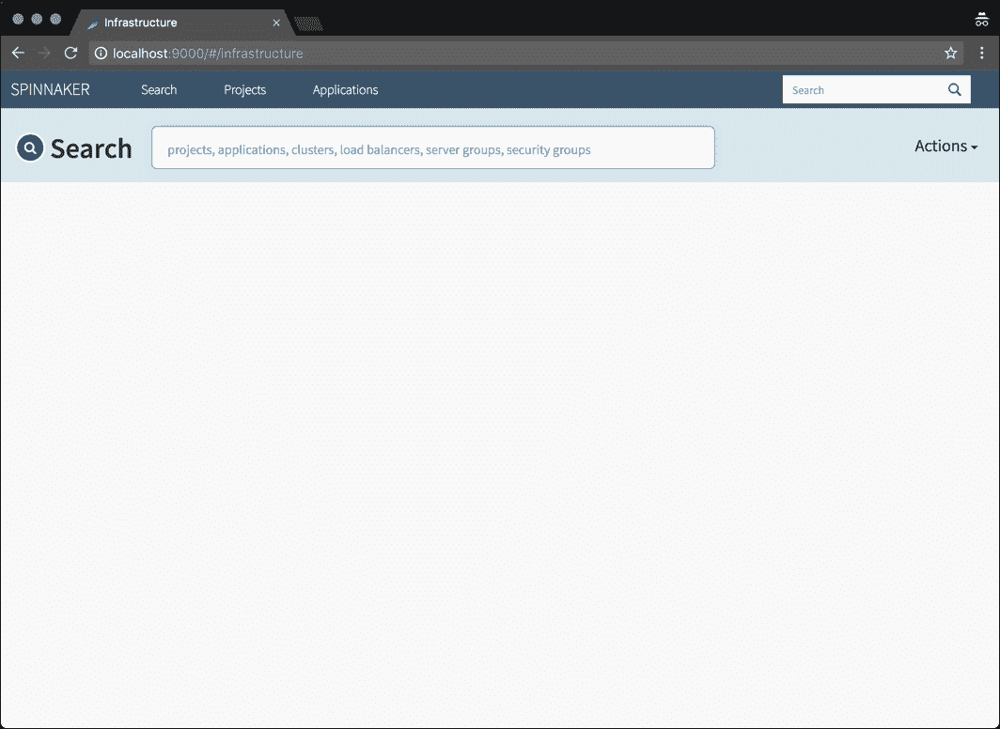

## 通过 Spinnaker 部署和扩展容器化的应用程序

让我们通过部署一个简单的 Nginx web 服务器来熟悉 Spinnaker 的概念和术语。

首先，通过单击右上角操作菜单下的创建应用程序来创建应用程序。这里的“应用程序”是各种资源的逻辑集合，例如负载平衡器、安全组、服务器组和集群。

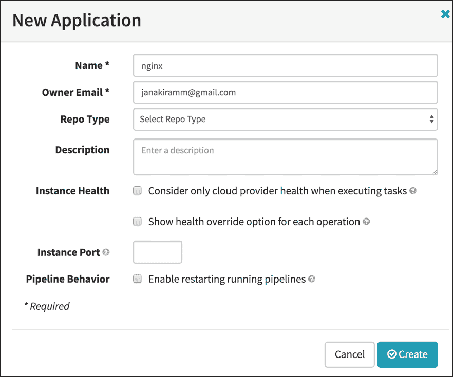

让我们创建一个负载平衡器，通过它可以访问应用程序。单击顶部菜单栏上的负载平衡器，然后单击创建负载平衡器按钮。

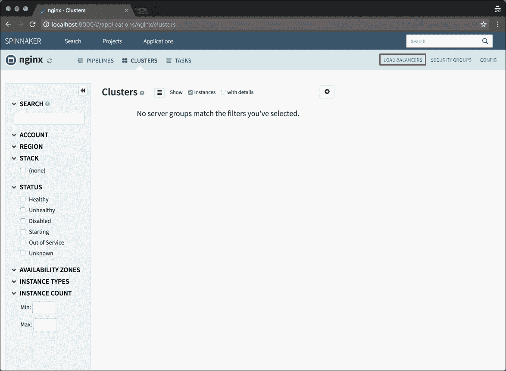

**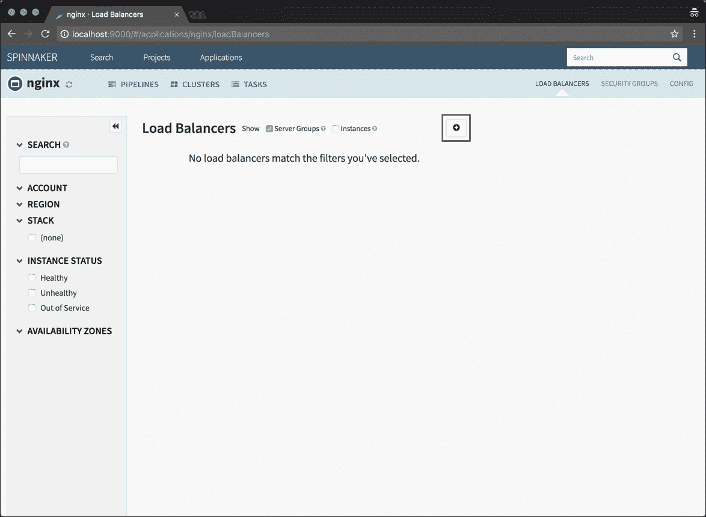**

创建新的负载均衡器时，键入 ***prod*** 作为栈名， ***80*** 作为目标端口，选择 ***NodePort*** 作为类型。完成后点击 ***创建*** 按钮。

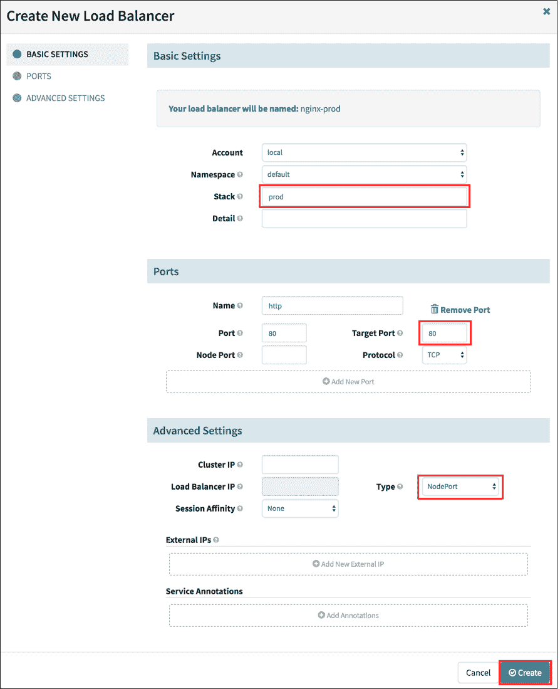

在 ***集群下*** ，点击 ***创建服务器组。***

**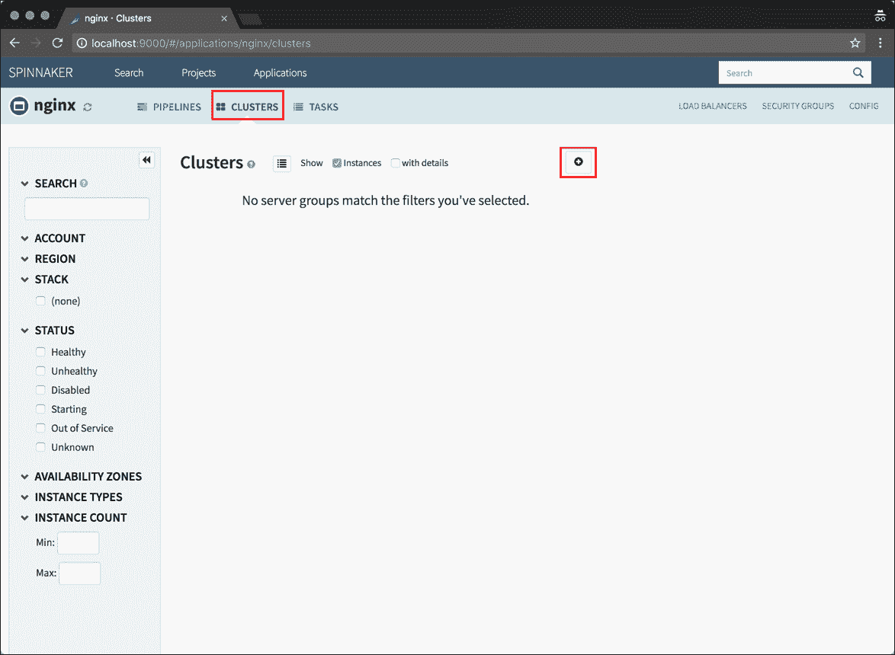**

创建新的服务器组时，键入 ***prod*** 作为堆栈名称。从下拉列表中选择 ***nginx:latest*** 作为容器。选择 ***nginx-prod*** 作为负载平衡器，这是我们在上一步中创建的。键入 ***10*** 作为容量。

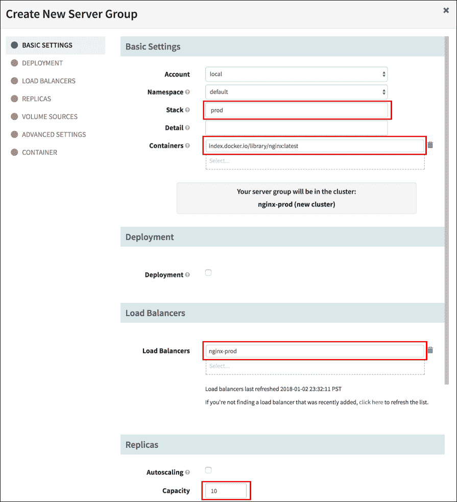

在 ***容器*** 设置下，选择 ***探针*** 创建 ***准备就绪探针*** 和 ***活性探针*** ，默认设置。最后，点击 ***创建*** 按钮。

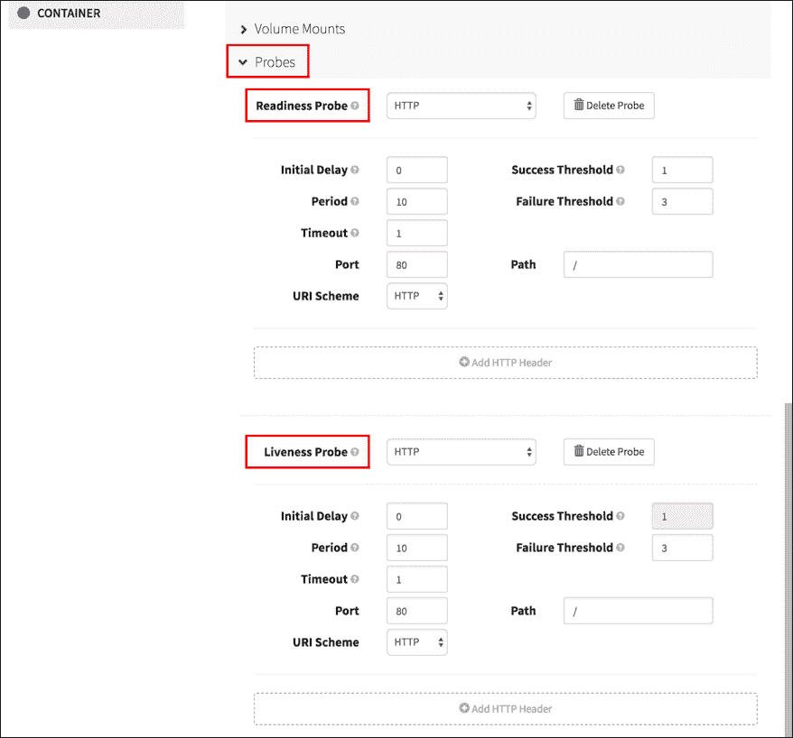

等待服务器组下的实例变得可用。红色块表示实例还没有准备好。

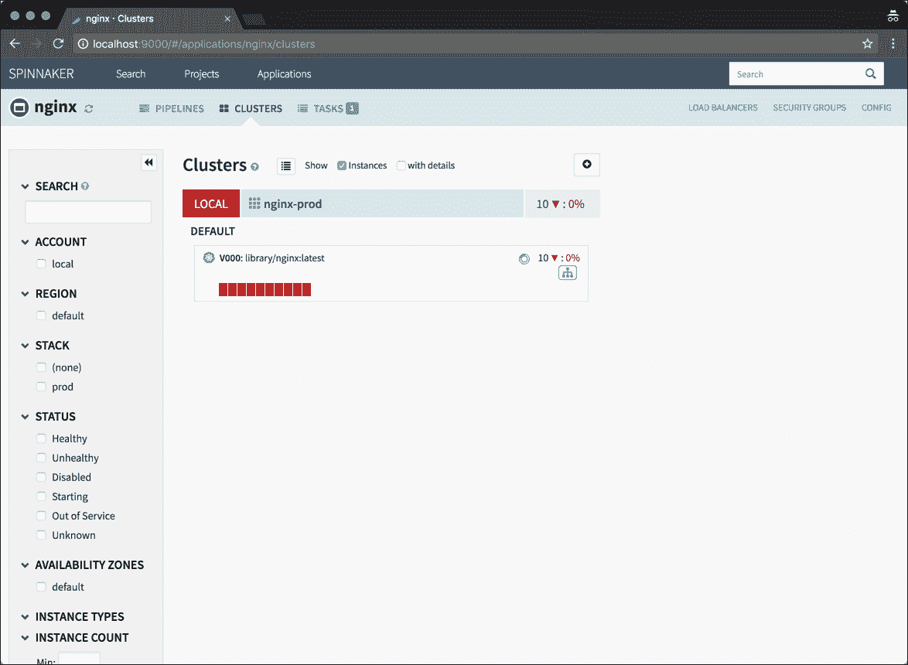

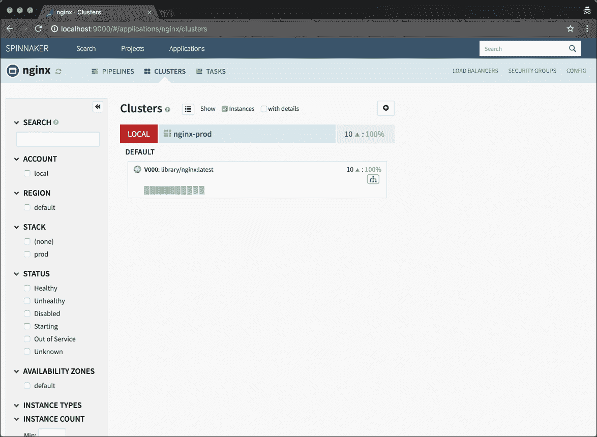

切换到终端，运行下面的命令来获取服务的节点端口。

```
$  kubectl get svc

NAME          TYPE         CLUSTER-IP      EXTERNAL-IP    PORT(S)         AGE

kubernetes    ClusterIP    10.96.0.1       &lt;none&gt;         443/TCP         50m

nginx-prod    NodePort     10.99.164.47    &lt;none&gt;         80:31728/TCP    18m

```

在 Spinnaker 中创建的负载平衡器被翻译成 Kubernetes 中的节点端口服务。我们现在通过 Minikube 命令直接访问它。

```
$  minikube service nginx-prod

Opening kubernetes service default/nginx-prod in default browser...

```

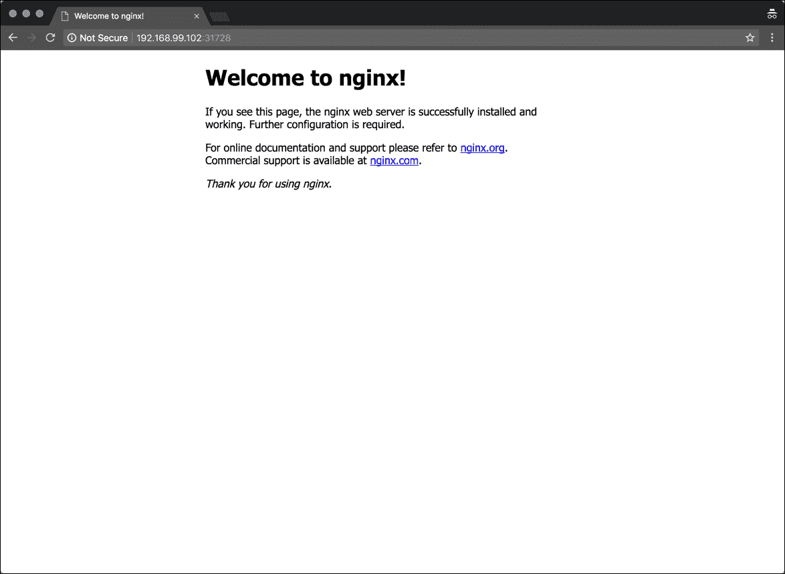

运行 *kubectl get pods* 显示从 Nginx 容器创建了 10 个 pods。

```
$  kubectl get pods

NAME                     READY      STATUS     RESTARTS    AGE

nginx-prod-v000-6m642    1/1        Running    0           9m

nginx-prod-v000-9kxtv    1/1        Running    0           9m

nginx-prod-v000-bpzw4    1/1        Running    0           9m

nginx-prod-v000-f87gn    1/1        Running    0           9m

nginx-prod-v000-h629g    1/1        Running    0           9m

nginx-prod-v000-hkhjc    1/1        Running    0           9m

nginx-prod-v000-jhnv2    1/1        Running    0           9m

nginx-prod-v000-jmkgx    1/1        Running    0           9m

nginx-prod-v000-s59pm    1/1        Running    0           9m

nginx-prod-v000-ssz85    1/1        Running    0           9m

```

在 Spinnaker dashboard 中展开服务器组也证实了这一点。

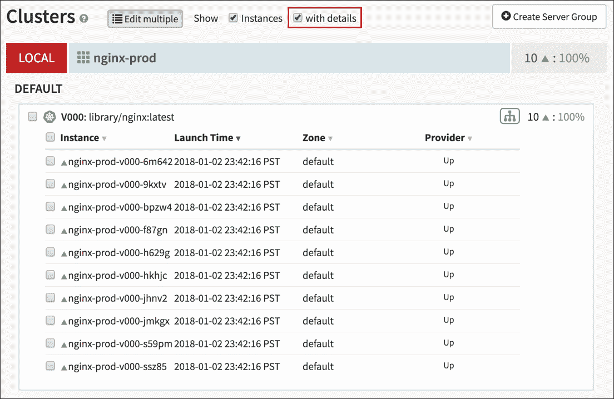

本教程涵盖了在开发环境中启动和运行 Spinnaker 的所有步骤。在 Spinnaker 系列的下一部分中，我们将通过 Spinnaker 为蓝/绿部署构建一个端到端 CI/CD 管道。敬请期待！

*在这里可以找到关于学习 Spinnaker 的本系列的其他版本。*

<svg xmlns:xlink="http://www.w3.org/1999/xlink" viewBox="0 0 68 31" version="1.1"><title>Group</title> <desc>Created with Sketch.</desc></svg>