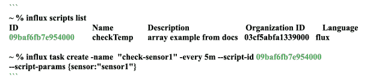
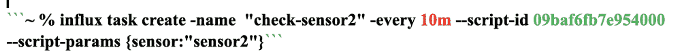
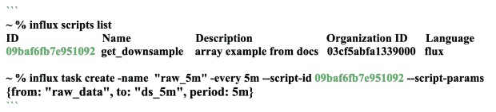
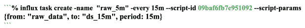

# InfluxDB 脚本使用入门

> 原文：<https://thenewstack.io/getting-started-using-scripts-with-influxdb/>

[](https://www.linkedin.com/in/jrmyers)

 [杰森·迈尔斯

杰森是 InfluxData 的技术营销作家。他获得了芝加哥罗耀拉大学的爱尔兰现代史博士学位。从那以后，他利用自己的写作技巧为一系列初创公司和科技公司创作内容。](https://www.linkedin.com/in/jrmyers) [](https://www.linkedin.com/in/jrmyers)

时序数据无处不在，这一现实不会改变。时序数据的本质意味着时序工作负载不同于许多其他类型的数据。鉴于时间序列数据在现代互联世界中的普遍存在，确保开发人员拥有管理这些数据的工具比以往任何时候都更加重要。

通过使用时序数据库的脚本， [InfluxDB](https://www.influxdata.com/?utm_source=vendor&utm_medium=referral&utm_campaign=2022-09_spnsr-ctn_scripts-influxdb_tns) 帮助开发人员简化和民主化应用程序开发，扩展时序工作负载并构建精益集成以增强系统或应用程序功能。

在 InfluxDB 的上下文中，脚本由 [Flux](https://docs.influxdata.com/flux/v0.x/get-started/?utm_source=vendor&utm_medium=referral&utm_campaign=2022-09_spnsr-ctn_scripts-influxdb_tns) 代码组成。(Flux 是 InfluxDB 的脚本和查询语言。你可以在这里学习如何使用焊剂[。)您可以在本地机器上编写 Flux 脚本，然后上传代码并将其安装在 InfluxDB Cloud 中。一旦进入 InfluxDB Cloud，您就可以以不同的方式共享和利用这些脚本。](https://university.influxdata.com/courses/beginner-flux-tutorial/?utm_source=vendor&utm_medium=referral&utm_campaign=2022-09_spnsr-ctn_scripts-influxdb_tns)

## 在团队中保存和共享代码

首先，脚本对于开发团队来说是一个很好的学习工具。Flux 专家可以编写高级的 Flux 应用程序，并将其保存为脚本。然后，其他团队成员可以访问该代码，并根据他们的需要直接使用它。访问这些脚本意味着团队成员在他们自己的工作中有一个有价值的资源可以阅读、学习和重用。

您还可以将脚本与任务结合使用。InfluxDB [任务系统](https://docs.influxdata.com/influxdb/cloud/process-data/manage-tasks/create-task/#create-a-task-in-the-task-ui?utm_source=vendor&utm_medium=referral&utm_campaign=2022-09_spnsr-ctn_scripts-influxdb_tns)是一个自动化平台，用于按照特定的时间表运行查询。在任务中安装脚本意味着每次任务按计划运行时都会执行脚本。这很有帮助，因为您可以在多个任务上安装相同的脚本。当您更新该脚本时，这些更改会自动应用于调用该脚本的所有任务。如果你有很多任务，在一个地方进行修改并立即应用到整个系统的能力可以节省大量的时间。

## 动态数据分析

将动态参数传递到脚本的能力简化了开发和规模管理过程。假设您有一个制造工厂，您需要保持建筑内的温度，因此您在它的各处安装了温度传感器。您需要在每个传感器上运行相同的检查，但是不同型号的传感器的检查频率不同。以下脚本是一个简单温度检查操作的开始。该脚本有一些动态变量，它将从调用该脚本的任务中提取。

```
```// script checkTemp
import  "slack"

sendSlackMessage  =  (text,  color)  =&gt;
   slack.message(
          url:  "https://hooks.slack.com/services/YOURHOOKHERE",
       token:  "",
       channel:  "team-sensors",
       text:  text,
       color:  color,
   )

from(bucket:"sensors")
 |&gt;  range  (start:-tasks.every)
 |&gt;  filter  (fn(r)=&gt;r.sensor_id==params.sensor)
 |&gt;  map(  fn(r)  =&gt;  {
           return  {r  with sentMessage:
             if  r.temperature  &gt;  80
             then string(v:  200  ==  sendSlackMessage(color:  "warning",  text:  "Temperature on sensor ${r.sensor_id} is WARN: ${r.temperature}")  )  }
             else if  r.temperature  &gt;  100

               then string(v:  200  ==  sendSlackMessage(color:  "danger",  "text":  "ALERT: Temperature sensor on ${r.sensor_id} needs immediate attention: ${r.temperature}"))
             else  "false"
       }
   )
 |&gt;  to(bucket:  "SensorCheckLog")

```

```

我们这里有两个任务示例。第一个每五分钟检查一次传感器的温度。该任务调用`check_temp`脚本并传入传感器 ID 进行检查。



下一个任务做同样的事情，主要区别是`task_10`任务以不同的时间间隔检查不同的传感器。这次是每 10 分钟一次。



## 用数据和脚本创造价值

将数据动态插入脚本和任务的能力使得大规模管理任务和设备变得更加容易。以这种方式使用脚本可以让您以任何提供价值的方式快速分割数据。

例如，假设您想要在两个不同的粒度级别上对数据集执行相同的转换。以下脚本计算一个简单的平均值。汇总的数据源、数据输出位置和窗口都是动态值。

```
// script get_downsample
from(bucket:params.from)
|>  range(start:-tasks.every)
|>  AggregateWindow(period:params.period,  fn:mean)
|>  to(bucket:params.to)

```

要在任务中使用这个脚本，我们需要调用脚本并传入参数。这里，我们从`raw_data`桶中选择数据，取五分钟窗口的平均值，然后将聚合数据发送到一个名为`ds_5m`的新桶。



以下任务对相同的数据执行相同的操作，但有一些关键的区别。我们在这里得到了更粗的平均粒度，平均 15 分钟窗口的数据。我们希望将这些数据分开进行分析，所以我们将把它们发送到自己的桶中，`ds_15m`。



如果一个基本的平均运算不能满足您的需要，您可以用一个更高级的数据分析算法更新脚本，任务将自动开始使用该算法。同样，这有助于管理数据源和大规模处理。

## 通过脚本实现更智能的警报

虽然脚本使得扩展系统变得更加容易，但是它们也可以帮助监控那些不断增长的系统。您可以使用脚本来简化基于时间序列数据的[警报](https://www.influxdata.com/blog/influxdbs-checks-and-notifications-system/?utm_source=vendor&utm_medium=referral&utm_campaign=2022-09_spnsr-ctn_scripts-influxdb_tns)。假设我们建立了一个策略，用于在出现问题时提醒站点可靠性工程(SRE)团队。一种方法是用 Flux 脚本写出您的警报策略。

使用像 InfluxDB 这样的时间序列数据库，这可能包括诸如加载消息传递秘密之类的项目。(InfluxDB 有一个用于存储秘密的安全保险库，Flux 在需要时可以调用来提取这些秘密。)另一个要考虑的策略元素是消除重复警报的过程。与其让同一个警报持续 ping 您的端点，不如将当前警报与前一个警报进行比较，以查看是否存在状态变化。如果不是，就没有必要再发警报了。

脚本中用于设置实际端点以及何时何地发送警报的标准的部分是使用动态变量的有用位置。

```
import  "influxdata/influxdb/secrets"
import  "slack"
import  "pagerduty"
import  "array"

slackhook  =  secrets.get(key:  "SLACK_HOOK")
pd_key  =  secrets.get(key:  "PD_KEY")

sendSlackMessage  =  (text,  color)  =>
 slack.message(
 url:  slackhook,
 token:  "",
 channel:  "your-channel",
 text:  text,
 color:  color,
 )

pagerduty_endpoint  =  pagerduty.endpoint()
sendPagerDutyMessage  =  (
 service,
 level,
 summary,
 timestamp,
 key,
)  =>
 pagerduty.sendEvent(
 class:  "error_alert",
 client:  "your-company",
 clientURL:  "http://your.company.com",
 dedupKey:  key,
 eventAction:  pagerduty.actionFromLevel(level),
 group:  service,
 routingKey:  pd_key,
 severity:  pagerduty.severityFromLevel(level),
 source:  "ALERT_SRE",
 summary:  summary,
 timestamp:  timestamp,
 )

record  =  if params.level=="crit"
then  {pd_sent:  sendPagerDutyMessage(
 key:  params.pagerdutyDedupKey,
 level:  params.level,
 service:  "sre-services",
 summary:  params.message,
 timestamp:  now(),
 ).statusCode,
 slack_sent:  0,
 message:  params.message,
 _time:  now(),
 level:  prams.level
}

else if params.level=="warn"
then  {    pd_sent:  0,
 slack_sent:  sendSlackMessage(text:  params.message,  color:  "warning"),
 message:  params.message,
 _time:  now(),
 level:  prams.level
}
else if params.level=="ok"
then  {pd_sent:  sendPagerDutyMessage(
 key:  params.pagerdutyDedupKey,
 level:  params.level,
 service:  "sre-services",
 summary:  params.message,
 timestamp:  now(),
 ).statusCode,
 slack_sent:  sendSlackMessage(text:  params.message,  color:  "ok"),
 message:  params.message,
 _time:  now(),
 level:  prams.level
}
// shouldn't hit this case, is added for syntactical correctness
else  {pd_sent:  0,
 slack_sent:  sendSlackMessage(text:  params.message,  color:  "ok"),
 message:  params.message,
 _time:  now(),
 level:  prams.level}

array.from(rows:[record])
 |>  set(key:  "_measurement",  value:  "SRE_ALERTS")
 |>  group(columns:  ["level",  "pd_sent",  "slack_sent",  "_measurement"])
 |>  wideTto(bucket:  "AlertSeriesLog")

```

在上面的例子中，当一个任务生成一个紧急警报时，脚本会接收一个定制消息，并将其发送到一个 [PagerDuty](https://www.influxdata.com/integration/pagerduty/?utm_source=vendor&utm_medium=referral&utm_campaign=2022-09_spnsr-ctn_scripts-influxdb_tns) 端点。如果这是一个关键问题，可能值得叫醒某人来解决它。警告警报[向类似 Slack 的群组消息](https://www.influxdata.com/blog/tldr-influxdb-tech-tips-configuring-slack-notification-with-influxdb/?utm_source=vendor&utm_medium=referral&utm_campaign=2022-09_spnsr-ctn_scripts-influxdb_tns)平台发送定制警报消息。如果警报级别恢复正常，您可能希望向随叫随到的 sre 和更广泛的团队发出警报，让他们知道问题已经解决。

将警报历史数据写入 InfluxDB 中的一个新桶也是一个好主意，因此将它作为您的警报策略的一部分。警报历史记录为 sre 提供了有关事件的详细信息，以便他们可以跟踪问题的主要里程碑。预警历史记录还会通知重复消除流程。因为我们正在处理时间序列数据，所以很容易回顾以前的警报，并确定它是重复的还是新的。

## 使用可调用脚本扩展可能性

另一个有用的选项是将警报策略脚本安装为一个[可调用脚本](https://www.influxdata.com/blog/tldr-influxdb-tech-tips-api-invokable-scripts-influxdb-cloud/?utm_source=vendor&utm_medium=referral&utm_campaign=2022-09_spnsr-ctn_scripts-influxdb_tns)。在一个可调用的 URL 后面安装一个 Flux 脚本，使用户能够使用一个经过身份验证的令牌从平台外部访问他们的时序数据和 InfluxDB。

这极大地简化了应用程序开发，因为它允许开发人员访问时间序列数据，而无需在代码中安装额外的库或组件。他们可以简单地调用 URL 端点。

[https://www.youtube.com/embed/JwuPpuY-ZF8?feature=oembed](https://www.youtube.com/embed/JwuPpuY-ZF8?feature=oembed)

视频

因此，继续我们的示例，将脚本放在可调用的 URL 后面，使支持您的应用程序的外部服务或应用程序能够通过调用脚本 URL 来使用相同的警报策略。这些服务不需要担心政策的细节。它们只需要传入警告级别的参数和相应的消息。

## 结论

无论您计划如何使用时间序列数据，脚本都可以帮助您更加高效和有效地使用它。采用动态参数的脚本有助于简化伸缩，因为您可以编写脚本来完成复杂的操作，并简单地在整个解决方案中重用它们。您甚至可以向外部资源公开脚本，用更少的代码行构建更复杂、更健壮的解决方案。

<svg xmlns:xlink="http://www.w3.org/1999/xlink" viewBox="0 0 68 31" version="1.1"><title>Group</title> <desc>Created with Sketch.</desc></svg>