# C++和 InfluxDB 入门

> 原文：<https://thenewstack.io/getting-started-with-c-and-influxdb/>

[](https://portal.draft.dev/writers/rec9zSjQeEtqubS2m)

[Pravin Kumar Sinha](https://portal.draft.dev/writers/rec9zSjQeEtqubS2m)

[Pravin 是印度班加罗尔 Minh，Inc .的 Python 开发人员和培训顾问，拥有 22 年的面向对象技术经验，主要是 C++、Qt/Qml、Python。](https://portal.draft.dev/writers/rec9zSjQeEtqubS2m)

[](https://portal.draft.dev/writers/rec9zSjQeEtqubS2m)[](https://portal.draft.dev/writers/rec9zSjQeEtqubS2m)

虽然关系数据库管理系统(RDBMS)在电子表格体系结构中存储表、列和主键是有效的，但是当长时间接收到大量数据输入时，它们就变得低效了。

专门为存储时间序列数据而设计的数据库被称为时间序列数据库( [TSDB](https://www.influxdata.com/time-series-database/) )。

例如，RDBMS 可能看起来像这样:

```
  ------------------------------------------------------------------
  |  Id  | Name |  Age  |  Phonenumber |    email        |
  ------------------------------------------------------------------
  |  0  |  Jonn |  26 |  xxxxxx          |  john@email.com  |
  |  1  |  Susan          |  44 |  xxxxxx          |  susan@email.com  |
  |  2  |  Alice          |  19 |  xxxxxx          |  alice@email.com  |
  |  3  |  Jennifer |  32 |  xxxxxx          |  jennifer@email.com  |
  ---------------------------------------------------------------------

```

在 TSDB 中，数据按测量值分类。度量是一个容器，大致相当于 RDBMS 中的一个表，其中包含时间和字段数据的元组。每个条目是一个(时间、字段数据)元组，并被识别为一个*点*。一个点可以选择包含一个字符串标签。\

TSDB 可能看起来更像这样:

```
  ----------------------------------------------------
  | Tag | Field | Timestamp  |
  |city device name |  temperature  |              |
  ------------------------------------------------------------------
  |HUSTON    deviceX    |  23          |  2021-11-20T12-31-18.865954  |
  |MIAMI deviceX    |  26          |  2021-11-20T12-31-18.965954  |
  |MIAMI deviceY    |  23          |  2021-11-20T12-31-19.965954  |
  |SEATTLE deviceY    |  18          |  2021-11-20T12-31-19.965954  |
  |SEATTLE deviceZ    |  19          |  2021-11-20T12-31-20.814952  |
  |ATLANTA deviceA    |  20          |  2021-11-20T12-31-21.665954  |
  |DALLAS    deviceC    |  28          |  2021-11-20T12-31-22.485954  |
  ------------------------------------------------------------------

```

上面显示的示例 TSDB 存储了在一段时间(时间戳)内不同城市(标签)测量的温度(测量值)和值(现场数据)，这些值是通过多家公司生产的设备(标签)测量的。

但 TSDBs 可以促进对各种数据的持续监控，如物联网传感器、市场交易数据和股票交易数据。本文向您展示了如何使用 C++库设置、配置、连接、编写和查询 InfluxDB 数据库。

[InfluxDB](https://www.influxdata.com/) 是一个开源时序数据库，旨在处理高写入和读取/查询[时间戳数据](https://www.influxdata.com/what-is-time-series-data/)负载。除了提供持续的数据流，如服务器指标或应用程序监控，InfluxDB 还提供事件生成、实时分析、备份存储数据的自动过期和删除，以及[预测](https://www.influxdata.com/time-series-forecasting-methods/)和[分析](https://www.influxdata.com/time-series-analysis-methods/)时间序列数据的简单方法。

您将了解如何在 InfluxDB 数据库中存储真实的物联网传感器数据，然后将存储的数据作为时间段样本块进行分析。我们最后将把数据绘制成图表。

## 设置 InfluxDB 服务器

本教程设置在 Ubuntu 20.04 LTS 上，但是你可以在 [InfluxDB 的文档](https://docs.influxdata.com/influxdb/v1.8/introduction/install/)中找到其他安装支持。你可以在这里跟随本教程的源代码。

```
sudo apt-get install influxdb
  sudo systemctl start influxdb
  sudo systemctl status influxdb

```

`systemctl status influxdb`应显示运行状态:

```
influxdb.service  -  InfluxDB is an open-source,  distributed,  time series database
  Loaded:  loaded  (/lib/systemd/system/influxdb.service;  enabled;  vendor preset:  enabled)
  Active:  active  (running)  since Sat  2021-11-20  14:24:56  IST;  39s  ago
  Docs:  man:influxd(1)
  Main PID:  23892  (influxd)
  Tasks:  13  (limit:  4505)
  Memory:  4.5M
  CGroup:  /system.slice/influxdb.service
  └─23892  /usr/bin/influxd  -config  /etc/influxdb/influxdb.conf

```

本教程的 InfluxDB 服务器版本是 1.6.4。您可以通过运行`$influxd`获得更多关于服务器配置的信息，并使用`/etc/influxdb/influxdb.conf`调整您的配置。

## 设置 influxdb-cxx C++客户端库

本教程使用版本为 0.6.7 的 [influxdb-cxx](https://github.com/offa/influxdb-cxx) 客户端库来连接、填充和查询 influxdb 服务器。InfluxDB 服务器正在侦听 IP 地址 127.0.0.1 和 TCP 端口 8086。

### 先决条件

如前所述，本教程是建立在 Ubuntu 20.04 LTS。软件依赖列表的其余部分如下:

*   C++ 17 编译器。可以通过`sudo apt-get install g++`安装 g++ 9.3.0。
*   CMake 3.12+工具。可以通过`sudo apt-get install cmake`安装 CMake 3.16.3。
*   Curl 库。可以通过`sudo apt-get install libcurl4-openssl-dev`安装 curl4-openssl。
*   Boost 1.57+库(可选)。通过`sudo apt-get install libboost1.71-all-dev`安装 Boost 1.71 c。

### 获取 influxdb-cxx 客户端库

创建一个新目录并执行以下命令:

```
$git clone https://github.com/offa/influxdb-cxx

```

### 构建 influxdb-cxx 客户端库

```
$cd influxdb-cxx
  $mkdir build  &amp;&amp;  cd build

```

当不需要测试套件时，您可以在运行 cmake 时将以下选项设置为 **OFF** 。

```
$cmake  -D  INFLUXCXX_TESTING:BOOL=OFF  ..

```

### 安装 influxdb-cxx 客户端库

客户端库构建`libInfluxDB.so`并在`/usr/local/lib/libInfluxDB.so`安装。头文件`InfluxDBFactory.h`、`InfluxDB.h`、`Point.h`、`Transport.h`安装在`/usr/local/include/`。

> 编译和链接源代码时分别需要头文件和库文件。

C++应用程序在链接时使用`libInfluxDB.so`来生成可执行的二进制文件。

```
-----------------
  |libInfluxDB.so  |
  -----------------
  ^
  |  &lt;&lt;link&gt;&gt;
  |
  ---------------  &lt;&lt;compile&gt;&gt;
  |  C++  program  |  ----------&gt;  InfluxDBFactory.h
  ---------------  |  InfluxDB.h
  |  |  Point.h
  |&lt;&lt;generates  +--&gt;  Transport.h
  |  executable&gt;&gt;
  ------------
  |Executable|
  ------------

```

### influxdb-cxx 客户端库类设计

influxdb-cxx 客户端被设计为通过类`InfluxDB`与 influxdb 服务器进行交互。所有的`influxdb-cxx`类都在全局名称空间`influxdb`下定义。

```
  --------------------
  |  InfluxDBFactory  |---o  get()  [protocol]://[username:password@]host:port[?db=database]
  --------------------  \  --------------
  |  \&lt;&lt;connects&gt;&gt;  ----&gt;|  TSDB  |
  |&lt;&lt;returns&gt;&gt;  v  /  |Time-Series  |
  |  -------------------  /  |  Database  |
  |  +----------&gt;|  InfluxDB server  |  --  --------------
  |  /  -------------------
  |  +--+
  |  |
  ------------
  |  |  ----o  createDatabaseIfNotExists()
  |  |  ----o  write()
  |  InfluxDB  |  ----o  query()
  |  |  --o  batchOf()
  |  |  --o  flushBatch()
  ------------
  |
  v
  &lt;&lt;Measurement&gt;&gt;
  ----------------
  |  Point  |  ----o  addField()
  |--------------|
  |  +measurement  |  ----o  setTimestamp()|
  ----------------
  |
  o
  addTag()

```

`InfluxDBFactory`类提供了`get()`方法，该方法接受一个 URI 字符串，该字符串包含 IP 地址、带有可选协议名的端口、数据库名、数据库用户和密码等信息。HTTP URI 默认为`tcp`。`InfluxDBFactory`返回连接到 InfluxDB 服务器的`InfluxDB`类。

然后，`InfluxDB`类提供了创建数据库、写入数据库和查询数据库的方法。`InfluxDB`类将一个点(或一系列点)写入数据库——point 类代表一个测量容器。

由于度量容器包含`tag`、`field`和`timestamp`，因此`point`类提供了向自身添加`tag`、`field`和`timestamp`的方法。以`point`为参数调用`InfluxDB`类上的`write()`方法，首先按照线路协议规则序列化点类数据。

最终线路协议数据随后被发送到 InfluxDB 服务器。`InfluxDB`类也支持批处理模式，其中`batchOf()`方法指定批处理大小。`addPointToBatch()`方法获取要添加的点的列表，`flushBatch()`方法最终写入数据库。

### 建立联系

使用 URI 字符串调用`InfluxDBFactory.get()`方法来创建与 InfluxDB 服务器的连接。将 URI 指定为:

```
[protocol]://[username:password@]host:port[?db=database]

```

比如你可以把`get()`方法调用成`influxdb::InfluxDBFactory::Get("http://localhost:8086?db=temperature_db")`。

这里 HTTP (TCP)是协议，localhost (127.0.0.1)是 IP 地址，8086 是 TCP 端口，`temperature_db`是数据库名。您可以使用 HTTP (TCP)、UDP 和 Unix 套接字作为协议。IP 地址、协议、用户名、密码、端口号和数据库名称也可以通过[配置文件`/etc/influxdb/influxdb.conf`](https://docs.influxdata.com/influxdb/v1.8/administration/config/) 进行配置。
在本例中，您可以通过指定数据库名称来建立连接。如果数据库不存在，请创建它。

```
auto db  =  influxdb::InfluxDBFactory::Get("http://localhost:8086?db=temperature_db");
db-&gt;createDatabaseIfNotExists();

```

```
#include &lt;iostream&gt;
#include &lt;InfluxDBFactory.h&gt;
int main(int argc,char *argv[])  {
  auto db  =  influxdb::InfluxDBFactory::Get("http://localhost:8086?db=temperature_db");
  db-&gt;createDatabaseIfNotExists();
  for  (auto  i:  db-&gt;query("SHOW DATABASES"))  std::cout&lt;&lt;i.getTags()&lt;&lt;std::endl;
  return  0;
}

```

### 编译、链接和创建可执行文件

在一个新目录中，创建一个名为`CMakeLists.txt`的文件。

```
$mkdir cxx-influxdb-example  &amp;&amp;  cd cxx-influxdb-example

```

在`CMakeLists.txt`中增加以下几行:

```
cmake_minimum_required(VERSION  3.12.0)
project(cxx-influxdb-example)
find_package(InfluxDB)
add_executable(example-influx-cxx main.cpp)
target_link_libraries(example-influx-cxx PRIVATE InfluxData::InfluxDB)

```

`cxx-influxdb-example`是项目名称，而`example-influx-cxx`是可执行文件名称。

编写您的`main.cpp`代码，包括`influxdb-cxx`客户端头文件。

```
$mkdir build  &amp;&amp;  cd build
  $cmake  ..
  $make
  $./example-influx-cxx

```

输出:

```
name=_internal
name=temperature_db

```

### 使用 SSL/TLS 连接

默认情况下，HTTP 是禁用的。您需要购买 SSL 密钥和证书。修改配置文件`/etc/influxdb/influxdb.conf`，修改或添加以下键值对:

```
https-enabled=true
https-certificate=/etc/ssl/&lt;signed-certificate-file&gt;.crt  (or to  /etc/ssl/&lt;bundled-certificate-file&gt;.pem)
https-private-key=/etc/ssl/&lt;private-key-file&gt;.key  (or to  /etc/ssl/&lt;bundled-certificate-file&gt;.pem

```

接下来，运行以下命令:

```
$sudo chown influxdb:influxdb  /etc/ssl/&lt;CA-certificate-file&gt;
$sudo chmod  644  /etc/ssl/&lt;CA-certificate-file&gt;
$sudo chmod  600  /etc/ssl/&lt;private-key-file&gt;
$sudo systemctl restart influxdb

```

您可以在`InfluxDBFactory.get()` URI 参数中指定`https`而不是`http`来获得 TLS(SSL)加密。

```
influxdb::InfluxDBFactory::Get("https://localhost:8086?db=temperature_db");

```

### 写入 InfluxDB 数据库

InfluxDB 数据库被组织成各种度量。如前所述，度量就像一个容器，相当于 RDBMS 中的表。每个测量记录是一个点，它是一个元组(测量、标签、字段值、时间)。

```
Measurement  -  String
  Tag name,value  -  String
  Field name  -  String
  Filed value  -  String,  Integer,  Float and Boolean
  Timestamp  -  Unix nanosecond timestamps

```

通过指定测量名称、标签名称、值对列表(可选)、字段名称、值对列表和时间戳(可选)，可以用`InfluxDB.write()`方法向数据库写入一个点。InfluxDB 数据库服务器会添加一个缺失的时间戳。

```
auto db  =  influxdb::InfluxDBFactory::Get("http://localhost:8086?db=temperature_db");
db-&gt;write(influxdb::Point{"temperature"}.addTag("city","DALLAS").addTag("device","companyX").addField("value",28));

```

### 查询数据

您可以通过调用`InfluxDB.query()`方法并传递 SQL 查询字符串作为参数来查询 InfluxDB。InfluxDB 中的数据库记录以 JSON 格式返回，其中每个记录由一个`point`类表示。`Point.getName()`、`Point.getTags()`、`Point.getFields()`和`Point.getTimestamp()`分别返回度量、标签、字段和时间戳。

```
#include &lt;iostream&gt;
#include &lt;InfluxDBFactory.h&gt;
int main(int argc,char *argv[])  {
  auto db  =  influxdb::InfluxDBFactory::Get("http://localhost:8086?db=temperature_db");
  for  (auto  i:  db-&gt;query("select * from temperature"))  {
  std::cout&lt;&lt;i.getName()&lt;&lt;":";
  std::cout&lt;&lt;i.getTags()&lt;&lt;":";
  std::cout&lt;&lt;i.getFields()&lt;&lt;":";
  std::cout&lt;&lt;std::to_string(std::chrono::duration_cast&lt;std::chrono::nanoseconds&gt;(i.getTimestamp().time_since_epoch()).count())&lt;&lt;std::endl;
  }
  return  0;
}

```

输出:

```
temperature:city=DALLAS,device=companyX:value=28.000000000000000000:1637659246724538477

```

您可以通过设置`influxdb::Point::floatsPrecision=4`来设置浮动类型精度。

```
int main(int argc,char *argv[])  {
  auto db  =  influxdb::InfluxDBFactory::Get("http://localhost:8086?db=temperature_db");
  influxdb::Point::floatsPrecision=4;
  ...

```

输出:

```
temperature:city=DALLAS,device=companyX:value=28.0000:1637659246724538477

```

### 批量写入 InfluxDB

提到批量大小后，就可以批量写数据了。调用`flushBatch()`方法将数据刷新到数据库。

```
#include &lt;iostream&gt;
#include &lt;InfluxDBFactory.h&gt;
int main(int argc,char *argv[])  {
  auto db  =  influxdb::InfluxDBFactory::Get("http://localhost:8086?db=temperature_db");
  influxdb::Point::floatsPrecision=4;
  db-&gt;batchOf(10);
  for  (int  i=0;i&lt;10;i++)
  db-&gt;write(influxdb::Point{"temperature"}.addTag("city","SEATTLE").addTag("device","companyY").addField("value",28+i));
  db-&gt;flushBatch();
  return  0;
}

```

## 使用 influxdb-client 实用程序进行调试

您也可以通过 Ubuntu 20.04 上的 influxdb-client 实用程序通过`$sudo apt-get install influxdb-client`来验证 InfluxDB 中的可用数据。

```
$  influx
Connected to http://localhost:8086 version 1.6.4
InfluxDB shell version:  1.6.4
&gt;  SHOW DATABASES
name:  databases
name
----
_internal
temperature_db
&gt;  use temperature_db
Using database temperature_db
&gt;  SELECT *  FROM temperature
name:  temperature
time city device value
----  ----  ------  -----
1637661663965328258  SEATTLE companyY  28
1637661663965352861  SEATTLE companyY  29
1637661663965357288  SEATTLE companyY  30
  .....

```

## 完成的应用程序

完整的程序如下:

```
#include &lt;iostream&gt;
#include &lt;InfluxDBFactory.h&gt;
int main(int argc,char *argv[])  {
  auto db  =  influxdb::InfluxDBFactory::Get("http://localhost:8086?db=temperature_db");
  influxdb::Point::floatsPrecision=4;
  db-&gt;createDatabaseIfNotExists();
  for  (auto  i:  db-&gt;query("SHOW DATABASES"))  std::cout&lt;&lt;i.getTags()&lt;&lt;std::endl;
  db-&gt;write(influxdb::Point{"temperature"}.addTag("city","DALLAS").addTag("device","companyX").addField("value",28));
  db-&gt;batchOf(10);
  for  (int  i=0;i&lt;10;i++)
  db-&gt;write(influxdb::Point{"temperature"}.addTag("city","SEATTLE").addTag("device","companyY").addField("value",28+i));
  db-&gt;flushBatch();
  for  (auto  i:  db-&gt;query("select * from temperature"))  {
  std::cout&lt;&lt;i.getName()&lt;&lt;":";
  std::cout&lt;&lt;i.getTags()&lt;&lt;":";
  std::cout&lt;&lt;i.getFields()&lt;&lt;":";
  std::cout&lt;&lt;std::to_string(std::chrono::duration_cast&lt;std::chrono::nanoseconds&gt;(i.getTimestamp().time_since_epoch()).count())&lt;&lt;std::endl;
  }
return  0;
}

```

## 来自实验物联网传感器的实时数据

测量功率、温度、湿度、光线、二氧化碳和灰尘的物联网传感器数据可从 [IoTSenser](https://github.com/reogac/smart-home/blob/master/sensor-data.csv) 获得。
根据时间戳记录每个数据样本:

```
"2015-08-01 00:00:28",0,32,40,0,973,27.8
"2015-08-01 00:00:58",0,32,40,0,973,27.09
"2015-08-01 00:01:28",0,32,40,0,973,34.5
"2015-08-01 00:01:58",0,32,40,0,973,28.43
"2015-08-01 00:02:28",0,32,40,0,973,27.58
"2015-08-01 00:02:59",0,32,40,0,971,29.35
"2015-08-01 00:03:29",0,32,40,0,971,26.46
...

```

在示例代码中，数据库`iotsensor_db`是用`iotsensor`作为测量字段创建的。

将数据插入数据库并绘制图表的完整代码如下。另外，请注意，该图是从 Cpp 目录中的 [pbPlots](https://github.com/InductiveComputerScience/pbPlots) 实用程序绘制的。从`cxx-influxdb-example`目录中复制`pbPlots.cpp`、`pbPlots.hpp`、`supportLib.cpp`和`supportLib.hpp`文件并添加到`CMakeLists.txt`文件中。

```
cmake_minimum_required(VERSION  3.12.0)
project(cxx-influxdb-example)
find_package(InfluxDB)
add_executable(example-influx-cxx supportLib.cpp pbPlots.cpp demomain.cpp)
target_link_libraries(example-influx-cxx PRIVATE InfluxData::InfluxDB)

```

```
#include <iostream>
#include <string>
#include <fstream>
#include <boost/algorithm/string.hpp>
#include <InfluxDBFactory.h>
#include "pbPlots.h"
#include "supportLib.h"
#include <chrono>
std::chrono::system_clock::time_point createDateTime(int year,  int month,  int day,  int hour,  int minute,  int second)  // these are UTC values
{
  tm timeinfo1  =  tm();
  timeinfo1.tm_year  =  year  -  1900;
  timeinfo1.tm_mon  =  month  -  1;
  timeinfo1.tm_mday  =  day;
  timeinfo1.tm_hour  =  hour;
  timeinfo1.tm_min  =  minute;
  timeinfo1.tm_sec  =  second;
  tm timeinfo  =  timeinfo1;
  time_t tt  =  timegm(&timeinfo);
  return std::chrono::system_clock::from_time_t(tt);
}
int main(int argc,char *argv[])  {
  auto db  =  influxdb::InfluxDBFactory::Get("http://localhost:8086?db=iotsensor_db");
  influxdb::Point::floatsPrecision=4;
  db->createDatabaseIfNotExists();
  for  (auto  i:  db->query("SHOW DATABASES"))  std::cout<<i.getTags()<<std::endl;
  std::ifstream file("sensor-data.csv");
  if  (!file)  {
  std::cout<<"Unable to open file"<<std::endl;
  return  -1;
  }
  std::string dataline;
  std::vector<std::string>  sensordatavector,  linevector,  timestampvector;
  while(getline(file,dataline))  {
  dataline.erase(remove(  dataline.begin(),  dataline.end(),  '\"'  ),dataline.end());
  sensordatavector.push_back(dataline);
  }
  std::cout<<"number of entries in sensor data "<<sensordatavector.size()<<std::endl;
  auto t_start  =  std::chrono::high_resolution_clock::now();
  db->batchOf(10000);
  int counter=0;
  for  (std::string  i  :  sensordatavector)  {
  boost::algorithm::split(linevector,  i,  boost::is_any_of(","));
  boost::algorithm::split(timestampvector,  linevector[0],  boost::is_any_of(":- "));
  std::chrono::system_clock::time_point tss=createDateTime(std::stod(timestampvector[0]),std::stod(timestampvector[1]),std::stod(timestampvector[2]),std::stod(timestampvector[3]),std::stod(timestampvector[4]),std::stod(timestampvector[5]));
  db->write(influxdb::Point{"iotsensor"}
  .addField("power",std::stod(linevector[1]))
  .addField("temperature",std::stod(linevector[2]))
  .addField("humidity",std::stod(linevector[3]))
  .addField("light",std::stod(linevector[4]))
  .addField("co2",std::stod(linevector[5]))
  .addField("dust",std::stod(linevector[6]))
  .setTimestamp(tss));
  counter+=1;
  if  (counter==10000)  {
  db->flushBatch();
  counter=0;
  }
  }
  auto t_end  =  std::chrono::high_resolution_clock::now();
  std::cout<<"Total time (ms) for write "<<std::chrono::duration<double,  std::milli>(t_end-t_start).count()<<std::endl;
  std::cout<<"database record count "<<db->query("select * from iotsensor").size()<<std::endl;
  std::vector<double>  doublevector;
  std::vector<double>  fieldvector[6];
  std::vector<std::string>  fieldnamevector;
  sensordatavector.resize(0);linevector.resize(0);
// for (auto i: db->query("select * from iotsensor")) {
  for  (auto  i:  db->query("select * from iotsensor where time> '2015-08-04 00:00:00' and time<'2015-08-08 01:00:00'"))  {
  doublevector.push_back(std::chrono::duration_cast<std::chrono::nanoseconds>(i.getTimestamp().time_since_epoch()).count());
  boost::algorithm::split(sensordatavector,  i.getFields(),  boost::is_any_of(","));
  for  (int  j=0;j<6;j++)  {
  boost::algorithm::split(linevector,  sensordatavector[j],  boost::is_any_of("="));
  fieldnamevector.push_back(linevector[0]);
  fieldvector[j].push_back(std::stod(linevector[1]));
  }
  }
  RGBABitmapImageReference *imageref=CreateRGBABitmapImageReference();
  size_t length;
  double *pngdata;
  std::string filename;
  for  (int  j=0;j<6;j++)  {
  DrawScatterPlot(imageref,  600,  400,  &doublevector[0], doublevector.size(),&fieldvector[j][0],doublevector.size());
  pngdata=ConvertToPNG(&length,imageref->image);
  filename="plot_partial_"+fieldnamevector[j]+std::to_string(j)+".png";
  WriteToFile(pngdata,length,(char*)filename.c_str());
  }
return  0;
}

```

输出:

```
name=_internal
name=temperature_db
name=iotsensor_db
number of entries in sensor data  88688
Total time  (ms)  for write  5874.81
database record count  79992

```

在一个每个点有 6 个字段的数据库中写入 79992 个点需要 5874.81 毫秒。

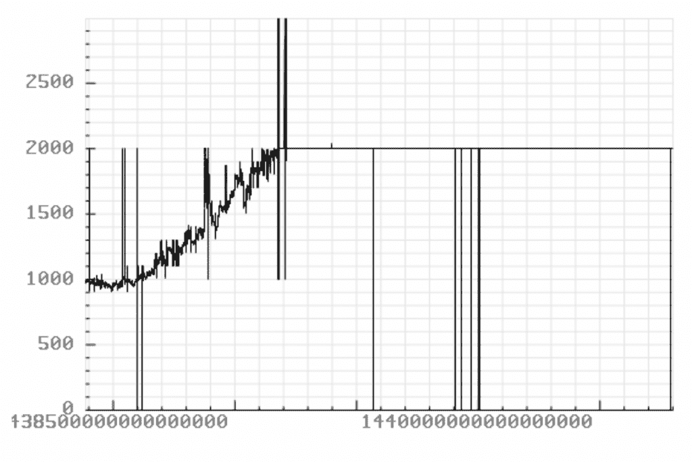
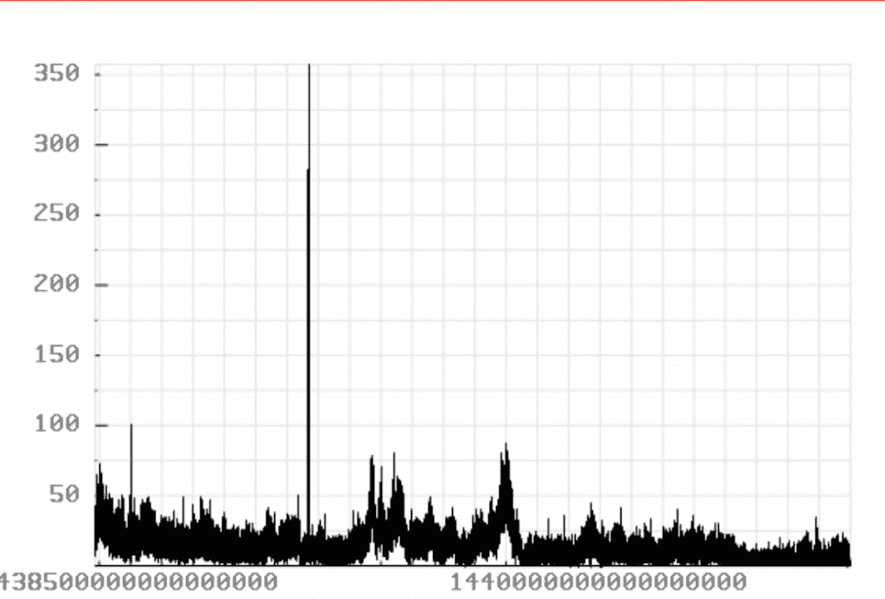
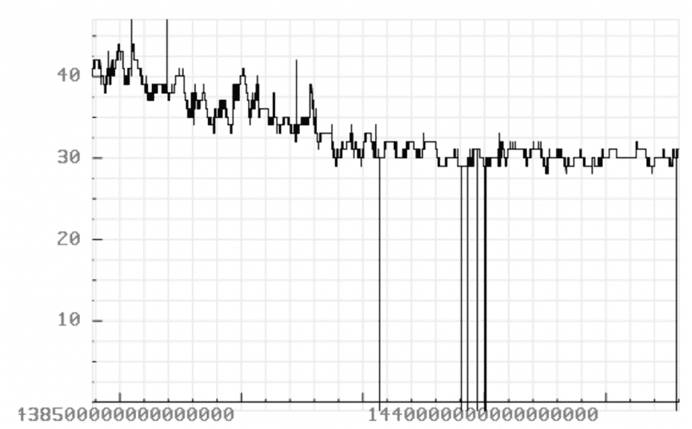
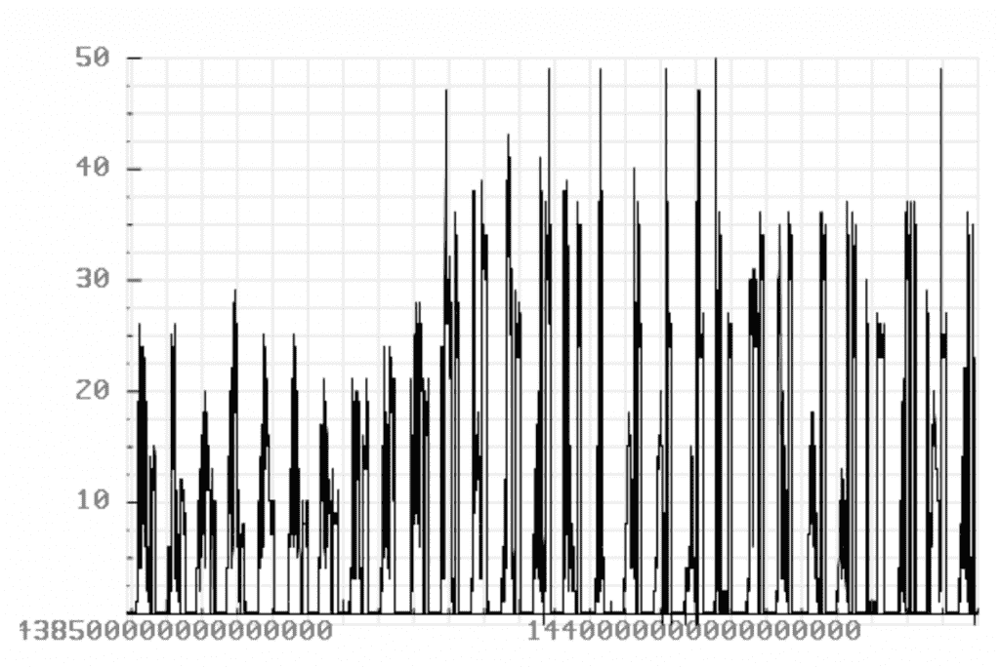
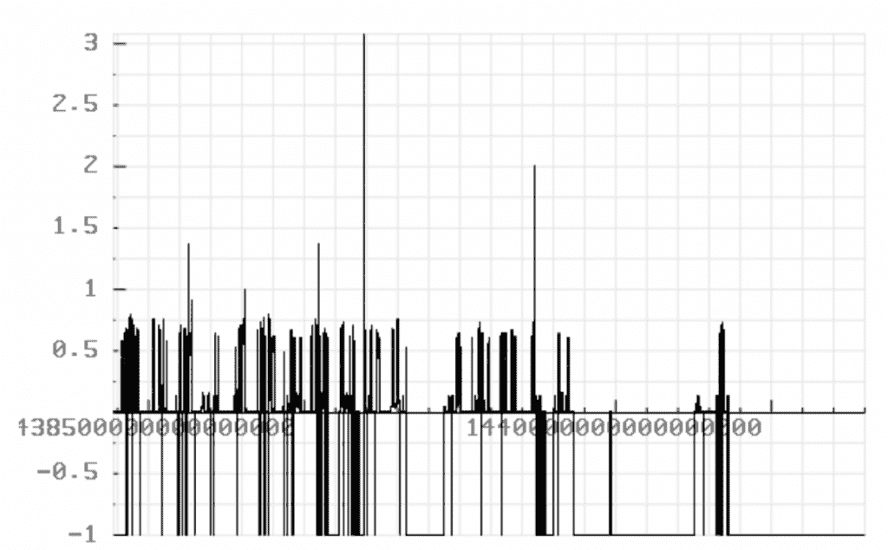
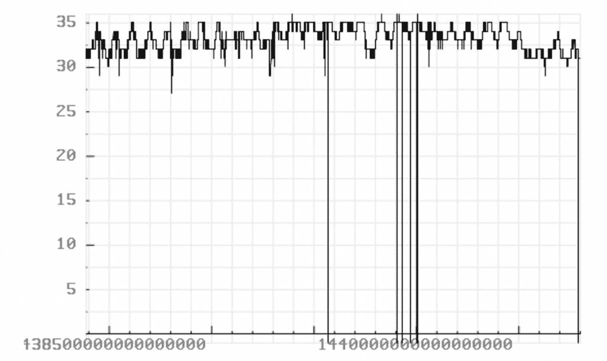
记录时间戳在“2015-08-04 00:00:00”和“2015-08-08 01:00:00”之间。

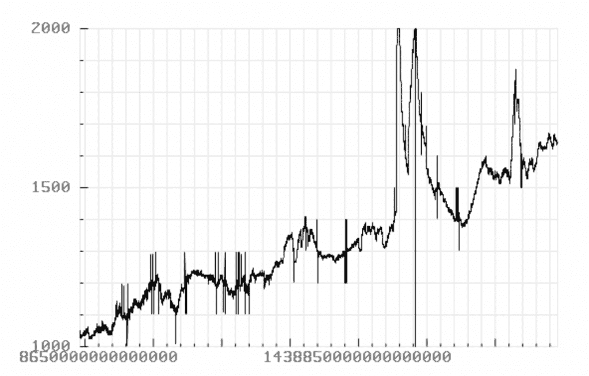
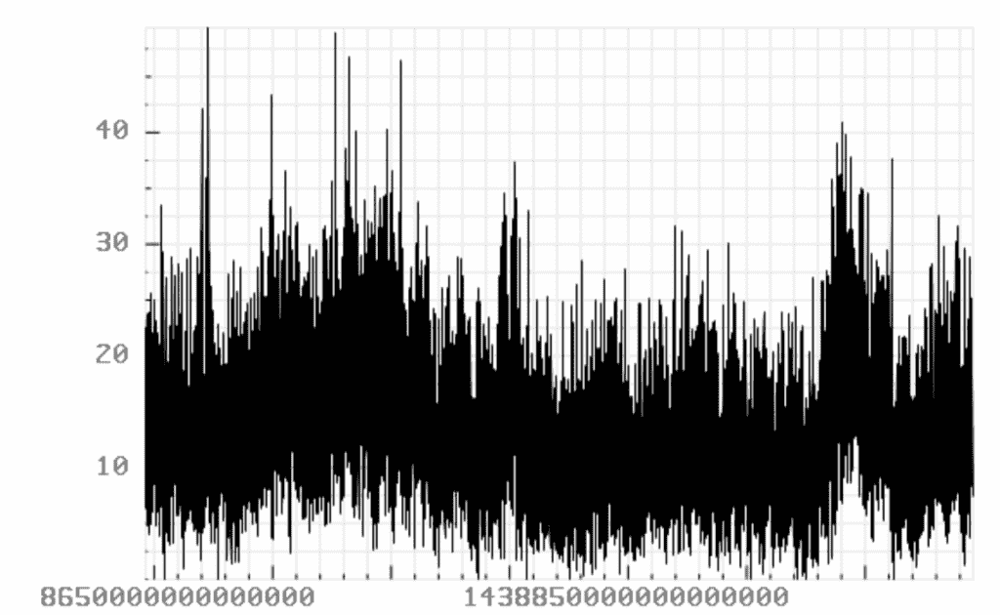
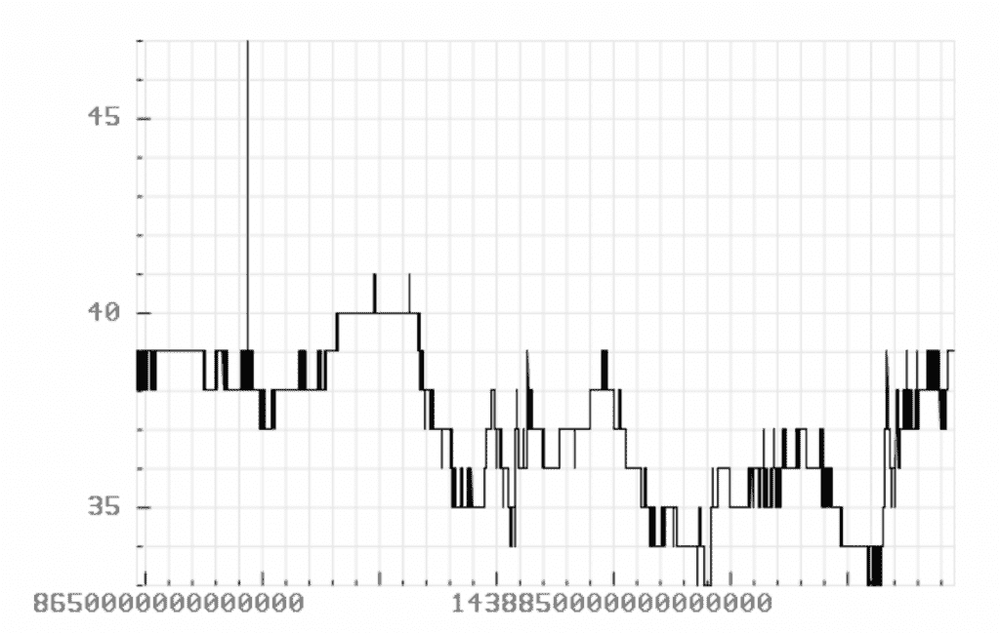
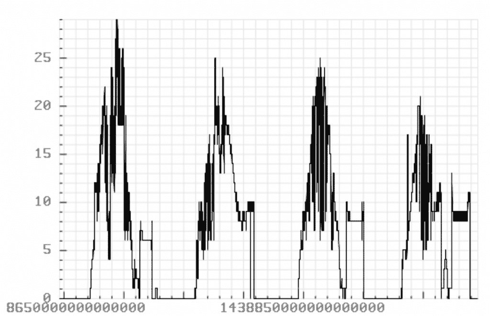
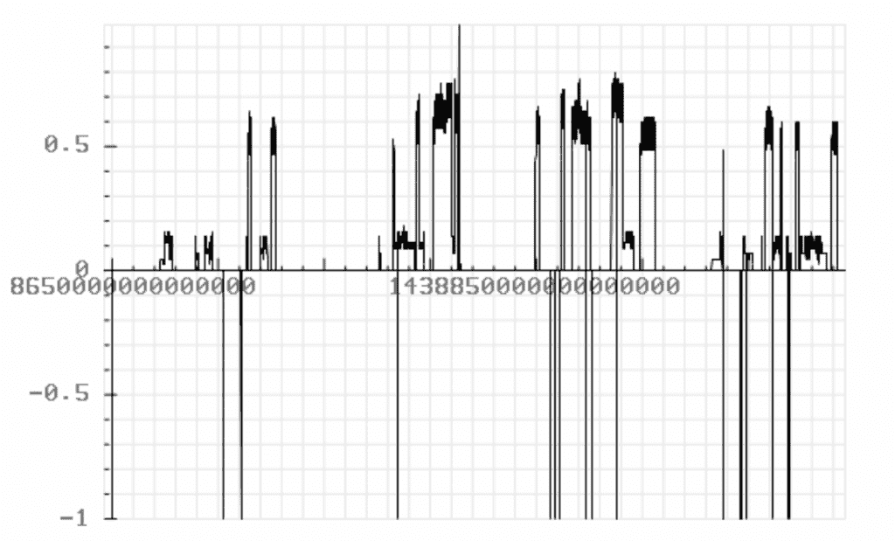
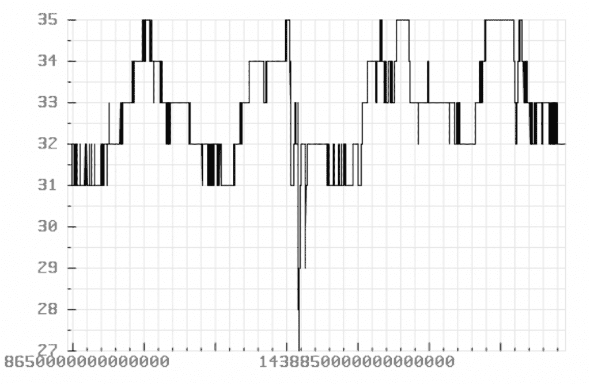

## 结论

概括地说，时间序列数据库(TSDB)不同于 RDBMSes，因为 TSDB 在备份存储的时间序列数据方面非常专业。因此，写入和查询数据的速度非常快。

谷歌最近发布了一种名为 Carbon 的新的[编程语言，作为 C++的潜在替代品，所以请密切关注这项实验的进展。](https://thenewstack.io/google-launches-carbon-an-experimental-replacement-for-c/)

对于您自己的应用程序，请查看 [InfluxDB](https://www.influxdata.com/) ，这是一个为时间序列数据提供指标、事件和数据分析的数据库。

<svg xmlns:xlink="http://www.w3.org/1999/xlink" viewBox="0 0 68 31" version="1.1"><title>Group</title> <desc>Created with Sketch.</desc></svg>