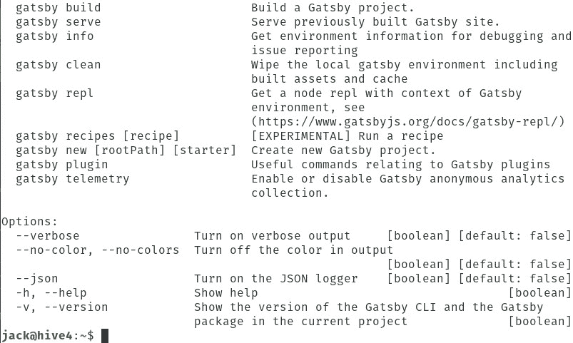
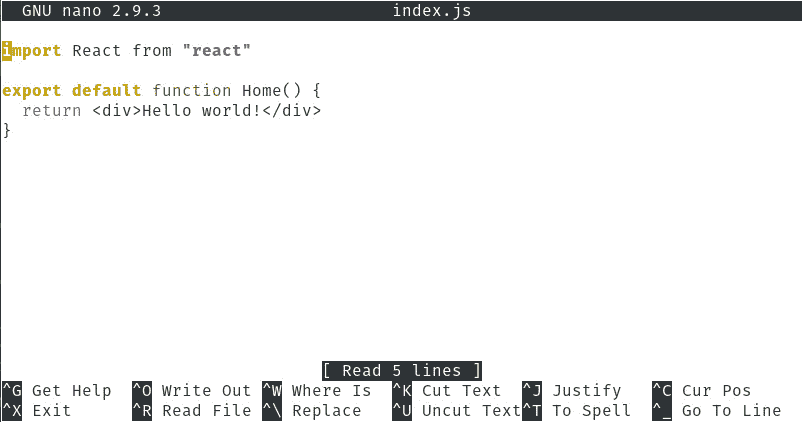
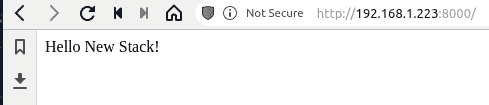

# 云本地静态站点生成器 Gatsby 入门

> 原文：<https://thenewstack.io/getting-started-with-gatsby-the-cloud-native-static-site-generator/>

如果你建立网站，或者你的公司依赖于一个网站，可能有一件事你讨厌处理——静态网站。他们很无聊，不会炫耀你的技能，当然也不会“惊艳”用户。

然而，静态站点是有用途的。很多时候它们是信息性的，其他时候它们是接触消费者的一种快速而简单的方式。不管你为什么必须在你的站点上使用静态页面，你可能害怕创建它们。

这就是盖茨比出现的原因。盖茨比(官方[盖茨比。JS](https://www.gatsbyjs.com/) 是一个基于 React、 [GraphQL](https://graphql.org/) 的静态站点生成器，它将 React、webpack、react-route、GraphQL 和其他工具的各个部分整合到一个开发人员友好的框架中。Gatsby 是 JAMStack 的一部分，jam stack 是一种构建网站和应用的新方法，旨在提供更好的性能、更高的安全性、更低的扩展成本和更好的整体开发体验。

Gatsby 还可以单独使用预配置和启动器来构建静态站点，用于:

*   闪电般的页面加载速度
*   服务人员
*   代码分割
*   服务器端渲染
*   智能图像加载
*   资产优化
*   数据预取

使用 Gatsby 命令行界面(CLI)，您可以创建部分构建的站点(使用一些默认配置)，称为启动器。这是帮助你开始使用 Gatsby 的好方法。

现在，盖茨比的情况是这样的:当你开始使用它时，你可能会想，“但是我可以用普通的 HTML 建立一个静态网站，比我用盖茨比的华丽语言和文件要快得多。”那可能是真的。然而，使用 Gatsby(以及 CI/CD 管道中的正确工具),您可以完成这项工作，从而自动部署这些静态站点。最重要的是，在初学者的帮助下，您可以在几秒钟内部署完整的站点，帮助您开始开发定制的东西。

让我们安装并开始使用这项激动人心的技术。

## 您选择的平台

Gatsby 可以安装在 Linux、macOS 和 Windows 上。我将在 Linux 平台上进行演示(特别是 Ubuntu Server 18.04)。虽然每个平台的安装会有所不同，但由于 Gatsby 是一个 CLI 工具，所以用法应该是相同的。

话虽如此，让我们安装盖茨比。

## 安装盖茨比

你要做的第一件事是更新和升级你的操作系统。但是，请记住，如果您的内核在此过程中升级，您将需要重新启动系统。因此，请确保在重启可行时运行更新/升级。

要更新和升级 Ubuntu，请登录到您的实例，访问终端窗口，并发出以下两个命令:

`sudo apt-get update`

`sudo apt-get upgrade -y`

接下来，您需要使用命令安装两个依赖项:

`sudo apt-get install curl git -y`

上述命令完成后，使用以下命令安装最新版本的 nvm:

`curl -o- https://raw.githubusercontent.com/nvm-sh/nvm/v0.35.1/install.sh | bash`

当上述命令完成时，您应该有一个 nvm 的工作实例。您可以使用以下命令进行验证:

`nvm --version`

上面的命令应该打印出新安装的 nvm 版本。

接下来我们需要设置要使用的 Node.js 的版本。然而，首先我们需要安装它。使用 nvm 命令非常简单:

`nvm install 10`

完成后，确保使用以下命令设置默认版本:

`nvm use 10`

最后，我们可以使用以下命令安装 Gatsby CLI:

`npm install -g gatsby-cli`

当上述命令完成时，您可以使用以下命令验证安装:

`gatsby --help`

您应该看到打印出来的帮助文件(图 1)。

Figure 1: Gatsby has been successfully installed.

## 创建你的第一个盖茨比网站

现在你已经安装了 Gatsby，是时候创建你的第一个站点了。让我们用久经考验的真实的你好，世界！举例。幸运的是，《你好，世界》有了首发！这样你就可以从 Github 下载所有必要的内容。

创造一个新的你好，世界！站点，发出命令:

`gatsby new hello-world https://github.com/gatsbyjs/gatsby-starter-hello-world`

上面的命令将下拉 Hello，World！starter(将其命名为 hello-world ),并安装部署站点所需的所有组件。完成后，您会发现一个新创建的目录。使用以下命令切换到该目录:

`cd hello-world`

在这个新目录中，您将找到新网站所需的一切，包括:

*   盖茨比-配置. js
*   许可证
*   节点 _ 模块
*   package.json
*   包锁. json
*   README.md
*   科学研究委员会
*   静电

您可以浏览各种文件和文件夹来定制页面。例如，在 src/pages 目录中，您会找到 index.js 文件。发出命令:

`nano index.js`

您将看到显示 Hello，World 的页面！信息(图 2)。

图 2

The index page for our Hello, World site.

让我们把它改成你好，新堆栈！。完成后，保存并关闭文件。使用以下命令切换回~/hello-world 目录:

`cd ~/hello-world`

接下来我们必须启动内置的 Gatsby 服务器。这完全是出于开发目的(所以你不会以这种方式向公众提供这些网站)。要启动服务器，请发出以下命令:

`gatsby develop`

随着服务器的运行，您现在可以打开一个 web 浏览器并指向 http://localhost:8000。你可能已经发现了第一个问题。我们在一个无头服务器上安装了盖茨比。如果你把 Gatsby 安装在一台带桌面的 Linux 机器上，你的浏览器会显示这个页面。但是因为我们在服务器上，我们想指示 Gatsby 使用什么 IP 地址。为此，我们将使用以下命令让它在服务器的相同 IP 地址上为站点提供服务:

`gatsby develop --host=SERVER`

其中 SERVER 是主机的 IP 地址。

现在，如果您将浏览器指向 http://SERVER:8000(其中 SERVER 是主机的 IP 地址)，您将看到 Hello，New Stack 打印出来(图 3)。

We’ve successfully deployed our modified Hello, World! site.

这就是安装 Gatsby 和部署您的第一个站点的全部内容。你会在[初学者库](https://www.gatsbyjs.com/starters/?v=2)中找到更多的初学者来帮助你使用这个工具。开始与 Gatsby 合作，看看你是否能让它成为你的 web 开发管道的一部分。

特征图像由 [Zbynek Burival](https://unsplash.com/@zburival?utm_source=unsplash&utm_medium=referral&utm_content=creditCopyText) 在 [Unsplash](https://unsplash.com/s/photos/wind-farm?utm_source=unsplash&utm_medium=referral&utm_content=creditCopyText) 上拍摄。

<svg xmlns:xlink="http://www.w3.org/1999/xlink" viewBox="0 0 68 31" version="1.1"><title>Group</title> <desc>Created with Sketch.</desc></svg>